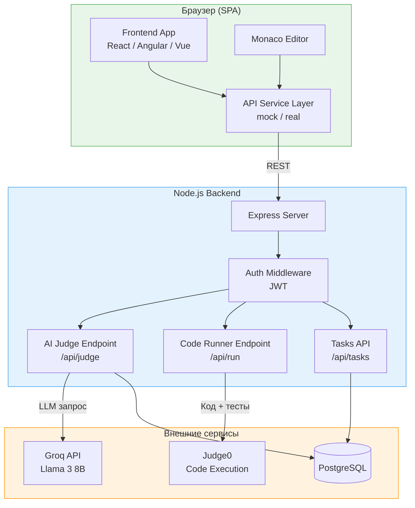
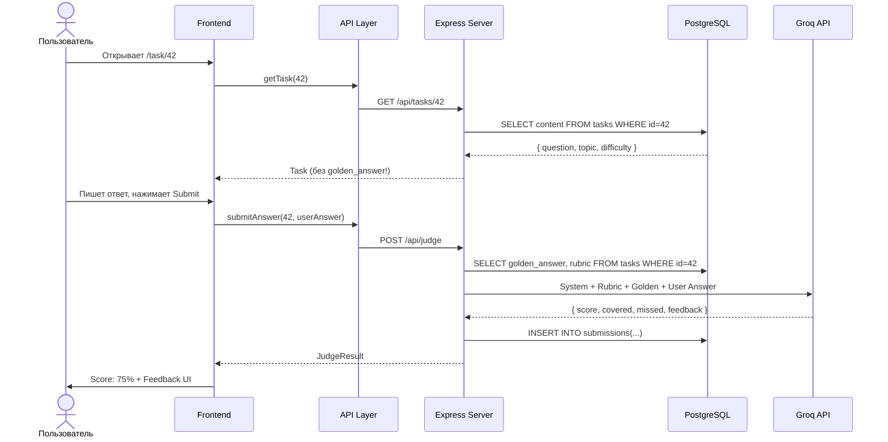

# Вариант A: Custom Backend + Judge0

Полная архитектурная документация для реализации AI Prep App с **собственным Node.js бэкендом** и **Judge0 Code Runner**.

> **Product Spec** (концепция, UI mockups): [03-ai-prep-app.md](../03-ai-prep-app.md)
> **Сравнение вариантов**: [README.md](./README.md)

---

## Почему Custom Backend?

- **Custom Backend +30** — отдельный балл за собственный сервер
- **Полный контроль** — кастомная валидация, стриминг, сложная логика оценки
- **Judge0 Code Runner** — 60+ языков, sandbox из коробки, production-level
- **Production-like архитектура** — опыт для портфолио и собеседований
- **AI Judge на сервере** — ключи API не попадают в браузер

### Когда НЕ выбирать

- Ментор (**Mentor**) не готов писать бэкенд на Node.js
- В команде нет опыта с Docker / PostgreSQL
- Хотите сфокусироваться на фронтенде → [Вариант B](./architecture-b.md)

---

## Команда

| Имя        | Роль             | Компоненты                                                              |
| ---------- | ---------------- | ----------------------------------------------------------------------- |
| **Nika**   | Editor-Dev       | Task Viewer, Code Editor (Monaco), Submissions, Hint UI                 |
| **Oscar**  | Dashboard-Dev    | Dashboard, Progress Matrix, Rubrics Display, History Page               |
| **Paula**  | Judge-Dev        | Judge Client, Feedback UI, Score Display, Answer Comparison             |
| **Mentor** | Backend (Mentor) | Express API, Judge0 интеграция, AI Judge endpoint, DB, Generator Script |

---

## 1. Архитектура высокого уровня



### Поток данных: Theory Task



---

## 2. Декомпозиция компонентов

### Nika (Editor-Dev): Task & Editor

| Компонент       | Описание                                                     | Сложность |
| --------------- | ------------------------------------------------------------ | --------- |
| `TaskViewer`    | Отображение вопроса, темы, сложности, breadcrumbs            | Средняя   |
| `TheoryInput`   | Textarea для текстового ответа + Markdown preview            | Средняя   |
| `CodeEditor`    | Monaco Editor с подсветкой, автокомплитом, темами            | Высокая   |
| `SubmitButton`  | Submit + loading state + debounce (защита от двойного клика) | Низкая    |
| `HintPanel`     | Уровневые подсказки: Level 1 → Level 2 → Show Answer         | Средняя   |
| `TopicSelector` | Список тем с прогресс-индикатором                            | Средняя   |

**API-сервисы Nikaа:**

```
src/api/
├── tasks.api.ts      # getTask, getTasksByTopic, getTopics
└── submissions.api.ts # submitAnswer, getMySubmissions
```

### Oscar (Dashboard-Dev): Dashboard & Progress

| Компонент        | Описание                                             | Сложность |
| ---------------- | ---------------------------------------------------- | --------- |
| `Dashboard`      | Главный экран: XP, streak, последние сабмиты         | Средняя   |
| `ProgressMatrix` | Матрица навыков: темы × уровни, цветовое кодирование | Высокая   |
| `RubricDisplay`  | Чеклист: ✅ покрытые / ❌ непокрытые критерии        | Средняя   |
| `HistoryPage`    | Таблица/список всех сабмитов с фильтрами             | Средняя   |
| `StatsCharts`    | Графики прогресса (by topic, by time)                | Средняя   |
| `ProfilePage`    | Настройки, аватар, статистика пользователя           | Низкая    |

**API-сервисы Oscarа:**

```
src/api/
├── dashboard.api.ts  # getDashboardStats, getStreak
├── progress.api.ts   # getProgressMatrix, getTopicProgress
└── history.api.ts    # getSubmissionHistory, getSubmissionById
```

### Paula (Judge-Dev): Judge & Feedback

| Компонент          | Описание                                                  | Сложность |
| ------------------ | --------------------------------------------------------- | --------- |
| `JudgeClient`      | Сервис отправки ответа на оценку (mock/real)              | Высокая   |
| `FeedbackPanel`    | Отображение score, feedback, rubric results               | Средняя   |
| `ScoreDisplay`     | Визуализация оценки: круговая диаграмма, анимация         | Средняя   |
| `AnswerComparison` | Side-by-side: ответ пользователя vs эталон                | Средняя   |
| `TestResults`      | Результаты автотестов для coding tasks: ✅/❌ каждый тест | Средняя   |
| `AIErrorHint`      | AI-подсказка на основе stderr (для coding tasks)          | Средняя   |

**API-сервисы Paulaа:**

```
src/api/
├── judge.api.ts      # evaluateTheory, evaluateCode
└── feedback.api.ts   # getFeedbackHistory, compareFeedback
```

### Mentor (Mentor): Backend

| Компонент          | Описание                                            | Сложность |
| ------------------ | --------------------------------------------------- | --------- |
| `Express Server`   | REST API + middleware (auth, validation, CORS)      | Высокая   |
| `Judge Endpoint`   | POST /api/judge → Groq API → structured response    | Высокая   |
| `Runner Endpoint`  | POST /api/run → Judge0 → test results + stderr      | Высокая   |
| `Auth System`      | JWT generation/validation, refresh tokens           | Средняя   |
| `DB Schema`        | PostgreSQL миграции, seed data                      | Средняя   |
| `Generator Script` | Python/Node скрипт для генерации контента через GPT | Средняя   |

---

## 3. Модель данных

### TypeScript интерфейсы (shared между frontend и backend)

```typescript
// types/task.ts

/** Тема (Core JS, TypeScript, Algorithms...) */
interface Topic {
  id: string;
  title: string; // "Core JavaScript"
  description: string; // "Замыкания, прототипы, Event Loop..."
  icon: string; // emoji или URL иконки
  taskCount: number; // количество задач в теме
}

/** Тип задачи */
type TaskType = "theory_open" | "theory_choice" | "coding";

/** Задача (то, что видит пользователь) */
interface Task {
  id: string;
  topicId: string;
  type: TaskType;
  difficulty: 1 | 2 | 3 | 4 | 5;
  title: string; // "Замыкания в JavaScript"
  questionText: string; // Текст вопроса (Markdown)
  codeTemplate?: string; // Шаблон кода для coding tasks
  testCode?: string; // Тесты (скрыты от пользователя, но нужны Runner)
  rubricItems: string[]; // ["Упомянул лексическое окружение", ...]
  maxScore: number; // 100
}

/** Секретные данные задачи (НЕ отправляются клиенту) */
interface TaskSecret {
  taskId: string;
  goldenAnswer: string; // Эталонный ответ
  rubricWeights: number[]; // Вес каждого критерия
  hints: string[]; // Подсказки по уровням
}
```

```typescript
// types/submission.ts

/** Ответ пользователя */
interface Submission {
  id: string;
  userId: string;
  taskId: string;
  answer: string; // Текст ответа или код
  submittedAt: string; // ISO datetime
  result: JudgeResult;
}

/** Результат оценки AI Judge */
interface JudgeResult {
  score: number; // 0-100
  maxScore: number; // 100
  coveredPoints: string[]; // Покрытые критерии
  missedPoints: string[]; // Пропущенные критерии
  feedback: string; // Текстовый комментарий AI
  judgeLevel: 0 | 1 | 2; // Уровень мока (0=hardcoded, 1=LLM, 2=advanced)
}

/** Результат выполнения кода (для coding tasks) */
interface RunResult {
  passed: boolean;
  totalTests: number;
  passedTests: number;
  testDetails: TestDetail[];
  stderr?: string; // Ошибки (для AI Hint)
  executionTimeMs: number;
}

interface TestDetail {
  name: string; // "should delay execution"
  passed: boolean;
  error?: string; // Текст ошибки если failed
}
```

```typescript
// types/user.ts

/** Профиль пользователя */
interface UserProfile {
  id: string;
  email: string;
  name: string;
  avatarUrl?: string;
  createdAt: string;
}

/** Статистика для Dashboard */
interface UserStats {
  xp: number;
  streak: number; // Дней подряд
  completedTasks: number;
  totalTasks: number;
  rank: string; // "Junior" | "Middle" | "Senior"
}

/** Прогресс по теме */
interface TopicProgress {
  topicId: string;
  topicTitle: string;
  completed: number;
  total: number;
  avgScore: number; // Средний балл (0-100)
  lastAttemptAt?: string;
}
```

### PostgreSQL схема

```sql
CREATE TABLE users (
  id          UUID PRIMARY KEY DEFAULT gen_random_uuid(),
  email       VARCHAR(255) UNIQUE NOT NULL,
  name        VARCHAR(100) NOT NULL,
  avatar_url  TEXT,
  password_hash TEXT NOT NULL,
  created_at  TIMESTAMPTZ DEFAULT NOW()
);

CREATE TABLE topics (
  id          VARCHAR(50) PRIMARY KEY,  -- 'core_js', 'typescript'
  title       VARCHAR(200) NOT NULL,
  description TEXT,
  icon        VARCHAR(10),
  sort_order  INT DEFAULT 0
);

CREATE TABLE tasks (
  id              VARCHAR(50) PRIMARY KEY,  -- 'task_closure_01'
  topic_id        VARCHAR(50) REFERENCES topics(id),
  type            VARCHAR(20) NOT NULL,     -- 'theory_open', 'coding'
  difficulty      INT CHECK (difficulty BETWEEN 1 AND 5),
  title           VARCHAR(200) NOT NULL,
  question_text   TEXT NOT NULL,
  code_template   TEXT,
  test_code       TEXT,
  rubric_items    JSONB NOT NULL,           -- ["point1", "point2"]
  golden_answer   TEXT NOT NULL,            -- Секрет: НЕ отдаём клиенту
  rubric_weights  JSONB,
  hints           JSONB,                    -- ["hint1", "hint2"]
  max_score       INT DEFAULT 100,
  created_at      TIMESTAMPTZ DEFAULT NOW()
);

CREATE TABLE submissions (
  id          UUID PRIMARY KEY DEFAULT gen_random_uuid(),
  user_id     UUID REFERENCES users(id),
  task_id     VARCHAR(50) REFERENCES tasks(id),
  answer      TEXT NOT NULL,
  score       INT,
  covered     JSONB,                        -- ["point1"]
  missed      JSONB,                        -- ["point2"]
  feedback    TEXT,
  judge_level INT DEFAULT 0,
  submitted_at TIMESTAMPTZ DEFAULT NOW()
);

-- Индексы для быстрых запросов
CREATE INDEX idx_submissions_user ON submissions(user_id);
CREATE INDEX idx_submissions_task ON submissions(task_id);
CREATE INDEX idx_tasks_topic ON tasks(topic_id);
```

---

## 4. API контракты (REST)

### Аутентификация

| Метод | Endpoint             | Описание             | Кто делает |
| ----- | -------------------- | -------------------- | ---------- |
| POST  | `/api/auth/register` | Регистрация          | **Mentor** |
| POST  | `/api/auth/login`    | Логин → JWT token    | **Mentor** |
| POST  | `/api/auth/refresh`  | Обновление токена    | **Mentor** |
| GET   | `/api/auth/me`       | Текущий пользователь | **Mentor** |

### Задачи

| Метод | Endpoint                | Описание       | Response                     |
| ----- | ----------------------- | -------------- | ---------------------------- |
| GET   | `/api/topics`           | Список тем     | `Topic[]`                    |
| GET   | `/api/topics/:id/tasks` | Задачи по теме | `Task[]` (без goldenAnswer!) |
| GET   | `/api/tasks/:id`        | Одна задача    | `Task` (без goldenAnswer!)   |

```typescript
// GET /api/tasks/task_closure_01
// Response:
{
  "id": "task_closure_01",
  "topicId": "core_js",
  "type": "theory_open",
  "difficulty": 3,
  "title": "Замыкания в JavaScript",
  "questionText": "Объясни, что такое замыкание...",
  "rubricItems": [
    "Упомянул лексическое окружение",
    "Объяснил сохранение переменных",
    "Привёл корректный пример",
    "Упомянул практическое применение"
  ],
  "maxScore": 100
}
// ⚠️ goldenAnswer, hints, rubricWeights — НЕ отправляются!
```

### AI Judge

| Метод | Endpoint          | Описание           | Response                          |
| ----- | ----------------- | ------------------ | --------------------------------- |
| POST  | `/api/judge`      | Оценить ответ      | `JudgeResult`                     |
| POST  | `/api/judge/hint` | Получить подсказку | `{ hint: string, level: number }` |

```typescript
// POST /api/judge
// Request:
{
  "taskId": "task_closure_01",
  "answer": "Замыкание это когда функция..."
}

// Response:
{
  "score": 65,
  "maxScore": 100,
  "coveredPoints": [
    "Упомянул лексическое окружение",
    "Объяснил сохранение переменных"
  ],
  "missedPoints": [
    "Привёл корректный пример",
    "Упомянул практическое применение"
  ],
  "feedback": "Ты верно описал основную идею замыкания...",
  "judgeLevel": 1
}
```

### Code Runner

| Метод | Endpoint   | Описание      | Response    |
| ----- | ---------- | ------------- | ----------- |
| POST  | `/api/run` | Запустить код | `RunResult` |

```typescript
// POST /api/run
// Request:
{
  "taskId": "task_debounce_01",
  "code": "function debounce(fn, delay) { ... }",
  "language": "javascript"
}

// Response:
{
  "passed": false,
  "totalTests": 4,
  "passedTests": 2,
  "testDetails": [
    { "name": "should delay execution", "passed": true },
    { "name": "should cancel previous timeout", "passed": true },
    { "name": "should pass arguments to fn", "passed": false,
      "error": "Expected fn to be called with (1, 2) but got ()" },
    { "name": "should preserve this context", "passed": false,
      "error": "Expected this to be obj but got undefined" }
  ],
  "stderr": "AssertionError: Expected fn to be called with (1, 2)...",
  "executionTimeMs": 234
}
```

### Dashboard & Progress

| Метод | Endpoint               | Описание                | Response          |
| ----- | ---------------------- | ----------------------- | ----------------- |
| GET   | `/api/dashboard/stats` | Статистика пользователя | `UserStats`       |
| GET   | `/api/progress`        | Прогресс по всем темам  | `TopicProgress[]` |
| GET   | `/api/submissions`     | История сабмитов        | `Submission[]`    |
| GET   | `/api/submissions/:id` | Конкретный сабмит       | `Submission`      |

---

## 5. Стратегия AI Judge

### Level 0: Hardcoded (без LLM)

Используется для разработки UI. Не требует API ключей, работает мгновенно.

```typescript
// backend/services/judge-level0.ts

function evaluateLevel0(answer: string, task: TaskWithSecret): JudgeResult {
  const answerLower = answer.toLowerCase();
  const covered: string[] = [];
  const missed: string[] = [];

  // Простое keyword matching
  const keywordMap: Record<string, string[]> = {
    "Упомянул лексическое окружение": [
      "лексическ",
      "lexical",
      "scope",
      "окружени",
    ],
    "Объяснил сохранение переменных": [
      "сохран",
      "запомин",
      "remember",
      "persist",
    ],
    "Привёл корректный пример": ["function", "const", "let", "return", "()"],
    "Упомянул практическое применение": [
      "приватн",
      "private",
      "counter",
      "каррир",
      "curry",
    ],
  };

  for (const rubricItem of task.rubricItems) {
    const keywords = keywordMap[rubricItem] || [];
    const found = keywords.some((kw) => answerLower.includes(kw));
    if (found) covered.push(rubricItem);
    else missed.push(rubricItem);
  }

  const score = Math.round((covered.length / task.rubricItems.length) * 100);

  return {
    score,
    maxScore: 100,
    coveredPoints: covered,
    missedPoints: missed,
    feedback:
      score >= 80
        ? "Отличный ответ! Покрыты основные критерии."
        : `Неплохо, но стоит раскрыть: ${missed.join(", ")}.`,
    judgeLevel: 0,
  };
}
```

### Level 1: Real LLM (Groq)

Подключается когда UI готов. **Mentor** реализует endpoint.

```typescript
// backend/services/judge-level1.ts

import Groq from "groq-sdk";

const groq = new Groq({ apiKey: process.env.GROQ_API_KEY });

async function evaluateLevel1(
  answer: string,
  task: TaskWithSecret,
): Promise<JudgeResult> {
  const systemPrompt = `
ROLE: You are a strict technical interviewer.
TASK: Compare the CANDIDATE_ANSWER with the REFERENCE_ANSWER using the RUBRIC.

REFERENCE_ANSWER: ${task.goldenAnswer}
RUBRIC_POINTS: ${JSON.stringify(task.rubricItems)}

IMPORTANT: Respond ONLY with valid JSON in this exact format:
{
  "score": <0-100>,
  "covered_points": ["point that was covered"],
  "missed_points": ["point that was missed"],
  "feedback": "Short constructive feedback in Russian."
}`;

  const completion = await groq.chat.completions.create({
    model: "llama-3.3-70b-versatile",
    messages: [
      { role: "system", content: systemPrompt },
      { role: "user", content: answer },
    ],
    temperature: 0.3,
    response_format: { type: "json_object" },
  });

  const raw = JSON.parse(completion.choices[0].message.content!);

  return {
    score: raw.score,
    maxScore: 100,
    coveredPoints: raw.covered_points,
    missedPoints: raw.missed_points,
    feedback: raw.feedback,
    judgeLevel: 1,
  };
}
```

### Level 2: Advanced (если осталось время)

- Несколько rubric dimensions с весами
- Confidence score для каждого пункта
- Follow-up вопросы при пограничном результате
- Сравнение с предыдущими попытками пользователя

### Переключение уровней

```typescript
// backend/services/judge.ts

const JUDGE_LEVEL = parseInt(process.env.JUDGE_LEVEL || "0");

export async function evaluate(
  answer: string,
  task: TaskWithSecret,
): Promise<JudgeResult> {
  switch (JUDGE_LEVEL) {
    case 0:
      return evaluateLevel0(answer, task);
    case 1:
      return evaluateLevel1(answer, task);
    case 2:
      return evaluateLevel2(answer, task);
    default:
      return evaluateLevel0(answer, task);
  }
}
```

---

## 6. Стратегия Code Runner (Judge0)

### Что такое Judge0?

[Judge0](https://judge0.com/) — open-source система выполнения кода. Принимает код + тесты → возвращает stdout/stderr/время.

### Использование (SaaS)

Самый простой путь — бесплатный Judge0 CE на [RapidAPI](https://rapidapi.com/judge0-official/api/judge0-ce).

```typescript
// backend/services/code-runner.ts

const JUDGE0_URL = process.env.JUDGE0_URL || "https://judge0-ce.p.rapidapi.com";
const JUDGE0_KEY = process.env.JUDGE0_API_KEY;

interface Judge0Submission {
  source_code: string;
  language_id: number; // 63 = JavaScript (Node.js)
  stdin?: string;
  expected_output?: string;
}

async function runCode(userCode: string, testCode: string): Promise<RunResult> {
  // Объединяем пользовательский код с тестами
  const fullCode = `${userCode}\n\n// === TESTS ===\n${testCode}`;

  // Создаём submission
  const response = await fetch(`${JUDGE0_URL}/submissions?wait=true`, {
    method: "POST",
    headers: {
      "Content-Type": "application/json",
      "X-RapidAPI-Key": JUDGE0_KEY!,
    },
    body: JSON.stringify({
      source_code: Buffer.from(fullCode).toString("base64"),
      language_id: 63,
      base64_encoded: true,
    }),
  });

  const result = await response.json();

  return parseJudge0Result(result);
}
```

### Self-hosted (Docker)

Для полного контроля — запуск Judge0 локально:

```bash
# docker-compose.yml (упрощённый)
services:
  judge0:
    image: judge0/judge0:latest
    ports:
      - "2358:2358"
    depends_on:
      - db
      - redis
  db:
    image: postgres:15
  redis:
    image: redis:7
```

### AI Error Hint (бонус)

Когда тесты падают, отправляем stderr в LLM для human-friendly объяснения:

```typescript
async function getErrorHint(
  stderr: string,
  userCode: string,
  hints: string[],
): Promise<string> {
  const prompt = `
ROLE: Helpful coding assistant.
TASK: Explain the error in simple terms. Do NOT give the full solution.

ERROR: ${stderr}
USER_CODE: ${userCode}
AVAILABLE_HINTS: ${JSON.stringify(hints)}

Choose the most relevant hint or rephrase the error simply. Respond in Russian.`;

  const completion = await groq.chat.completions.create({
    model: "llama-3.1-8b-instant",
    messages: [{ role: "user", content: prompt }],
    temperature: 0.5,
    max_tokens: 200,
  });

  return completion.choices[0].message.content!;
}
```

---

## 7. Упрощения для MVP

### Sprint 1 (Недели 1-2): Theory-Only Loop

**Цель:** рабочий core loop без AI и без Code Runner.

| Что делаем                                         | Кто        |
| -------------------------------------------------- | ---------- |
| Роутинг + Layout (Landing, Login, Dashboard, Task) | **Nika**   |
| Mock API Layer (все сервисы с `USE_MOCK=true`)     | **Все**    |
| Task Viewer + TheoryInput (textarea)               | **Nika**   |
| Dashboard + Stats (моковые данные)                 | **Oscar**  |
| Judge Level 0 (keyword matching)                   | **Paula**  |
| Feedback UI (score + covered/missed)               | **Paula**  |
| Express Server скелет + DB schema                  | **Mentor** |
| Seed: 10 задач по 2 темам (JSON)                   | **Mentor** |

**Что пропускаем:** Code Editor, Code Runner, real LLM, History, Progress Matrix, Profile.

### Sprint 2 (Недели 3-4): Real AI + Progress

| Что делаем                                   | Кто        |
| -------------------------------------------- | ---------- |
| AI Judge Level 1 (Groq API)                  | **Mentor** |
| Structured Feedback UI (рубрики, comparison) | **Paula**  |
| Progress Matrix                              | **Oscar**  |
| History Page                                 | **Oscar**  |
| Hint System (уровневые подсказки)            | **Nika**   |
| Topic Selector с прогрессом                  | **Nika**   |

### Sprint 3 (Недели 5-6): Code Runner + Polish

| Что делаем                         | Кто        |
| ---------------------------------- | ---------- |
| Monaco Editor интеграция           | **Nika**   |
| Judge0 Code Runner                 | **Mentor** |
| Test Results UI                    | **Paula**  |
| AI Error Hint (stderr → подсказка) | **Paula**  |
| Stats Charts (графики)             | **Oscar**  |
| Deploy (Vercel + Render)           | **Все**    |

---

## 8. Стек технологий

| Слой            | Технология                       | Зачем                   |
| --------------- | -------------------------------- | ----------------------- |
| **Frontend**    | React / Angular / Vue (на выбор) | SPA                     |
| **Стейт**       | Zustand / Redux / NgRx           | Глобальное состояние    |
| **Code Editor** | Monaco Editor                    | VS Code в браузере      |
| **Стилизация**  | CSS Modules / Tailwind           | На выбор команды        |
| **Backend**     | Node.js + Express                | REST API                |
| **Авторизация** | JWT (jsonwebtoken)               | Stateless auth          |
| **База данных** | PostgreSQL                       | Реляционные данные      |
| **AI**          | Groq API (Llama 3)               | Быстрый inference       |
| **Code Runner** | Judge0 (SaaS)                    | Sandbox-выполнение кода |
| **Деплой FE**   | Vercel / Netlify                 | Бесплатный хостинг      |
| **Деплой BE**   | Render / Railway                 | Free tier для Node.js   |

---

## 9. Что делает этот вариант интересным

1. **Полный full-stack проект** — от PostgreSQL до Monaco Editor. Идеально для портфолио
2. **AI в продакшене** — не просто чат-бот, а structured evaluation с рубриками
3. **Judge0** — то, что стоит за LeetCode и HackerRank. Вы узнаете, как это работает изнутри
4. **3 уровня мокирования** — учит думать об архитектуре: interface first, implementation second
5. **Content generation** — генерация задач через ChatGPT/Claude учит prompt engineering
6. **Вы строите тренажёр для себя** — реальный инструмент подготовки к собеседованиям

### «Вау-моменты» для демо

- Пользователь пишет ответ → AI выдаёт рубрику с покрытыми/непокрытыми критериями
- Monaco Editor с запуском кода → тесты проходят/падают в реальном времени
- AI объясняет ошибку stderr на понятном языке
- Матрица навыков окрашивается по мере прогресса
