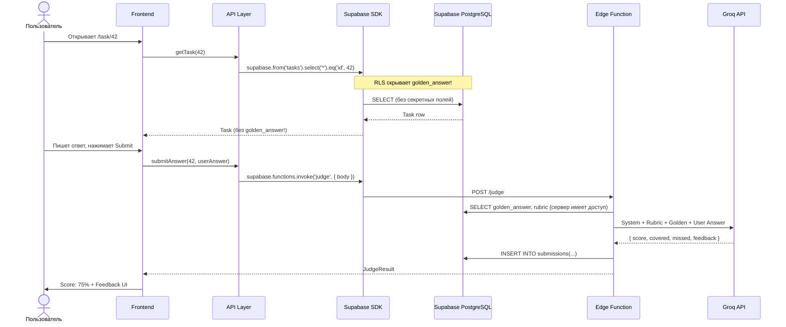
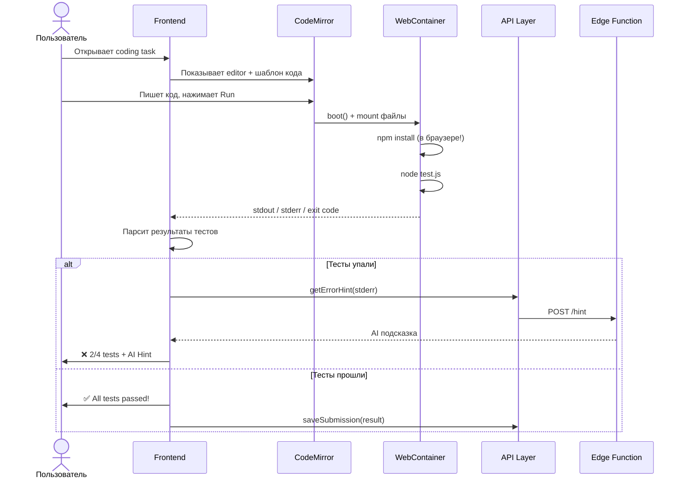

# Вариант B: Supabase + WebContainer

Полная архитектурная документация для реализации AI Prep App с **Supabase** (Auth + DB + Edge Functions) и **WebContainer** (StackBlitz) для запуска кода в браузере.

> **Product Spec** (концепция, UI mockups): [03-ai-prep-app.md](../03-ai-prep-app.md)
> **Сравнение вариантов**: [README.md](./README.md)

---

## Почему Supabase + WebContainer?

- **Нет своего сервера** — Supabase даёт Auth, DB, Edge Functions из коробки
- **BaaS CRUD +15** — балл за работу с облачной базой данных
- **Code Runner в браузере** — WebContainer не требует бэкенда для запуска кода
- **Ментор фокусируется на AI** — вместо DevOps, **Командный Блок** пишет промпты и контент
- **Быстрый старт** — Supabase проект за 5 минут, авторизация через Google/GitHub

### Когда НЕ выбирать

- Хотите получить Custom Backend +30 → [Вариант A](./architecture-a.md)
- Нужен Judge0 (60+ языков, серьёзный sandbox) → [Вариант A](./architecture-a.md)
- Команда имеет сильного бэкендера, который хочет писать Node.js

---

## Команда (кодовые имена)

| Кодовое имя        | Роль             | Компоненты                                                  |
| ------------------ | ---------------- | ----------------------------------------------------------- |
| **Эндермен**       | Editor-Dev       | Task Viewer, Code Editor (CodeMirror), Submissions, Hint UI |
| **Картограф**      | Dashboard-Dev    | Dashboard, Progress Matrix, Rubrics Display, History Page   |
| **Страж**          | Judge-Dev        | Judge Client, Feedback UI, Score Display, Answer Comparison |
| **Командный Блок** | Backend (Mentor) | Supabase setup, Edge Functions, AI Judge, Generator Script  |

---

## 1. Архитектура высокого уровня

```mermaid
graph TB
    subgraph Browser["Браузер (SPA)"]
        FE[Frontend App<br/>React / Angular / Vue]
        CM[CodeMirror Editor]
        WC[WebContainer<br/>Node.js в браузере]
        API_Layer[API Service Layer<br/>mock / real]
    end

    subgraph Supabase["Supabase Cloud"]
        Auth[Supabase Auth<br/>Google, GitHub]
        DB[(PostgreSQL)]
        Edge[Edge Functions<br/>Deno Runtime]
        RLS[Row Level Security]
    end

    subgraph External["Внешние сервисы"]
        Groq[Groq API<br/>Llama 3 8B]
    end

    FE --> API_Layer
    CM --> WC
    API_Layer -->|supabase-js SDK| Auth
    API_Layer -->|supabase-js SDK| DB
    API_Layer -->|invoke()| Edge
    Edge -->|LLM запрос| Groq
    DB --> RLS

    style Browser fill:#e8f5e9,stroke:#4caf50
    style Supabase fill:#fff3e0,stroke:#ff9800
    style External fill:#e3f2fd,stroke:#42a5f5
```

### Поток данных: Theory Task



### Поток данных: Coding Task (WebContainer)



---

## 2. Декомпозиция компонентов

### Эндермен (Editor-Dev): Task & Editor

| Компонент            | Описание                                             | Сложность |
| -------------------- | ---------------------------------------------------- | --------- |
| `TaskViewer`         | Отображение вопроса, темы, сложности, breadcrumbs    | Средняя   |
| `TheoryInput`        | Textarea для текстового ответа + Markdown preview    | Средняя   |
| `CodeEditor`         | CodeMirror с подсветкой, темами, авто-отступами      | Высокая   |
| `WebContainerRunner` | Запуск кода в WebContainer + парсинг результатов     | Высокая   |
| `SubmitButton`       | Submit + loading state + debounce                    | Низкая    |
| `HintPanel`          | Уровневые подсказки: Level 1 → Level 2 → Show Answer | Средняя   |
| `TopicSelector`      | Список тем с прогресс-индикатором                    | Средняя   |

**API-сервисы Эндермена:**

```
src/api/
├── tasks.api.ts      # getTask, getTasksByTopic, getTopics
└── submissions.api.ts # submitAnswer, getMySubmissions
```

### Картограф (Dashboard-Dev): Dashboard & Progress

| Компонент        | Описание                                             | Сложность |
| ---------------- | ---------------------------------------------------- | --------- |
| `Dashboard`      | Главный экран: XP, streak, последние сабмиты         | Средняя   |
| `ProgressMatrix` | Матрица навыков: темы × уровни, цветовое кодирование | Высокая   |
| `RubricDisplay`  | Чеклист: ✅ покрытые / ❌ непокрытые критерии        | Средняя   |
| `HistoryPage`    | Таблица/список всех сабмитов с фильтрами             | Средняя   |
| `StatsCharts`    | Графики прогресса (by topic, by time)                | Средняя   |
| `ProfilePage`    | Настройки, аватар, статистика пользователя           | Низкая    |

**API-сервисы Картографа:**

```
src/api/
├── dashboard.api.ts  # getDashboardStats, getStreak
├── progress.api.ts   # getProgressMatrix, getTopicProgress
└── history.api.ts    # getSubmissionHistory, getSubmissionById
```

### Страж (Judge-Dev): Judge & Feedback

| Компонент          | Описание                                                  | Сложность |
| ------------------ | --------------------------------------------------------- | --------- |
| `JudgeClient`      | Сервис отправки ответа на оценку (mock/real)              | Высокая   |
| `FeedbackPanel`    | Отображение score, feedback, rubric results               | Средняя   |
| `ScoreDisplay`     | Визуализация оценки: круговая диаграмма, анимация         | Средняя   |
| `AnswerComparison` | Side-by-side: ответ пользователя vs эталон                | Средняя   |
| `TestResults`      | Результаты автотестов для coding tasks: ✅/❌ каждый тест | Средняя   |
| `AIErrorHint`      | AI-подсказка на основе stderr (для coding tasks)          | Средняя   |

**API-сервисы Стража:**

```
src/api/
├── judge.api.ts      # evaluateTheory, evaluateCode
└── feedback.api.ts   # getFeedbackHistory, compareFeedback
```

### Командный Блок (Mentor): Supabase & AI

| Компонент              | Описание                                           | Сложность |
| ---------------------- | -------------------------------------------------- | --------- |
| `Supabase Project`     | Создание проекта, настройка Auth (Google, GitHub)  | Средняя   |
| `DB Schema + RLS`      | PostgreSQL таблицы + Row Level Security политики   | Средняя   |
| `Edge Function: judge` | AI Judge endpoint → Groq API → structured response | Высокая   |
| `Edge Function: hint`  | Error hint endpoint → stderr → подсказка           | Средняя   |
| `RPC Functions`        | SQL-функции для сложных запросов (dashboard stats) | Средняя   |
| `Generator Script`     | Скрипт генерации контента через GPT/Claude         | Средняя   |

---

## 3. Модель данных

### TypeScript интерфейсы (те же, что в Варианте A)

```typescript
// types/task.ts

/** Тема (Core JS, TypeScript, Algorithms...) */
interface Topic {
  id: string;
  title: string; // "Core JavaScript"
  description: string; // "Замыкания, прототипы, Event Loop..."
  icon: string; // emoji или URL иконки
  taskCount: number; // количество задач в теме
}

/** Тип задачи */
type TaskType = "theory_open" | "theory_choice" | "coding";

/** Задача (то, что видит пользователь) */
interface Task {
  id: string;
  topicId: string;
  type: TaskType;
  difficulty: 1 | 2 | 3 | 4 | 5;
  title: string; // "Замыкания в JavaScript"
  questionText: string; // Текст вопроса (Markdown)
  codeTemplate?: string; // Шаблон кода для coding tasks
  testCode?: string; // Тесты (скрыты от пользователя, но нужны Runner)
  rubricItems: string[]; // ["Упомянул лексическое окружение", ...]
  maxScore: number; // 100
}

/** Секретные данные задачи (НЕ видны через RLS) */
interface TaskSecret {
  taskId: string;
  goldenAnswer: string; // Эталонный ответ
  rubricWeights: number[]; // Вес каждого критерия
  hints: string[]; // Подсказки по уровням
}
```

```typescript
// types/submission.ts

/** Ответ пользователя */
interface Submission {
  id: string;
  userId: string;
  taskId: string;
  answer: string; // Текст ответа или код
  submittedAt: string; // ISO datetime
  result: JudgeResult;
}

/** Результат оценки AI Judge */
interface JudgeResult {
  score: number; // 0-100
  maxScore: number; // 100
  coveredPoints: string[]; // Покрытые критерии
  missedPoints: string[]; // Пропущенные критерии
  feedback: string; // Текстовый комментарий AI
  judgeLevel: 0 | 1 | 2; // Уровень мока (0=hardcoded, 1=LLM, 2=advanced)
}

/** Результат выполнения кода (для coding tasks) */
interface RunResult {
  passed: boolean;
  totalTests: number;
  passedTests: number;
  testDetails: TestDetail[];
  stderr?: string; // Ошибки (для AI Hint)
  executionTimeMs: number;
}

interface TestDetail {
  name: string; // "should delay execution"
  passed: boolean;
  error?: string; // Текст ошибки если failed
}
```

```typescript
// types/user.ts

/** Профиль пользователя */
interface UserProfile {
  id: string;
  email: string;
  name: string;
  avatarUrl?: string;
  createdAt: string;
}

/** Статистика для Dashboard */
interface UserStats {
  xp: number;
  streak: number; // Дней подряд
  completedTasks: number;
  totalTasks: number;
  rank: string; // "Junior" | "Middle" | "Senior"
}

/** Прогресс по теме */
interface TopicProgress {
  topicId: string;
  topicTitle: string;
  completed: number;
  total: number;
  avgScore: number; // Средний балл (0-100)
  lastAttemptAt?: string;
}
```

### Supabase PostgreSQL схема

```sql
-- Та же логическая схема, что и в Варианте A
-- Отличия: Supabase Auth для users + RLS политики

CREATE TABLE topics (
  id          VARCHAR(50) PRIMARY KEY,
  title       VARCHAR(200) NOT NULL,
  description TEXT,
  icon        VARCHAR(10),
  sort_order  INT DEFAULT 0
);

CREATE TABLE tasks (
  id              VARCHAR(50) PRIMARY KEY,
  topic_id        VARCHAR(50) REFERENCES topics(id),
  type            VARCHAR(20) NOT NULL,
  difficulty      INT CHECK (difficulty BETWEEN 1 AND 5),
  title           VARCHAR(200) NOT NULL,
  question_text   TEXT NOT NULL,
  code_template   TEXT,
  test_code       TEXT,
  rubric_items    JSONB NOT NULL,
  golden_answer   TEXT NOT NULL,       -- Скрыто через RLS!
  rubric_weights  JSONB,
  hints           JSONB,
  max_score       INT DEFAULT 100,
  created_at      TIMESTAMPTZ DEFAULT NOW()
);

CREATE TABLE submissions (
  id          UUID PRIMARY KEY DEFAULT gen_random_uuid(),
  user_id     UUID REFERENCES auth.users(id),  -- Supabase Auth!
  task_id     VARCHAR(50) REFERENCES tasks(id),
  answer      TEXT NOT NULL,
  score       INT,
  covered     JSONB,
  missed      JSONB,
  feedback    TEXT,
  judge_level INT DEFAULT 0,
  submitted_at TIMESTAMPTZ DEFAULT NOW()
);

-- Индексы
CREATE INDEX idx_submissions_user ON submissions(user_id);
CREATE INDEX idx_submissions_task ON submissions(task_id);
CREATE INDEX idx_tasks_topic ON tasks(topic_id);
```

### Row Level Security (RLS) — ключевая фишка Supabase

RLS гарантирует, что `golden_answer` и `hints` недоступны с клиента:

```sql
-- Включаем RLS
ALTER TABLE tasks ENABLE ROW LEVEL SECURITY;
ALTER TABLE submissions ENABLE ROW LEVEL SECURITY;

-- Tasks: пользователи видят все задачи, но БЕЗ секретных полей
-- Вместо RLS на уровне строк, создаём VIEW
CREATE VIEW public_tasks AS
SELECT
  id, topic_id, type, difficulty, title,
  question_text, code_template,
  rubric_items, max_score, created_at
FROM tasks;
-- ⚠️ golden_answer, rubric_weights, hints — НЕ в VIEW

-- Submissions: пользователь видит только свои
CREATE POLICY "Users see own submissions"
  ON submissions FOR SELECT
  USING (auth.uid() = user_id);

CREATE POLICY "Users can insert submissions"
  ON submissions FOR INSERT
  WITH CHECK (auth.uid() = user_id);

-- Topics: доступны всем аутентифицированным
CREATE POLICY "Authenticated users see topics"
  ON topics FOR SELECT
  TO authenticated
  USING (true);
```

### RPC-функции для Dashboard

```sql
-- Статистика пользователя (вызывается через supabase.rpc())
CREATE OR REPLACE FUNCTION get_user_stats()
RETURNS JSON AS $$
  SELECT json_build_object(
    'xp', COALESCE(SUM(score), 0),
    'streak', 0,  -- упрощено для MVP
    'completedTasks', COUNT(DISTINCT task_id),
    'totalTasks', (SELECT COUNT(*) FROM tasks),
    'rank', CASE
      WHEN COALESCE(SUM(score), 0) < 500 THEN 'Junior'
      WHEN COALESCE(SUM(score), 0) < 2000 THEN 'Middle'
      ELSE 'Senior'
    END
  )
  FROM submissions
  WHERE user_id = auth.uid();
$$ LANGUAGE SQL SECURITY DEFINER;

-- Прогресс по темам
CREATE OR REPLACE FUNCTION get_topic_progress()
RETURNS JSON AS $$
  SELECT json_agg(row_to_json(t))
  FROM (
    SELECT
      t.id AS "topicId",
      t.title AS "topicTitle",
      COUNT(DISTINCT s.task_id) AS completed,
      COUNT(DISTINCT tk.id) AS total,
      COALESCE(AVG(s.score), 0)::INT AS "avgScore",
      MAX(s.submitted_at) AS "lastAttemptAt"
    FROM topics t
    LEFT JOIN tasks tk ON tk.topic_id = t.id
    LEFT JOIN submissions s ON s.task_id = tk.id AND s.user_id = auth.uid()
    GROUP BY t.id, t.title
    ORDER BY t.sort_order
  ) t;
$$ LANGUAGE SQL SECURITY DEFINER;
```

---

## 4. API контракты (Supabase SDK + Edge Functions)

### Аутентификация (Supabase Auth)

```typescript
import { createClient } from "@supabase/supabase-js";

const supabase = createClient(
  import.meta.env.VITE_SUPABASE_URL,
  import.meta.env.VITE_SUPABASE_ANON_KEY,
);

// Регистрация (email)
await supabase.auth.signUp({ email, password });

// Логин (email)
await supabase.auth.signInWithPassword({ email, password });

// OAuth (Google / GitHub)
await supabase.auth.signInWithOAuth({ provider: "github" });

// Текущий пользователь
const {
  data: { user },
} = await supabase.auth.getUser();

// Логаут
await supabase.auth.signOut();
```

### Задачи (через Supabase SDK)

```typescript
// src/api/tasks.api.ts

const USE_MOCK = import.meta.env.VITE_USE_MOCK === "true";

const MOCK_TASKS: Task[] = [
  /* ... */
];

export async function getTopics(): Promise<Topic[]> {
  if (USE_MOCK) {
    await delay(400);
    return MOCK_TOPICS;
  }

  const { data, error } = await supabase
    .from("topics")
    .select("*")
    .order("sort_order");

  if (error) throw error;
  return data.map(mapToTopic);
}

export async function getTask(id: string): Promise<Task> {
  if (USE_MOCK) {
    await delay(300);
    return MOCK_TASKS.find((t) => t.id === id)!;
  }

  // Используем VIEW, которая скрывает golden_answer
  const { data, error } = await supabase
    .from("public_tasks")
    .select("*")
    .eq("id", id)
    .single();

  if (error) throw error;
  return mapToTask(data);
}

export async function getTasksByTopic(topicId: string): Promise<Task[]> {
  if (USE_MOCK) {
    await delay(400);
    return MOCK_TASKS.filter((t) => t.topicId === topicId);
  }

  const { data, error } = await supabase
    .from("public_tasks")
    .select("*")
    .eq("topic_id", topicId)
    .order("difficulty");

  if (error) throw error;
  return data.map(mapToTask);
}
```

### AI Judge (через Edge Function)

```typescript
// src/api/judge.api.ts

export async function evaluateTheory(
  taskId: string,
  answer: string,
): Promise<JudgeResult> {
  if (USE_MOCK) {
    await delay(800);
    return MOCK_JUDGE_RESULT;
  }

  const { data, error } = await supabase.functions.invoke("judge", {
    body: { taskId, answer },
  });

  if (error) throw error;
  return data as JudgeResult;
}

export async function getHint(
  taskId: string,
  hintLevel: number,
): Promise<{ hint: string; level: number }> {
  if (USE_MOCK) {
    await delay(300);
    return { hint: "Подумай о лексическом окружении...", level: hintLevel };
  }

  const { data, error } = await supabase.functions.invoke("hint", {
    body: { taskId, hintLevel },
  });

  if (error) throw error;
  return data;
}
```

### Dashboard (через RPC)

```typescript
// src/api/dashboard.api.ts

export async function getDashboardStats(): Promise<UserStats> {
  if (USE_MOCK) {
    await delay(500);
    return MOCK_STATS;
  }

  const { data, error } = await supabase.rpc("get_user_stats");
  if (error) throw error;
  return data as UserStats;
}

export async function getTopicProgress(): Promise<TopicProgress[]> {
  if (USE_MOCK) {
    await delay(500);
    return MOCK_PROGRESS;
  }

  const { data, error } = await supabase.rpc("get_topic_progress");
  if (error) throw error;
  return data as TopicProgress[];
}
```

### Submissions (через Supabase SDK)

```typescript
// src/api/submissions.api.ts

export async function getSubmissionHistory(): Promise<Submission[]> {
  if (USE_MOCK) {
    await delay(400);
    return MOCK_SUBMISSIONS;
  }

  const { data, error } = await supabase
    .from("submissions")
    .select("*")
    .order("submitted_at", { ascending: false });

  if (error) throw error;
  return data.map(mapToSubmission);
}
```

---

## 5. Стратегия AI Judge

### Level 0: Hardcoded (без LLM)

Идентична Варианту A. Работает на клиенте, не требует Edge Function:

```typescript
// src/services/judge-level0.ts (клиентская реализация для dev)

function evaluateLevel0(answer: string, rubricItems: string[]): JudgeResult {
  const answerLower = answer.toLowerCase();
  const covered: string[] = [];
  const missed: string[] = [];

  const keywordMap: Record<string, string[]> = {
    "Упомянул лексическое окружение": [
      "лексическ",
      "lexical",
      "scope",
      "окружени",
    ],
    "Объяснил сохранение переменных": [
      "сохран",
      "запомин",
      "remember",
      "persist",
    ],
    "Привёл корректный пример": ["function", "const", "let", "return", "()"],
    "Упомянул практическое применение": [
      "приватн",
      "private",
      "counter",
      "каррир",
      "curry",
    ],
  };

  for (const item of rubricItems) {
    const keywords = keywordMap[item] || [];
    const found = keywords.some((kw) => answerLower.includes(kw));
    if (found) covered.push(item);
    else missed.push(item);
  }

  const score = Math.round((covered.length / rubricItems.length) * 100);

  return {
    score,
    maxScore: 100,
    coveredPoints: covered,
    missedPoints: missed,
    feedback:
      score >= 80
        ? "Отличный ответ! Покрыты основные критерии."
        : `Неплохо, но стоит раскрыть: ${missed.join(", ")}.`,
    judgeLevel: 0,
  };
}
```

### Level 1: Real LLM (Supabase Edge Function)

Edge Function запускается на Deno Runtime в Supabase Cloud:

```typescript
// supabase/functions/judge/index.ts

import { serve } from "https://deno.land/std@0.177.0/http/server.ts";
import { createClient } from "https://esm.sh/@supabase/supabase-js@2";

serve(async (req) => {
  const { taskId, answer } = await req.json();

  // Создаём клиент с сервисным ключом (обходит RLS)
  const supabase = createClient(
    Deno.env.get("SUPABASE_URL")!,
    Deno.env.get("SUPABASE_SERVICE_ROLE_KEY")!,
  );

  // Получаем секретные данные задачи (golden_answer)
  const { data: task } = await supabase
    .from("tasks")
    .select("golden_answer, rubric_items, rubric_weights")
    .eq("id", taskId)
    .single();

  if (!task) {
    return new Response(JSON.stringify({ error: "Task not found" }), {
      status: 404,
    });
  }

  // Вызываем Groq API
  const systemPrompt = `
ROLE: You are a strict technical interviewer.
TASK: Compare the CANDIDATE_ANSWER with the REFERENCE_ANSWER using the RUBRIC.

REFERENCE_ANSWER: ${task.golden_answer}
RUBRIC_POINTS: ${JSON.stringify(task.rubric_items)}

IMPORTANT: Respond ONLY with valid JSON:
{
  "score": <0-100>,
  "covered_points": ["point covered"],
  "missed_points": ["point missed"],
  "feedback": "Constructive feedback in Russian."
}`;

  const llmResponse = await fetch(
    "https://api.groq.com/openai/v1/chat/completions",
    {
      method: "POST",
      headers: {
        Authorization: `Bearer ${Deno.env.get("GROQ_API_KEY")}`,
        "Content-Type": "application/json",
      },
      body: JSON.stringify({
        model: "llama-3.3-70b-versatile",
        messages: [
          { role: "system", content: systemPrompt },
          { role: "user", content: answer },
        ],
        temperature: 0.3,
        response_format: { type: "json_object" },
      }),
    },
  );

  const llmData = await llmResponse.json();
  const raw = JSON.parse(llmData.choices[0].message.content);

  // Сохраняем submission
  const authHeader = req.headers.get("Authorization")!;
  const userClient = createClient(
    Deno.env.get("SUPABASE_URL")!,
    Deno.env.get("SUPABASE_ANON_KEY")!,
    { global: { headers: { Authorization: authHeader } } },
  );
  const {
    data: { user },
  } = await userClient.auth.getUser();

  await supabase.from("submissions").insert({
    user_id: user!.id,
    task_id: taskId,
    answer,
    score: raw.score,
    covered: raw.covered_points,
    missed: raw.missed_points,
    feedback: raw.feedback,
    judge_level: 1,
  });

  const result: JudgeResult = {
    score: raw.score,
    maxScore: 100,
    coveredPoints: raw.covered_points,
    missedPoints: raw.missed_points,
    feedback: raw.feedback,
    judgeLevel: 1,
  };

  return new Response(JSON.stringify(result), {
    headers: { "Content-Type": "application/json" },
  });
});
```

### Переключение уровней

```typescript
// src/api/judge.api.ts

const JUDGE_LEVEL = parseInt(import.meta.env.VITE_JUDGE_LEVEL || "0");

export async function evaluateTheory(
  taskId: string,
  answer: string,
): Promise<JudgeResult> {
  if (USE_MOCK) {
    await delay(800);
    return MOCK_JUDGE_RESULT;
  }

  if (JUDGE_LEVEL === 0) {
    // Level 0: клиентский keyword matching (без Edge Function)
    const task = await getTask(taskId);
    return evaluateLevel0(answer, task.rubricItems);
  }

  // Level 1+: Edge Function (серверная оценка через LLM)
  const { data, error } = await supabase.functions.invoke("judge", {
    body: { taskId, answer },
  });

  if (error) throw error;
  return data as JudgeResult;
}
```

---

## 6. Стратегия Code Runner (WebContainer)

### Что такое WebContainer?

[WebContainer](https://webcontainers.io/) от StackBlitz — Node.js runtime в браузере. Позволяет запускать `npm install`, `node test.js` без бэкенда.

### Установка

```bash
npm install @webcontainer/api
```

### Интеграция

```typescript
// src/services/web-container-runner.ts

import { WebContainer } from "@webcontainer/api";

let container: WebContainer | null = null;

async function getContainer(): Promise<WebContainer> {
  if (!container) {
    container = await WebContainer.boot();
  }
  return container;
}

export async function runCode(
  userCode: string,
  testCode: string,
): Promise<RunResult> {
  const wc = await getContainer();

  // Монтируем файлы
  await wc.mount({
    "solution.js": { file: { contents: userCode } },
    "test.js": { file: { contents: testCode } },
    "package.json": {
      file: {
        contents: JSON.stringify({
          name: "runner",
          scripts: { test: "node test.js" },
        }),
      },
    },
  });

  // Запускаем тесты
  const process = await wc.spawn("node", ["test.js"]);

  let stdout = "";
  let stderr = "";

  process.output.pipeTo(
    new WritableStream({
      write(chunk) {
        stdout += chunk;
      },
    }),
  );

  // Ждём завершения
  const exitCode = await process.exit;

  return parseTestOutput(stdout, stderr, exitCode);
}
```

### Формат тестов (простой assertion-based)

Тесты хранятся в `task.testCode` и используют простую систему assert:

```javascript
// Пример test.js (хранится в tasks.test_code)
const assert = require("assert");
const { debounce } = require("./solution.js");

let passed = 0;
let failed = 0;
const results = [];

function test(name, fn) {
  try {
    fn();
    passed++;
    results.push({ name, passed: true });
  } catch (e) {
    failed++;
    results.push({ name, passed: false, error: e.message });
  }
}

test("should delay execution", () => {
  // ...test logic...
});

test("should cancel previous timeout", () => {
  // ...test logic...
});

// Output results as JSON
console.log(
  JSON.stringify({ passed, failed, total: passed + failed, results }),
);
process.exit(failed > 0 ? 1 : 0);
```

### Ограничения WebContainer

| Аспект             | WebContainer            | Judge0 (Вариант A)       |
| ------------------ | ----------------------- | ------------------------ |
| Языки              | Только Node.js          | 60+ языков               |
| Sandbox            | Ограниченный            | Полная изоляция (Docker) |
| npm пакеты         | Да (в браузере!)        | Да (на сервере)          |
| Таймауты           | Нужно реализовать самим | Встроенные               |
| Производительность | Зависит от браузера     | Серверная                |
| Offline            | Да (после boot)         | Нет                      |
| Бэкенд             | **Не нужен**            | Нужен                    |

### AI Error Hint (бонус)

Когда тесты падают, отправляем stderr в Edge Function:

```typescript
// supabase/functions/hint/index.ts

serve(async (req) => {
  const { stderr, taskId } = await req.json();

  const supabase = createClient(
    Deno.env.get("SUPABASE_URL")!,
    Deno.env.get("SUPABASE_SERVICE_ROLE_KEY")!,
  );

  const { data: task } = await supabase
    .from("tasks")
    .select("hints")
    .eq("id", taskId)
    .single();

  const prompt = `
ROLE: Helpful coding assistant. Respond in Russian.
TASK: Explain the error simply. Do NOT give the full solution.
ERROR: ${stderr}
AVAILABLE_HINTS: ${JSON.stringify(task?.hints || [])}
Choose the most relevant hint or rephrase the error.`;

  const response = await fetch(
    "https://api.groq.com/openai/v1/chat/completions",
    {
      method: "POST",
      headers: {
        Authorization: `Bearer ${Deno.env.get("GROQ_API_KEY")}`,
        "Content-Type": "application/json",
      },
      body: JSON.stringify({
        model: "llama-3.1-8b-instant",
        messages: [{ role: "user", content: prompt }],
        temperature: 0.5,
        max_tokens: 200,
      }),
    },
  );

  const data = await response.json();
  const hint = data.choices[0].message.content;

  return new Response(JSON.stringify({ hint }), {
    headers: { "Content-Type": "application/json" },
  });
});
```

---

## 7. Упрощения для MVP

### Sprint 1 (Недели 1-2): Theory-Only Loop

**Цель:** рабочий core loop без AI и без Code Runner.

| Что делаем                                         | Кто                |
| -------------------------------------------------- | ------------------ |
| Роутинг + Layout (Landing, Login, Dashboard, Task) | **Эндермен**       |
| Mock API Layer (все сервисы с `USE_MOCK=true`)     | **Все**            |
| Task Viewer + TheoryInput (textarea)               | **Эндермен**       |
| Dashboard + Stats (моковые данные)                 | **Картограф**      |
| Judge Level 0 (keyword matching на клиенте)        | **Страж**          |
| Feedback UI (score + covered/missed)               | **Страж**          |
| Supabase проект + Auth (Google/GitHub)             | **Командный Блок** |
| DB schema + seed data (10 задач, 2 темы)           | **Командный Блок** |

**Что пропускаем:** Code Editor, WebContainer, real LLM, History, Progress Matrix, Profile.

### Sprint 2 (Недели 3-4): Real AI + Progress

| Что делаем                                   | Кто                |
| -------------------------------------------- | ------------------ |
| Edge Function: judge (Groq API)              | **Командный Блок** |
| Structured Feedback UI (рубрики, comparison) | **Страж**          |
| Progress Matrix                              | **Картограф**      |
| History Page                                 | **Картограф**      |
| Hint System (уровневые подсказки)            | **Эндермен**       |
| Topic Selector с прогрессом                  | **Эндермен**       |
| RPC-функции (dashboard stats)                | **Командный Блок** |

### Sprint 3 (Недели 5-6): Code Runner + Polish

| Что делаем                       | Кто                |
| -------------------------------- | ------------------ |
| CodeMirror интеграция            | **Эндермен**       |
| WebContainer Runner              | **Эндермен**       |
| Test Results UI                  | **Страж**          |
| AI Error Hint (Edge Function)    | **Командный Блок** |
| Stats Charts (графики)           | **Картограф**      |
| Deploy (Vercel + Supabase Cloud) | **Все**            |

---

## 8. Стек технологий

| Слой            | Технология                       | Зачем                           |
| --------------- | -------------------------------- | ------------------------------- |
| **Frontend**    | React / Angular / Vue (на выбор) | SPA                             |
| **Стейт**       | Zustand / Redux / NgRx           | Глобальное состояние            |
| **Code Editor** | CodeMirror 6                     | Лёгкий, модульный, хорошие docs |
| **Code Runner** | WebContainer API                 | Node.js в браузере              |
| **Стилизация**  | CSS Modules / Tailwind           | На выбор команды                |
| **Авторизация** | Supabase Auth                    | Google, GitHub из коробки       |
| **База данных** | Supabase PostgreSQL              | Управляемый PG + RLS            |
| **Serverless**  | Supabase Edge Functions          | Deno runtime, бесплатный tier   |
| **AI**          | Groq API (Llama 3)               | Быстрый inference               |
| **Деплой**      | Vercel / Netlify                 | Бесплатный хостинг SPA          |

---

## 9. Supabase: Quick Start

### Создание проекта (5 минут)

1. Зайти на [supabase.com](https://supabase.com), создать проект
2. Скопировать `SUPABASE_URL` и `SUPABASE_ANON_KEY` в `.env`
3. Включить Auth providers (Google, GitHub) в Dashboard → Authentication
4. Выполнить SQL-схему в Dashboard → SQL Editor
5. Установить `@supabase/supabase-js` в проекте

### Деплой Edge Functions

```bash
# Установить Supabase CLI
npm install -g supabase

# Логин
supabase login

# Создать Edge Function
supabase functions new judge

# Задеплоить
supabase functions deploy judge

# Установить секреты
supabase secrets set GROQ_API_KEY=gsk_...
```

### Локальная разработка

```bash
# Запуск локального Supabase (Docker)
supabase start

# Edge Functions в dev режиме
supabase functions serve
```

---

## 10. Что делает этот вариант интересным

1. **Нет своего сервера** — всё через Supabase SDK и Edge Functions. Меньше DevOps, больше продукта
2. **WebContainer — магия** — Node.js запускается прямо в браузере. Это впечатляет на демо
3. **RLS вместо middleware** — безопасность на уровне базы данных. Элегантно и надёжно
4. **OAuth за 5 минут** — Google/GitHub логин без написания кода авторизации
5. **Edge Functions** — серверлесс на Deno, ключи API в безопасности
6. **Ты строишь тренажёр для себя** — реальный инструмент подготовки к собеседованиям

### «Вау-моменты» для демо

- Пользователь логинится через GitHub одним кликом
- Пишет ответ → AI выдаёт структурированную рубрику с фидбеком
- Открывает coding task → пишет код → запускает **в браузере** → тесты проходят
- AI объясняет ошибку на понятном языке
- Матрица навыков окрашивается по мере прогресса
- Всё работает без единого собственного сервера
