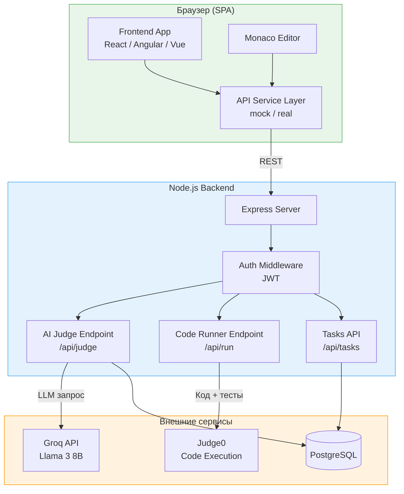
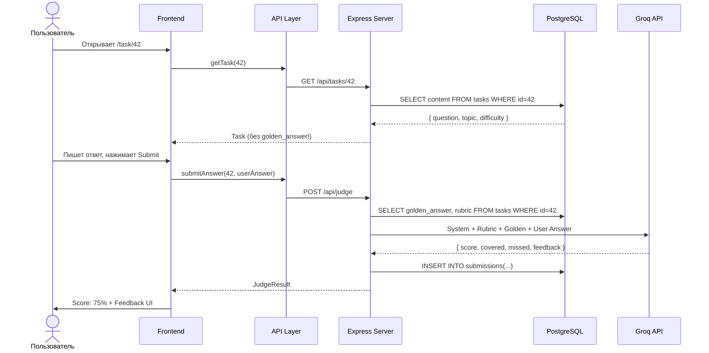

# Вариант A: Custom Backend + Judge0

Полная архитектурная документация для реализации AI Prep App с **собственным Node.js бэкендом** и **Judge0 Code Runner**.

> **Product Spec** (концепция, UI mockups): [03-ai-prep-app.md](../../03-ai-prep-app.md)
> **Сравнение вариантов**: [../README.md](../README.md)

---

## Почему Custom Backend?

- **Custom Backend +30** — отдельный балл за собственный сервер
- **Полный контроль** — кастомная валидация, стриминг, сложная логика оценки
- **Judge0 Code Runner** — 60+ языков, sandbox из коробки, production-level
- **Production-like архитектура** — опыт для портфолио и собеседований
- **AI Judge на сервере** — ключи API не попадают в браузер

### Когда НЕ выбирать

- Ментор (**Mentor**) не готов писать бэкенд на Node.js
- В команде нет опыта с Docker / PostgreSQL
- Хотите сфокусироваться на фронтенде → [Вариант B](../variant-b/)

---

## Команда

| Имя        | Роль             | Компоненты                                                              |
| ---------- | ---------------- | ----------------------------------------------------------------------- |
| **Nika**   | Editor-Dev       | Task Viewer, Code Editor (Monaco), Submissions, Hint UI                 |
| **Oscar**  | Dashboard-Dev    | Dashboard, Progress Matrix, Rubrics Display, History Page               |
| **Paula**  | Judge-Dev        | Judge Client, Feedback UI, Score Display, Answer Comparison             |
| **Mentor** | Backend (Mentor) | Express API, Judge0 интеграция, AI Judge endpoint, DB, Generator Script |

---

## Архитектура высокого уровня



### Поток данных: Theory Task



---

## Декомпозиция компонентов

### Nika (Editor-Dev): Task & Editor

| Компонент       | Описание                                                     | Сложность |
| --------------- | ------------------------------------------------------------ | --------- |
| `TaskViewer`    | Отображение вопроса, темы, сложности, breadcrumbs            | Средняя   |
| `TheoryInput`   | Textarea для текстового ответа + Markdown preview            | Средняя   |
| `CodeEditor`    | Monaco Editor с подсветкой, автокомплитом, темами            | Высокая   |
| `SubmitButton`  | Submit + loading state + debounce (защита от двойного клика) | Низкая    |
| `HintPanel`     | Уровневые подсказки: Level 1 → Level 2 → Show Answer         | Средняя   |
| `TopicSelector` | Список тем с прогресс-индикатором                            | Средняя   |

**API-сервисы Nika:**

```
src/api/
├── tasks.api.ts      # getTask, getTasksByTopic, getTopics
└── submissions.api.ts # submitAnswer, getMySubmissions
```

### Oscar (Dashboard-Dev): Dashboard & Progress

| Компонент        | Описание                                             | Сложность |
| ---------------- | ---------------------------------------------------- | --------- |
| `Dashboard`      | Главный экран: XP, streak, последние сабмиты         | Средняя   |
| `ProgressMatrix` | Матрица навыков: темы × уровни, цветовое кодирование | Высокая   |
| `RubricDisplay`  | Чеклист: покрытые / непокрытые критерии              | Средняя   |
| `HistoryPage`    | Таблица/список всех сабмитов с фильтрами             | Средняя   |
| `StatsCharts`    | Графики прогресса (by topic, by time)                | Средняя   |
| `ProfilePage`    | Настройки, аватар, статистика пользователя           | Низкая    |

**API-сервисы Oscar:**

```
src/api/
├── dashboard.api.ts  # getDashboardStats, getStreak
├── progress.api.ts   # getProgressMatrix, getTopicProgress
└── history.api.ts    # getSubmissionHistory, getSubmissionById
```

### Paula (Judge-Dev): Judge & Feedback

| Компонент          | Описание                                            | Сложность |
| ------------------ | --------------------------------------------------- | --------- |
| `JudgeClient`      | Сервис отправки ответа на оценку (mock/real)        | Высокая   |
| `FeedbackPanel`    | Отображение score, feedback, rubric results         | Средняя   |
| `ScoreDisplay`     | Визуализация оценки: круговая диаграмма, анимация   | Средняя   |
| `AnswerComparison` | Side-by-side: ответ пользователя vs эталон          | Средняя   |
| `TestResults`      | Результаты автотестов для coding tasks: каждый тест | Средняя   |
| `AIErrorHint`      | AI-подсказка на основе stderr (для coding tasks)    | Средняя   |

**API-сервисы Paula:**

```
src/api/
├── judge.api.ts      # evaluateTheory, evaluateCode
└── feedback.api.ts   # getFeedbackHistory, compareFeedback
```

### Mentor (Mentor): Backend

| Компонент          | Описание                                            | Сложность |
| ------------------ | --------------------------------------------------- | --------- |
| `Express Server`   | REST API + middleware (auth, validation, CORS)      | Высокая   |
| `Judge Endpoint`   | POST /api/judge → Groq API → structured response    | Высокая   |
| `Runner Endpoint`  | POST /api/run → Judge0 → test results + stderr      | Высокая   |
| `Auth System`      | JWT generation/validation, refresh tokens           | Средняя   |
| `DB Schema`        | PostgreSQL миграции, seed data                      | Средняя   |
| `Generator Script` | Python/Node скрипт для генерации контента через GPT | Средняя   |

---

## Стек технологий

| Слой            | Технология                       | Зачем                   |
| --------------- | -------------------------------- | ----------------------- |
| **Frontend**    | React / Angular / Vue (на выбор) | SPA                     |
| **Стейт**       | Zustand / Redux / NgRx           | Глобальное состояние    |
| **Code Editor** | Monaco Editor                    | VS Code в браузере      |
| **Стилизация**  | CSS Modules / Tailwind           | На выбор команды        |
| **Backend**     | Node.js + Express                | REST API                |
| **Авторизация** | JWT (jsonwebtoken)               | Stateless auth          |
| **База данных** | PostgreSQL                       | Реляционные данные      |
| **AI**          | Groq API (Llama 3)               | Быстрый inference       |
| **Code Runner** | Judge0 (SaaS)                    | Sandbox-выполнение кода |
| **Деплой FE**   | Vercel / Netlify                 | Бесплатный хостинг      |
| **Деплой BE**   | Render / Railway                 | Free tier для Node.js   |

---

## Что делает этот вариант интересным

1. **Полный full-stack проект** — от PostgreSQL до Monaco Editor. Идеально для портфолио
2. **AI в продакшене** — не просто чат-бот, а structured evaluation с рубриками
3. **Judge0** — то, что стоит за LeetCode и HackerRank. Вы узнаете, как это работает изнутри
4. **3 уровня мокирования** — учит думать об архитектуре: interface first, implementation second
5. **Content generation** — генерация задач через ChatGPT/Claude учит prompt engineering
6. **Вы строите тренажёр для себя** — реальный инструмент подготовки к собеседованиям

### «Вау-моменты» для демо

- Пользователь пишет ответ → AI выдаёт рубрику с покрытыми/непокрытыми критериями
- Monaco Editor с запуском кода → тесты проходят/падают в реальном времени
- AI объясняет ошибку stderr на понятном языке
- Матрица навыков окрашивается по мере прогресса

---

## Навигация по документам

| Документ                                               | Описание                                                       | Когда читать               |
| ------------------------------------------------------ | -------------------------------------------------------------- | -------------------------- |
| [scoring-and-plan.md](./scoring-and-plan.md)           | Расчёт баллов (4 человека), 6-недельный план, MVP стратегия    | На этапе планирования      |
| [data-contracts.md](./data-contracts.md)               | TypeScript типы, PostgreSQL схема, REST API контракты          | Перед началом разработки   |
| [ai-judge.md](./ai-judge.md)                           | Стратегия AI Judge: Level 0/1/2, промпты, переключение уровней | При разработке AI Judge    |
| [code-runner.md](./code-runner.md)                     | Judge0 интеграция (SaaS + self-hosted), AI Error Hint          | При разработке Code Runner |
| [risks-and-mitigations.md](./risks-and-mitigations.md) | Mentor SPOF, Judge0 лимиты, cold start, безопасность           | На всех этапах проекта     |
