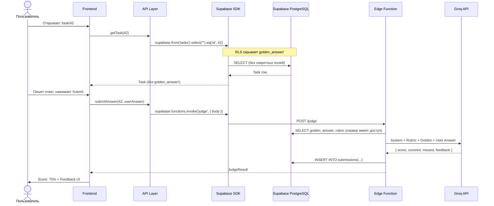
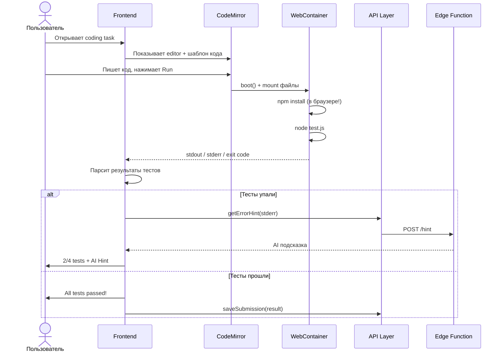

# Вариант B: Supabase + WebContainer

Полная архитектурная документация для реализации AI Prep App с **Supabase** (Auth + DB + Edge Functions) и **WebContainer** (StackBlitz) для запуска кода в браузере.

> **Product Spec** (концепция, UI mockups): [03-ai-prep-app.md](../../03-ai-prep-app.md)
> **Сравнение вариантов**: [../README.md](../README.md)

---

## Почему Supabase + WebContainer?

- **Нет своего сервера** — Supabase даёт Auth, DB, Edge Functions из коробки
- **BaaS Auth +15** — балл за работу с облачной авторизацией
- **BaaS CRUD +15** — балл за работу с облачной базой данных
- **Code Runner в браузере** — WebContainer не требует бэкенда для запуска кода
- **Ментор фокусируется на AI** — вместо DevOps, **Mentor** пишет промпты и контент
- **Быстрый старт** — Supabase проект за 5 минут, авторизация через Google/GitHub

### Когда НЕ выбирать

- Хотите получить Custom Backend +30 → [Вариант A](../variant-a/)
- Нужен Judge0 (60+ языков, серьёзный sandbox) → [Вариант A](../variant-a/)
- Команда имеет сильного бэкендера, который хочет писать Node.js

---

## Команда

| Имя        | Роль             | Компоненты                                                  |
| ---------- | ---------------- | ----------------------------------------------------------- |
| **Nika**   | Editor-Dev       | Task Viewer, Code Editor (CodeMirror), Submissions, Hint UI |
| **Oscar**  | Dashboard-Dev    | Dashboard, Progress Matrix, Rubrics Display, History Page   |
| **Paula**  | Judge-Dev        | Judge Client, Feedback UI, Score Display, Answer Comparison |
| **Mentor** | Backend (Mentor) | Supabase setup, Edge Functions, AI Judge, Generator Script  |

---

## Архитектура высокого уровня

```mermaid
graph TB
    subgraph Browser["Браузер (SPA)"]
        FE[Frontend App<br/>React / Angular / Vue]
        CM[CodeMirror Editor]
        WC[WebContainer<br/>Node.js в браузере]
        API_Layer[API Service Layer<br/>mock / real]
    end

    subgraph Supabase["Supabase Cloud"]
        Auth[Supabase Auth<br/>Google, GitHub]
        DB[(PostgreSQL)]
        Edge[Edge Functions<br/>Deno Runtime]
        RLS[Row Level Security]
    end

    subgraph External["Внешние сервисы"]
        Groq[Groq API<br/>Llama 3 8B]
    end

    FE --> API_Layer
    CM --> WC
    API_Layer -->|supabase-js SDK| Auth
    API_Layer -->|supabase-js SDK| DB
    API_Layer -->|invoke()| Edge
    Edge -->|LLM запрос| Groq
    DB --> RLS

    style Browser fill:#e8f5e9,stroke:#4caf50
    style Supabase fill:#fff3e0,stroke:#ff9800
    style External fill:#e3f2fd,stroke:#42a5f5
```

### Поток данных: Theory Task



### Поток данных: Coding Task (WebContainer)



---

## Декомпозиция компонентов

### Nika (Editor-Dev): Task & Editor

| Компонент            | Описание                                             | Сложность |
| -------------------- | ---------------------------------------------------- | --------- |
| `TaskViewer`         | Отображение вопроса, темы, сложности, breadcrumbs    | Средняя   |
| `TheoryInput`        | Textarea для текстового ответа + Markdown preview    | Средняя   |
| `CodeEditor`         | CodeMirror с подсветкой, темами, авто-отступами      | Высокая   |
| `WebContainerRunner` | Запуск кода в WebContainer + парсинг результатов     | Высокая   |
| `SubmitButton`       | Submit + loading state + debounce                    | Низкая    |
| `HintPanel`          | Уровневые подсказки: Level 1 → Level 2 → Show Answer | Средняя   |
| `TopicSelector`      | Список тем с прогресс-индикатором                    | Средняя   |

**API-сервисы Nika:**

```
src/api/
├── tasks.api.ts      # getTask, getTasksByTopic, getTopics
└── submissions.api.ts # submitAnswer, getMySubmissions
```

### Oscar (Dashboard-Dev): Dashboard & Progress

| Компонент        | Описание                                             | Сложность |
| ---------------- | ---------------------------------------------------- | --------- |
| `Dashboard`      | Главный экран: XP, streak, последние сабмиты         | Средняя   |
| `ProgressMatrix` | Матрица навыков: темы × уровни, цветовое кодирование | Высокая   |
| `RubricDisplay`  | Чеклист: покрытые / непокрытые критерии              | Средняя   |
| `HistoryPage`    | Таблица/список всех сабмитов с фильтрами             | Средняя   |
| `StatsCharts`    | Графики прогресса (by topic, by time)                | Средняя   |
| `ProfilePage`    | Настройки, аватар, статистика пользователя           | Низкая    |

**API-сервисы Oscar:**

```
src/api/
├── dashboard.api.ts  # getDashboardStats, getStreak
├── progress.api.ts   # getProgressMatrix, getTopicProgress
└── history.api.ts    # getSubmissionHistory, getSubmissionById
```

### Paula (Judge-Dev): Judge & Feedback

| Компонент          | Описание                                            | Сложность |
| ------------------ | --------------------------------------------------- | --------- |
| `JudgeClient`      | Сервис отправки ответа на оценку (mock/real)        | Высокая   |
| `FeedbackPanel`    | Отображение score, feedback, rubric results         | Средняя   |
| `ScoreDisplay`     | Визуализация оценки: круговая диаграмма, анимация   | Средняя   |
| `AnswerComparison` | Side-by-side: ответ пользователя vs эталон          | Средняя   |
| `TestResults`      | Результаты автотестов для coding tasks: каждый тест | Средняя   |
| `AIErrorHint`      | AI-подсказка на основе stderr (для coding tasks)    | Средняя   |

**API-сервисы Paula:**

```
src/api/
├── judge.api.ts      # evaluateTheory, evaluateCode
└── feedback.api.ts   # getFeedbackHistory, compareFeedback
```

### Mentor (Mentor): Supabase & AI

| Компонент              | Описание                                           | Сложность |
| ---------------------- | -------------------------------------------------- | --------- |
| `Supabase Project`     | Создание проекта, настройка Auth (Google, GitHub)  | Средняя   |
| `DB Schema + RLS`      | PostgreSQL таблицы + Row Level Security политики   | Средняя   |
| `Edge Function: judge` | AI Judge endpoint → Groq API → structured response | Высокая   |
| `Edge Function: hint`  | Error hint endpoint → stderr → подсказка           | Средняя   |
| `RPC Functions`        | SQL-функции для сложных запросов (dashboard stats) | Средняя   |
| `Generator Script`     | Скрипт генерации контента через GPT/Claude         | Средняя   |

---

## Стек технологий

| Слой            | Технология                       | Зачем                           |
| --------------- | -------------------------------- | ------------------------------- |
| **Frontend**    | React / Angular / Vue (на выбор) | SPA                             |
| **Стейт**       | Zustand / Redux / NgRx           | Глобальное состояние            |
| **Code Editor** | CodeMirror 6                     | Лёгкий, модульный, хорошие docs |
| **Code Runner** | WebContainer API                 | Node.js в браузере              |
| **Стилизация**  | CSS Modules / Tailwind           | На выбор команды                |
| **Авторизация** | Supabase Auth                    | Google, GitHub из коробки       |
| **База данных** | Supabase PostgreSQL              | Управляемый PG + RLS            |
| **Serverless**  | Supabase Edge Functions          | Deno runtime, бесплатный tier   |
| **AI**          | Groq API (Llama 3)               | Быстрый inference               |
| **Деплой**      | Vercel / Netlify                 | Бесплатный хостинг SPA          |

---

## Supabase: Quick Start

### Создание проекта (5 минут)

1. Зайти на [supabase.com](https://supabase.com), создать проект
2. Скопировать `SUPABASE_URL` и `SUPABASE_ANON_KEY` в `.env`
3. Включить Auth providers (Google, GitHub) в Dashboard → Authentication
4. Выполнить SQL-схему в Dashboard → SQL Editor
5. Установить `@supabase/supabase-js` в проекте

### Деплой Edge Functions

```bash
# Установить Supabase CLI
npm install -g supabase

# Логин
supabase login

# Создать Edge Function
supabase functions new judge

# Задеплоить
supabase functions deploy judge

# Установить секреты
supabase secrets set GROQ_API_KEY=gsk_...
```

### Локальная разработка

```bash
# Запуск локального Supabase (Docker)
supabase start

# Edge Functions в dev режиме
supabase functions serve
```

---

## Что делает этот вариант интересным

1. **Нет своего сервера** — всё через Supabase SDK и Edge Functions. Меньше DevOps, больше продукта
2. **WebContainer — магия** — Node.js запускается прямо в браузере. Это впечатляет на демо
3. **RLS вместо middleware** — безопасность на уровне базы данных. Элегантно и надёжно
4. **OAuth за 5 минут** — Google/GitHub логин без написания кода авторизации
5. **Edge Functions** — серверлесс на Deno, ключи API в безопасности
6. **Ты строишь тренажёр для себя** — реальный инструмент подготовки к собеседованиям

### «Вау-моменты» для демо

- Пользователь логинится через GitHub одним кликом
- Пишет ответ → AI выдаёт структурированную рубрику с фидбеком
- Открывает coding task → пишет код → запускает **в браузере** → тесты проходят
- AI объясняет ошибку на понятном языке
- Матрица навыков окрашивается по мере прогресса
- Всё работает без единого собственного сервера

---

## Навигация по документам

| Документ                                               | Описание                                                             | Когда читать               |
| ------------------------------------------------------ | -------------------------------------------------------------------- | -------------------------- |
| [scoring-and-plan.md](./scoring-and-plan.md)           | Расчёт баллов (4 человека), 6-недельный план, MVP стратегия          | На этапе планирования      |
| [data-contracts.md](./data-contracts.md)               | TypeScript типы, Supabase схема + RLS, SDK интеграция                | Перед началом разработки   |
| [ai-judge.md](./ai-judge.md)                           | Стратегия AI Judge: Level 0/1/2, Edge Function, переключение уровней | При разработке AI Judge    |
| [code-runner.md](./code-runner.md)                     | WebContainer интеграция, формат тестов, AI Error Hint                | При разработке Code Runner |
| [risks-and-mitigations.md](./risks-and-mitigations.md) | Supabase лимиты, WebContainer ограничения, RLS безопасность          | На всех этапах проекта     |
