# RS Shop

| Deadline | Repo name    |
| -------- | ------------ |
|          | angular-shop |

**RS Shop** – приложение - интернет-магазин со следующим функционалом:

- витрина с товарами
- корзина с товарами
- заказы

## Прототипы приложения

Прототипом приложения можно считать сайт электронного магазина 21 Век: https://www.21vek.by/
Задание — это упрощенная версия магазина. Примеры макетов и поведения можно смотреть в оригинале. Картинки товаров, их цены и описание в качестве исходных данных также можно брать из оригинала. Задание следует выполнять как можно более приближеннее к оригиналу.

## Структура приложения

1. [Хедер](#хедер):  
   1.1 Навигация  
   1.2 Навигация по категориям товаров  
   1.3 Блок работы с профилем
1. [Футер](#футер)
1. [Главная страница магазина](#главная-страница-магазина)
1. [Страница товаров выбранной категории](#страница-товаров-выбранной-категории)
1. [Страница Детали товара](#Страница-детали-товара)
1. [Избранные товары](#избранные-товары)
1. [Лист ожидания](#лист-ожидания)

## **Описание функциональных блоков**

### **Хедер**

Хедер должен содержать:

- #### Информационный блок:

  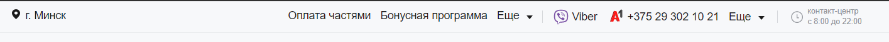

  - блок выбора и изменения локации пользователя. Список локаций состоит из крупных городов вашей страны. Изначально локация определяется автоматически по IP-адресу.

    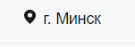

  - блок контактов: вайбер, мобильный телефон + дропдаун с выпадающим списком дополнительных контактов

    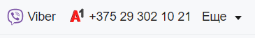
    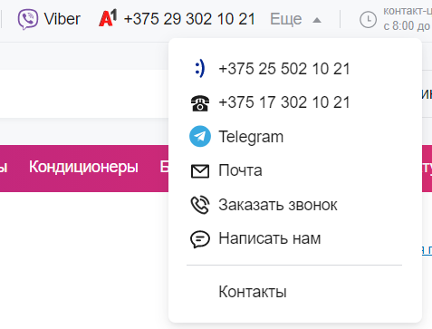

  - блок с указанием времени работы контакт-центра

- #### Навигационный блок:

  

  - распологается под информационным блоком
  - содержит логотип (можно взять любой логотип). По клику на логотип происходит навигация на главную страницу.
  - содержит кнопку **"Каталог товаров"**, при нажатии на которую появляется панель (либо происходит навигация на отдельную страница) с категориями товаров

    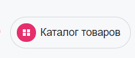

  - категории товаров должны иметь уровни иерархии, например **Бытовая техника / Техника для ухода за одеждой / Утюги**

    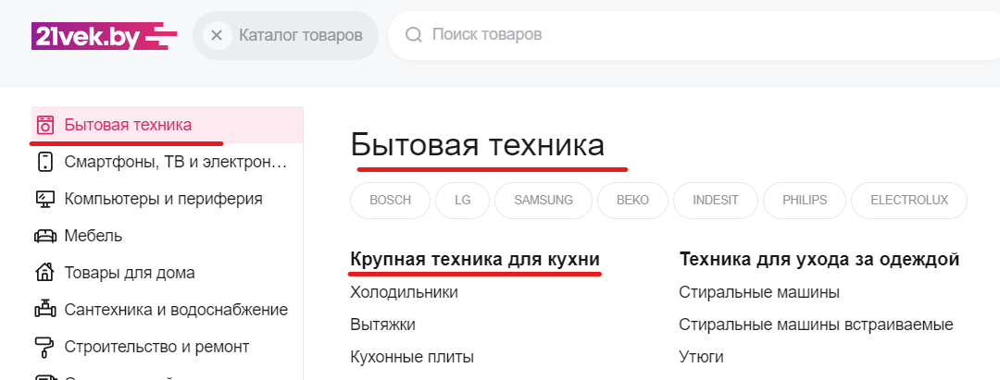

  - панель разделена на 2 части - слева главные категории товаров (самый верхний уровень), справа вложенные уровни в виде списка в 2 колонки. При наведении на какую-либо основную категорию в левой части, справа отображается список вложенных категорий, которые относятся к главной категории.

    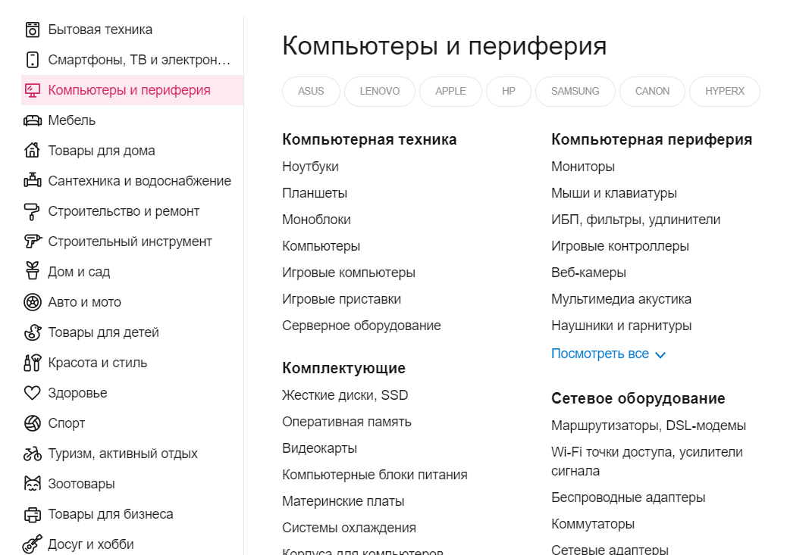

  - категории в левой имеют соответствующие иконки
  - реализовать поиск как по названиям категории. Результаты должны отображаться в выпадающем окне. Результаты поиска должны отображать список товаров, подходящих под запрос с возможностью перейти на страницу с деталями любого из указанных товаров. При вводе символов в поле для поиска реализовать debounce, который отправляет запрос спустя определенное время (например: 100 мс), а также при определенном количестве символов (например: больше 2-х)

    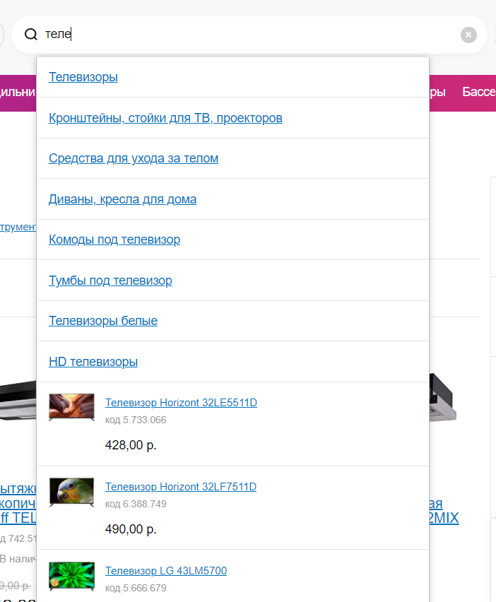

  Для реализации поиска создавать отдельную страницу не обязательно. Достаточно отобразить результаты в выпадающем списке.

  - кнопка перехода в корзину открывает страницу с товарами, добавленными в корзину
  - #### **Блок работы с профилем**

    - распологается в главной навигации в выпадающем списке

      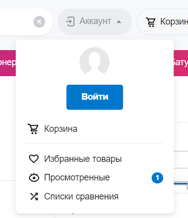

    - содержит краткое инфо об аккаунте (аватарка и имя пользователя)
    - вход/регистрация в аккаунт. Данные о зарегистрированном пользователе сохраняются в localStorage.
      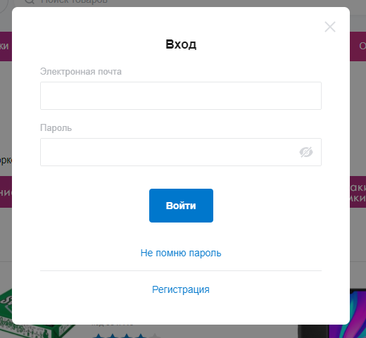
    - выход из аккаунта. При этом удаляются из localStorage данные о пользователе.
    - блок работы с товарами:
      - переход на страницу _Избранные товары_
      - переход на страницу _Лист ожидания_

  - ### **Навигация по категориям товаров**
    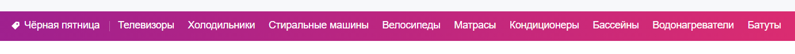
    - выполнена под основной навигацией и содержит отдельно список основных (главных) категорий товаров
      При клике должен быть переход на страницу категории товаров

### **Футер**

Содержит следующие элементы:

- блок контактов (аналогичных указанных в хедере, но без дропдауна)
- блок ссылок на социальные сети магазина

  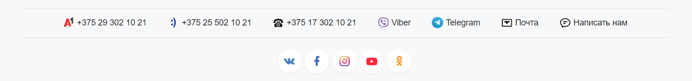

### **Главная страница магазина**

Главная страница содержит следующие элементы:

- #### Слайдер
  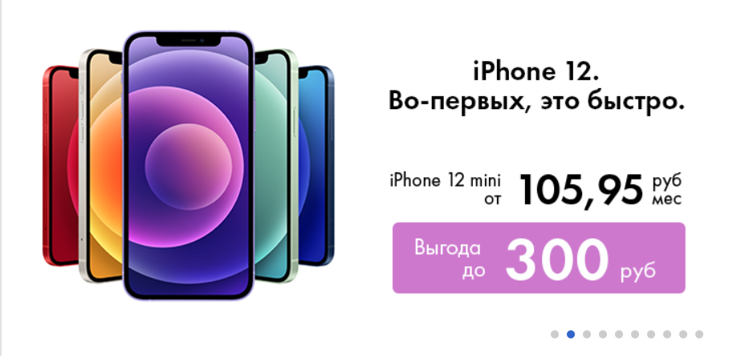
  - слайдер с набором товаров, которые сменяются автоматически с заданным интервалом времени (задается самостоятельно). При клике на слайдер пользователь попадает на страницу **Детали товара**
- #### Популярные товары
  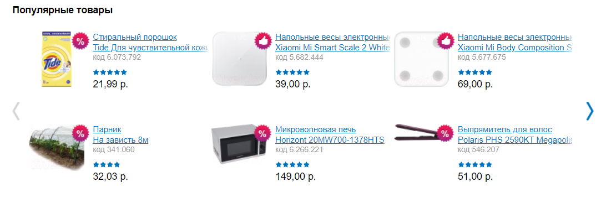
- необходимо выполнить в виде слайдера каждая страница которого состоит из 6 карточек популярных товаров.

### **Страница товаров выбранной категории**

- содержит иерархию выбранной категории (breadcrumbs). Например: Туризм, активный отдых > Велосипеды, самокаты, ролики  
  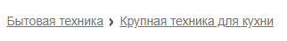
- название категории, например **Холодильники**
- список товаров в данной категории в виде карточек  
  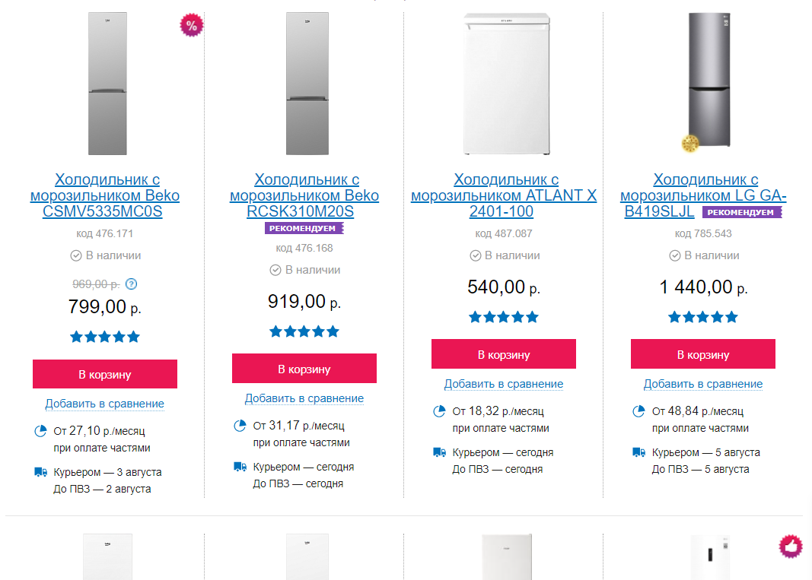
  - наименование товара
  - изображение товара
  - есть ли в наличии или нет. Для товаров которых на складе более 20 окрашивать иконку в зеленый цвет, если от 5 до 19 - в желтый, если менее 5 в красный.
  - цена
  - рейтинг
  - кнопка добавления в корзину
  - кнопка добавления в избранное
  - состояние кнопок _в избранное_ и _в корзину_ меняется в зависимости от того, добавлен ли товар в тот или иной список
- должна быть возможность сортировки товаров по цене (сначала дешевые или сначала дорогие) и по популярности
  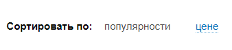
- товары должны отображаться не все сразу, а группами по 10 штук, после них должна быть кнопка "Показать больше", по нажатию на которую подгружается еще группа из 10 товаров.

### **Страница Детали товара**

- должна содержать иерархию выбранной категории (breadcrumbs). Например: Туризм, активный отдых > Велосипеды, самокаты, ролики
- Наименование товара
- Фотографии товара в виде слайдера
- Кнопка добавления _в избранное_
- Кнопка добавления _в корзину_
- состояние кнопок _в избранное_ и _в корзину_ меняется в зависимости от того, добавлен ли товар в тот или иной список

  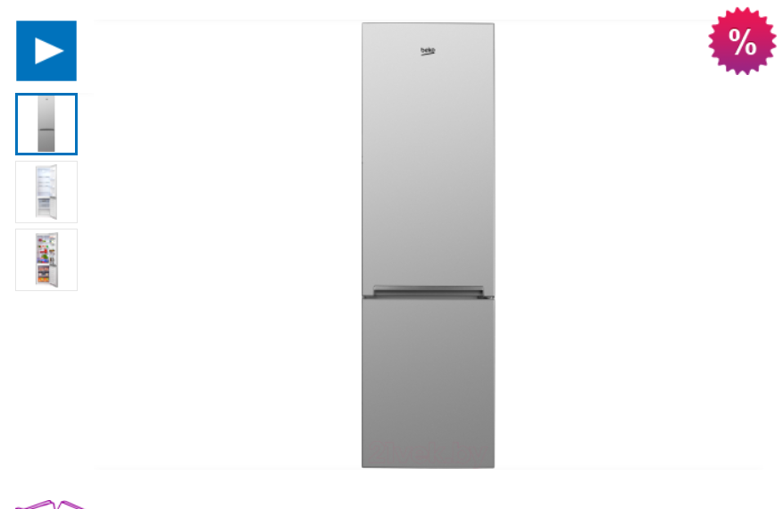

- если товар на акции или популярен, в правом верхнем углу должна быть иконка
- Секция с описанием товара и его характеристиками располагается под блоком с фотографиями

  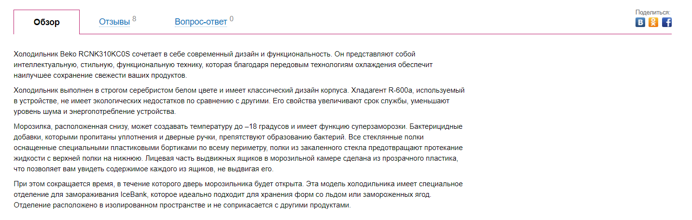

### **Корзина**

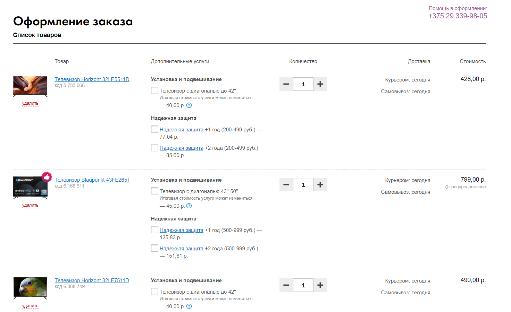

#### Должна содержать:

- список товаров с названием, изображением, кратким описанием, кол-вом (с возможностью изменения количества единиц товара, при это стоимость за данный товар должна пересчитываться), сроком доставки, стоимостью товара и возможностью перейти на данный товар
- информацию об общей стоимости заказа
- форму для ввода информации для заказа:
  - ФИО
  - Адрес доставки
  - Номер телефона
  - Желаемое время доставки. Можно использовать Date & time picker
  - Комментарий к заказу
- кнопку с подтверждением оформления заказа

Правила валидации полей:

- ФИО: обязательное поле, минимальная длина строки - 3, максимальная - 50
- Адрес доставки: обязательное поле, минимальная длина строки - 3, максимальная - 250
- Номер телефона: обязательное поле, строка содержит только символ "+" вначале и числа
- Желаемое время доставки: обязательное поле, валидная дата и время
- Комментарий к заказу: опциональное поле, максимальная длина строки - 250
  Пользователь может оформить заказ только после правильного ввода всех полей, в противном случае необходимо показать сообщение об ошибке под тем полем, которое заполнено неверно.

По созданию заказа показать подтверждение с указанными данными для доставки: "Ваш заказ создан успешно, ожидайте доставку в указанное время". После этого количество доступных единиц товаров в самом магазине должно уменьшиться.

### **Избранные товары**

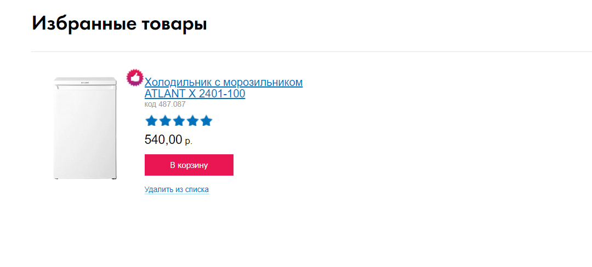

Нобор карточек товаров в несколько колонок. Каждая карточка должна содержать:

- изображение товара
- наименование товара
- рейтинг (0-5 в виде звезд)
- цену
- кнопку добавления в корзину
- кнопку удаления из избранного

### **Лист ожидания**

Должен содержать информацию о каждом заказе пользователя в виде списка (дизайн на ваше усмотрение). Каждый элемент списка — это отдельный заказ

- должен содержать информацию о доставке, стоимость к оплате, номер заказа, элементы отмены / редактирования заказа. Каждый заказ должен быть выполнен в виде раскрывающегося списка с набором товаров в заказе (наименование товара / кол-во / стоимость)

## Бекенд

В качестве бекенда можете использовать созданный [JSON server](https://github.com/pavelrazuvalau/rs-shop-json-server).
Для этого вам нужно клонировать репозиторий и запустить локально json-server.

## Требования к репозиторию

- для разработки приложения вы создаете приватный репозиторий в своем GitHub
- название репозитория: **rs-shop**, название ветки, в которой ведётся разработка - **develop**, ветка **master** пустая, содержит только README.md
- история коммитов должна отображать процесс разработки приложения. [Требования к коммитам](https://docs.rs.school/#/git-convention)
- демо-версия приложения размещается на `gh-pages`, `netlify`, `heroku` либо на другом подобном хостинге.
  Для демоверсий, размещённых на `netlify` и `heroku`, название страницы дайте по схеме: rs-shop - гитхаб студента
- после окончания разработки или при наступлении дедлайна, создайте pull request из ветки разработки в ветку `main`. [Требования к pull request](https://docs.rs.school/#/pull-request-review-process?id=Требования-к-pull-request-pr). **Мержить Pull Request не нужно**
- репозиторий, в котором велась работа над проектом, после наступления дедлайна нужно сделать публичным.

## Технические требования

- работа приложения проверяется в браузере Google Chrome последней версии
- необходимо использовать Angular
- использование фич Angular и TypeScript
  - типизация объектов сущностей, используемых в приложении. Избегать использование any
  - Components
  - Directives & Pipes
  - Modules (core, shared, feature modules)
  - Services
  - Routing (Page navigation, Guards, Resolvers)
  - Reactive / Template forms, validation
  - HttpClient + HttpInterceptor
  - RxJS
  - NgRx
- можно использовать [bootstrap](https://getbootstrap.com/), [Angular material](https://material.angular.io/), css-фреймворки, html и css препроцессоры
- можно использовать сторонние js-библиотеки
- запрещено копировать код других студентов. Этот запрет касается html, css, js кода, дизайна. Можно использовать небольшие фрагменты кода со Stack Overflow, других самостоятельно найденных источников в интернете, за исключением github-репозиториев студентов курса.

## Как сабмитить задание

- Каждый студент самостоятельно сабмитит в rs app ссылку на pull request и получает баллы по результатам кросс-чека.
- Убедитесь, что pull request доступен для проверки. Для этого откройте ссылку, которую сабмитите в rs app, в режиме инкогнито браузера.
- Если задание не засабмитить до дедлайна, оно не попадёт на распределение при кросс-чеке и за него не будут выставлены баллы.

## Требования к оформлению приложения

- особое внимание обратите на качество оформления приложения. Как прототип можно использовать подходящие шаблоны, размещённые на [behance](https://www.behance.net/search/projects?tracking_source=typeahead_search_direct&search=learn%20english%20app%20design), [dribbble](https://dribbble.com/search/Learn%20English%20App), [pinterest](https://www.pinterest.com/search/pins/?q=learn%20english%20app%20design)
- качественное приложение характеризуется проработанностью деталей, вниманием к типографике (не больше трёх шрифтов на странице, размер шрифта не меньше 14 рх, оптимальная [контрастность шрифта и фона](https://snook.ca/technical/colour_contrast/colour.html)), тщательно подобранным контентом
- вёрстка адаптивная. Минимальная ширина страницы, при которой проверяется корректность отображения приложения - 500рх
- интерактивность элементов, с которыми пользователи могут взаимодействовать, изменение внешнего вида самого элемента и состояния курсора при наведении, использование разных стилей для активного и неактивного состояния элемента, плавные анимации
- единство стилей всех страниц приложения - одинаковые шрифты, стили кнопок, отступы, одинаковые элементы на всех страницах приложения имеют одинаковый внешний вид и расположение. Цвет элементов и фоновые изображения могут отличаться. В этом случае цвета используются из одной палитры, а фоновые изображения из одной коллекции.

## Критерии оценивания

### Максимальный бал **640**

### Верстка **+50**

- [ ] вёрстка и дизайн всего приложения выполнены в едином стиле +20
- [ ] собственный оригинальный интересный качественный дизайн приложения +30

### Хедер **+100**

- [ ] информационный блок +15
  - [ ] автоматическое определение и выбор локации +5
  - [ ] контактные данные +5
  - [ ] информация о времени работы +5
- [ ] навигационный блок + 35
  - [ ] логотип +5
  - [ ] панель с иерархией категории товаров +20
  - [ ] поиск по категориям и товарам. Реализован debounce и фильтрация по количеству символов в строке поиска +10
- [ ] блок работы с профилем. Данные о текущем пользователе сохраняются в localstorage +10
- [ ] блок с навигацией по основным категориям товаров +40

### Футер **+20**

- [ ] блок контактов (аналогичных указанных в хедере, но без дропдауна) +10
- [ ] блок ссылок на социальные сети магазина +10

### Главная страница магазина **+70**

- [ ] слайдер с акционными товарами. При клике происходит навигация на страницу с товаром +30
- [ ] описание возможностей и преимуществ приложения +20
- [ ] видео с демонстрацией работы приложения +20

### Страница категории товаров **+120**

- [ ] содержит иерархию навигации (breadcrumbs) +10
- [ ] содержит необходимую информацию о выбранной категории и товарах +10
- [ ] каждая карточка с товаром или отдельный ее элемент меняет свой стиль в зависимости от наличия товара на складе +20
- [ ] реализовано добавление в избранное +15
- [ ] реализовано добавление в корзину +15
- [ ] кнопки добавления в списки меняются в зависимости от состояния +10
- [ ] реализована сортировка по критериям +20
- [ ] реализована частичная загрузка результатов (пагинация) +20

### Страница деталей товара **+100**

- [ ] содержит иерархию навигации (breadcrumbs) +10
- [ ] содержит необходимую информацию о товаре +10
- [ ] содержит слайдер с изображениями товара +20
- [ ] реализовано добавление в избранное +10
- [ ] реализовано добавление в корзину +10
- [ ] кнопки добавления в списки меняются в зависимости от состояния +20
- [ ] содержит описание и характеристики товара +10
- [ ] добавлена иконка в зависимости от акции и популярности товара +10

### Корзина **+60**

- [ ] содержит список товаров, добавленных в корзину +10
- [ ] реализована возможность изменять количество товаров для заказа +5
- [ ] содержит информацию об общей стоимости заказа в зависимости от количества +5
- [ ] реализована форма заказа со всеми необходимыми полями, включая валидацию +30
- [ ] заказ успешно оформляется при подтверждении +10

### Избранные товары **+20**

- [ ] содержит список добавленных товаров со всеми необходимыми данными +20

### Лист ожидания **+50**

- [ ] содержит информацию о заказах +10
- [ ] каждый заказ выполнен в виде раскрывающегося списка с указанием введенной информации для доставки +20
- [ ] реализована возможность редактирования заказа +20

### Дополнительный функционал **+50**

- [ ] реализован не указанный в задании дополнительный функционал. Оценивается оригинальная идея, вклад в улучшение качества приложения, полезность, сложность и качество выполнения +30
- [ ] написано не меньше 10 юнит-тестов (не созданных автоматически) +20

### Штрафы

- [ ] не выполнены требования к репозиторию -50
- [ ] в коде присутствуют ошибки линтера -20
- [ ] в ходе работы приложения возникают ошибки в консоли (http ошибки не учитываются) -50

## Cross-check

- инструкция по проведению cross-check: https://docs.rs.school/#/cross-check-flow

## Документ для вопросов

- документ для вопросов, связанных с выполнением задания: [ссылка здесь](https://docs.google.com/spreadsheets/d/1X82ONIAqDJ2JoliqBUMTrYu2tKhC5AMSB16GPrn3les/edit?usp=sharing)
