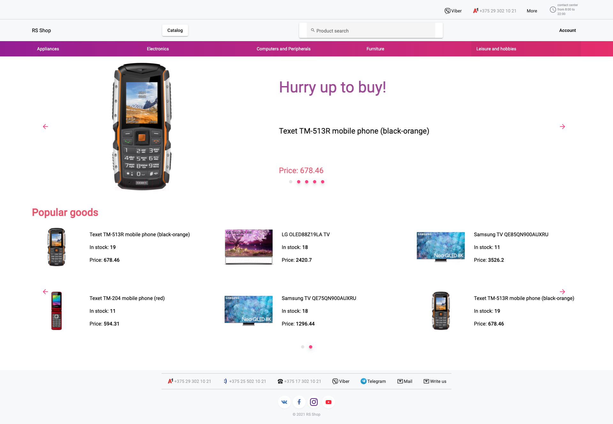

# Angular Online Shop

| Deadline |  Branch name          |
| -------- | --------------------- |
|          | angular-online-shop   |

**Angular Online Shop** – the online shop application with the following functionality:
- products showcase
- managing shopping cart
- submitting orders

## Application prototype
The presented design is for your reference and your final one could be any.



## Application structure

1. [Header](#header):  
  1.1 Navigation  
  1.2 Navigation to products category  
  1.3 Profile block  
1. [Footer](#footer)
1. [Shop landing page](#shop-landing-page)
1. [Category listing page](#category-listing-page)
1. [Product details page](#product-details-page)
1. [Cart](#cart)
1. [Favorite products](#favorite-products)
1. [Orders](#orders)

## **Functional requirements**

### **Header**

Header should contain:

- #### Block with information:  
  - contacts block: main contacts information and the dropdown with additional contacts

    

  - block that contains contact center working hours

- #### Navigation block:
  - located under the **Block with information**
  - has a logo (could be any). By clicking it a user navigates to the **Shop landing page**.
  - contains the **Catalog** button, after clicking on it a panel with product categories appears (or navigation to a separate page occurs)   
  - product categories should have hierarchy 

    
  - the panel is divided into 2 parts - on the left are the main categories of products (the topmost level), on the right are nested categories. When you hover over any main category on the left, a list of nested categories that belong to the main category is displayed on the right.

  - search by categories and products. The results should be displayed in a dropdown box. Search results should display a list of products that match the request with the ability to go to a page with details of any of the specified products. When entering characters in the search input, implement debounce, which sends a request after an input delay (for example: 100 ms), as well as for a particular number of characters (for example: more than 2)

    
  
  It is not necessary to create a separate page to implement search. It is enough to display the results in the dropdown.

  - #### **Account block**
    - anonymous user   
    
      - sign in, sign up buttons.   

    

    - authorized user   
    
      - log out button.
      - link to user **Cart**
      - link to user **Favorite products**
      - link to user **Orders**

  - ### **Navigation to products category**
    - contains a separate list of the main categories of products. By clicking each of them the navigation should be performed to the **Category listing page**

### **Footer**

Has the following elements:

- contacts block (as in header, but without a dropdown)
- links to social networks

### **Shop landing page**

The page has the following elements:

- #### Slider
  - a slider with a set of products that change automatically at a given time interval (set manually). When clicking on the slider, the user navigates to the **Product Details page**
- #### Popular products
- should be implemented as a slider, each slide of which consists of 6 cards of popular products.

### **Category listing page**

- contains the hierarchy of the selected category (breadcrumbs)   
  
- category name, for example **Laptops**
- list of products in this category as cards  
  
  - product name
  - image
  - availability of a product. For products with more than 20 in the warehouse, paint the card green, if from 5 to 19 - yellow, if less than 5 - red.   
  - price
  - rating
  - add to cart button
  - add to favorites button
  - state of the buttons should be changed depending on whether an item is in cart or marked as favorite
- it should be possible to sort products by price (cheap first or expensive first) and by rating   
  
- products should not be displayed all at once, but in groups of 10, after which there should be a "Show more" button, by clicking on which another group of 10 products is loaded.

### **Product details page**

- should contain the hierarchy of the selected category (breadcrumbs)
- name of product
- product images as a slider
- add to favorites button
- add to cart button
- state of the buttons should be changed depending on whether an item is in cart or marked as favorite
- a section with a description of the product is located under the block with images

  

### **Cart**

  
 
- a list of products including its name, image, quantity (with the ability to change the number of units of a product, while the cost for this product should be recalculated), cost of the product and the ability to navigate to this product
- information about the total cost of the order
- a form for entering information for the order with the following data:
   - Full name
   - Delivery address
   - Phone number
   - Desired delivery time. Date & time picker can be used
   - Comment to the order
- button for submitting an order

Field validation rules:
- Full name: required field, minimum length - 3, maximum - 50
- Delivery address: required field, minimum length - 3, maximum - 250
- Phone number: required field, the line contains only the "+" symbol at the beginning and numbers
- Desired delivery time: required field, valid date and time
- Comment to order: optional field, maximum length - 250
The user can place an order only if all fields are valid, otherwise it is necessary to show an error message under the field that is filled in incorrectly.

After creating an order, show a confirmation with the specified data for delivery and a message like "Your order has been created successfully, expect delivery at the specified time."

### **Favorite products**

A set of product cards in several columns. Each card should contain:

- product image
- name of product
- rating (0-5 stars)
- price
- add to cart button
- button for removing from favorites

### **Orders**

Should contain information about each user's order in the form of a list (design the way you want). Each item in the list is a separate order
  - should contain information about delivery, cost for payment, order number, elements of order cancellation / editing. Each order should be implemented as a drop-down list with a set of products in the order (product name / quantity / cost)

## Backend

As a backend, you should use the created [JSON server](https://github.com/pavelrazuvalau/rs-shop-json-server).
To do this, you need to clone the repository and run json-server locally.

## Repository requirements

- the work should be done in your private repository
- source code should be committed to a separate branch
- the **master** branch should be empty (contain only files like README.md or .gitignore)
- commit messages should follow the [guideline](https://www.conventionalcommits.org/en)
- once the work is finished, create a pull request from a development branch to master
- the pull request name should contain **the task name**
- the pull request description should contain the following information:
    - link to the task
    - screenshot of your application (one would be enough)
    - link to your application
    - date of completion/deadline
    - your self-check with a preliminary evaluation that is based on the evaluation criteria from the task

Example:

```
1. Task:
   Link to the current is here
2. App screenshot:
   Your screenshot is here
3. Deploy:  
   A link to your deployed application is here
4. Done 19.04.20 (deadline 19.04.20)
5. Score: 200 / 200
- [x] Minimal scope
    - [x] Feature 1 is implemented (+10)
    - [x] Feature 2 is implemented (+10)
- [x] Basic scope
    - [x] Feature 3 is implemented (+10)
    - [x] Feature 4 is implemented (+10)
- [x] Extra scope
    - [x] Feature 5 is implemented (+10)
    - [x] Feature 6 is implemented (+10)
- [x] Technical requirements
    - [x] ESLint is used (+10)
    - [x] ES6 features are used (+10)
    - [x] Requirements to the repository, commits and pull request are met (+10)
- [x] Penalties
    - [x] Errors while app's working. (-10 for each, but no more than the total number of points for requirement implementation)
    - [x] Not comply with the requirements for Pull Request, repository, commits names (-10) scores by mentor
```

## Technical requirements

- the application is checked in the latest version of Google Chrome
- you are supposed to use Angular
- usage of Angular and TypeScript features
  - typing of every objects used in the application. Avoid using "any"
  - Components
  - Directives & Pipes
  - Modules (Core, Shared, Feature modules)
  - Services
  - Routing (Page navigation, Guards, Resolvers)
  - Reactive / Template forms, validation
  - HttpClient + HttpInterceptor
  - RxJS
  - NgRx
- you can use [Angular material](https://material.angular.io/), [bootstrap](https://getbootstrap.com/) or any other UI framework. However, it's recommended to use Angular Material
- you can use 3rd party JS libraries
- it's prohibited to copy the code of other students. This prohibition applies to HTML, CSS, JS code, design. You can use small snippets of code from Stack Overflow, other self-found sources on the Internet, with the exception of the course students' GitHub repositories.

## Design requirements

- pay special attention to the quality of the application design. As a prototype, you can use suitable templates hosted on [behance](https://www.behance.net/search/projects?tracking_source=typeahead_search_direct&search=learn%20english%20app%20design), [dribbble](https://dribbble.com/search/Learn%20English%20App), [pinterest](https://www.pinterest.com/search/pins/?q=learn%20english%20app%20design)
- a high-quality application is characterized by elaboration of details, attention to typography (no more than three fonts on the page, font size not less than 14 px, optimal [font and background contrast](https://snook.ca/technical/colour_contrast/colour.html)) carefully selected content
- adaptive layout. The minimum page width at which the correctness of the application display is checked is 500px
- interactivity of elements with which users can interact, changing the appearance of the element itself and the state of the cursor on hover, using different styles for the active and inactive states of the element, smooth animations
- the uniformity of the styles of all pages of the application - the same fonts, button styles, indents, the same elements on all pages of the application have the same appearance and arrangement. Item color and background images may vary. In this case, the colors are used from the same palette, and the background images are from the same collection.

## Evaluation criteria

### The maximum score for the task: **620**
### Layout **+50**

- [ ] the layout and design of the entire application are made in the same style +20
- [ ] own original interesting high-quality app design +30

### Header **+100**

- [ ] block with information +15
  - [ ] contact details +10
  - [ ] working hours information +5
- [ ] Navigation block + 35
  - [ ] logo +5
  - [ ] categories listing panel +15
  - [ ] search field. Debounce and search query length filter is implemented +15
- [ ] account block +30
- [ ] list of links to categories +20

### Footer **+20**

- [ ] contacts block (as in header, but without a dropdown) +10
- [ ] links to social networks +10

### Shop landing page **+70**

- [ ] large showcase slider with a set of products that change automatically at a given time interval (set manually). By clicking on the slider, the user navigates to the **Product Details page** +40
- [ ] slider with popular products. By clicking on each product the navigation to the **Product Details page** occurs +30

### Category listing page **+120**

- [ ] has breadcrumbs +10
- [ ] has products of the current category +10
- [ ] each card with a product or its individual element changes its style depending on the availability of the product in stock +20
- [ ] add to favorites button +15
- [ ] add to cart button +15
- [ ] buttons for adding to lists change depending on the state +10
- [ ] implemented sorting by criteria +20
- [ ] implemented partial loading of results (pagination) +20

### Product details page **+80**

- [ ] has breadcrumbs (breadcrumbs) +10
- [ ] contains the necessary information about the product +10
- [ ] has product images as a slider +20
- [ ] add to favorites button +10
- [ ] add to cart button +10
- [ ] buttons for adding to lists change depending on the state +10
- [ ] has product description +10

### Cart **+60**

- [ ] contains a list of products added to the cart +10
- [ ] implemented the ability to change the quantity of products to order +5
- [ ] contains information about the total cost of the order depending on the quantity +5
- [ ] implemented order form with all required fields, including validation +30
- [ ] the order is successfully completed upon confirmation +10

### Favorite products **+20**

- [ ] contains a list of added products with all the necessary data +20

### Orders **+50**

- [ ] contains information about orders +10
- [ ] each order is made in the form of a drop-down list indicating the entered information for delivery +20
- [ ] implemented the ability to edit the order +20

### Additional functionality **+50**
- [ ] additional functionality not specified in the task has been implemented. The original idea, contribution to improving the quality of the application, usefulness, complexity and quality of implementation are evaluated: up to 50

### Penalties
- [ ] repository requirements aren't met -50
- [ ] the source code has lint errors -20
- [ ] errors occur in the console while the application is running (http errors are not counted) -50
