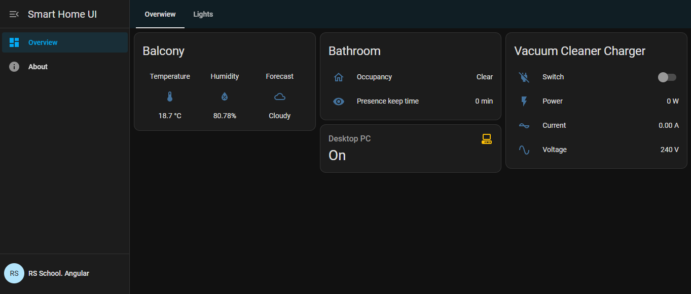
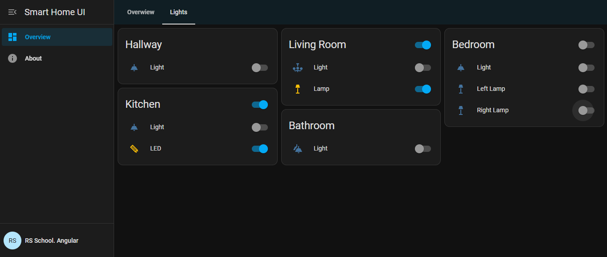

# Smart Home UI. Part 1

## Overview

Smart Home UI is an application for monitoring and controlling smart devices within a home environment. It offers a structured and interactive layout that allows users to:

- Monitor temperature, humidity, weather conditions, electricity usage, and other sensor data
- Control lights, sockets, relays, and switches
- View a unified dashboard composed of device and sensor cards grouped by rooms or functional areas

The interface adapts to various room configurations and device combinations, providing a flexible and user-friendly experience.




## Getting started

- Use `@angular/cli` to generate a new Angular project
- Angular 20 recommends using the standalone component architecture for new projects
  - You are free to choose either **Standalone components** or **NgModules**
  - Your choice of architecture will **not affect your score**
- It's highly recommended to use **SCSS** as the default stylesheet format
- Migrate the Angular application to ESLint
  - **Instead of Airbnb**, use the [Unicorn ESLint plugin](https://github.com/sindresorhus/eslint-plugin-unicorn), which was already used in Stage 2 and is known to work reliably with ESLint 9+
- Generate all the necessary components using `ng-cli`
- Use mock data to define the initial dashboard content. Based on this data:
  - Create interfaces/models for card types, devices, and sensors
  - Based on the models, plan the structure of components, including separate components for the list of cards and individual card rendering
- You may use any UI framework or library. It is recommended to use **Angular Material** for better integration

Mock data: [mock-data.json](mock-data.json)

## Components structure

You should implement a modular and reusable component structure that includes:

- **Sidebar** – static on desktop, collapsible on smaller screens
  - **Sidebar header**
  - **Sidebar menu** (contains at least a "Dashboard" section)
  - **Sidebar footer** with placeholder layout for login/avatar (no logic required in this task)
- **Dashboard** – displays the main content area
- **Tab switcher** – switches between sections of the dashboard (e.g., Overview, Lights)
- **Card list** – renders a collection of cards
- **Card** – renders a single card and its contents
- **Device** – reusable component for all controllable devices
- **Sensor** – reusable component for all read-only sensors

## Functional requirements

The dashboard displays a list of cards, each representing a group of devices and/or sensors.

The data now comes as mock data defined directly within the application code. In the next task in the series, the data will be retrieved from a backend.

Each card should reflect the structure and entities defined in the data.  
Card data includes a layout type that defines how its content should be displayed (e.g., single, horizontal, vertical).

### Card types

- **Single-device card**  
  Compact layout for a single device or sensor  
  For controllable devices, the icon acts as a toggle — no separate switch is shown

- **Multi-device card — horizontal layout**  
  Devices or sensors are displayed in a horizontal row

- **Multi-device card — vertical layout**  
  Devices or sensors are stacked vertically

Each card includes:

- A title (e.g., room name or zone)
- A list of devices and/or sensors
- (If applicable) a **group toggle** for all controllable devices

The toggle appears when the card includes **two or more controllable devices**, even if it also contains sensors

### Group toggle logic

If a card contains two or more controllable devices, a **group toggle** should be shown. The toggle is considered:

- **ON** if at least one device is on
- **OFF** if all devices are off

Toggling the group switch should set all device states accordingly.  
This logic can be implemented as part of the card component.

### Device and Sensor components

#### Controllable device

Controllable devices may include **lights, sockets, relays, wall switches**, etc.

The device component should receive a data object like:

```ts
{
  icon: string;
  label: string;
  state: boolean;
}
```

- In **single-device cards**, the icon acts as a toggle
- In **multi-device cards**, use a **switch element** to control device state
- The icon should visually reflect the device’s current state (ON/OFF)
- You may use icons from **Angular Material** or any other icon set

#### Sensor

Sensors provide read-only values such as:

- Weather: temperature, humidity, forecast
- Electricity: voltage, current, power

A reusable sensor component should receive a data object like:

```ts
{
  icon: string;
  label: string;
  value: {
    amount: number;
    unit: string;
  }
}
```

You should implement a custom **pipe** to convert sensor values into a readable string (e.g., `220 W`, `75 %`).

### Custom Directives

You should implement at least **one custom directive**.

Recommended use cases include:

- Highlighting a controllable device when its state is **ON** (e.g., change color, glow, etc.)
- Highlighting an entire **card** when at least one device in it is active

### Custom Pipes

You should implement at least **one custom pipe** to:

- Format sensor values from objects into readable strings (e.g., `{ amount: 220, unit: 'W' }` → `220 W`)

Additional custom pipes are encouraged but optional. It may include transforming device labels or state indicators.

## Evaluation criteria (100 points)

### Getting Started — 30 points

- Project is initialized and structured — 5
- ESLint is configured with the **Unicorn plugin** — 5
- Models are created based on the mock data — 5
- Components are generated according to the **Components structure** section — 5
- HTML layout is implemented: sidebar, tab switcher, and dashboard container — 5
- Sidebar is responsive: static and always visible on desktop, collapsible with toggle icon on tablet/mobile and hidden by default — 5

### Components — 40 points

- Card list and individual cards are implemented as separate components and interact via Input/Output; card lists are displayed in separate tabs — 5
- Group toggle is implemented and stays synchronized with device states — 5
- Devices are rendered using a shared component with icon, label, and state; includes correct interaction logic for single and multi-device cards; icon and switch reflect device state — 15
- Sensors are rendered using a shared component with icon, label, and value; sensor value is formatted from an object with amount and unit — 15

### Custom logic — 30 points

- At least one custom directive is implemented and used (e.g., highlight active devices or cards) — 15
- At least one custom pipe is implemented and used to format sensor values — 15

## Penalties

- App fails to build or has console errors — −30
- Component structure significantly deviates from described architecture — −15
- No custom directive is implemented — −15
- No custom pipe is implemented — −15
- ESLint warnings or errors are present — −10
- Using the `any` type in TypeScript — −10
- Mandatory flag `strict: true` is not set in the TypeScript configuration file — −10
- The ESLint configuration file does not include the `no-explicit-any` rule — −5
- Failure to meet the [requirements](https://rs.school/docs/en/pull-request-review-process#pull-request-requirements-pr) when creating a `Pull Request` — −5
- Non-compliance with commit history and commit message [guidelines](https://rs.school/docs/en/git-convention#commit-requirements) — −5
- Failure to submit on time may lead to points loss according to the [Deadlines for Students requirements](https://rs.school/docs/en/pull-request-review-process#deadlines-for-students)
