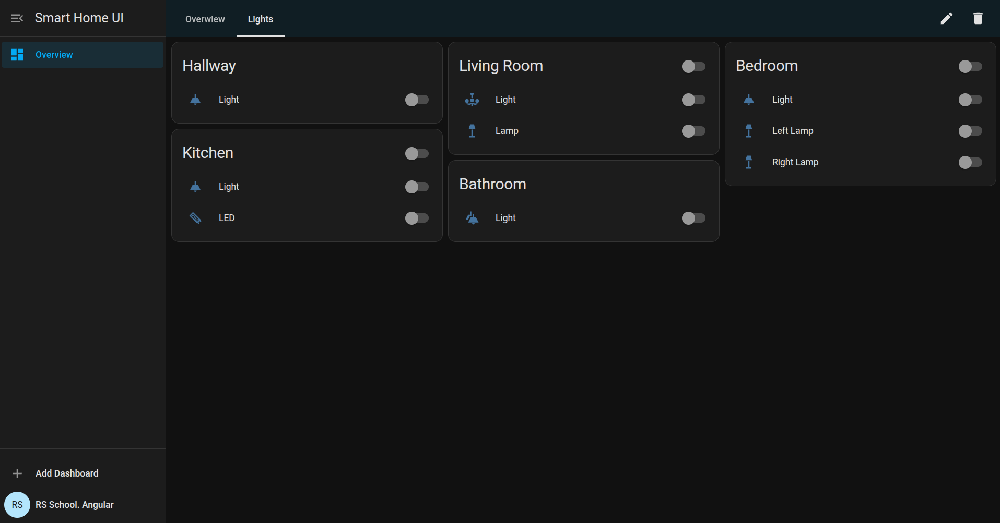
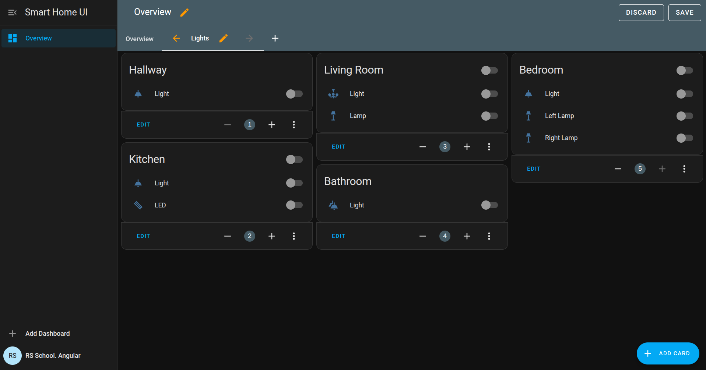
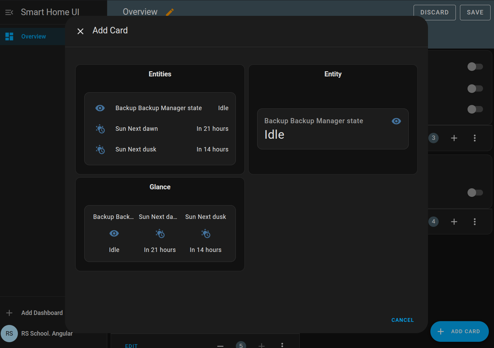
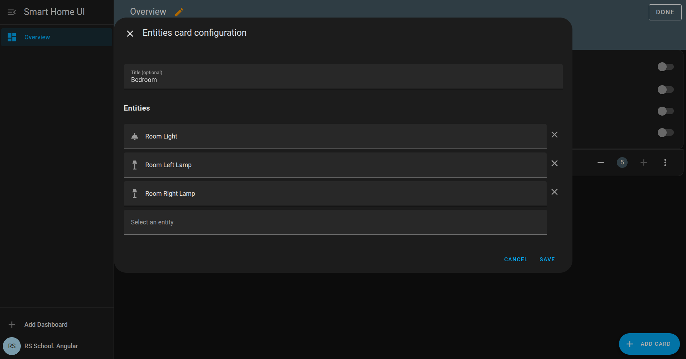

# Smart Home UI. Part 3

## Overview

In this part, you will implement full create/edit/delete support for dashboards, tabs, and cards. Users should be able to build dashboards from scratch or modify existing ones by adding, removing, and reordering tabs and cards. Each card can contain a list of devices and sensors.

All dashboard-related changes should be managed using NgRx Store + Effects and synchronized with the backend via API. Reactive Forms, Signals, and RxJS should be applied where appropriate.

## Backend Updates

The backend has been extended to support full dashboard editing.

### `GET /api/devices`

Returns a list of all available devices and sensors.

Response:

```json
[
  {
    "type": "device",
    "icon": "lightbulb",
    "label": "Living Room Light"
  },
  {
    "type": "sensor",
    "icon": "thermostat",
    "label": "Temperature",
    "value": {
      "amount": 22.5,
      "unit": "°C"
    }
  }
]
```

### `POST /api/dashboards/:dashboardId`

Saves the full structure of a dashboard (tabs + cards + content).

Sample Request Body:

```json
{
  "tabs": [
    {
      "id": "main",
      "title": "Main",
      "cards": [
        {
          "id": "living-room",
          "title": "Living Room",
          "layout": "verticalLayout",
          "items": [
            {
              "type": "device",
              "icon": "lightbulb",
              "label": "Lamp",
              "state": true
            },
            {
              "type": "sensor",
              "icon": "thermostat",
              "label": "Temperature",
              "value": {
                "amount": 23.5,
                "unit": "°C"
              }
            }
          ]
        }
      ]
    }
  ]
}
```

### `DELETE /api/dashboards/:dashboardId`

Deletes the specified dashboard.

### `PATCH /api/devices/:deviceId`

Updates the state of a single device.

Request Body:

```json
{
  "state": true
}
```

## Architecture Requirements

- Use NgRx Store + Effects to manage the **currently selected dashboard**, i.e., the one loaded via `/dashboard/:dashboardId/:tabId`.
- All dashboard modifications should go through actions and update the store.
- You are not required to store the dashboard list in NgRx - focus on managing only the selected dashboard.
- Use Signals for UI state like Edit Mode.
- All API interactions related to the selected dashboard should go through services and effects.
- Device state changes should be handled via separate NgRx actions and effects (not bundled with dashboard updates).
- The screenshots provided in the task are for your reference. You are encouraged to improve the UI or adjust elements as needed to enhance usability or match your design preferences.

## NgRx Actions (Recommended Structure)

- `enterEditMode()` / `exitEditMode()`

- `addTab({ title: string })`
- `removeTab({ tabId: string })`
- `reorderTab({ tabId: string, direction: 'left' | 'right' })`

- `addCard({ tabId: string, layout: string })`
- `removeCard({ tabId: string, cardId: string })`
- `reorderCard({ tabId: string, cardId: string, newIndex: number })` - visually update position in the UI immediately, persist only on Save.

- `addItemToCard({ tabId: string, cardId: string, item: DeviceItem | SensorItem })`
- `removeItemFromCard({ tabId: string, cardId: string, itemId: string })`

- `saveDashboard()` – effect sends `POST /api/dashboards/:dashboardId`, then `exitEditMode()`
- `discardChanges()` – reverts to snapshot made at Edit Mode entry, then `exitEditMode()`

- `toggleDeviceState({ deviceId: string, newState: boolean })` - effect sends `PATCH /api/devices/:deviceId`

## Functional Requirements

### Dashboard Creation



- An “Add Dashboard” button should be shown in the **Sidebar footer**.
- Clicking it opens a modal with a form, containing the following fields:
  - `id`: required, max 30 characters, should be unique (validate locally).
  - `title`: required, max 50 characters.
  - `icon`: required.
- On submit:
  - Send `POST /api/dashboards/:id` with empty structure.
  - Reload the dashboard list.
  - Navigate to the created dashboard.

### Dashboard Deletion

- Deletion is triggered by clicking the Delete button in the toolbar while not in Edit Mode
- Show a confirmation modal before deletion.
- On confirm:
  - Send `DELETE /api/dashboards/:id`.
  - Reload dashboard list.
  - Navigate to the first available dashboard

### Edit Mode



- Edit Mode is activated by clicking the Edit button in the toolbar
- You can rename the current dashboard
- UI State of components is controlled by a Signal.
- Store a deep copy of the current dashboard when entering Edit Mode.
- When exiting:
  - On Save: send full POST and call `exitEditMode()`.
  - On Discard: revert state and call `exitEditMode()`.

#### Tabs

- Add, remove, rename, reorder using left/right buttons.
- Clicking the Edit or Create button shows an editable input field.
- Title: required, max 50 characters, unique within the dashboard.
- The tab ID should duplicate the provided tab name in kebab-case (e.g. energy-usage)

#### Cards



- Clicking the Add Card button at the bottom opens a modal for selecting the card layout.
- Creation starts with selecting layout: `singleDevice`, `horizontalLayout`, or `verticalLayout`.
- After layout is selected, an empty card is added and devices/sensors can be inserted.
- **Layout cannot be changed** after creation.
- Empty cards should display an empty state.

##### Reordering

- Use - / + buttons or numeric input (`index + 1`).
- It updates the UI immediately; persist only on Save.

##### Card Content



- Click the three-dot icon on a card to open a modal window for editing its content.
- You can set a card title (optional, e.g., Bedroom). Leaving it empty is allowed.
- A list of already added entities (devices or sensors) is displayed - each can be individually removed.
- A dropdown labeled "Select an Entity" allows you to add items from the list of available entities retrieved via `GET /api/devices`.
- No validation is required:
  - Duplicate entities are allowed
  - Empty cards (with no devices or sensors) are allowed - make sure to display an appropriate empty state in the UI.

### Device Toggle

In previous parts, toggling a device only updated the UI. Now, device state changes should be synchronized with the backend.

- When a device toggle is clicked:
  - Dispatch `toggleDeviceState({ deviceId, newState })`.
  - Effect sends `PATCH` request to backend.
  - Store is updated accordingly.

## Evaluation Criteria (100 points)

### Forms & Validation - **10 points**

- Dashboard creation form with required, max length, and uniqueness checks - **5**
- Tab form with required, max length, and local uniqueness - **5**

### NgRx State Management - **40 points**

- Selected dashboard is stored and managed via NgRx - **10**
- All tab/card/item updates go through store actions - **10**
- Device toggle handled through separate actions/effects - **10**
- Dashboard state is restored correctly on discard - **10**

### Functionality - **40 points**

- Dashboard creation and navigation works - **5**
- Tab and card creation, and item addition (core add/edit logic) - **10**
- Tab and card reordering works correctly with immediate visual feedback - **5**
- Deletion logic for dashboards/tabs/cards/items - **5**
- Card content can be modified (title, add/remove devices and sensors) - **10**
- Edit Mode behavior (enter, save, discard) - **5**

### Signals - **10 points**

- At least one Signal is used appropriately (e.g. Edit Mode UI state) - **10**

## Penalties

- Store is not used for dashboard - **-25**
- Device toggle handled locally (not via NgRx) - **-10**
- API not used for saving/deleting dashboards - **-10**
- Business logic is implemented in components/templates instead of services or store - **-10**
- ESLint warnings or errors are present - **-10**
- Using the `any` type in TypeScript - **-10**
- Mandatory flag `strict: true` is not set in the TypeScript configuration file - **-10**
- The ESLint configuration file does not include the `no-explicit-any` rule - **-5**
- Failure to meet the [requirements](https://rs.school/docs/en/pull-request-review-process#pull-request-requirements-pr) when creating a `Pull Request` - **-5**
- Non-compliance with commit history and commit message [guidelines](https://rs.school/docs/en/git-convention#commit-requirements) - **-5**
- Failure to submit on time may lead to points loss according to the [Deadlines for Students requirements](https://rs.school/docs/en/pull-request-review-process#deadlines-for-students)
