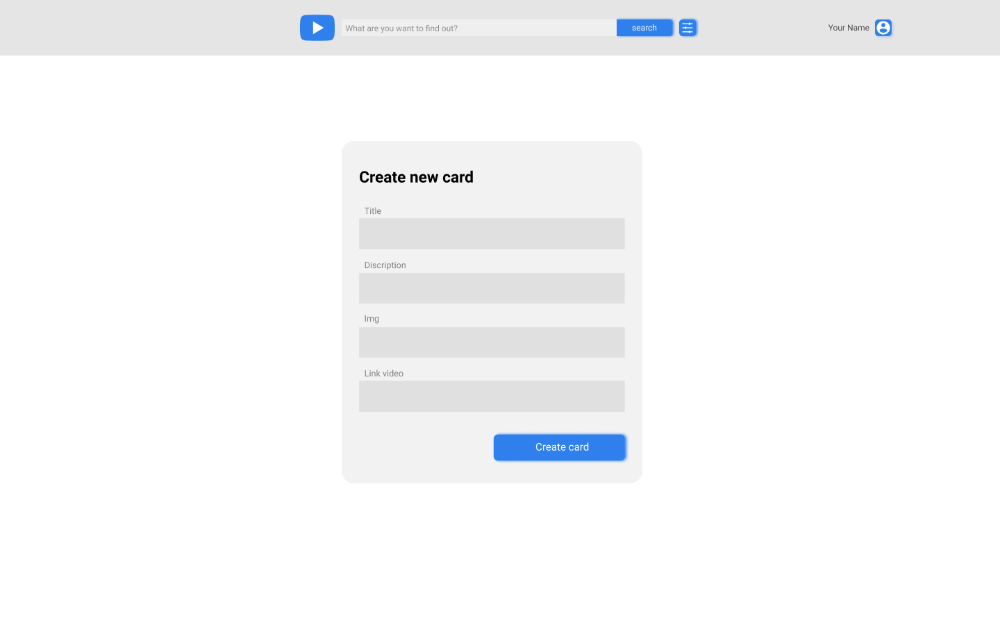

# YouTube Client App

[Figma mockup](https://www.figma.com/file/tS3Zqk138yXUmRxSWKDv4r/YouTube-client?node-id=0%3A1)

## Angular. NgRx

The objective of the task is to implement _Admin Page_ and _Favorite Page_. So, your entire app will contain the
following pages:

- Login page
- 404 page
- Main page
- Detailed information page
- Admin page
- Favorite page

> **Note!**<br>
> Not all requirements are reflected in mockups! If you meet any requirements marked by `*` that are not in mockup
> you can choose the place and appearance you consider is the best and most logical.

## Definitions

_Admin Page_ - the page with dedicated url path where user can create new Custom Card;

_Favorite Page_ - the page with dedicated url path where user can observe list of videos marked with
special button on _List Page_ (Main Page) or _View Page_ (Detailed Information Page);

_List Page_ or _Main Page_ - the page with dedicated url path where user can see list of YouTube videos;

_View Page_ or _Detailed Information Page_ - the page with dedicated url path abort certain video;

_Video List_ - list of the video items combined with _Custom Cards_ on _List Page_;

_Favorite List_ - list of the video items marked as favorite on _Favorite Page_;

_Custom Card_ - entity created on _Admin Page_ that contains information about YouTube video, looks the same
as regular YouTube item in the list but predefined data is displayed.

## Project structure

The project structure could be organized in the following way:

```
    app
    ├── core
    │   ├── components
    │   ├── pages
    │   ├── services
    │   ├── guards
    ├── shared
    │   ├── components
    │   ├── directives
    │   ├── models
    │   ├── pipes
    ├── redux
    │   ├── actions
    │   ├── effects
    │   ├── reducers
    │   ├── selectors
    │   ├── state.models.ts
    ├── youtube
    │   ├── components
    │   ├── directives
    │   ├── models
    │   ├── pages
    │   ├── pipes
    │   ├── services
    ├── auth
    │   ├── components
    │   ├── models
    │   ├── pages
    │   ├── services
    ├── favorite
    │   ├── components
    │   ├── models
    │   ├── services
    ├── app.component.html
    ├── app.component.scss
    ├── app.component.ts
    ├── app.component.spec.ts
    ├── app.module.ts
```

### Task1. Admin page

1. [Install NgRx package](https://ngrx.io/guide/store/install) and create a storage (state);
2. Generate appropriate reducers, selectors, actions to creating, obtaining and deleting custom cards;
3. Make **pagination\*** for video list on _List Page_ of **20 items** per page;
4. Combine common YouTube videos with _Custom Cards_ so that custom cards are first in the list and common videos
   follow them;
5. Add _delete button_\* on _Custom Cards_ in video list and on the _View Page_ for _Custom Card_ to delete item;

Here you can find an example of admin page: [Admin page reference](./admin.jpg):


#### Requirements

1. NgRx storage must contain:
   - list of custom cards;
   - list of videos from API YouTube.
2. NgRx storage must only be changed in the following cases:
   - new response from the YouTube API is received;
   - new card is added using _Admin Page_;
   - card is deleted;
3. _Custom Cards_ must contain the following information:
   - title
   - description
   - link to the image
   - link to video
   - creation date (current date)
4. Information about _Custom Cards_ must be saved until your application is reloaded even if you perform requests to
   YouTube API. In other words, all custom cards are one-off session data and suppose not to be saved in localStorage.

#### Expected behavior

1. User can see only 20 items per page on _List Page_ with the ability to change the current page number for new items;
2. All _Custom Cards_ are prepended (to the beginning) to the video list and form single stream.
   Common YouTube videos follow them;

> **Hint!**<br>
> Current page number is saved in store alongside the page tokens for other pages. The good way
> to update video information via API is NgRx Effects.

### Task2. Favorite Page\*

1. Generate appropriate module and page with respective url;
2. Add icon-link (heart icon, for example) in site header to new page;
3. Create feature slice for the store with reducers, actions and selectors;
4. Display the list of favorite videos from the store using selectors on the new page\*;
5. Add _favorite button_\* (heart sign) into each video item card on _List Page_ and _View Page_ that toggles favorite
   status;

#### Requirements

1. The crucial moment for that task is to use **single store source** of common YouTube videos
   for _List Page_ and _Favorite Page_. NgRx store should be constructed with single video set and different sequence:
   1. Video from YouTube saved as object where key - some unique video identifier, value - video data;
   2. One array of video identifiers for _Video List_ (the result is generated by selector);
   3. Second array of video identifiers for _Favorite List_ (another selector for the result);
2. User can mark **only** ordinary video as favorite on _List Page_ but not _Custom Card_; _Custom Card_ should not
   contain corresponding button;
3. _Favorite Page_ is the same as _List Page_ in appearance (because it's the same content);

#### Expected behavior

1. Heart button (_favorite button_)\* clicking alternately changes the state of video. Favorite video should have filled
   favorite icon, default state is represented by outline favorite button (or any other visually different versions);
2. If user click favorite button on _Favorite Page_ then video is no longer favorite and removes from list immediately;

### Evaluation criteria

Maximum score - **100**

- [ ] _Admin Page_ is generated (**+5**)
- [ ] _Favorite Page_ is generated (**+5**)
- [ ] NgRx package is used and storage is created (**+5**)
- [ ] _Custom Cards_ are saved in the store (**+10**)
- [ ] Videos (with _favorite button_) from the YouTube API received via Effects are saved in store (**+20**)
- [ ] _Custom Cards_ (without _favorite button_) are displayed on _List Page_ combined with YouTube videos (**+20**)
- [ ] _Favorite Page_ displays all marked videos from _List Page_ or _View Page_ (**+10**)
- [ ] Clicking the _favorite button_ on the card on _Favorite Page_ removes item from the store and from the page
      immediately (**+15**)
- [ ] _List Page_ displays 20 items with pagination and _Custom Cards_ are added to the beginning of the list on 1
      page (**+10**)

Fines

- [ ] Failure to submit on time may lead to points lose according to
      the [Deadlines for Students requirements](https://docs.app.rs.school/#/platform/pull-request-review-process?id=deadlines-for-students)
- [ ] Store is not separated into video data and sequences for _List Page_ and _Favorite Page_ (**-30**)
- [ ] _Custom Card_ on _List Page_ or _View Page_ contains _favorite button_ (**-15**)
- [ ] _favorite button_ on _List Page_ or _View Page_ for common YouTube video element doesn't change its appearance
      after clicking (**-15**)
- [ ] The app doesn't work or has console errors (**-20**)
- [ ] ESLint warnings or errors are present (**-15**)
- [ ] Using the `Any` type. (**-20**)
- [ ] Mandatory flags `noImplicitAny: true` and `strict: true` are not set in the TypeScript configuration file. (**-10**)
- [ ] The ESLint configuration file does not include the `no-explicit-any` rule. (**-10**)
- [ ] Failure to meet the [requirements](https://docs.rs.school/#/en/pull-request-review-process?id=pull-request-requirements-pr) when creating a `Pull Request`. (**-10**)
- [ ] Non-compliance with commit history and commit message [guidelines](https://docs.rs.school/#/en/git-convention?id=commit-requirements). (**-10**)

### Useful links

https://ngrx.io
