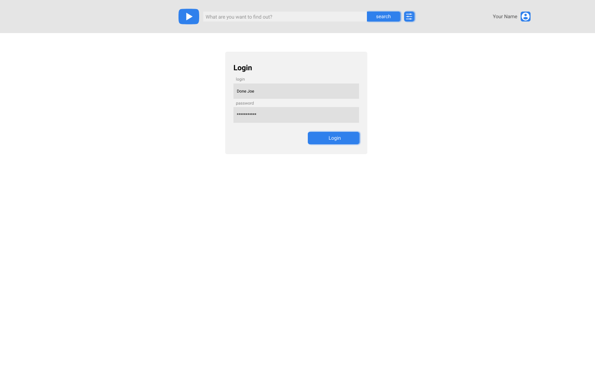

# YouTube client app

[Figma mockup](https://www.figma.com/file/tS3Zqk138yXUmRxSWKDv4r/YouTube-client?node-id=0%3A1)

## Angular. Forms

### Task requirements

The main goal of this task is to implement forms handling and validation using Reactive Forms functionality.

#### Functional requirements

- **Login block**

  

  - implement login form
  - add validation rules for input fields:
    - login
      - required (message: "Please enter a login email")
      - valid email (message: "The login email is invalid")
    - password
      - required (message: "Please enter a password")
      - add a custom validator that will check how strong a password is. the following checks should be applied (message: "Your password isn't strong enough" + recommendations below):
        - at least 8 characters
        - a mixture of both uppercase and lowercase letters
        - a mixture of letters and numbers
        - inclusion of at least one special character, e.g., ! @ # ? ]

- **Admin page**

  

  - implement card creation form
  - add validation rules for input fields:
    - title
      - required (message: "Please enter a title")
      - min length: 3 (message: "The title is too short")
      - max length: 20 (message: "The title is too long")
    - description
      - optional
      - max length: 255 (message: "The description is too long")
    - link to the image cover
      - required (message: "Please enter a link to the image")
    - link to the video
      - required (message: "Please enter a link to the video")
    - creation date
      - required (message: "Please enter a creation date")
      - an entered date should not be in the future (message: "The date is invalid")
  - implement "Tags" sub-form:
    - initially a single "Tag" input is present
    - click "Add tag" button to add an extra input
    - each tag input should be required
    - form can have up to five "Tag" inputs
    - each tag starts with # sign
  - implement "Reset" button
    - when clicked all inputs should be reset to their initial values and the "Tags" sub-form should return to having only a single (empty) input

- The application should prevent user from submitting the form if at least one of the described validation rules didn't pass
- If the user has entered invalid data into an input, its border should be colored in red
- To indicate which rule fails, an appropriate message under an invalid input field should be displayed.

#### Evaluation criteria

Maximum score - **100**

- [ ] **Login block** is implemented as reactive form (**+10**)
- [ ] Validation rules are applied to the **Login block**. Form submission is possible only if all inputs are valid (**+15**)
- [ ] The application indicates which inputs are invalid on the **Login block** with appropriate styles and messages (**+15**)
- [ ] **Admin page** is implemented as reactive form (**+10**)
- [ ] Validation rules are applied to the **Admin page**. Form submission is possible only if all inputs are valid (**+15**)
- [ ] The application indicates which inputs are invalid on the **Admin page** with appropriate styles and messages (**+15**)
- [ ] "Tags" sub-form is implemented using `FormArray`. "Add tag" button works correctly (**+15**)
- [ ] "Reset" button functionality is fully implemented (**+5**)

Fines

- [ ] Failure to submit on time may lead to points lose according to the [Deadlines for Students requirements](https://docs.app.rs.school/#/platform/pull-request-review-process?id=deadlines-for-students)
- [ ] The app doesn't work or has console errors (**-20**)
- [ ] ESLint warnings or errors are present (**-15**)
- [ ] Using the `Any` type. (**-20**)
- [ ] Mandatory flags `noImplicitAny: true` and `strict: true` are not set in the TypeScript configuration file. (**-10**)
- [ ] The ESLint configuration file does not include the `no-explicit-any` rule. (**-10**)
- [ ] `UntypedFormGroup` or other `Untyped` form controls are used at any point of the task. Usage of `any` type is considered equivalent to using `Untyped` forms. (**-15**)
- [ ] Failure to meet the [requirements](https://docs.rs.school/#/en/pull-request-review-process?id=pull-request-requirements-pr) when creating a `Pull Request`. (**-10**)
- [ ] Non-compliance with commit history and commit message [guidelines](https://docs.rs.school/#/en/git-convention?id=commit-requirements). (**-10**)

### Useful links

[Forms Overview](https://angular.dev/tutorials/learn-angular/15-forms)
[Reactive forms](https://angular.dev/guide/forms/reactive-forms)
[Typed Forms](https://angular.dev/guide/forms/typed-forms)
[Template-driven forms](https://angular.dev/guide/forms/template-driven-forms)
[api FormGroup](https://angular.dev/api/forms/FormGroup)

https://blog.angular-university.io/introduction-to-angular-2-forms-template-driven-vs-model-driven/
