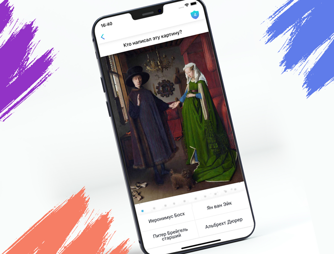
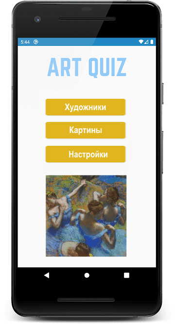
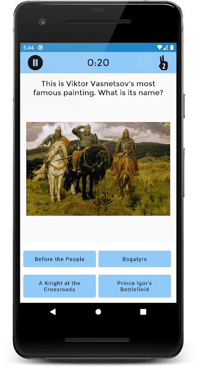
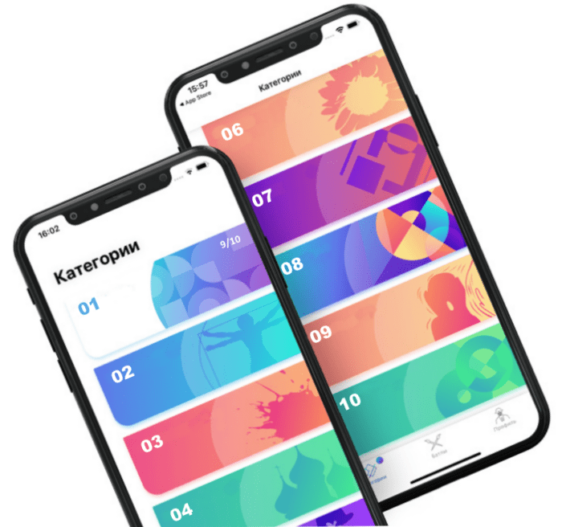
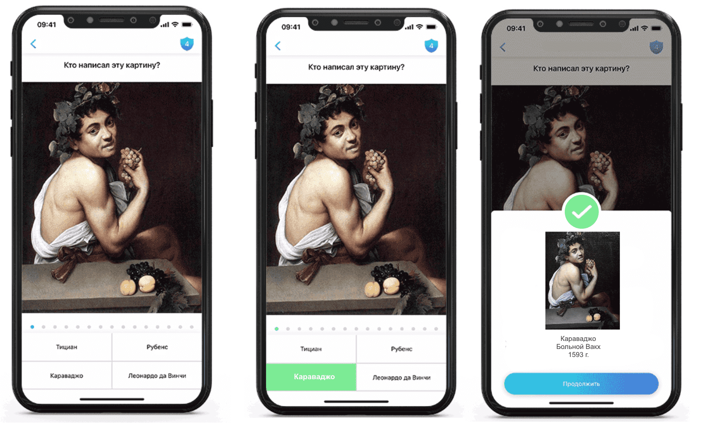
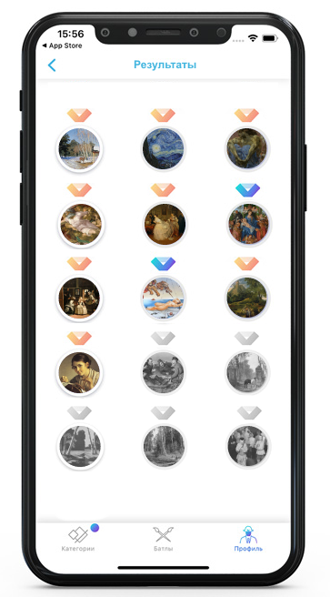

# art-quiz

**ArtQuiz** - приложение-викторина на знание шедевров живописи и их авторов.

## Ключевые навыки:

- OOP
- JavaScript Classes
- Modules in JavaScript
- Webpack
- CSS3 Animations
- Local Storage
- генерирование html через js
- самостоятельное создание js-приложений

<kbd></kbd>

- [Demo](https://art-quiz.netlify.app/)
- [Исходные данные](https://github.com/irinainina/image-data)  
  Репозиторий с исходными данными необходимо форкнуть или клонировать себе на компьютер.  
  Вы можете редактировать исходные данные для улучшения качества созданного приложения.

## Приложения-прототипы:

- [Art Quiz - Викторина по искусству](https://play.google.com/store/apps/details?id=com.ironwaterstudio.artquiz)
- [Art Quiz](https://play.google.com/store/apps/details?id=in.imaginacion.artquiz)

## Описание викторины

- на основании предложенных исходных данных средствами JavaScript генерируются вопросы двух типов про художников и про картины и варианты ответов к ним
- при этом вопросы идут последовательно, как они записаны в коллекции исходных данных, а варианты ответов создаются рандомно
- всего на основании предложенных исходных данных необходимо сгенерировать 240 вопросов: 120 про художников, 120 про картины
- вопросы викторины разбиты на группы (категории). В каждой категории десять вопросов.
- у вопросов одной категорий нет единой тематики или другого объединяющего их признака. Вопросы делятся на категории по порядку размещения данных о картинах в файле с исходными данными. Названия категорий произвольные
- при желании вы можете создать тематические категории. Такая доработка не является требованием задания
- прохождение всех вопросов одной категории составляет один раунд игры. Данные про сыгранные раунды и их результаты, а также про настройки приложения хранятся в local storage.
- для каждого вопроса генерируется четыре варианта ответов. Пользователь выбирает ответ кликая по карточке с ним
- для вопросов про художников на карточках с вариантами ответами указываются имена художников, для вопросов про картины на карточках с вариантами ответами отображаются картины
- после выбора пользователем ответа, появляется индикатор, разный для правильных и неправильных ответов, выводится правильный ответ, появляется возможность перейти к следующему вопросу
- после окончания раунда выводится его результат - количество вопросов, на которые был дан правильный ответ
- результаты всех пройденных раундов отображаются на карточках категорий.
- для каждой сыгранной категории можно открыть страницу с результатами, на которой отображаются все картины категории - цветные или черно-белые в зависимости от того, были ли они угаданы правильно. При клике по картине выводится информация о ней
- сыгранный раунд можно пройти повторно, при этом вопросы будут повторяться, а варианты ответов будут другими
- в дизайн, оформление и функционал викторины можно вносить изменения, если они направлены на улучшение внешнего вида, функционала, удобства использования приложения, и не приводят к упрощению описанного в задании функционала и/или ухудшению внешнего вида приложения

## Требования к самостоятельно составленной викторине

- вы можете изменить тематику викторины по своему усмотрению
- для викторины с картинами уже есть исходные данные, если решите составить викторину на другую тему, исходные данные для неё нужно будет подготовить самостоятельно
- язык викторины русский, английский или белорусский
- викторина должна быть иллюстрированной: вопросы и/или ответы должны содержать изображения соответствующей им тематики
- всего в самостоятельно составленной викторине должно быть не меньше ста вопросов не меньше чем двух разных типов.

## Структура и функционал приложения

1. Стартовая страница и навигация +20

   - вёрстка, дизайн, UI стартовой страницы приложения. Выполняются [требования к вёрстке и оформлению приложения](https://github.com/rolling-scopes-school/tasks/blob/master/tasks/art-quiz/art-quiz.md#требования-к-вёрстке-и-оформлению-приложения) +10  
     На стартовой странице есть кнопка, при клике по которой открываются настройки викторины, и две кнопки, при кликах по которым можно выбрать тип вопроса: - угадать художника по картине - угадать картину по имени её автора
   - реализована навигация по страницам приложения +10
     - со стартовой страницы при клике по кнопке с типом вопроса пользователь попадает на страницу категорий выбранного типа вопросов. Со страницы категорий пользователь может вернуться на стартовую страницу приложения
     - со страницы категорий при клике по карточке категории пользователь попадает на страницу с вопросами категории. На карточке сыгранной категории есть кнопка, при клике по которой пользователь попадает на страницу с результатами прохождения раунда. Со страницы с вопросами и со страницы с результатами пользователь может вернуться на страницу категорий или на стартовую страницу приложения

   <kbd></kbd>

2. Настройки +40

   - в настройках есть возможность включать/выключать звук, есть регулятор громкости звука. Если звук включён, есть звуковая индикация разная для правильных и неправильных ответов, звуковое сопровождение окончания раунда +10
   - в настройках есть возможность включать/выключать игру на время. Если выбрана игра на время, на странице с вопросами викторины отображается таймер, отсчитывающий время, которое отведено для ответа на вопрос +10
   - в настройках можно указать время для ответа на вопрос в интервале от 5 до 30 секунд с шагом в 5 секунд. Если время истекает, а ответа нет, это засчитывается как неправильный ответ на вопрос +10
   - при перезагрузке страницы приложения выбранные настройки сохраняются +10

   <kbd></kbd>

3. Страница категорий +30

   - вёрстка, дизайн, UI страницы категории. Выполняются [требования к вёрстке и оформлению приложения](https://github.com/rolling-scopes-school/tasks/blob/master/tasks/art-quiz/art-quiz.md#требования-к-вёрстке-и-оформлению-приложения) +10
     - на странице категорий размещаются карточки категорий.
     - карточки категорий могут иметь названия, или их можно просто пронумеровать.
     - карточки категорий вопросов про художников и про картины внешне отличаются между собой, например, в их оформлении использутся разные изображения.
   - карточка сыгранной категории внешне отличается от карточки категории, которая ещё не игралась +10
   - на карточке сыгранной категории отображается результат прохождения раунда - количество вопросов, на которые был дан правильный ответ +10  
     Например, на скрине ниже первая категория вопросов уже сыграна (белый фон, синий шрифт, в правом верхнем углу отображается результат прохождения раунда), остальные ещё нет (цветной фон, белый шрифт, нет результатов прохождения раунда)

   <kbd></kbd>

4. Страница с вопросами +50

   - вёрстка, дизайн, UI страницы с вопросами. Выполняются [требования к вёрстке и оформлению приложения](https://github.com/rolling-scopes-school/tasks/blob/master/tasks/art-quiz/art-quiz.md#требования-к-вёрстке-и-оформлению-приложения) +10
     - ни в коем случае не ожидается, что вы вручную напишете все вопросы викторины и варианты ответов к ним - вопросы должны генерироваться средствами JavaScript на основе исходных данных.
     - вопросы в викторине идут в том порядке, в каком информация про картины и их авторов размещается в коллекции исходных данных.

   Примеры вопросов про художников и про картины, которые можно сгенерировать на основании предложенных в задании исходных данных:

   <kbd></kbd>

   - варианты ответов на вопросы генерируются случайным образом +10
     - в вариантах ответов на вопросы викторины должен быть правильный ответ и только один.
     - правильный ответ в разных вопросах должен находиться на разных местах, а не, например, всегда быть только первым.
     - варианты ответов должны быть разными.
     - в вариантах ответов не должны повторяться картины одного и того же художника.
   - правильным и неправильным ответам пользователя соответствуют индикаторы разного цвета +10
   - после того, как ответ выбран, появляется модальное окно с правильным ответом на вопрос и кнопкой "Продолжить". При клике по кнопке "Продолжить" пользователь переходит к следующему вопросу категории +10

   <kbd></kbd>

   - после окончания раунда выводится уведомление об окончании раунда и его результат - количество вопросов, на которые был дан правильный ответ. Есть кнопка "Продолжить" при клике по которой пользователь перенаправляется на страницу категорий данного типа вопросов +10

5. Страница с результатами +50

   - вёрстка, дизайн, UI страницы с результатами. Выполняются требования к вёрстке и оформлению приложения +10
   - страница с результатами содержит превью всех картин категории +10
   - картины, на вопросы про которые или про их авторов был дан правильный ответ, цветные; картины, на вопросы про которые или про их авторов был дан неправильный ответ, черно-белые +10
   - при клике по картине выводится информация о ней - название, автор, год создания +10
   - если раунд переигрывался, и результаты изменились, эти изменения отображаются на странице с результатами +10

   <kbd></kbd>

6. Плавная смена изображений; картинки сначала загружаются, потом отображаются; нет ситуации, когда пользователь видит частично загрузившиеся изображения. Плавную смену изображений не проверяем: 1) при загрузке и перезагрузке приложения 2) при открытой консоли браузера +10
7. Реализована анимация отдельных деталей интерфейса, также анимированы переходы и взаимодействия, чтобы работа с приложением шла плавным и непрерывным потоком +20  
   Примеры анимаций можно увидеть в [видео](https://youtu.be/0C9CjjuCOvM) и [gif](assets/art-quiz.gif)
   - 5 баллов за каждую уникальную сложную анимацию, улучшающую интерфейс и удобство использования приложения, но не больше 20 баллов.
     - для удобства проверки перечень и описание реализованных анимаций включите в самооценку, которую выведите в консоль браузера
8. Дополнительный функционал на выбор +20
   - дополнительными баллами оцениваются очень высокое качество оформления приложения, продуманность отдельных деталей интерфейса, улучшающие внешний вид приложения и удобство пользования им, а также выполненный на высоком уровне и сложный в реализации свой собственный дополнительный функционал, существенно улучшающий качество или возможности приложения +20
     - для удобства проверки перечень и описание реализованного дополнительного функционала включите в самооценку, которую выведите в консоль браузера

## Примеры дополнительного функционала

- возможность открыть приложение во весь экран +2
- фоновая музыка и отдельный пункт в настройках (вкл/выкл и громкость) для неё +2
- разные уведомления по окончанию раунда в зависимости от результата +2
- перевод приложения на два языка +5
- управление игрой с клавиатуры +5
- возможность скачать картину на компьютер +5
- ещё одна мини-игра, например, блиц: показываем пользователю картину и имя художника, нужно выбрать ответ "да" или "нет" в зависимости от того, является ли этот художник автором картины. Вопросы идут один за другим без необходимости кликать next. На мини-игру отводится 1 минута, за каждый правильный ответ добавляем к этому времени несколько секунд. Храним и отображаем статистику мини-игр +10
- возможность авторизации в приложении, например, через гугл или через гитхаб +10
- создание небольшого бэкенда для хранения результатов викторины (можно посмотреть и сравнить свои результаты и результаты других пользователей) +10
- многопользовательская игра (как в [видео](https://youtu.be/0C9CjjuCOvM?t=20)) +20

## Критерии оценки

**Максимальный балл за задание +220**

Для удобства проверки выведите в консоль браузера самооценку своего проекта по пунктам с указанием баллов за каждый выполненный вами пункт.

Баллы за отдельные пункты требований указаны в разделе ["Структура и функционал приложения"](#структура-и-функционал-приложения)

Разница между максимальной оценкой за приложение (220 баллов) и максимально возможным количеством баллов за выполнение всех пунктов требований (240 баллов) позволит сгладить возможные ошибки проверяющих в ходе кросс-чека, неточности в описании задания, разное понимание требований задания проверяющим и проверяемым.

## Проверка задания ментором

**Максимальный балл за задание +220**

1. Репозиторий +20
   - pull request выполнен в соответствии с [требованиями](https://docs.rs.school/#/pull-request-review-process?id=Требования-к-pull-request-pr) +10
   - ведётся история коммитов, названия коммитов даются согласно [гайдлайну](https://docs.rs.school/#/git-convention) +10
2. Качество кода +150
   - правильное именование переменных и функций +10
   - используется prettier, код отформатирован, хорошо читается +10
   - нет дублирования кода, повторяющиеся фрагменты кода вынесены в функции, оптимальный размер функций, выполняется рекомендация: одна функция – одна задача +10
   - нет глубокой вложенности циклов, нет магических чисел +10
   - используется делегирование +10
   - используются фичи ES6 и выше: let, const для объявления переменных, стрелочные функции, Spread/Rest операторы, деструктуризация, async/await и т.д +10
   - код разбит на модули +10
   - для сборки кода используется webpack. Студенты могут использовать как свою собственную, так и готовую сборку webpack +10
   - используется eslint с конфигурацией eslint-config-airbnb-base, ошибки линтера исправлены, в eslint не добавляются собственные правила без согласования с ментором +10
   - в качестве источника данных используется JSON-файл, данные из которого получаются асинхронно +10
   - для написания компонентов приложения используются классы +10
   - создано одностраничное (SPA) приложение +10
   - html-код генерируется при помощи JavaScript. При этом нет требования чтобы весь код приложения генерировался динамически, достаточно динамически добавлять вопросы и ответы +10
   - у ментора нет замечаний к качеству кода, либо все замечания ментора исправлены +20
3. Оформление и функционал приложения +50
   - у ментора нет замечаний к оформлению и функционалу приложения, либо все замечания ментора исправлены +50

## Требования к репозиторию

- задание выполняется в **приватном репозитории школы** [Как работать с приватным репозиторием](https://docs.rs.school/#/private-repository?id=Как-работать-с-приватным-репозиторием)
- в приватном репозитории школы от ветки `main` создайте ветку с названием задания, в ней создайте папку с названием задания, в папке разместите файлы проекта
- для деплоя используйте gh-pages [Как сделать деплой задания из приватного репозитория школы](https://docs.rs.school/#/private-repository?id=Как-сделать-деплой-задания-из-приватного-репозитория-школы)
- при невозможности использовать gh-pages, используйте для деплоя https://app.netlify.com/drop. Название страницы дайте по схеме: имя гитхаб аккаунта - название таска
- история коммитов должна отображать процесс разработки приложения. [Требования к коммитам](https://docs.rs.school/#/git-convention?id=Требования-к-именам-коммитов)
- после окончания разработки необходимо сделать Pull Request из ветки приложения в ветку `main` [Требования к Pull Request](https://docs.rs.school/#/pull-request-review-process?id=Требования-к-pull-request-pr). **Мержить Pull Request из ветки разработки в ветку `main` не нужно**

## Технические требования

- работа приложения проверяется в браузере Google Chrome последней версии
- можно использовать [bootstrap](https://getbootstrap.com/), [material design](https://material.io/), css-фреймворки, html и css препроцессоры
- не разрешается использовать jQuery, другие js-библиотеки и фреймворки

## Рекомендации по написанию кода

- если это ваше первое самостоятельно созданное приложение, основное и самое важное требование к коду - его работоспособность: работающий код лучше идеального, но не работающего
- тем не менее, есть те рекомендации, которым нужно стараться следовать даже начинающему разработчику:
  - правильное именование переменных и функций
  - используйте prettier для форматирования кода, отформатированный код проще читается
  - избегайте дублирования кода, повторяющиеся фрагменты кода вынесите в функции
  - стремитесь к оптимальному размеру функций, следуйте правилу: одна функция – одна задача
  - избегайте глубокой вложенности циклов, магических чисел
  - используйте делегирование
  - используйте фичи ES6 и выше, например, let, const для объявления переменных, стрелочные функции и т.д
- разбейте js-код на модули
- для совершенствования навыков работы с асинхронным кодом, файл `images.js` рекомендуется преобразовать в JSON-файл и работать с ним асинхронно
- для сборки приложения используйте Webpack. Это может быть как ваша собственная, так и готовая сборка, например, https://www.npmjs.com/package/create-rss-app
- используйте eslint с конфигурацией eslint-config-airbnb-base
- для написания компонентов приложения рекомендуется использовать классы
- в ходе работы над данным проектом целесообразно разрабатывать одностраничное (SPA) приложение, html-код которого частично генерируется при помощи JavaScript.

## Требования к вёрстке и оформлению приложения

- при вёрстке и оформлении приложения ориентируйтесь на [демо](https://art-quiz.netlify.app/), а также на созданные профессиональными разработчиками [приложения-прототипы](https://github.com/rolling-scopes-school/tasks/blob/master/tasks/art-quiz/art-quiz.md#приложения-прототипы)
- при этом вам необходимо создать веб-приложение, которое будет одинаково хорошо отображаться и выглядеть на экранах с разными разрешениями
- вёрстка адаптивная. Минимальная ширина страницы, при которой проверяется корректность отображения приложения - 360рх, максимальная ширина страницы, при которой проверяется корректность отображения приложения - 1920рх
- при вёрстке данного приложения целесообразно применить подход `mobile first` - сначала сверстать мобильную версию приложения, а потом адаптировать её к экранам с большим разрешением
- интерактивность элементов, с которыми пользователи могут взаимодействовать, изменение внешнего вида самого элемента и состояния курсора при наведении, использование разных стилей для активного и неактивного состояния элемента
- обязательное требование к интерактивности: плавное изменение внешнего вида элемента при наведении и клике не влияющее на соседние элементы
- читабельность текста: минимальный размер шрифта на любом разрешении экрана не меньше 14рх, достаточная контрастность цвета фона и цвета шрифта в активном и неактивном состоянии. Проверить контрастность на соответствие стандартам можно [здесь](https://webaim.org/resources/contrastchecker/).
- в футере приложения есть ссылка на гитхаб автора, год создания приложения, [логотип курса](https://rs.school/images/rs_school_js.svg) со [ссылкой на курс](https://rs.school/js/)

## Как сабмитить задание

Засабмитить задание необходимо как можно раньше, как только в rs app появится такая возможность. Для этого зайдите в rs app https://app.rs.school/, выберите пункт Cross-Check: Submit, в выпадающем списке выберите название таска, в поле Solution URL добавьте ссылку на задеплоенную версию вашего приложения, нажмите кнопку Submit.  
После сабмита задания его можно продолжать выполнять до самого дедлайна.

## Материалы

- [Объектно-ориентированный JavaScript для начинающих](https://developer.mozilla.org/ru/docs/Learn/JavaScript/Objects/Object-oriented_JS)
- [Вебинар "Основы ООП"](https://youtu.be/3SaedVlvo5E)
- [Создание приложения-викторины на JavaScript](https://ichi.pro/ru/sozdanie-prilozenia-viktoriny-na-javascript-197877021705563)

## Макеты в figma

Макеты предложены для ознакомления и дают примерное представление о структуре проекта. В части пунктов макеты не соответствуют требованиям задания и не являются руководством для его выполнения или проверки.

- [Макет1](https://www.figma.com/file/vQ5Wm4ZSRcIYt1MQq8g8qD/ArtQuiz)
- [Макет2](https://www.figma.com/file/UmT7sS6ztbMTQzFrcjPQRn/ArtQuiz)
- [Варианты дизайна](https://raw.githubusercontent.com/rolling-scopes-school/tasks/master/tasks/art-quiz/assets/project-design.png)

## Cross-check

- инструкция по проведению cross-check: https://docs.rs.school/#/cross-check-flow
- форма для проверки задания https://art-quiz-cross-check.netlify.app/
- ссылки на лучшие работы добавьте, пожалуйста, в эту форму https://forms.gle/C1gXgJv4kGCPiMz9A
- документ для вопросов: https://docs.google.com/spreadsheets/d/1kfp680-tHPCd8gW2I4M1LAwlsFgHM87z9iLiRcu1KHE/
