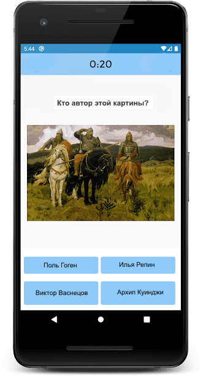

# art-quiz

**ArtQuiz** - иллюстрированное и анимированное приложение-викторина на знание шедевров живописи и их авторов.  
Викторина состоит из нескольких раундов. Количество раундов не меньше 10. В каждом раунде викторины 10 вопросов с вариантами ответов. Пользователь выбирает ответ кликая по карточке с ним. После выбора пользователем ответа появляется индикатор, разный для правильных и неправильных ответов, выводится правильный ответ. После окончания раунда выводятся его результаты - отношение вопросов, на которые был дан правильный ответ, к общему количеству вопросов. Результаты всех пройденных раундов отображаются на странице категорий. Также можно посмотреть результаты по каждому сыгранному вопросу викторины, правильный ответ на него.

Тематика викторины может быть любой. Для викторины с картинами уже есть исходные данные, если решите составить викторину на другую тему, данные для неё нужно будет подготовить самостоятельно. Если выполняете викторину на другую тематику, слова про картины и их авторов из описания таска заменяете на слова, соответствующие тематике вашей викторины. 

Также могут вноситься изменения в дизайн, оформление и даже функционал викторины при условии, что изменения позволяют улучшить внешний вид, функционал, удобство использования приложения, и не приводят к упрощению описанного в задании функционала и/или ухудшению внешнего вида приложения.

## Ключевые навыки:
- OOP
- JavaScript Classes
- Modules in JavaScript
- Webpack
- CSS3 Animations
- Local Storage
- генерирование html через js
- самостоятельное создание js-приложений 

- [Demo работы прототипа приложения](https://youtu.be/0C9CjjuCOvM)
- [Исходные данные](https://github.com/irinainina/image-data)

## Структура и функционал приложения
1. Стартовый экран +10
  - на стартовом экране можно выбрать тип вопроса:
     - угадать художника по картине
     - угадать картину по имени её автора
  - на стартовом экране есть кнопка перенаправляющая на страницу с настройками викторины

Со стартового экрана пользователь может попасть на страницу категорий выбранного типа вопросов либо на страницу настроек.

2. Страница настроек +30
  - в настройках включаются/выключаются звуковые эффекты и музыкальное сопровождение викторины, настраивается их громкость +10
  - также в настройках можно выбрать игру на время или игру без учёта времени +5
  - если выбрана игра на время, на странице с вопросами викторины отображается таймер, для ответа на вопрос отводится определённое время, например, 20 секунд +10
  - если выбрана игра на время, после ответа на вопрос, но перед кликом на кнопку "Продолжить" можно поставить таймер на паузу +5

3. Страница категорий +30
  - всего в викторине 200 вопросов - 100 про художников, 100 про картины +10
  - вопросы разбиты на группы (категории) по 10 вопросов в каждой +5
  - категории могут иметь названия, или можно их просто пронумеровать +5
  - карточка категории, на вопросы которой уже давались ответы, внешне отличается от карточки категории, которая ещё не игралась +10
  Например, на скрине ниже первая категория вопросов уже пройдена (белый фон, синий шрифт, в правом верхнем углу отображаются результаты прохождения категории), остальные ещё нет (цветной фон, белый шрифт)

Со страницы категорий пользователь попадает на страницу с вопросами.

4. Страница с вопросами +50
  - ни в коем случае не ожидается, что вы вручную напишете все 200 вопросов и варианты ответов к ним - вопросы и ответы должны генерироваться автоматически +10
  - на основании предложенных в задании исходных данных можно сгенерировать вопросы как про художников, так и про картины: 

  - вопросы в викторине идут в том порядке, в каком объекты с информацией про картины и их авторов размещаются в файле `images.js` коллекции исходных данных. Например, первые 100 вопросов про художников, следующие 100 вопросов про картины. Варианты ответов к вопросам генерируются случайным образом +10
  - правильным и неправильным ответам соответствуют разные звуковые сигналы и индикаторы разного цвета +10
  - после того как ответ выбран, появляется модальное окно с правильным ответом на вопрос и кнокой "Продолжить" +10

  - после окончания раунда выводится модальное окно с поздравлением и результатами раунда +10
 
5. Страница с результатами викторины +50
  - страница с результатами содержит превью всех картин викторины. +10
  - чтобы не заставлять пользователя загружать все 200 картин, для страницы с результатми  необходимо добавить пагинацию, чтобы результаты можно было пролистывать постранично +10
  - картины, вопросы с которыми уже проигрывались, цветные, картины, которые ещё не участвовали в вопросах, черно-белые. Данные про проигранные раунды и результаты угадывания каждой картины (или её автора) хранятся в local storage +10
  - при клике на картины, которые уже проигрывались, всплывает подсказка с данными по этой картине - название, автор, год создания +10
  - возле картин, которые уже проигрывались, есть цветные индикаторы, которые показывают была эта картина или её автор угаданы, или нет +5
  - если раунд с картиной проигрывался повторно и результаты изменились, меняются и индикаторы возле картин +5

6. Реализована анимация отдельных деталей интерфейса, также анимированы переходы и взаимодействия, чтобы работа с приложением шла плавным и непрерывным потоком +30
Примеры анимаций можно увидеть в [видео](https://youtu.be/0C9CjjuCOvM) и [gif](assets/art-quiz.gif)
  - 5 баллов за каждую уникальную сложную анимацию, улучшающую интерфейс и удобство использования приложения, но не больше 30 баллов.
  - Для удобства проверки список реализованных анимаций выведите в консоль браузера

7. В качестве дополнительной функциональности можно придумать и реализовать ещё один дополнительный механизм прохождения викторины, например, блиц: появляются вопросы с ответами, нужно указать правильный это ответ или нет. За ответы начисляются баллы. За каждые пять правильных ответов количество баллов за ответ удваивается, при ошибке возвращается к исходному значению. Или за правильный ответ добавляется секунда времени, за неправильный снимаются две секунды. Или экспресс - появляется картина, падают карточки с именами художников, пока карточка не долетела до средины экрана нужно выбрать правильный ответ. Баллы за анимации, реализованные в дополнительном механизме прохождения викторины, не учитываются в баллах за основную часть викторины +20

## Критерии оценки
**Максимальный балл за задание +200**

Баллы за отдельные пункты требований указаны в разделе "Структура и функционал приложения"

Разница между максимальной оценкой за приложение (200 баллов) и максимально возможным количеством баллов за выполнение всех пунктов требований (220 баллов) позволит сгладить возможные ошибки проверяющих в ходе кросс-чека, неточности в описании задания, разное понимание требований задания проверяющим и проверяемым.

## Требования к репозиторию
- задание выполняется в **приватном репозитории школы** [Как работать с приватным репозиторием](https://docs.rs.school/#/private-repository?id=Как-работать-с-приватным-репозиторием)
- в приватном репозитории школы от ветки `main` создайте ветку с названием задания, в ней создайте папку с названием задания, в папке разместите файлы проекта
- для деплоя используйте gh-pages [Как сделать деплой задания из приватного репозитория школы](https://docs.rs.school/#/private-repository?id=Как-сделать-деплой-задания-из-приватного-репозитория-школы)
- при невозможности использовать gh-pages, используйте для деплоя https://app.netlify.com/drop. Название страницы дайте по схеме: имя гитхаб аккаунта - название таска
- история коммитов должна отображать процесс разработки приложения. [Требования к коммитам](https://docs.rs.school/#/git-convention?id=Требования-к-именам-коммитов)
- после окончания разработки необходимо сделать Pull Request из ветки приложения в ветку `main` [Требования к Pull Request](https://docs.rs.school/#/pull-request-review-process?id=Требования-к-pull-request-pr). **Мержить Pull Request из ветки разработки в ветку `main` не нужно**

## Технические требования
- работа приложения проверяется в браузере Google Chrome последней версии
- можно использовать [bootstrap](https://getbootstrap.com/), [material design](https://material.io/), css-фреймворки, html и css препроцессоры
- не разрешается использовать jQuery, другие js-библиотеки и фреймворки
- подход к реализации многостраничности приложения, будь то разработка одностраничного (SPA) или многостраничного (MPA) приложения, а также реализация навигации между страницами остаётся на усмотрение разработчика
- в случае имплементации одностраничного приложения (SPA) не обязательно реализовывать все особенности данного подхода (например, routing), если в этом нет необходимости

## Требования к оформлению приложения
- внешний вид приложения соответствует предложенному образцу или является его улучшенной версией
- вёрстка адаптивная. Минимальная ширина страницы, при которой проверяется корректность отображения приложения, 320рх
- интерактивность элементов, с которыми пользователи могут взаимодействовать, изменение внешнего вида самого элемента и состояния курсора при наведении, использование разных стилей для активного и неактивного состояния элемента, плавные анимации
- в футере приложения есть ссылка на гитхаб автора, год создания приложения, [логотип курса](https://rs.school/images/rs_school_js.svg) со [ссылкой на курс](https://rs.school/js/)

## Как сабмитить задание
Засабмитить задание необходимо как можно раньше, как только в rs app появится такая возможность. Для этого зайдите в rs app https://app.rs.school/, выберите пункт Cross-Check: Submit, в выпадающем списке выберите название таска, в поле Solution URL добавьте ссылку на задеплоенную версию вашего приложения, нажмите кнопку Submit.   
После сабмита задания его можно продолжать выполнять до самого дедлайна.

## Материалы
- [Объектно-ориентированный JavaScript для начинающих](https://developer.mozilla.org/ru/docs/Learn/JavaScript/Objects/Object-oriented_JS)
- [Вебинар "Основы ООП"](https://youtu.be/3SaedVlvo5E)
- [Создание приложения-викторины на JavaScript](https://ichi.pro/ru/sozdanie-prilozenia-viktoriny-na-javascript-197877021705563)

## Cross-check
- инструкция по проведению cross-check: https://docs.rs.school/#/cross-check-flow
<!-- - ссылки на лучшие работы добавьте, пожалуйста, в эту форму 
- документ для вопросов:  -->
