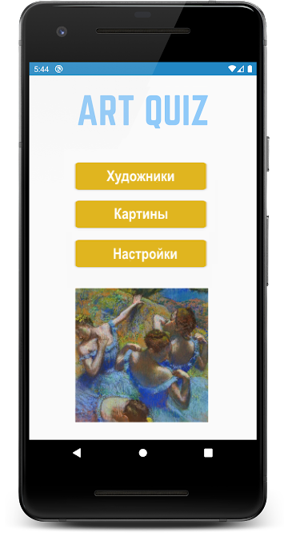
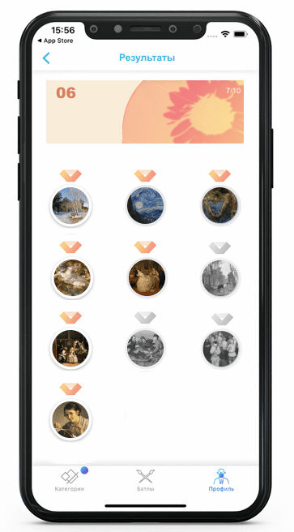

# art-quiz

**ArtQuiz** - приложение-викторина на знание шедевров живописи и их авторов.

## Ключевые навыки:
- OOP
- JavaScript Classes
- Modules in JavaScript
- Webpack
- CSS3 Animations
- Local Storage
- генерирование html через js
- самостоятельное создание js-приложений 

<kbd></kbd>

- [Demo работы прототипа приложения](https://youtu.be/0C9CjjuCOvM)
- [Исходные данные](https://github.com/irinainina/image-data)
- [Макет в figma](https://www.figma.com/file/vQ5Wm4ZSRcIYt1MQq8g8qD/ArtQuiz)  
  *Макет даёт общее представление как может выглядеть приложение, вёрстка по макету не требуется.*  
  *Если описание требований на макете и в задании разное, ориентируйтесь на требования задания*

## Требования к викторине
- тематика викторины может быть любой. Для викторины с картинами уже есть исходные данные, если решите составить викторину на другую тему, данные для неё нужно будет подготовить самостоятельно
- исходные данные викторины с картинами можно менять и улучшать по своему усмотрению
- язык викторины русский, английский или белорусский на ваше усмотрение
- викторина должна быть иллюстрированной: вопросы и/или ответы должны содержать изображения соответствующей им тематики
- вы можете вносить изменения в дизайн, оформление и функционал викторины, при условии, что эти изменения позволяют улучшить внешний вид, возможности, удобство использования приложения, и не приводят к упрощению описанного в задании функционала и/или ухудшению внешнего вида приложения
- всего в самостоятельно составленной викторине не меньше ста вопросов. Если используете предложенные исходные данные, на их основе необходимо сгенерировать двести вопросов: сто про художников, сто про картины.  
- вопросы викторины разбиты на группы (категории). В каждой категории десять вопросов.
- прохождение всех вопросов одной категории составляет один раунд игры. Данные про проигранные раунды и их результаты хранятся в local storage.  
- для каждого вопроса есть несколько вариантов ответов. Пользователь выбирает ответ кликая по карточке с ним
- после выбора пользователем ответа, появляется индикатор, разный для правильных и неправильных ответов, выводится правильный ответ, появляется возможность перейти к следующему вопросу
- после окончания раунда выводится его результат - отношение количества вопросов, на которые был дан правильный ответ, к общему количеству вопросов. 
- результаты всех пройденных раундов отображаются на карточках категорий. 
- есть страница с результатами, на которой можно посмотреть результат по каждому сыгранному раунду: был ли вопрос угадан в ходе викторины, правильный ответ на него.
- вопросы викторины генерируются на основе исходных данных. При этом вопросы идут последовательно, а варианты ответов создаются рандомно. Если пройти раунд повторно, вопросы будут повторяться, а варианты ответов будут другими. 

## Структура и функционал приложения
1. Стартовая страница и навигация +20
   - вёрстка, дизайн, UI стартовой страницы приложения. Выполняются требования к вёрстке и оформлению приложения +10   
   На стартовой странице есть кнопка, при клике по которой открываются настройки викторины, и две кнопки, при кликам по которым можно выбрать тип вопроса:
       - угадать художника по картине
       - угадать картину по имени её автора
   - реализована навигация по страницам приложения +10
      - со стартовой страницы при клике по кнопке с типом вопроса пользователь попадает на страницу категорий выбранного типа вопросов. Со страницы категорий пользователь может вернуться на стартовую страницу приложения
      - со страницы категорий при клике по карточке категории пользователь попадает на страницу с вопросами категории. На карточке уже проигранной категории есть кнопка или ссылка, при клике по которой пользователь попадает  на страницу с результатами прохождения категории. Со страницы с вопросами и со страницы с результатами пользователь может вернуться на страницу категорий  

   <kbd></kbd>

2. Настройки +30  
   В настройках есть возможность включать/выключать звук, включать/выключать игру на время  
   - звуковая индикация правильных и неправильных ответов, звуковое сопровождение окончания раунда +10
   - если выбрана игра на время, на странице с вопросами викторины отображается таймер, отсчитывающий время, которое отведено для ответа на вопрос +10
   - время для ответа на вопрос можно указать в настройках в интервале от 5 до 30 секунд с шагом в 5 секунд. Если время истекает, а ответа нет, это засчитывается как неправильный ответ на вопрос +10

   <kbd></kbd>
   
3. Страница категорий +30  
   - вёрстка, дизайн, UI страницы категории. Выполняются требования к вёрстке и оформлению приложения +10   
   На странице категорий размещаются карточки категорий.       
   Карточки категорий могут иметь названия, или их можно просто пронумеровать.  
   - карточка категории, на вопросы которой уже давались ответы, внешне отличается от карточки категории, которая ещё не игралась +10
   - на карточке категории, на вопросы которой уже давались ответы, отображаются результаты прохождения раунда: отношение количества вопросов, на которые был дан правильный ответ, к общему количеству вопросов. На карточке есть кнопка или ссылка при клике по которой можно перейти на страницу с результатами +10  
   Например, на скрине ниже первая категория вопросов уже пройдена (белый фон, синий шрифт, в правом верхнем углу отображаются результаты прохождения раунда), остальные ещё нет (цветной фон, белый шрифт, нет результатов прохождения раунда)  

   <kbd></kbd>

4. Страница с вопросами +50
   - вёрстка, дизайн, UI страницы с вопросами. Выполняются требования к вёрстке и оформлению приложения +10  
   Ни в коем случае не ожидается, что вы вручную напишете все вопросы викторины и варианты ответов к ним - вопросы должны генерироваться средствами JavaScript на основе исходных данных.  
   Вопросы в викторине идут в том порядке, в каком информация про картины и их авторов размещается в файле `images.js` коллекции исходных данных.  
   Примеры вопросов про художников и про картины, которые можно сгенерировать на основании предложенных в задании исходных данных:  

   <kbd></kbd>

   - варианты ответов на вопросы генерируются случайным образом +10   
   В вариантах ответов на вопросы викторины должен быть правильный ответ и только один.  
   Правильный ответ в разных вопросах должен находиться на разных местах, а не, например, всегда быть только первым.  
   Варианты ответов должны быть разными.  
   В вариантах ответов не должны повторяться картины одного и того же художника.  
   - правильным и неправильным ответам пользователя соответствуют индикаторы разного цвета +10
   - после того, как ответ выбран, появляется модальное окно с правильным ответом на вопрос и кнопкой "Продолжить" +10
   - при клике по кнопке "Продолжить" пользователь переходит к следующему вопросу категории +10
   
   <kbd></kbd>
   
   - после окончания раунда выводится модальное окно с уведомлением об окончании раунда и его результатами - отношением количества вопросов, на которые был дан правильный ответ, к общему количеству вопросов +10
  
5. Страница с результатами +50
   - вёрстка, дизайн, UI страницы с результатами. Выполняются требования к вёрстке и оформлению приложения +10
   - страница с результатами содержит превью всех картин категории +10
   - картины, на вопросы про которые или про их авторов был дан правильный ответ, цветные; картины, на вопросы про которые был дан неправильный ответ, черно-белые +10
   - при клике по картине появляется модальное окно с информацией по этой картине - название, автор, год создания +10
   - если раунд проигрывался повторно и результаты изменились, эти изменения отображаются на странице с результатами +10
   
   <kbd></kbd>

6. Реализована анимация отдельных деталей интерфейса, также анимированы переходы и взаимодействия, чтобы работа с приложением шла плавным и непрерывным потоком +20  
Примеры анимаций можно увидеть в [видео](https://youtu.be/0C9CjjuCOvM) и [gif](assets/art-quiz.gif)
   - 5 баллов за каждую уникальную сложную анимацию, улучшающую интерфейс и удобство использования приложения, но не больше 20 баллов.
   - Для удобства проверки перечень и описание реализованных анимаций включите в самооценку, которую выведите в консоль браузера 

## Критерии оценки
**Максимальный балл за задание +200**

Для удобства проверки выведите в консоль браузера самооценку своего проекта по пунктам с указанием баллов за каждый выполненный вами пункт.

Баллы за отдельные пункты требований указаны в разделе ["Структура и функционал приложения"](#структура-и-функционал-приложения)

Разница между максимальной оценкой за приложение (200 баллов) и максимально возможным количеством баллов за выполнение всех пунктов требований (220 баллов) позволит сгладить возможные ошибки проверяющих в ходе кросс-чека, неточности в описании задания, разное понимание требований задания проверяющим и проверяемым.

## Проверка задания ментором
**Максимальный балл за задание +200**

1. Репозиторий +20
   - pull request выполнен в соответствии с [требованиями](https://docs.rs.school/#/pull-request-review-process?id=Требования-к-pull-request-pr) +10
   - ведётся история коммитов, названия коммитов даются согласно [гайдлайну](https://docs.rs.school/#/git-convention) +10
2. Качество кода +130
   - правильное наименование переменных и функций +10
   - используется prettier, код отформатирован, хорошо читается +10
   - нет дублирования кода, повторяющиеся фрагменты кода вынесены в функции, оптимальный размер функций, выполняется рекомендация: одна функция – одна задача +10
   - нет глубокой вложенности циклов, нет магических чисел, используется делегирование +10
   - используются фичи ES6 и выше: let, const для объявления переменных, стрелочные функции, Spread/Rest операторы, деструктуризация, async/await и т.д +10
   - код разбит на модули +10
   - для сборки кода используется webpack +10
   - используется eslint с конфигурацией eslint-config-airbnb-base, ошибки линтера исправлены, в eslint не добавляются собственные правила без согласования с ментором +10
   - в качестве источника данных используется JSON-файл, данные от которого получаются асинхронно +10
   - для написания компонентов приложения используются классы +10
   - создано одностраничное (SPA) приложение  +10
   - html-код генерируется при помощи JavaScript. При этом нет требования чтобы весь код приложения генерировался динамически, достаточно, если динамически генерируется хотя бы часть кода +10
   - у ментора нет замечаний к качеству кода, либо все замечания ментора исправлены +10
4. Оформление и функционал приложения +50
   - у ментора нет замечаний к оформлению и функционалу приложения, либо все замечания ментора исправлены +50

## Требования к репозиторию
- задание выполняется в **приватном репозитории школы** [Как работать с приватным репозиторием](https://docs.rs.school/#/private-repository?id=Как-работать-с-приватным-репозиторием)
- в приватном репозитории школы от ветки `main` создайте ветку с названием задания, в ней создайте папку с названием задания, в папке разместите файлы проекта
- для деплоя используйте gh-pages [Как сделать деплой задания из приватного репозитория школы](https://docs.rs.school/#/private-repository?id=Как-сделать-деплой-задания-из-приватного-репозитория-школы)
- при невозможности использовать gh-pages, используйте для деплоя https://app.netlify.com/drop. Название страницы дайте по схеме: имя гитхаб аккаунта - название таска
- история коммитов должна отображать процесс разработки приложения. [Требования к коммитам](https://docs.rs.school/#/git-convention?id=Требования-к-именам-коммитов)
- после окончания разработки необходимо сделать Pull Request из ветки приложения в ветку `main` [Требования к Pull Request](https://docs.rs.school/#/pull-request-review-process?id=Требования-к-pull-request-pr). **Мержить Pull Request из ветки разработки в ветку `main` не нужно**

## Технические требования
- работа приложения проверяется в браузере Google Chrome последней версии
- можно использовать [bootstrap](https://getbootstrap.com/), [material design](https://material.io/), css-фреймворки, html и css препроцессоры
- не разрешается использовать jQuery, другие js-библиотеки и фреймворки

## Рекомендации по написанию кода
- если это ваше первое самостоятельно созданное приложение, основное и самое важное требование к коду - его работоспособность: работающий код лучше идеального, но не работающего
- тем не менее, есть те рекомендации, которым нужно стараться следовать даже начинающему разработчику:
  - правильное наименование переменных и функций
  - используйте prettier для форматирования кода, отформатированный код проще читается
  - избегайте дублирования кода, повторяющиеся фрагменты кода вынесите в функции
  - стремитесь к оптимальному размеру функций, следуйте правилу: одна функция – одна задача
  - избегайте глубокой вложенности циклов, магических чисел
  - используйте делегирование
  - используйте фичи ES6 и выше, например, let, const для объявления переменных, стрелочные функции и т.д
- разбейте js-код на модули
- для совершенствования навыков работы с асинхронным кодом, файл `images.js` рекомендуется преобразовать в JSON-файл и работать с ним асинхронно
- для сборки приложения используйте Webpack
- используйте eslint с eslint-config-airbnb-base
- для написания компонентов приложения рекомендуется использовать классы
- в ходе работы над данным проектом целесообразно разрабатывать одностраничное (SPA) приложение, html-код которого генерируется при помощи JavaScript.

## Требования к вёрстке и оформлению приложения
- внешний вид приложения соответствует предложенному образцу или является его улучшенной версией
- вёрстка адаптивная. Минимальная ширина страницы, при которой проверяется корректность отображения приложения - 320рх, максимальная ширина страницы, при которой проверяется корректность отображения приложения - 1920рх
- при вёрстке этого приложения целесообразно применить подход `mobile first` - сначала сверстать мобильную версию приложения, а потом адаптировать её к экранам с большим разрешением
- интерактивность элементов, с которыми пользователи могут взаимодействовать, изменение внешнего вида самого элемента и состояния курсора при наведении, использование разных стилей для активного и неактивного состояния элемента, плавные анимации
- в футере приложения есть ссылка на гитхаб автора, год создания приложения, [логотип курса](https://rs.school/images/rs_school_js.svg) со [ссылкой на курс](https://rs.school/js/)

## Как сабмитить задание
Засабмитить задание необходимо как можно раньше, как только в rs app появится такая возможность. Для этого зайдите в rs app https://app.rs.school/, выберите пункт Cross-Check: Submit, в выпадающем списке выберите название таска, в поле Solution URL добавьте ссылку на задеплоенную версию вашего приложения, нажмите кнопку Submit.   
После сабмита задания его можно продолжать выполнять до самого дедлайна.

## Материалы
- [Объектно-ориентированный JavaScript для начинающих](https://developer.mozilla.org/ru/docs/Learn/JavaScript/Objects/Object-oriented_JS)
- [Вебинар "Основы ООП"](https://youtu.be/3SaedVlvo5E)
- [Создание приложения-викторины на JavaScript](https://ichi.pro/ru/sozdanie-prilozenia-viktoriny-na-javascript-197877021705563)

## Cross-check
- инструкция по проведению cross-check: https://docs.rs.school/#/cross-check-flow
<!-- - ссылки на лучшие работы добавьте, пожалуйста, в эту форму 
- документ для вопросов:  -->
