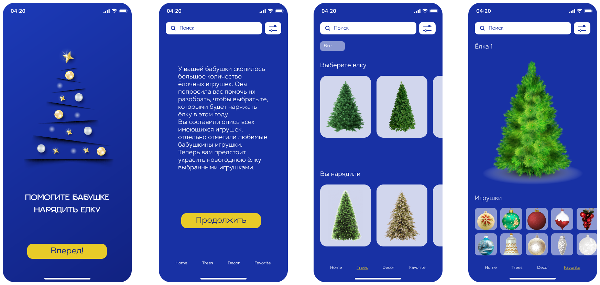

# christmas-task

## Предыстория
У вашей бабушки скопилось большое количество ёлочных игрушек. Она попросила вас помочь их разобрать, чтобы выбрать те, которыми будет наряжать ёлку в этом году.  
Зная, как бережно бабушка относится к этим игрушкам, вы отнеслись к её просьбе очень внимательно.  
Вы составили опись всех имеющихся игрушек, указав для каждой её название, количество экземпляров, год покупки, форму (шар, фигурка, снежинка и т.д.), цвет, размер, отдельно отметили любимые бабушкины игрушки.  
Теперь вам предстоит создать приложение, которое позволит отсортировать игрушки по названию и количеству экземпляров, найти игрушку по названию, сгруппировать игрушки по видам, добавлять игрушки в избранное и удалять из него, а также с интерактивной страницей избранного, на которой выбранными игрушками можно украсить новогоднюю ёлку.

## Ключевые навыки:
- TypeScript
- OOP
- создание SPA
- сортировка данных
- фильтрация данных
- реализация поиска
- работа с асинхронными запросами
- генерирование html при помощи TypeScript
- самостоятельное создание TypeScript приложения

<kbd></kbd>

- [Демо работы прототипа приложения](https://react-course-comfy-sloth-store.netlify.app/products)  

## Структура приложения
Приложение состоит из трёх страниц
- стартовая страница
- главная страница приложения
- интерактивная страница избранного

## Функционал приложения
1. Стартовая страница это обложка приложения, содержит его краткое описание и кнопку "Начать игру" или аналогичную. Со стартовой страницы приложения пользователь переходит на главную страницу приложения. Выполняются требования к вёрстке +10
2. Главная страница приложения содержит карточки всех игрушек. Также на главной странице приложения размещаются фильтры, строка поиска, поле для сортировки. С главной страницы приложения можно перейти на страницу избранного. Выполняются требования к вёрстке +10
3. На карточке игрушки есть её изображение, название, текстом или условным значком обозначено количество экземпляров, год покупки, форма, цвет, размер, является ли игрушка любимой +10
4. Игрушку можно добавить в избранное или удалить из избранного +10
5. На главной странице приложения отображается количество добавленных в избранное игрушек. Общее количество игрушек, которые можно добавить в избранное, не превышает количество отведённых для них слотов на странице избранного. При попытке добавить в избранное количество игрушек большее, чем отведённое для них количество слотов, выводится предупреждение в человекочитаемом формате +10
6. Сортировка +25
   - сортировка игрушек по названию в возрастающем и спадающем порядке +10
   - сортировка игрушек по году их приобретения в возрастающем и спадающем порядке +10
   - в процессе сортировки карточки с изображениями игрушек плавно меняют своё положение с эффектами анимации [Демо](https://codepen.io/Vestride/pen/ZVWmMX). С этой целью может использоваться js-библиотека +5
7. Фильтры +45
   - карточки с игрушками можно фильтровать по количеству экземпляров, году покупки, форме, цвету, размеру, есть возможность отобразить только любимые игрушки. Фильтры отличаются по внешнему виду и оформлению. 5 баллов за каждый уникальный фильтр, но не больше 30 баллов +30
   - можно отсортировать игрушки по нескольким фильтрам и/или по нескольким значениям одного фильтра. Есть кнопка для сброса фильтров +10
   - в процессе фильтрации карточки с игрушками плавно меняют своё положение с эффектами анимации [Демо1](https://codepen.io/Vestride/pen/ZVWmMX), [Демо2](https://codepen.io/ComeonCreative/pen/WxwPaW). С этой целью может использоваться js-библиотека +5
8. Поиск +25
   - при открытии приложения курсор находится в поле поиска +2
   - автозаполнение поля ввода поискового запроса отключено (нет выпадающего списка с предыдущими запросами) +2
   - есть placeholder +2
   - в поле поиска есть крестик, позволяющий очистить поле поиска +2
   - если нет совпадения последовательности букв в поисковом запросе с названием игрушки, выводится уведомление о том, что совпадение не обнаружено, например "Sorry, no products matched your search" +2 
   - при вводе поискового запроса под строкой поиска появляется выпадающее окно, в котором по мере ввода отображаются названия тех игрушек, в которых есть указанные в поиске буквы в указанном порядке. При этом не обязательно, чтобы буквы были в начале слова +5
   - при вводе поискового запроса можно выбрать игрушку кликом по её названию в выпадающем окне под строкой поиска. При этом выпадающее окно исчезает, на странице остаётся только карточка с выбранной игрушкой +5
   - после ввода поискового запроса при нажатии клавиши `Enter` выпадающее окно под строкой поиска исчезает, на странице остаются только те игрушки, в которых есть указанные в поиске буквы в указанном порядке. При этом не обязательно, чтобы буквы были в начале слова +5
9. Внешний вид и функционал интерактивной страницы избранного создаётся на основе игры [Наряди Ёлку](https://www.karusel-tv.ru/games/tree). На странице избранного есть меню с настройками, слоты для добавленных в избранное игрушек, ёлка. Со страницы избранного можно перейти на главную страницу приложения. Выполняются требования к вёрстке +10
9. Меню с настройками +50  
   У пользователя есть возможность:
   - выбрать один из нескольких (минимум 4) фонов +5
   - выбрать одну из нескольких (минимум 4) ёлок +5
   - плавная смена фонового изображения и ёлки. Нет ситуации когда пользователь видит частично прогрузившийся фон. Небольшая анимация при смене фона и ёлки. Например, уменьшение при скрытии, увеличение при появлении, или другая по вашему усмотрению +5
   - добавить на ёлку мерцающую гирлянду. Мерцание реализуется через html/css/js, а не добавлением gif-изображения с эффектом мерцания +5
   - выбрать тип свечения гирлянды - лампочки горят постоянно или по очереди включаются/выключаются +5
   - выбрать один из нескольких (минимум 4) цветов лампочек гирлянды или оставить её разноцветной +5
   - включить/отключить падающий снег +5
   - включить/отключить новогоднюю музыку +5
   - все выбранные настройки сохраняются в local storage и отображаются при перезагрузке страницы. Есть кнопка сброса к настройкам по умолчанию +10
9. Игрушки добавленные в избранное +25
   - пользователь может развесить на ёлку добавленные в избранное игрушки, снять игрушки с ёлки, перемещать игрушки в пределах ёлки +10
   - когда игрушку "вешают на ёлку", размер попавшей на ёлку игрушки уменьшается, масштабируясь под размер ёлки +5
   - возле слота с каждой игрушкой отображается количество имеющихся в наличии экземпляров, когда игрушку "вешают на ёлку", количество доступных игрушек в слоте уменьшается на единицу, когда все экземпляры игрушки помещаются на ёлку, отображается пустой слот +5
   - можно удалить игрушку из избранного +5
9. Есть кнопка "Ёлочка гори" или аналогичная, при клике по которой игра "Наряди ёлочку" заканчивается +20
   - слоты с игрушками и меню скрываются +5
   - выводится уведомление "До Нового года осталось" с таймером, отсчитывающим время до Нового года в днях, часах, минутах, секундах +10
   - воспроизводятся дополнительные эффекты анимации, появляется поздравление с наступающим Новым годом +5
12. Высокое качество оформления приложения, дополнительные, не указанные в задании, сложные, интересные, уместные анимации +10
13. Дополнительный, не указанный в задании, сложный в реализации функционал, улучшающий качество приложения и/или удобство пользования им +10

При желании вы можете использовать свой собственный набор данных.  
Также в рамках предложенного таска вы можете создать приложение на другую тематику.  
В таком случае вам понадобится самостоятельно придумать функционал интерактивной страницы избранного.  
Это могут быть книги, которые можно ставить на полку, снимать с неё, перелистывать, видеть название и автора.  
Мебель, которой можно обставить виртуальную комнату.  
Аквариумные рыбки, которые будут плавать в виртуальном аквариуме.  
Астрономические объекты, из которых можно создать Солнечную систему или целую Вселенную.  
Или любая другая тематика на ваш выбор.

## Критерии оценки cross-check
**Максимальный балл за задание +250**

Для удобства проверки выведите в консоль браузера самооценку своего проекта по пунктам с указанием баллов за каждый выполненный вами пункт.

Баллы за отдельные пункты требований указаны в разделе ["Функционал приложения"](#функционал-приложения)

Разница между максимальной оценкой за приложение (250 баллов) и максимально возможным количеством баллов за выполнение всех пунктов требований (270 баллов) позволит сгладить возможные ошибки проверяющих в ходе кросс-чека, неточности в описании задания, разное понимание требований задания проверяющим и проверяемым.

## Проверка задания ментором
**Максимальный балл за задание +250**

1. Репозиторий +20
   - pull request выполнен в соответствии с [требованиями](https://docs.rs.school/#/pull-request-review-process?id=Требования-к-pull-request-pr) +10
   - ведётся история коммитов, названия коммитов даются согласно [гайдлайну](https://docs.rs.school/#/git-convention) +10
2. Технические требования +110
   - используется TypeScript и его возможности +50
   - используется ООП +20
   - код разбит на модули +10
   - для сборки кода используется webpack +10
   - используется eslint с конфигурацией eslint-config-airbnb-base, ошибки линтера исправлены, в eslint не добавляются собственные правила без согласования с ментором +10
   - в качестве источника данных используется JSON-файл +10  
3. Качество кода +70
   - правильное наименование переменных и функций +10
   - используется prettier, код отформатирован, хорошо читается +10
   - нет дублирования кода, повторяющиеся фрагменты кода вынесены в функции, оптимальный размер функций, выполняется рекомендация: одна функция – одна задача +10
   - нет глубокой вложенности циклов, нет магических чисел +10
   - используются фичи ES6 и выше: let, const для объявления переменных, стрелочные функции, Spread/Rest операторы, деструктуризация, классы, async/await и т.д +10
   - у ментора нет замечаний к качеству кода, либо все замечания ментора исправлены +20
4. Оформление и функционал приложения +50
   - у ментора нет замечаний к внешнему виду и функционалу приложения, либо все замечания ментора исправлены +50

## Требования к репозиторию
- задание выполняется в **приватном репозитории школы** [Как работать с приватным репозиторием](https://docs.rs.school/#/private-repository?id=Как-работать-с-приватным-репозиторием)
- в приватном репозитории школы от ветки `main` создайте ветку с названием задания, в ней создайте папку с названием задания, в папке разместите файлы проекта
- для деплоя используйте gh-pages [Как сделать деплой задания из приватного репозитория школы](https://docs.rs.school/#/private-repository?id=Как-сделать-деплой-задания-из-приватного-репозитория-школы)
- при невозможности использовать gh-pages, используйте для деплоя https://app.netlify.com/drop. Название страницы дайте по схеме: имя гитхаб аккаунта - название таска
- история коммитов должна отображать процесс разработки приложения. [Требования к коммитам](https://docs.rs.school/#/git-convention?id=Требования-к-именам-коммитов)
- после окончания разработки необходимо сделать Pull Request из ветки приложения в ветку `main` [Требования к Pull Request](https://docs.rs.school/#/pull-request-review-process?id=Требования-к-pull-request-pr). **Мержить Pull Request из ветки разработки в ветку `main` не нужно**

## Технические требования
- для написания кода приложения используйте TypeScript
- разбейте код на модули
- для сборки кода используйте webpack
- в качестве источника данных создайте и используйте JSON-файл
- используйте eslint с конфигурацией eslint-config-airbnb-base
- работа приложения проверяется в браузере Google Chrome последней версии
- можно использовать [bootstrap](https://getbootstrap.com/), [material design](https://material.io/), css-фреймворки, html и css препроцессоры
- не разрешается использовать jQuery, другие js-библиотеки и фреймворки, за исключением библиотек, обеспечивающих анимацию перемещения элементов на странице
- использование Angular/React/Vue допускается только по согласованию с ментором

## Рекомендации по написанию кода
- основное и самое важное требование к коду - его работоспособность: работающий код лучше идеального, но не работающего
- тем не менее, есть те рекомендации, которым необходимо следовать даже начинающему разработчику:
  - правильное наименование переменных и функций
  - используйте prettier для форматирования кода, отформатированный код проще читается
  - избегайте дублирования кода, повторяющиеся фрагменты кода вынесите в функции
  - стремитесь к оптимальному размеру функций, следуйте правилу: одна функция – одна задача
  - избегайте глубокой вложенности циклов, магических чисел
  - используйте фичи ES6 и выше, например, let, const для объявления переменных, стрелочные функции, классы и т.д

## Требования к вёрстке
- внешний вид приложения соответствует предложенному образцу или является его улучшенной версией
- вёрстка адаптивная. Минимальная ширина страницы, при которой проверяется корректность отображения приложения - 500рх, максимальная ширина страницы, при которой проверяется корректность отображения приложения - 1920рх
- интерактивность элементов, с которыми пользователи могут взаимодействовать, изменение внешнего вида самого элемента и состояния курсора при наведении, использование разных стилей для активного и неактивного состояния элемента, плавные анимации
- в футере приложения есть ссылка на гитхаб автора, год создания приложения, [логотип курса](https://rs.school/images/rs_school_js.svg) со [ссылкой на курс](https://rs.school/js/)

## Как сабмитить задание
Засабмитить задание необходимо как можно раньше, как только в rs app появится такая возможность. Для этого зайдите в rs app https://app.rs.school/, выберите пункт Cross-Check: Submit, в выпадающем списке выберите название таска, в поле Solution URL добавьте ссылку на задеплоенную версию вашего приложения, нажмите кнопку Submit.   
После сабмита задания его можно продолжать выполнять до самого дедлайна.

## Материалы
- [Официальная документация TypeScript](https://www.typescriptlang.org/)
- [Руководство по TypeScript](https://metanit.com/web/typescript/)
- [Практическое руководство по TypeScript для разработчиков](https://habr.com/ru/company/macloud/blog/557996/)
- [TypeScript - Быстрый Курс за 70 минут](https://youtu.be/nyIpDs2DJ_c)
- [Новогодние открытки с codepen.io](https://html-plus.in.ua/new-year-cards-from-codepen-io/)
- [Игра «Наряди Ёлку!»](https://www.karusel-tv.ru/games/tree)

## Cross-check
- инструкция по проведению cross-check: https://docs.rs.school/#/cross-check-flow
<!-- - ссылки на лучшие работы добавьте, пожалуйста, в эту форму 
- документ для вопросов:  -->
