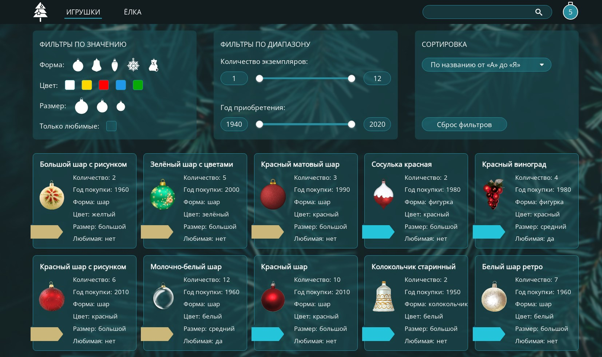

# christmas-task#1 - Игрушки

В первой части задания вам необходимо создать страницу с игрушками с возможностью их фильтрации, сортировки, поиска, добавления в избранное. Подобную функциональность имеют каталоги интернет-магазинов - [Пример](https://react-course-comfy-sloth-store.netlify.app/products)

В первую очередь ознакомьтесь с [требованиями задания](christmas-task.md)

<kbd></kbd>

[Демо](https://christmas-tasks.netlify.app/)  
Функционал реализован не полностью. Присутствуют ошибки и неточности.  
[Макет в Figma](https://www.figma.com/file/809uUaBRpWrbIkzLOZIhFY/Christmas_task_2021Q3)  
[Исходные данные](https://github.com/rolling-scopes-school/stage1-tasks/tree/christmas-task)  
Вы можете редактировать исходные данные или полностью изменить их с целью улучшения качества созданного приложения

## Функционал приложения

1. Страница с игрушками содержит карточки всех игрушек а также фильтры, строку поиска, поле для сортировки. Выполняются [требования к вёрстке](christmas-task.md#требования-к-вёрстке) +10
2. Карточка игрушки содержит её изображение, название, текстом или условным значком обозначено количество экземпляров, год покупки, форма, цвет, размер, является ли игрушка любимой +10  
   Карточки игрушек добавляются динамически средствами JavaScript (на кросс-чеке этот пункт не проверяется)
3. Добавление игрушек в избранное +20
   - кликая по карточке с игрушкой или по кнопке на ней игрушку можно добавлять в избранное или удалять из избранного. Карточки добавленных в избранное игрушек внешне отличаются от остальных +10
   - на странице отображается количество добавленных в избранное игрушек. При попытке добавить в избранное больше 20 игрушек, выводится всплывающее уведомление с текстом "Извините, все слоты заполнены" +10
4. Сортировка +20  
   Сортируются только те игрушки, которые в данный момент отображаются на странице
   - сортировка игрушек по названию в возрастающем и спадающем порядке +10
   - сортировка игрушек по году их приобретения в возрастающем и спадающем порядке +10
5. Фильтры в указанном диапазоне `от и до` +30
   - фильтры по количеству экземпляров +10
   - фильтры по году покупки +10
   - для фильтрации в указанном диапазоне используется range slider с двумя ползунками. При перемещении ползунков отображается их текущее значение, разный цвет слайдера до и после ползунка +10  
     Range slider можно создать на основе `input[type=range]` - [пример](https://ru.stackoverflow.com/questions/1025336/Два-бегунка-у-input-с-типом-range) или использовать для этой цели библиотеку [noUiSlider](https://refreshless.com/nouislider/), или другую на ваш выбор
6. Фильтры по значению +30  
   Выбранные фильтры выделяются стилем.
   - фильтры по форме +5
   - фильтры по цвету +5
   - фильтры по размеру +5
   - можно отобразить только любимые игрушки +5
   - можно отфильтровать игрушки по нескольким фильтрам одного типа +10  
     Для нескольких фильтров одного типа отображаются игрушки, которые соответствуют хоть одному выбранному фильтру. Например, можно отобразить снежинки и колокольчики; или белые, синие и красные игрушки; или большие и средние.
7. Можно отфильтровать игрушки по нескольким фильтрам разного типа +20  
   Для нескольких фильтров разного типа отображаются только те игрушки, которые соответствуют всем выбранным фильтрам.  
   Например, можно отобразить только синие шары. Или любимые белые и красные игрушки купленные в 1940-1960 годах.  
   Если игрушек, соответствующих всем выбранным фильтрам нет, на странице выводится уведомление в человекочитаемом формате, например, "Извините, совпадений не обнаружено"
8. Сброс фильтров +20
   - есть кнопка `reset` для сброса фильтров +10  
     Кнопка `reset` сбрасывает только фильтры, не влияя на порядок сортировки или игрушки, добавленные в избранное.  
     После использования кнопки `reset` фильтры остаются работоспособными
   - при сбросе фильтров кнопкой `reset`, ползунки range slider сдвигаются к краям, значения ползунков возвращаются к первоначальным, range slider закрашивается одним цветом +10
9. Сохранение настроек в local storage +10
   - выбранные пользователем фильтры, порядок сортировки, добавленные в избранное игрушки сохраняются при перезагрузке страницы. Есть кнопка сброса настроек, которая очищает local storage +10
10. Поиск +30
    - при открытии приложения курсор находится в поле поиска +2
    - автозаполнение поля поиска отключено (нет выпадающего списка с предыдущими запросами) +2
    - есть placeholder +2
    - в поле поиска есть крестик, позволяющий очистить поле поиска +2
    - если нет совпадения последовательности букв в поисковом запросе с названием игрушки, выводится уведомление в человекочитаемом формате, например "Извините, совпадений не обнаружено" +2
    - при вводе поискового запроса на странице остаются только те игрушки, в которых есть указанные в поиске буквы в указанном порядке. При этом не обязательно, чтобы буквы были в начале слова. Регистр символов при поиске не учитывается +10  
      Поиск ведётся только среди игрушек, которые в данный момент отображаются на странице.
    - если очистить поле поиска, на странице отображаются игрушки, соответствующие всем выбранным фильтрам и настройкам сортировки +10
11. Дополнительный функционал на выбор +20
    - в процессе сортировки, фильтрации, поиска карточки с изображениями игрушек плавно меняют своё положение +10  
      Код для плавного перемещения карточек можно написать самостоятельно - [пример](https://codepen.io/MauriciAbad/pen/yLbrpey), или использовать для этой цели библиотеку, [Демо 1](https://codepen.io/Vestride/pen/ZVWmMX), [Демо 2](https://codepen.io/GreenSock/pen/mdPzJKp). Библиотека может использоваться только для перемещения карточек, фильтрацию, сортировку и поиск вам необходимо написать полностью самостоятельно
    - очень высокое качество оформления приложения + дополнительный, не указанный в задании, сложный в реализации функционал, улучшающий качество приложения, удобство пользования им +10

## Критерии оценки cross-check

**Максимальный балл за задание +200**

Для удобства проверки выведите в консоль браузера самооценку своего проекта по пунктам с указанием баллов за каждый выполненный вами пункт.

Баллы за отдельные пункты требований указаны в разделе ["Функционал приложения"](#функционал-приложения)  
Если после пункта требований не указаны баллы, данный пункт является пояснением и условием получения баллов за предыдущий пункт с баллами.  
Баллы за пункты требований связанные с сортировкой, фильтрацией, поиском, добавлением в избранное выставляются полностью только в случае согласованной работы всего функционала.  
Фильтрация и поиск не должны ломать сортировку, кнопка `reset` сбрасывает только фильтры, но не порядок сортировки и т.д.

Разница между максимальной оценкой за приложение (200 баллов) и максимально возможным количеством баллов за выполнение всех пунктов требований (220 баллов) позволит сгладить возможные ошибки проверяющих в ходе кросс-чека, неточности в описании задания, разное понимание требований задания проверяющим и проверяемым.

## Проверка задания ментором

**Максимальный балл за задание +200**

1. Репозиторий +20
   - pull request выполнен в соответствии с [требованиями](https://docs.rs.school/#/pull-request-review-process?id=Требования-к-pull-request-pr) +10
   - ведётся история коммитов, названия коммитов даются согласно [гайдлайну](https://docs.rs.school/#/git-convention) +10
2. Качество кода +150
   - приложение написано на TypeScript.
     - используется Everyday Types +10
     - используются Generics +10
     - использование Object Types +10
     - использование Classes +10
     - использование Function +10
     - нигде не используется тип Any +10
     - ESLinter настроен на TypeScript (используется плагин `typescript-eslint/recommended`) и отсутствуют ошибки +10
     - В конфигурационном файле TypeScript стоят флаги `"noImplicitAny": true` и `"strict": true` + 20
     - webpack настроен и работает с TypeScript +10
   - код разбит на модули +10
   - карточки игрушек добавляются динамически средствами JavaScript +10
   - у ментора нет замечаний к качеству кода, либо все замечания ментора исправлены +30
3. Оформление и функционал приложения +30
   - у ментора нет замечаний к внешнему виду и функционалу приложения, либо все замечания ментора исправлены +30
