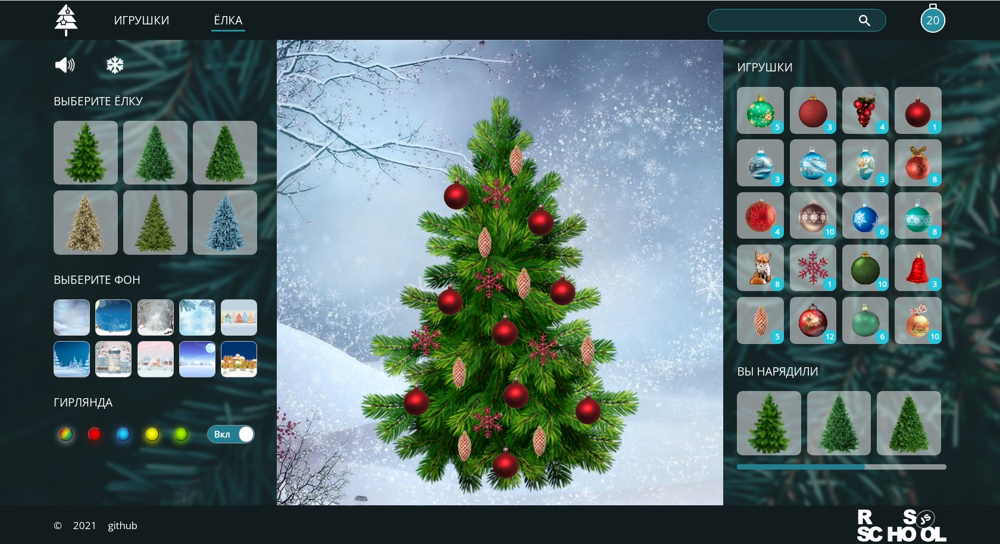

# christmas-task-part2 - Ёлочка

Во второй части задания вам необходимо создать страницу с ёлкой, которую можно украсить добавленными в избранное игрушками, а также собрать страницы приложения в SPA. Внешний вид и функционал страницы с ёлкой создан на основе игры [Наряди Ёлку](https://www.karusel-tv.ru/games/tree). 

В первую очередь ознакомьтесь с [требованиями задания](christmas-task.md)  

<kbd></kbd>

[Демо](https://christmas-tasks.netlify.app/)  
Функционал реализован не полностью. Присутствуют ошибки и неточности.  
Вы можете предложить своё приложение в качестве демо. 

## Страницы приложения
- стартовая страница
- страница с игрушками
- страница с ёлкой

## Функционал приложения
1. Вёрстка страниц приложения и навигация между ними +30
   - стартовая страница содержит название приложения и кнопку "Начать игру" или аналогичную. Выполняются требования к вёрстке +10
   - на странице с ёлкой есть меню с настройками, слоты с добавленными в избранное игрушками, ёлка. Выполняются требования к вёрстке +10
   - в header приложения есть навигация, которая позволяет с каждой страницы приложения перейти на две другие страницы +10    
2. Меню с настройками +50  
   У пользователя есть возможность:
   - выбрать один из нескольких (минимум 8) фонов +10
   - выбрать одну из нескольких (минимум 4) ёлок +10
   - включить/отключить падающий снег +10
   - включить/отключить новогоднюю музыку +10
   - выбранные настройки сохраняются в local storage и отображаются при перезагрузке страницы. Если музыка сохранилась включённой, она начинает играть при первом клике +10
3. Гирлянда +40  
   Гирлянда реализуется средствами css без использования изображений   
   Гирлянда на ёлку добавляется динамически средствами JavaScript (на кросс-чеке этот пункт не проверяется)  
   У пользователя есть возможность:
   - добавить на ёлку мерцающую разноцветную гирлянду +20  
   - выбрать один из нескольких (минимум 4) цветов лампочек гирлянды или оставить её разноцветной +10
   - внешний вид гирлянды соответствует предложенному образцу или является его улучшенной версией +10
4. Игрушки в избранном +80
   - в слотах находятся игрушки, которые были добавлены в избранное на странице с игрушками +10
   - если в избранное не была добавлена ни одна игрушка, в слотах отображаются первые 20 игрушек коллекции исходных данных +10
   - игрушки  из слотов с игрушками можно перетянуть на ёлку используя `drag and drop` +10
   - если в процессе перетягивания игрушку отпускают за пределами ёлки, она возвращается в свой слот +10
   - повешенные на ёлку игрушки можно перетягивать в пределах ёлки +10
   - повешенные на ёлку игрушки можно снимать с ёлки, при этом они возвращаются в свой слот +10
   - возле слота с каждой игрушкой указывается количество игрушек в слоте равное количеству экземпляров игрушки в массиве с исходными данными +10
   - когда игрушку "вешают на ёлку" количество игрушек в слоте уменьшается, когда игрушку "снимают с ёлки", количество игрушек в слоте увеличивается, когда все экземпляры игрушки помещаются на ёлку, отображается пустой слот +10
5. Дополнительный функционал на выбор +20  
   - есть кнопка "Сохранить" при клике по которой текущее состояние страницы с ёлкой сохраняется в local storage, изображение ёлки с размещёнными на ней игрушками добавляется в секцию "Вы нарядили". При клике по карточкам из этой секции восстанавливается состояние страницы с ёлкой на момент сохранения +10  
   Состояние страницы включает в себя настройки меню на момент сохранения, размещённые на ёлке игрушки, игрушки в избранном - их вид, порядок, количество
   - очень высокое качество оформления приложения + дополнительный, не указанный в задании, сложный в реализации функционал, улучшающий качество приложения, удобство пользования им +10

## Критерии оценки cross-check
**Максимальный балл за задание +200**

Для удобства проверки выведите в консоль браузера самооценку своего проекта по пунктам с указанием баллов за каждый выполненный вами пункт.

Баллы за отдельные пункты требований указаны в разделе ["Функционал приложения"](#функционал-приложения)  
Если после пункта требований не указаны баллы, данный пункт является пояснением и условием получения баллов за предыдущий пункт с баллами.  

Разница между максимальной оценкой за приложение (200 баллов) и максимально возможным количеством баллов за выполнение всех пунктов требований (220 баллов) позволит сгладить возможные ошибки проверяющих в ходе кросс-чека, неточности в описании задания, разное понимание требований задания проверяющим и проверяемым.

## Проверка задания ментором
**Максимальный балл за задание +200**

1. Репозиторий +20
   - pull request выполнен в соответствии с [требованиями](https://docs.rs.school/#/pull-request-review-process?id=Требования-к-pull-request-pr) +10
   - ведётся история коммитов, названия коммитов даются согласно [гайдлайну](https://docs.rs.school/#/git-convention) +10
2. Качество кода +130
   - приложение написано на TypeScript и максимально полно использует его возможности +50
   - код разбит на модули +10
   - для сборки кода используется webpack +10
   - используется eslint с конфигурацией eslint-config-airbnb-base, ошибки линтера исправлены, в eslint не добавляются собственные правила без согласования с ментором +10
   - гирлянда на ёлку добавляется динамически средствами JavaScript +10
   - у ментора нет замечаний к качеству кода, либо все замечания ментора исправлены +40
3. Оформление и функционал приложения +50
   - у ментора нет замечаний к внешнему виду и функционалу приложения, либо все замечания ментора исправлены +50