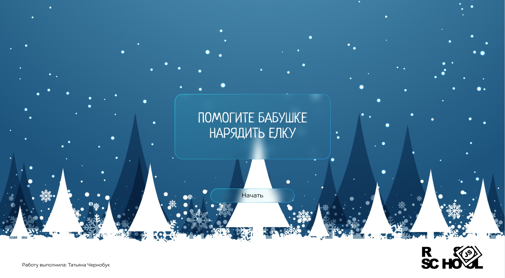
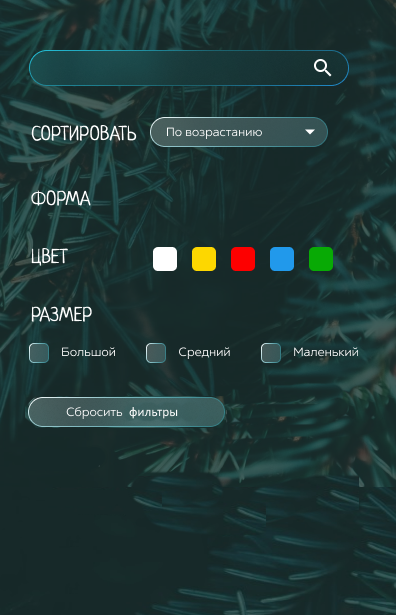

# christmas-task

## Предыстория
У вашей бабушки скопилось большое количество ёлочных игрушек. Она попросила вас помочь их разобрать, чтобы выбрать те, которыми будет наряжать ёлку в этом году.  
Зная, как бережно бабушка относится к этим игрушкам, вы отнеслись к её просьбе очень внимательно.  
Вы составили опись всех имеющихся игрушек, указав для каждой её название, количество экземпляров, год покупки, форму (шар, фигурка, снежинка и т.д.), цвет, размер, отдельно отметили любимые бабушкины игрушки.  
Теперь вам предстоит создать приложение, которое позволит отсортировать игрушки по названию и количеству экземпляров, найти игрушку по названию, сгруппировать игрушки по видам, добавлять игрушки в избранное и удалять из него, а также с интерактивной страницей, на которой выбранными игрушками можно украсить новогоднюю ёлку.

## Ключевые навыки:
- TypeScript
- Modules in JavaScript
- Webpack
- сортировка данных
- фильтрация данных
- реализация поиска
- реализация "drag and drop"

<kbd></kbd>

[Демо](https://christmas-tasks.netlify.app/)  
Функционал реализован не полностью. Присутствуют ошибки и неточности.  

## Структура задания
Задание состоит из двух частей: 
- Часть 1 - "Игрушки" - [Функционал и критерии оценки](christmas-task-part1.md)
- Часть 2 - "Ёлочка" - [Функционал и критерии оценки](christmas-task-part2.md)

## Технические требования
- для написания кода приложения используйте TypeScript
- разбейте код на модули
- для сборки кода используйте `webpack`
- используйте `eslint` настроеный для проверки TypeScript
- работа приложения проверяется в браузере Google Chrome последней версии
- можно использовать [bootstrap](https://getbootstrap.com/), [material design](https://material.io/), css-фреймворки, html и css препроцессоры
- не разрешается использовать jQuery, другие js-библиотеки и фреймворки, за исключением следующих случаев:
  - можно использовать js-библиотеку для создания ползунка с двумя значениями для сортировки в указанном диапазоне, например, [noUiSlider](https://refreshless.com/nouislider/), или другую на ваш выбор
  - можно использовать js-библиотеку для реализации дополнительного функционала - плавного перемещения карточек в ходе сортировки, фильтрации, поиска, например, [Shuffle](https://codepen.io/Vestride/pen/ZVWmMX), или другую на ваш выбор
  - можно использовать jQuery только для подключения используемых js-библиотек, если она необходима для их работы
  - использование Angular/React/Vue допускается только по согласованию с ментором

## Варианты дизайна
Функционал изображён не полностью  
В полный размер картинки открываются по клику  
Вы можете воспользоваться одним из предложенных вариантов дизайна или создать свой  
Язык приложения английский, русский, белорусский на ваше усмотрение

#### Синяя тема

 Стартовая страница        | Ёлка                     | Настройки                      |
:-------------------------:|:------------------------:|:------------------------------:|
||       |

#### Зелёная тема

 Стартовая страница        | Ёлка                     | Настройки                      |
:-------------------------:|:------------------------:|:------------------------------:|
||       |

## Требования к вёрстке
- внешний вид приложения соответствует предложенному образцу или является его улучшенной версией
- вёрстка адаптирована для планшета и десктопа. Корректность отображения приложения и отсутствие горизонтальной полосы прокрутки проверяется при ширине страницы от 1920рх до 768рх
- интерактивность элементов, с которыми пользователи могут взаимодействовать, изменение внешнего вида самого элемента и состояния курсора при наведении, использование разных стилей для активного и неактивного состояния элемента, плавные анимации
- в футере приложения есть ссылка на гитхаб автора, год создания приложения, [логотип курса](https://rs.school/images/rs_school_js.svg) со [ссылкой на курс](https://rs.school/js/)

## Как сабмитить задание
Засабмитить задание необходимо как можно раньше, как только в rs app появится такая возможность. Для этого зайдите в rs app https://app.rs.school/, выберите пункт Cross-Check: Submit, в выпадающем списке выберите название таска, в поле Solution URL добавьте ссылку на задеплоенную версию вашего приложения, нажмите кнопку Submit.   
После сабмита задания его можно продолжать выполнять до самого дедлайна.

## Cross-check
- инструкция по проведению cross-check: https://docs.rs.school/#/cross-check-flow

## Материалы
- [Официальная документация TypeScript](https://www.typescriptlang.org/)
- [Руководство по TypeScript](https://metanit.com/web/typescript/)
- [Практическое руководство по TypeScript для разработчиков](https://habr.com/ru/company/macloud/blog/557996/)
- [TypeScript. Полный курс](https://youtu.be/5QnZ9AyDW6c)
- [TypeScript - Быстрый Курс за 70 минут](https://youtu.be/nyIpDs2DJ_c)

## Вебинары RS School
- [JS/FE 2021Q3 Typescript Basics](https://youtu.be/BRTT8ZJeoS4)
- [Typescript 26.05.21 (part 1)](https://youtu.be/I_aTbZcH8Do)
- [Typescript 28.05.21 (part 2)](https://youtu.be/CegrbRXGw20)