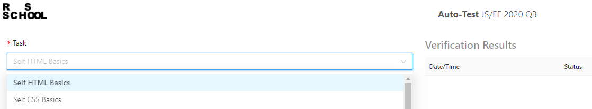

# code-basics

Это первое задание курса RS School JavaScript Front-end

Вам необходимо пройти интерактивные курсы 
- HTML для начинающих - https://ru.code-basics.com/languages/html
- CSS для начинающих https://ru.code-basics.com/languages/css
- JavaScript для начинающих https://ru.code-basics.com/languages/javascript

Для этого зарегистрируйтесь на сайте https://ru.code-basics.com через свой гитхаб-аккаунт, тот, который указывали при регистрации в rs app.

Выполните все задания каждого курса. Старайтесь выполнять задания самостоятельно, не пользуясь готовыми решениями.

## Как сдать задание?

1. Перейдите по этой ссылке https://app.rs.school/course/student/auto-test?course=js-2020-q3.
2. Выберите соответствующее задание из списка `Self HTML Basics` или `Self CSS Basics` или `Self JS Basics`.

3. Пройдите тест, заполнив необходимые поля.
4. Нажмите на кнопку `Submit`.

## Критерии оценки

**Максимальный балл за каждое задание - 100.**  
Если тест не удалось сдать, у вас есть еще одна попытка. Проходным результатом является 90 баллов, или 9 из 10 правильных ответов.

____

Успехов вам!
