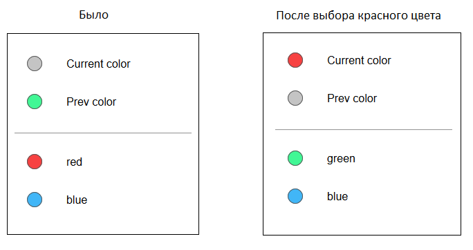
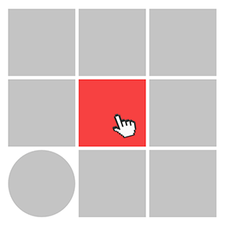
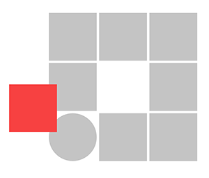
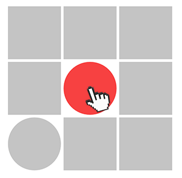

| Deadline  | Folder name | Branch name |
|-----------|-------------|-------------|
| 2019 23:59 | palette | codejam-dom-palette |

# CodeJam-dom Palette

## Задание
Внимательно посмотрите на прилагаемый к заданию прототип "UX proto".

Или онлайн:
https://www.figma.com/proto/EU8gNeqmJ8y57PUnCJ1UA3sL/pallete?node-id=1%3A2&scaling=min-zoom

Или для скачивания на свой компьютер:
https://www.dropbox.com/s/cddxz5gnpbl3gbz/pallete.fig?dl=0 - to open from file in online / desktop editor

В нем мы видим структуру:

- Шапка сайта
- Левая часть (Tools) - это панель с инструментами и панель с выбором цветов
- Рабочая правая часть (Canvas) -  это рабочая (div) область с фигурами (восемь квадратов и один круг). Все девять фигур, при старте, имеют один и тот же цвет - серый. Обратите внимание, это не canvas как элемент HTML5, это просто рабочая div-область

**Вам нужно реализовать три UI элемента (Tools, Colors, Canvas)**.

#### Tools
Данная панель инструментов должна содержать следующие инструменты:
- Paint bucket  - инструмент заливки фигуры

- Choose color  - выбор цвета (позволяет выбрать цвет из панели цветов)

- Move  - инструмент переноса фигуры в любое место рабочей области

- Transform   - инструмент преобразования фигуры (реализовать только переключение "круг - квадрат")

  
#### Colors

Панель с выбором цвета должна содержать:
- Current color - показывает текущий (выбранный) цвет (при старте предустановленный цвет - серый)

- Prev color - предыдущий цвет (при старте предустановленный цвет - зеленый)

- Палитра с красным цветом

- Палитра с синим цветом

  
#### Canvas

Это рабочая область с фигурами (восемь квадратов и один круг). Все девять фигур, при старте, имеют **один и тот же цвет** - серый. Обратите внимание, это не canvas как элемент HTML5, это просто рабочая div-область  

### Поведение работы должно проходить по следующему сценарию:

- Выбираем инструмент "Choose color". Данный инструмент, при выборе, должен изменить свое состояние, чтобы показать что он выбран (любым способом: смена цвета теста, обводка и т.д.).

- Выбираем нужный цвет на панели цветов. Например,  мышкой *выберем красный цвет*.  После выбора цвета, должны произойти визуальная перестановка на панели цветов:

 

- Выбираем инструмент заливки. Данным инструментом, мы закрашиваем текущим цветом любую фигуру  в рабочей области, просто нажимая на нее мышкой, например:

- Выбирая инструмент "Move", мы можем перемещать фигуру по рабочей области: 

  

- Выбирая инструмент  Transform,  мы изменяем фигуру с квадрата на круг и наоборот, просто нажимая на нее мышкой:

  
  

## Требования

Задание должно содержать файл index.html и папку названной  "palette".  Все файлы js и css должны находится в папке "palette".  

При выполнении задания, вы должны обязательно выполнять коммиты  в репозиторий (минимум три коммита).
Выполнив одну часть функциональности, вы должны сделать коммит. После этого вы переходите к следующей части функциональности и после ее завершения делаете коммит и так далее. 
До истечения срока дедлайна, вы можете выполнить рефакторинг и внесение изменений столько раз, сколько сочтете нужным.

##  Требования к PR

[General requirements from stage 2](https://github.com/rolling-scopes-school/docs/blob/master/docs/stage2.md).

### Limitations

    - Should work in Chrome
    - Usage of jQuery is allowerd, except for jQuery widgets
    - Usage of material design / bootstrap is allowed
    - You CANNOT use any of the frameworks like Angular / React / Vue
    - You can use preprocessors 
    - You can communicate, chat, google and use stackoverflow

### Evaluation

Maximum points - **140**

#### Basic scope (**30**):
- layout (palettes + canvas + menu) - **+10**
- paint bucket tool functionality - **+20**

#### Normal scope (include everything from basic) - **+100**:
- transform tool - **10**
- color picker tool - **+20**

*To mentor*: detect color by background color in predefined color area and inside canvas is enough  

- move tool - **+20**

*To mentor*: if a student has implemented drag and drop (swap) it will be enought for that point also 

- keyboard controls - it is possible to choose the tool with keyboard shortcuts - **+10**
- the `eslint` package is included in `package.json`, is setup with `eslint-config-airbnb-base` and all js code is validated - **+10** 

#### Extra scope (basic + normal are included)
- local storage: save current app state to restore it after the page reload - **+20**
- drag and drop: it is possible to drag and drop a figure (using a move tool) on top of another figure, making the figures swap places with each other - **+20**

#### Fines
- Requirements to commits, repo and PR are not met - up to **-20**

## Who checks your task
Your mentor
