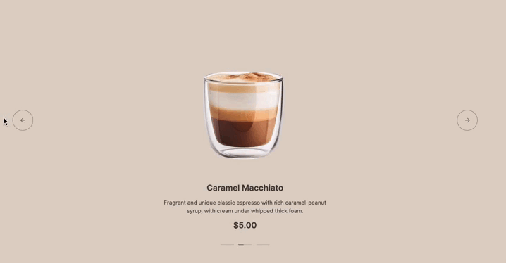
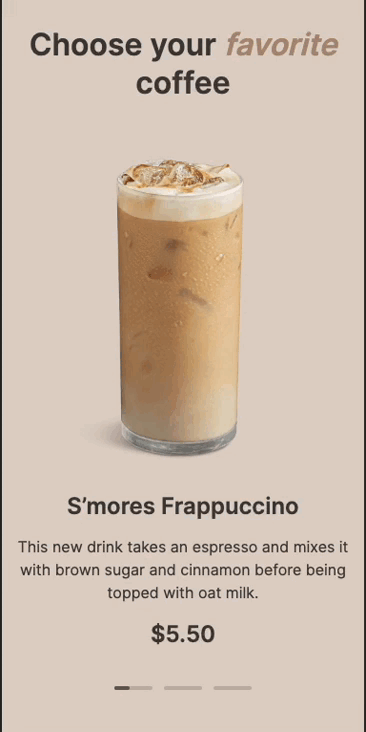

## Coffee-House. Week-3: Adding Functionality

### Main Task Description and Requirements

- [Detailed Description](coffee-house.md)

In this part of the task, you need to add the following functionality to the web pages previously created in the task:

- Opening and closing **burger menu** on pages when the width is <=768px.
- **Carousel** on the `home` page.
- **Category switching** for products on the `menu` page.
- **Loading more products** by button click if there are more than 4 on the `menu` page.
- **Modal** for the selected product on the `menu` page.

❗ Each DOM object (block) with a product description, whether it's a product in a category or a modal on the 'menu' page, will be generated from data objects with corresponding fields. The assembled JSON with the necessary objects for the project can be found in the [Materials](#materials).

## Materials:

- [The assembled JSON with all products](products.json)
- [Video for `Enjoy` block](https://www.pexels.com/ru-ru/video/2909914/)
- [Design in Figma](https://www.figma.com/file/SAoBmuOqTfguehdT4IFRxQ/Coffee-House?type=design&node-id=0-1&mode=design&t=qis81E9Ovgx47eVl-0)

## Workflow

1. The task should be completed in private repository of the school. [How to work with a school's private repository](https://docs.rs.school/#/private-repository).
2. Create a new branch named `coffee-house-week3` from `coffee-house` branch. You will find the `coffee-house` folder containing the project files completed in the previous stage within this branch.
3. Continue working on the task within the branch you have created.
4. Ensure your work meets the [CrossCheck Criteria](#crosscheck-criteria).
5. Independently evaluate your work according to the provided [Criteria for Evaluation](#criteria-for-evaluation).
6. Create a Pull Request from the `coffee-house-week3` branch to the `coffee-house` branch, resolve any conflicts that arise, and then marge the Pull Request.  
   The title of the Pull Request can be chosen at your discretion. A description for this Pull Request is not necessary.
7. After completing the cross-check for the previous part of the task, update your project's deployment. For example, you can create and merge a Pull Request from the `coffee-house` branch to the `gh-pages` branch.  
   The title of the Pull Request can be chosen at your discretion. A description for this Pull Request is not necessary.
8. Once you have completed your work, update the Pull Request from the `coffee-house` branch to the `main` branch to include the newly added functionality from the third part of the task.  
   It is not required to merge this Pull Request.
9. Submit the deployment link of your project in the "Cross-Check Submit" section of the [RS APP](https://app.rs.school/).
10. After the task deadline has passed, the cross-check phase will start, lasting three days. To earn points for the task, you must review all the projects assigned to you for cross-checking and submit your review results in the "Cross-Check Review" section of the [RS APP](https://app.rs.school/).

### CrossCheck Criteria (90 points)

1. Implementation of the **burger menu** on both pages: **+22**
   - At a page width of 768px or less, the navigation panel hides, and the burger icon appears: **+2**
   - When clicking the burger icon, the burger menu slides out from the right, and the burger icon smoothly transforms into a cross: **+4**
   - The burger menu occupies the entire available screen area below the `<header>` block: **+2**
   - When clicking the cross, the burger menu smoothly hides, moving to the right of the screen, and the cross smoothly transforms into a burger icon: **+4**
   - The burger icon is created using HTML and CSS without the use of images: **+2**
   - Links in the burger menu work, providing smooth scrolling to anchor points: **+2**
   - When clicking on any link (interactive or non-interactive) in the menu, the burger menu smoothly hides to the right, and the cross smoothly transforms into a burger icon: **+2**
   - The placement and dimensions of elements in the burger menu match the layout (horizontal centering of menu items): **+2**
   - When the page width increases to 769px or higher, the burger icon and the open burger menu hide, and the navigation panel appears: **+2**
2. Implementation of the **Carousel** on the `home` page: **+24**
   - Carousel elements are automatically scroll to the left with a specified time interval by default. The time interval duration is at the student's choose, but the recommended value is 5-7 seconds: **+4**
   - The current state until the next automatic switch is shown in the progress bar of the corresponding slide by filling it with color: **+4**
   - Only the progress bar of the current slide can be filled; the rest remain in their default state: **+2**
   - When hovering the mouse or touch-and-hold on the displayed carousel element, the time to the element switch is paused. When the mouse cursor moves out, or the hold ends, the time continues from where it stopped: **+2**
   - The switch slides is accompanied by like the carousel animation (the method of animation execution is not verified): **+4**
   - Manual switching in the corresponding direction is implemented by pressing left arrow button or right arrow button: **+2**
   - For mobile devices, manual switching in the corresponding direction is additionally implemented by swiping left or right: **+2**
   - When manually switching, the progress bar state of the switched slide resets, and the progress bar of the displayed slide starts to fill: **+2**
   - When switching to the right after the third element, it returns to the first. When switching to the left after the first element, it returns to the third: **+2**
   - Example of carousel operation on desktop:
     
   - Example of carousel operation on mobile:
     
3. Implementation of the **Category switching** for products on the `menu` page: **+4**
   - The **Coffee** category is active and the corresponding products are displayed when opening or reloading the `menu` page: **+2**
   - When switching categories, the products of the selected category are displayed: **+2**
4. Implementation of the **Loading more products** on the `menu` page **+12**
   - For screens with a width of 768px or less, when opening/reloading the page or switching categories, only 4 products are displayed. If there are more than 4 products in the displayed category, a **Load More** button is displayed below: **+4**
   - When clicking the **Load More** button below the displayed products, the missing products are added, and the **Load More** button is hidden: **+4**
   - When changing the screen width, the product display mode (8 products per page or 4 products with a **Load More** button) changes without page reloading: **+4**
5. Implementation of the **Modal** for selected product on the `menu` page: **+20**
   - The Modal with the description of a specific product opens when clicking on any part of a card of product: **+2**
   - The part of the page outside the Modal is darkened: **+2**
   - When the Modal is open, the vertical scroll of the page becomes inactive; when closed, it becomes active again: **+2**
   - Clicking on the area around the Modal and **Close** button closes it: **+2**
   - The Modal is centered on both axes, sizes of modal elements and their layout match the design: **+2**
   - After the Modal is opened, the 'Size' option 'S' is selected, and no option in the 'Additives' section is selected. The product's final price is the same as in the card: **+2**
   - Only one 'Size' option can be selected. Changing this option also changes the final price of the product based on the choice (+$0.00 for **S**, +$0.50 for **M**, +$1.00 for **L**): **+4**
   - Multiple 'Additives' options can be selected, and each selected option increases the final price of the product by $0.50: **+4**
6. Video on the `home` page: **+8**
   - In the `Enjoy` block of the `home` page, a video is played in the background instead of an image, without sound and control elements, and without the ability to interact with it: **+4**
   - After the video is finished, it automatically starts over: **+4**

### Penalties

1. If the layout of the entire design or individual blocks is implemented using images, this will result in a penalty of **-90 points**.
2. The use of frameworks, libraries, and technologies that are prohibited in the technical requirements will also result in a penalty of **-90 points**.

## Criteria for Evaluation

**Maximum score for the task: 90 points**

The scoring for each requirement is detailed in the [CrossCheck Criteria](#crosscheck-criteria) section.  
Penalties are outlined in the [Penalties](#penalties) section.

Any disputed issues should be resolved in favor of the student being assessed.

## How to Submit

- **Coffee-House. Week-3: Adding Functionality** task is evaluated through a cross-check process.
- Upon receipt of the task and prior to the submission deadline, proceed to the RS App at https://app.rs.school/. Navigate to **Cross-Check: Submit**, select the appropriate task from the dropdown list, and enter the URL of your deployed website into the **Solution URL** field. Then click the **Submit** button.

## Submit Recommendations

- Aim to submit early once the submission option becomes available in the RS App. You are free to make additional changes up until the deadline.
- Given that the project is contained within a private repository, there's no need to share repository or pull request links as reviewers will not have access to them. Private repositories are visible only to you, the course administrators, and any assigned mentors.
- Verify that the deployed website link is functional, especially when accessed in the browser's incognito mode.

## Task Evaluation

- Follow the instructions for conducting a cross-check available at: https://docs.rs.school/#/cross-check-flow
