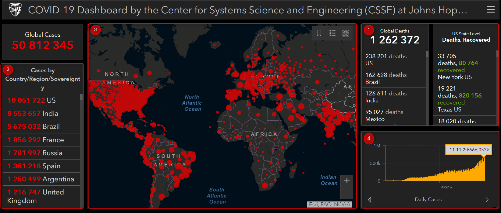

# COVID-19 Dashboard

| Deadline         | Folder name     | Branch name     |
| ---------------- | --------------- | --------------- |
| 23.12.2020 23:59 | covid-dashboard | covid-dashboard |

В этом задании создадим приложение для отслеживания распространения COVID-19 в мире и в отдельных странах. Информацию необходимо представить в виде таблицы, списка, графика и интерактивной карты.

[Онлайн-карта распространения Covid-19](https://coronavirus.jhu.edu/map.html). Структуру и внешний вид этого проекта можно использовать в качестве образца.

## Структура и особенности работы приложения

1. Таблица, в которой отображаются следующие данные:
   - количество случаев заболевания
   - количество летальных исходов
   - количество выздоровевших

В таблице есть переключатели для отображения данных:

- за весь период пандемии и за последний день (последнюю возвращаемую API дату)
- в абсолютных величинах и из расчёта на 100 тыс. населения

  

    
Таким образом всего в таблице может отображаться 12 показателей

1. общее количество случаев заболевания
2. общее количество летальных исходов
3. общее количество выздоровевших
4. количество случаев заболевания за последний день
5. количество летальных исходов за последний день
6. количество выздоровевших за последний день
7. общее количество случаев заболевания из расчёта на 100 тыс. населения
8. общее количество летальных исходов из расчёта на 100 тыс. населения
9. общее количество выздоровевших из расчёта на 100 тыс. населения
10. количество случаев заболевания за последний день из расчёта на 100 тыс. населения
11. количество летальных исходов за последний день из расчёта на 100 тыс. населения
12. количество выздоровевших за последний день из расчёта на 100 тыс. населения

По умолчанию в таблице отображаются данные для мира в целом. Если пользователь выбирает определённую страну, в таблице отображаются данные для выбранной пользователем страны.

Страну можно выбрать:

- кликом по пункту списка
- кликом по интерактивной карте
- найти при помощи поиска

2. Список стран для каждой из которых по умолчанию отображается общее количество случаев заболевания за весь период пандемии. У пользователя есть возможность выбрать для отображения в списке любой другой показатель из тех, которые могут отображаться в таблице. Список стран сортируется по убыванию по выбранному показателю. Работает поиск по названию страны. Для ввода поискового запроса может использоваться виртуальная клавиатура, созданная в одном из предыдущих заданий. Поиск работает "на лету": по мере ввода названия страны отображаются все соответствующие введённым символам результаты. Результат поиска можно выбрать кликом, даже если поисковый запрос ещё не был введён полностью. Возле каждой страны выводится изображение её флага.
3. Интерактивная карта на которой условными обозначениями: цветом или размером маркера указывается интенсивность распространения болезни в разных странах. По умолчанию интенсивность определяется по общему количеству случаев заболевания за весь период пандемии. У пользователя есть возможность выбрать для определения интенсивности распространения болезни любой другой показатель из тех, что могут отображаться в таблице.  
   Карта интерактивная, есть возможность перетаскивать карту, уменьшать и увеличивать масштаб. При наведении курсора на страну появляется всплывающая подсказка - название страны и показатель, который в данный момент используется для определения интенсивности распространения болезни. У карты есть легенда. Для оформления карты используется кастомный дизайн.
4. График по умолчанию строится по общему количеству случаев заболевания. При наведении курсора на график появляется всплывающая подсказка с датой, соответствующей этой точке графика и данными по этой дате. У пользователя есть возможность просмотреть график по любому из выбранных показателей из тех, которые выводятся в таблице, как для мира в целом, так и для любой выбранной страны.

Данные в приложении обновляться ежедневно, в соответствии с обновлением данных, предоставляемых API. В приложении указывается дата, за которую отображаются данные.

Переключение данных в разных блоках информации (таблица, список, карта, график) происходит согласованно. Это означает что при переключении данных для отображения в одном блоке информации или при выборе определённой страны, эти же данные для выбранной страны должны отображаться и в других блоках информации. Наличие отдельных переключателей для отображения данных в каждом блоке информации объясняется тем, что каждый блок информации можно развернуть в полный экран, как это реализовано в предложенной в качестве образца онлайн-карте распространения Covid-19.

## Особенности задания

1. Задание выполняется в командах из двух человек. При отсутствии ментора, команды формируются по желанию студентов. В случае наличия ментора его студенты обьединяются в одну (до 4 чел), две или три команды.  
   Каждый студент самостоятельно сабмитит созданное приложение и получает за него баллы по результатам кросс-чека.
2. Студенты могут изменить тему задания. Можно рассмотреть любую другую глобальную проблему человечества: загрязнение воздуха, воды, почв, лесные пожары, охрана животных и растений, использование альтернативных источников энергии, природоохранные территории и т.д. Лишь бы удалось найти подходящее API. Изменение темы задания не может сопровождаться его упрощением и сокращением количества отображаемых данных.

## Требования к репозиторию

- так как таск выполняется в составе команды, работа над ним ведётся в личном приватном репозитории одного из студентов, работающих вместе.
- особенности командной работы с репозиторием описаны в [документации курса](https://docs.rs.school/#/final-task?id=Работа-с-репозиторием)
- после окончания работы над проектом в приватном репозитории школы создайте ветку с названием задания, в ней создайте папку с названием задания, и в ней разместите файлы проекта
- для деплоя используйте `gh-pages` [Как сделать деплой задания из приватного репозитория школы](https://docs.rs.school/#/stage2?id=Как-сделать-деплой-задания-из-приватного-репозитория-школы). Если вы не можете задеплоить проект на `gh-pages`, для деплоя можно использовать https://app.netlify.com/drop  
  Для демоверсий, размещённых на `netlify`, название страницы дайте по схеме: имя гитхаб аккаунта - название таска
- после окончания разработки необходимо сделать Pull Request из ветки приложения в ветку `main` [Требования к Pull Request](https://docs.rs.school/#/stage2?id=Требования-к-pull-request-pr). **Мержить Pull Request не нужно**
- репозиторий, в котором велась работа над проектом, после наступления дедлайна нужно сделать публичным

## Требования к оформлению приложения

- внешний вид приложения соответствует предложенному образцу или является его улучшенной версией
- интерактивность элементов, с которыми пользователи могут взаимодействовать, изменение внешнего вида самого элемента и состояния курсора при наведении, использование разных стилей для активного и неактивного состояния элемента, плавные анимации
- каждый блок информации (таблица, список, карта, график) можно развернуть в полный экран, как это реализовано в предложенной в качестве образца онлайн-карте распространения Covid-19
- в футере приложения есть ссылки на гитхабы авторов приложения, год создания приложения, [логотип курса](https://rs.school/images/rs_school_js.svg) со [ссылкой на курс](https://rs.school/js/)

## Технические требования

- приложение корректно работает в последней версии Chrome
- можно использовать css-препроцессоры, bootstrap, material design
- разрешается использовать jQuery только в качесте подключаемой зависимости для UI библиотек. Использование jQuery в основном коде приложения не допускается
- можно использовать js-библиотеки для построения графиков и карты
- использование Angular / React / Vue допускается только по личной договорённости с ментором
- запрещено копировать код других студентов, демо, примеров, которые приводятся в задании. Этот запрет касается html, css, js кода. Можно использовать небольшие фрагменты кода со Stack Overflow, других самостоятельно найденных источников в интернете, за исключением github-репозиториев студентов курса. Возле использованного чужого фрагмента кода в комментарии указывается ссылка на источник.

## Критерии оценки:

**Максимальный балл за задание: 240 баллов при кросс-чеке / 280 баллов при проверке ментором**

### Basic scope +70

- Вёрстка, дизайн, UI **30 баллов**
  - [ ] внешний вид приложения соответствует образцу или является его улучшенной версией. Каждый блок информации (таблица, список, карта, график) можно развернуть в полный экран +10
  - [ ] для стандартных разрешений экрана монитора до 1024×768 включительно приложение полностью помещается в экран. При меньшем разрешении экрана допускается наличие вертикальной полосы прокрутки +10
  - [ ] вёрстка адаптивная. Минимальная ширина страницы, при которой проверяется корректность отображения приложения, 500рх +10
- Таблица – **40 баллов**
  - [ ] в таблице корректно отображаются указанные в описании задания данные за весь период пандемии - +10
  - [ ] данные можно просматривать за последний день (последнюю возвращаемую API дату) +10
  - [ ] данные можно просматривать из расчёта на 100 тыс. населения - +10
  - [ ] данные можно просматривать для выбранной пользователем страны - +10

### Advanced scope +100

- Список – **50 баллов**
  - [ ] есть список стран для каждой из которых по умолчанию отображается общее количество случаев заболевания за весь период пандемии +10
  - [ ] есть возможность выбрать для отображения в списке любой другой показатель из тех, которые выводятся в таблице. Список стран сортируется по убыванию по выбранному показателю +10
  - [ ] работает поиск по названию страны +10
  - [ ] для ввода поискового запроса может использоваться виртуальная клавиатура +10
  - [ ] возле каждой страны выводится изображение её флага +10
- Интерактивная карта – **50 баллов**
  - [ ] на карте условными обозначениями: цветом или размером маркера указывается интенсивность распространения болезни +10
  - [ ] есть возможность выбрать для отображения интенсивности распространения болезни другой показатель из тех, что могут отображаться в таблице +10
  - [ ] карта интерактивная, есть возможность пертескивать карту, уменьшать и увеличивать масштаб +10
  - [ ] при наведении курсора на страну на карте появляется всплывающая подсказка - название страны и показатель, который в данный момент используется для определения интенсивности распространения болезни +10
  - [ ] у карты есть легенда, для оформления карты используется кастомный дизайн +10

### Hacker scope +70

- График – **50 баллов**
  - [ ] есть график, который строится по общему количеству случаев заболевания +10
  - [ ] есть возможность просмотреть график по любому из выбранных показателей из тех, которые выводятся в таблице +20
  - [ ] при наведении курсора на график появляется всплывающая подсказка с датой, соответствующей этой точке графика и данными по этой дате +10
  - [ ] есть возможность просмотреть график как для мира в целом, так и для любой выбранной страны +10
- Бонусные баллы за качество приложения – **20 баллов**
  - [ ] оригинальный интересный качественный дизайн приложения +10
  - [ ] продуман и реализован не предусмотренный заданием дополнительный функционал +10

### Требования к коду +40 (оценивает только ментор)

- [ ] дублирование кода сведено к минимуму, не используются магические числа, используются осмысленные имена переменных и функций, оптимальный размер функций и т.д. +10
- [ ] подключены и используются webpack, eslint, eslint-config-airbnb-base +10
- [ ] приложение разбито на отдельные модули, используются фишки es6 и выше +10
- [ ] реализованы юнит-тесты – 2 балла за каждый уникальный тест, но не больше 10 баллов +10

### Штрафные баллы (оценивает только ментор)

- [ ] не выполняются требования к репозиторию, названиям коммитов, описанию Pull Request - до 20 баллов
- [ ] не выполняются требования к коду, игнорируются советы ментора относительно качества кода - до 50 баллов
- [ ] использование jQuery в основном коде приложения - 0 баллов за таск
- [ ] заимствование чужого кода (списывание) - 0 баллов за таск + возможность отчисления

## Ключевые навыки

- использование RESTful API
- получение данных при помощи асинхронных запросов
- разные способы отбражение данных на странице
- реализация сортировки и поиска
- создание картографического приложения
- работа с js-библиотеками

## Материалы

- **Асинхронные запросы, fetch/async/await**
  - [Асинхронные запросы. Использование Fetch](https://developer.mozilla.org/ru/docs/Web/API/Fetch_API/Using_Fetch)
  - [Fetch](https://learn.javascript.ru/fetch)
  - [Асинхронные функции (async/await)](https://youtu.be/5kAPExqSZ1I)
  - [JavaScript Fetch API and using Async/Await](https://dev.to/shoupn/javascript-fetch-api-and-using-asyncawait-47mp)
  - [Вебинар: Асинхронность в JavaScript. Таймеры, промисы, async/await](https://youtu.be/Ih6Q7ka2eSQ)
- **Советы по качеству кода**
  - [Магические числа](https://ru.code-basics.com/languages/javascript/modules/variables/lessons/magic-numbers)
  - [Как писать чистый код: обзор лучших практик JavaScript](https://techrocks.ru/2019/08/27/writing-clean-code-in-javascript/)
  - [Рекомендации по написанию чистого кода на JavaScript](https://habr.com/ru/company/ruvds/blog/454520/)
- **Тестирование. Юнит-тесты. Jest**
  - [Testing](https://youtu.be/xrS60rkoG3w)
  - [Testing live coding](https://youtu.be/qFSrImO04X8)
  - [Jest. Unit Тестирование в JavaScript](https://youtu.be/IEDe8jl5efU)
- **API**
  - [получить флаг любой страны](https://www.countryflags.io/)
  - [получить флаг и население по названию страны](https://restcountries.eu/rest/v2/all?fields=name;population;flag)
  - [данные по COVID-19](https://covid19api.com/)
- **Библиотеки**
  - [ChartJS: диаграммы HTML5](https://www.chartjs.org/)
  - [ChartJS - Simple usage example](https://youtu.be/PfvJU_F5UiA) (видео студента курса)
  - [LeafletJS: создание интерактивных карт](https://leafletjs.com/)
  - [LeafletJS — Краткое руководство](https://coderlessons.com/tutorials/veb-razrabotka/uznaite-leafletjs/leafletjs-kratkoe-rukovodstvo)
- **Туториалы**
  - [Create a COVID-19 Dashboard with JavaScript](https://medium.com/swlh/create-a-covid-19-dashboard-with-javascript-373f46a11fcc) (полностью прочитать можно в приватном окне браузера)
  - [How to create a Coronavirus (COVID-19) Dashboard & Map App](https://www.freecodecamp.org/news/how-to-create-a-coronavirus-covid-19-dashboard-map-app-in-react-with-gatsby-and-leaflet/)
  - [Создание панели мониторинга COVID-19 с помощью Charts.js](https://ichi.pro/ru/sozdanie-paneli-monitoringa-covid-19-s-pomos-u-charts-js-i-vue-js-6254886141860)
- **Примеры приложений**
  - [Search population API](https://codepen.io/bludce/full/KOmYyV)
  - [Coronavirus Dashboard](https://codepen.io/sheikh_ishaan/full/PoPYwJP)
  - [Corona virus animated dashboard](https://codepen.io/red-beard/full/MWwqPNW)

[Документ для вопросов, связанных с выполнением задания](https://docs.google.com/spreadsheets/d/1NGTZUk8IXt6g4CdIYK3Za8XOs1hW40kCk6VrLm0Mg0M/)

## Cross-check

- [инструкция по проведению cross-check](https://docs.rs.school/#/cross-check-flow)
- [форма для проверки задания](https://covid-dashboard-cross-check.netlify.app/)
- [cсылки на лучшие работы добавьте, пожалуйста, в эту форму](https://forms.gle/kAEtwN1mRouA5pny5)
