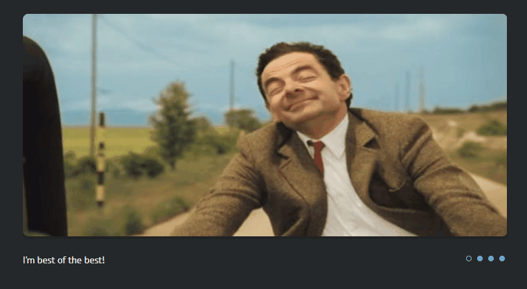
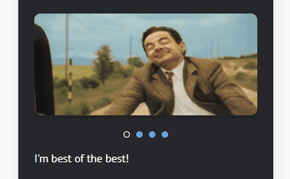
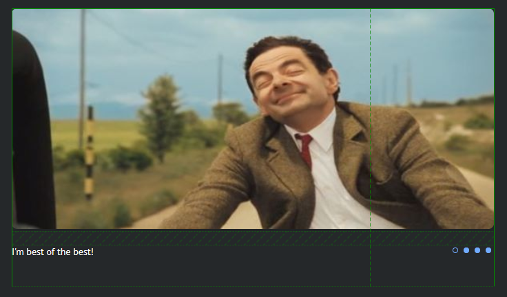
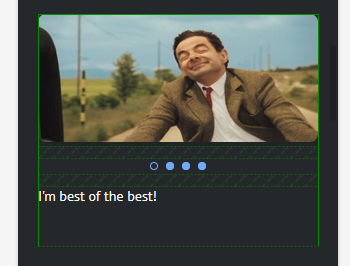
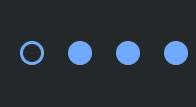

| Крайний срок сдачи                                      | Имя папки     | Имя ветки |
| ------------------------------------------------------- | ------------- | --------- |
| см. [расписание](https://app.rs.school/course/schedule) | cssMemeSlider | gh-pages  |

# Домашнее задание: CSS Meme Slider

В этом задании вам необходимо сверстать слайдер, используя чистые HTML и CSS (**без использования JS**), согласно требованиям:

Desktop:

<kbd></kbd>

Mobile:

<kbd></kbd>

1. Слайдер позиционируется с равными отступами слева и справа;
2. Расположение картинок, подписей к ним и контролов:

Desktop:

<kbd></kbd>

Mobile:

<kbd></kbd>

3. Имеется анимация для смены картинок по клику на контролы (например: перелистывание, исчезание, проскроливание и т.д. Главное - анимированная/плавная смена)
4. Имеется анимация для смены подписей к картинкам по клику на контролы (например: перелистывание, исчезание, проскроливание и т.д. Главное - анимированная/плавная смена)
5. Подписи к картинкам должны быть строковыми значениями (текстом)
6. Каждый контрол имеет большую область нажатия
7. Контролы имеют интерактивность (момент наведения, момент нажатия, активный контрол, изменение курсора). Желтый кружочек в примере выше - это индикация клика мыши в программе записи, реализовывать и оценивать его не надо.

Controls effects:
<kbd></kbd>

## Требования к репозиторию и как сабмитить задание

1.  создайте личный публичный репозиторий `cssMemeSlider` (необходимо поставить галочку на создание readme, чтобы создался репозиторий с веткой `main`).
2.  создайте `gh-pages` ветку (если таковой не имеется)
3.  перейдите в эту (gh-pages) ветку и создайте папку `cssMemeSlider`. Ваша работа будет доступна по ссылке, например: `https://${YOUR_GITHUB_NAME}.github.io/cssMemeSlider/cssMemeSlider/index.html`
4.  выполняете таску в этой папке (cssMemeSlider). В процессе выполнения задания должно быть не менее **5** коммитов.
5.  [Названия коммитов должны быть согласно гайдлайну](https://docs.rs.school/#/git-convention) + каждый ваш коммит должен содержать тайм-стемп.

        5.1. тайм-стемп может быть на любом  языке; по тайм-стемпу должно быть понятно, когда этот коммит был сделан: день недели, месяц, число, год, точное время до секунд (очередность может быть произвольная) например название коммитов:

    > init: start cssMemeSlider-task (Mon, Sep 13, 2021 10:12:24 PM)

    > feat: add basic page layout (Mon, Sep 13, 2021 10:25:24 PM)

    Например, можно использовать следующий шаблон коммита:

    > git commit -m "init: start cssMemeSlider-task \`LANG=en_EN date +'(%a, %b %d, %Y %r)'`"

6.  После завершения работы откройте Pull Request из ветки `gh-pages` в ветку `main`. Название Pull Request дайте по названию задания. [Описание Pull Request дайте по схеме](https://docs.rs.school/#/pull-request-review-process?id=%D0%A2%D1%80%D0%B5%D0%B1%D0%BE%D0%B2%D0%B0%D0%BD%D0%B8%D1%8F-%D0%BA-pull-request-pr). Мержить данный Pull Request не нужно. Ссылку на данный пулл реквест необходимо сабмитнуть в форму кросс-чека. В пулл реквесте необходимо описать по критериям оценки, что сделано и что нет. В частности - описаны все разрешения, при которых проверяющему необходимо смотреть - например: `мобильная версия 320x568, версия для ПК - 1920×1080`.

❗ В общем и целом помните, что если у проверяющего возникнут какие-либо потенциальные вопросы к автору работы на кросс-чеке - он должен найти все ответы в вашем описании к Pull Request.

## Проверка задания

- Задание будут проверяться посредством кросс-чека. [Инструкция по проведению cross-check](https://docs.rs.school/#/cross-check-flow)

## Технические требования

- Запрещается использование CSS-фреймворков (bootstrap, foundation и т.д.)
- Запрещается использование каких-либо js скриптов и npm пакетов
- Запрещается использование CSS препроцессоров (необходимо использовать только чистый CSS)
- Поддержка браузера Google Chrome
- Допускается добавление тегов типа h1, footer, header и т.д. для увеличения контента всей страницы
- Разрешается/допускается использование `gif` картинок
- Разрешается/допускается использование `px` только для синтаксиса медиа квери
- Разрешается/допускается, что в репозитории есть первый коммит, генерируемый автоматически гитхабом `Initial commit`
- Разрешается/допускается использование `reset.css` и `normalize.css`

## Критерии оценки

**Максимальный балл за задание 150**

1. Выполнено всё из секции `Требования к репозиторию и как сабмитить задание` **+30**:

   - Pull Request открыт из ветки `gh-pages` в ветку `main` и не замерджен **+2**
   - в ветке `gh-pages` создана папка `cssMemeSlider` и доступен деплой работы **+2**
   - присутствует история разработки (не менее **5** коммитов). **+6**
   - коммиты названы согласно [гайдлайну](https://docs.rs.school/#/git-convention) + каждый коммит содержит тайм-стемп. **+10**
   - cтудент засабмитил ссылку на пулл реквест **+5**
   - Pull Request описан [по схеме](https://docs.rs.school/#/pull-request-review-process?id=%D0%A2%D1%80%D0%B5%D0%B1%D0%BE%D0%B2%D0%B0%D0%BD%D0%B8%D1%8F-%D0%BA-pull-request-pr), и указаны все разрешения для проверки. **+5**

2. Слайдер позиционируется с равными отступами слева и справа **+10**
3. Соблюдено расположение картинок, подписей к ним и контролов **+10**
4. Имеется плавная анимация смены картинок **+20**
5. Имеется плавная анимация смены подписей к картинкам **+10**
6. Подписи к картинкам должны быть строковыми значениями (текстом), т.е. текст не должен быть частью картинки **+15**
7. Каждый контрол имеет большую область нажатия, чем размер самого контрола **+5**
8. Контролы имеют интерактивность (момент наведения, момент нажатия, активный контрол, изменение курсора) **+10**
9. Имеется мобильная версия слайдера, и соблюдено расположение картинок, подписей к ним и контролов **+20**
10. Используются только относительные единицы измерения: rem, em, %, vh, vw, fr and etc. Присутствует "резиновость" слайдера **+10**
11. Все блоки/составные части слайдера (контролы, картинки, подписи к слайдеру) находятся в базовом потоке дом-элементов, не позиционируются (position) с помощью `top, left, right, bottom`, не используется `float`. Можно: flex, grid, margin-left and etc... - все, что не упомянуто в запретах выше. Свойство `position` может быть только static. **+5**
12. Не используются псевдоэлементы (не путать с псевдоклассами, псевдоклассы можно). **+5**

## Штрафные баллы

- Использование каких-либо скриптов/библиотек **-100500**
- Использование обфусцированного (не человекочитаемого) CSS/HTML **-100500**
- Списывание **-100500**

❗ Размеры каждого блока/шрифт и контент слайдера, дизайн - на усмотрение разработчика. Отклонения могут варьироваться значительно. Оценку за это не снижаем. Гланое соблюсти позиционирование/расположение блоков (картинки, контролы, подписи) и другие технические требования.

❗ Минимальная ширина страницы, при которой проверяется корректность мобильной версии отображения приложения - 500рх. Десктопная версия проверяется на стандартном разрешении экрана - 1024px.

❗ Подбор мемасов - на усмотрение разработчика, но желательно не менее 4 штук ;)

Всем успехов и удачи!
