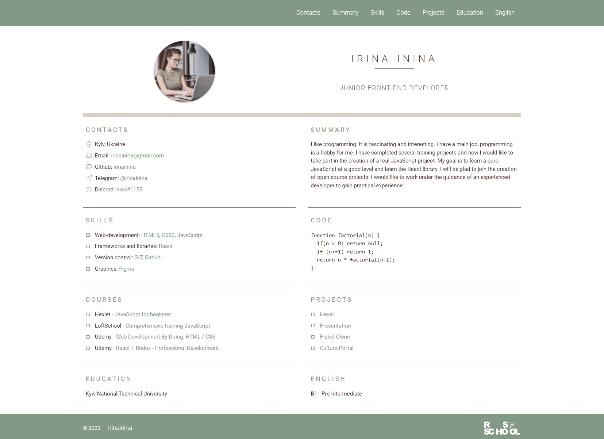

## Советы по выполнению задания CV#3. CV. Cross-Check
- [Описание и требования задания](cv-stage0.md)
- Советы не являются частью задания. Следуйте советам только в той мере, в которой они могут вам помочь. 

В третьей части задания необходимо сверстать CV.  
Его внешний вид и используемые технологии определяете вы сами.  
Если вы уже умеете верстать, выполняете задание как знаете и как считаете нужным.  
Если это ваши первые шаги в вёрстке, попробуйте следовать предложенным советам, возможно, они смогут вам помочь.  

В качестве примера рассмотрим вёрстку вот такого CV:

<kbd></kbd>

[Демо](https://cv-hints.netlify.app/)

На его примере рассмотрим на что обратить внимание при вёрстке, остановимся на самых общих моментах.  
Постарайтесь с ними разобраться, так как данное задание готовит к следующему таску по вёрстке, где понадобятся полученные в ходе его выполнения знания и навыки. 

1. [Редактор кода](#редактор-кода)
2. [Содержание CV](#содержание-cv)
3. [Репозиторий](#репозиторий)
4. [Структура проекта](#структура-проекта)
5. [Пути](#пути)
6. [Code guide](#code-guide)
7. [Начало работы](#начало-работы)
8. [Некоторые сокращения EMMET](#некоторые-сокращения-emmet)
9. [Подключение шрифтов](#подключение-шрифтов)
10. [Универсальный селектор](#универсальный-селектор)
11. [Вёрстка основных блоков](#вёрстка-основных-блоков)
12. [Как прижать `footer` к низу страницы](#как-прижать-`footer`-к-низу-страницы)
13. [Контейнер](#контейнер)
14. [Header](#header)
15. [Якорные ссылки](#якорные-ссылки)
16. [Стилизация списка](#стилизация-списка)
17. [Интерактивность при наведении](#интерактивность-при-наведении)
18. [Секции](#секции)
19. [Сетка](#сетка)
20. [Стилизация шрифта](#стилизация-шрифта)
21. [Изображения](#изображения)
22. [Псевдоэлементы](#псевдоэлементы)

### Редактор кода
Для вёрстки понадобится редактор кода. Если у вас нет других предпочтений и вы ещё не выбрали в чём будете писать код, рекомендуется установить и использовать `Visual Studio Code` – очень качественный бесплатный редактор кода, стандарт по умолчанию в профессиональной разработке.  
Ссылка на скачивание: https://code.visualstudio.com/

#### Расширения Visual Studio Code
- `Russian Language Pack for Visual Studio Code` - устанавливает русский язык
- `Auto Complete Tag` - автоматически закрывает теги
- `Live Server` - открывает html-страницу в браузере
- `Brackets Light Pro` – оформление как у Brackets (для любителей светлой темы)

Видео [Установка и настройка Visual Studio Code](https://youtu.be/1IvGow7V_dk) - 14 минут

### Содержание CV
Основу содержания CV составят данные, которые вы добавили в markdown-документ, созданный в ходе выполнения задания [CV#1. Markdown & Git](git-markdown.md)  
Эти данные можно дополнять, изменять, редактировать.

Кроме текста в CV нужно будет добавить ваше фото или аватарку.

### Репозиторий
Работу ведём в личном публичном репозитории `rsschool-cv` в ветке `rsschool-cv-html`, которую создали в ходе выполнения задания [CV#2. HTML, CSS & Git Basics](html-css-git.md)  
Клонируем ветку репозитория на компьютер. Для этого кликаем правой кнопкой мыши по рабочему столу компьютера и в появившемся меню выбираем пункт "Git Bash Here". Такой пункт появится, если у вас установлен Git. Если нет, установите. Ссылка на скачивание: https://git-scm.com/

#### Базовая настройка Git
Базовая настройка Git предусматривает выполнение двух команд    
```
git config --global user.name "github-username"
git config --global user.email "mail@gmail.com"
```  
здесь:  
- `github-username` – ваш логин на GitHub
- `mail@gmail.com` – почта, указанная при регистрации на GitHub (не обязательно gmail)

В открывшемся окне пишем команду  
`git clone https://github.com/GITHUB-USERNAME/rsschool-cv -b rsschool-cv-html`  
в которой вместо `GITHUB-USERNAME` укажите свой никнейм на сайте GitHub.

На рабочем столе появляется папка `rsschool-cv`. Это локальная копия ветки `rsschool-cv-html` расположенного на GitHub репозитория `rsschool-cv`. 

### Структура проекта
Проекты с вёрсткой обычно включают в себя файлы:
- `index.html`
- `style.css`
- `index.js` (может отсутствовать)
- медиафайлы: изображения, иконки, видео  

Обратите внимание:
- файл `index.html` всегда находится на верхнем уровне (в корне проекта, не вложенный в другую папку)
- файлы `style.css` и `index.js` находятся на верхнем уровне, если их только по одному.  
  Если таких файлов несколько, они размещаются внутри папок `css` и `js`
- для хранения медиафайлов используем папку `assets` с подпапками `img`, `svg`, `fonts`, `video` в которых размещаем изображения, иконки, шрифты и видео соответственно

В папке `rsschool-cv`, которую вы склонировали на компьютер, уже находятся файлы `index.html` и `style.css`

Также в папке `rsschool-cv` необходимо разместить файл с изображением (ваше фото или аватарка). Если файл с изображением в проекте только один, допустимо разместить его на одном уровне с файлами `index.html` и `style.css`. Если изображений в проекте будет несколько, необходимо создать папку `assets`, в ней папку `img`, в ней разместить изображения.

### Пути
Чтобы подключить к `index.html` файл со стилями, или добавить изображение в проект, необходимо указать путь к нему. Для изображения этот путь указываем значением атрибута `src`
```html

```  
Если изображение `image.jpg` лежит на одном уровне с файлом `index.html`, путь к нему можно указать как `image.jpg` или `./image.jpg`. Это две равнозначные записи, в первом случае путь указывается относительно файла `index.html`, во втором относительно их общего каталога. Точка перед косой чертой в этом случае обязательна.  
Точно так же двумя способами можно указать путь к файлу со стилями:  
```html
<link rel="stylesheet" href="style.css">
```  
или  
```html
<link rel="stylesheet" href="./style.css">
```  
Оба варианта равнозначные и рабочие.  
Очень частая ошибка: подключить файл указав в начале пути косую черту и не поставив точку.  
Внимание, ОШИБКА!  
```

```  
Так делать нельзя. В браузере путь, который начинается с косой черты, не сработает, картинка не отобразится. Если так подключить стили, они тоже не будут работать и проверяющие увидят только разметку без стилей.  

Таким образом, если файлы лежат на одном уровне, путь к файлу можно указать одним из двух способов:
1. указать только название и расширение файла
2. использовать точку + косую черту + название и расширение файла  

Путь к файлу заключаем в двойные кавычки.  

Если изображение вложено в папку `img`, а та в свою очередь вложена в папку `assets`, путь указываем с перечислением всех папок, начиная с той, которая находится на одном уровне с файлом, к которому подключаем изображение.  
Варианты правильного подключения:  
```html

```  
или  
```html

```  
#### Если нужно подняться на один уровень вверх
Предположим, у нас файл `style.css` лежит внутри папки `css` (так делают, если файлов со стилями несколько). Фото, которое подключаем в качестве фонового изображения, находится в папке `img`, которая вложена в папку `assets`. Папки `css` и `assets` находятся на одном уровне.  
Чтобы подключить изображение к файлу `style.css`, нужно выйти из папки `css`, подняться на один уровень вверх. Для этого в начале пути к файлу нужно добавить две точки и косую черту: `../`. Путь в этом случае будет выглядеть так:  
```css
background-image: url('../assets/img/image.jpg');
```  
Если вложенных папок несколько, конструкцию `../` в начале пути к файлу можно использовать несколько раз, каждое её использование - переход на один уровень вверх.  

### Code guide
Code guide - это соглашение как писать код: какие кавычки использовать, сколько отступов делать в начале строки, как писать названия классов и т.д.  
В разных командах Code guide может быть разным, но некоторые правила являются более-менее общепринятыми:
- для разделения строк используйте два пробела
- в html и css используйте двойные кавычки, в js - одинарные
- указывайте элементам названия классов и стилизуйте классы, а не теги, не id, не сложные селекторы и т.д
- названия классов записывайте строчными буквами через дефис
- названия классов описывают не то, как выглядит элемент или где он находится на странице, а его функционал.  
[Слова, часто используемые в CSS-классах](https://github.com/yoksel/common-words)
- не используйте транслит в названиях классов: `link`, `list` - хорошо, ~~`ssilka`~~, ~~`spisok`~~ - очень плохо
- порядок определения стилей:
  - позиционирование
  - блочная модель (размеры, отступы)
  - типографика (свойства шрифта)
  - оформление (цвет фона, тень)
  - анимация
- размеры, как правило, указываются в пикселях, в т.ч и размер шрифта. Также могут использоваться проценты. Относительные единицы `rem`, `em` обычно используются только если это указано в требованиях техзадания
- будьте осторожны с абсолютным позиционированием. Абсолютное позиционирование хорошо подходит для вёрстки элементов оформления, но не рекомендуется для вёрстки больших блоков. Использование абсолютного позиционирования при вёрстке сетки сайта очень усложнит добавление макету адаптивности.

### Начало работы
В файле `index.html` нажимаем восклицательный знак и `Tab` - готова основа html документа.  
Это сработал EMMET - одно из самых полезных расширений существенно облегчающее и ускоряющее работу.  
В блоке `head` указываем `title` - заголовок страницы:  
```html
<title>cv</title>
```  
Также в блоке `head` подключаем стили:  
```html
<link rel="stylesheet" href="style.css">
```  
И там же в блоке `head` подключаем фавикон - значок сайта  
```html
<link rel="icon" href="assets/favicon.ico">
```  
Изображение для фавикона можно взять любое и [конвертировать](https://image.online-convert.com/ru/convert-to-ico) его в формат `ico`

### Некоторые сокращения EMMET
EMMET невероятно популярное и очень полезное расширение уже интегрированное в VS Code. Изучите хотя бы несколько часто используемых в нём сокращений и постепенно расширяйте их список.

**Вёрстка - файл с расширением .html**  
- сочетание клавиш `! + Tab` - выведет основу html документа
- `link + Tab` = `<link rel="stylesheet" href="">` - используем для подключения стилей, значением атрибута `href` указываем путь к файлу `style.css`
- `.container + Tab` = `<div class="container">` - точка перед названием класса позволяет создать `div` с указанным классом
- `а + Tab` = `<a href=""></a>` - создаём тег, вместо `a` может быть любой другой тег
- `a.card + Tab` = `<a href="" class="card"></a>` - создаём тег `a` с указанным классом, вместо `a` может быть любой другой тег 
- `ul>li*3 + Tab` - выводится ненумерованный список с тремя пунктами, угловая скобка означает вложенность: `li` находится внутри `ul`, знак умножения и число после него - количество однотипных элементов
- `ul.nav-list>li.nav-item*3>a.nav-link + Tab` - выведется ненумерованный список `ul` с классом `nav-list` с тремя пунктами `li` с классом `nav-item` внутри каждого `li`  ссылка `a` с классом `nav-link`

**Стили - файл с расширением .css**  
- `m10 + Tab` = `margin: 10px;`
- `p10 + Tab` = `padding: 10px;`
- `bgc + Tab` = `background-color:`
- `bgi + Tab` = `background-image: url();`


### Подключение шрифтов
К проекту необходимо подключить шрифты, которые в нём будут использоваться. Количество шрифтов не должно быть большим, максимум, три шрифта на странице.  
В CV достаточно использовать два шрифта - для заголовков и для текста, или даже хватит одного.

Шрифты можно подключать через Google Fonts и из папки проекта.  
Первый способ проще в реализации, второй надёжнее.

#### Подключение шрифтов через Google Fonts  
- переходим по ссылке https://fonts.google.com/
- в поиске указываем нужный шрифт, например, Roboto
- кликаем по нужному шрифту
- кликаем по знаку "+" возле каждого используемого в макете стиля шрифта
- копируем код 
  ```
  <link rel="preconnect" href="https://fonts.gstatic.com">  
  <link href="https://fonts.googleapis.com/css2?family=Roboto:wght@100;300;500;700&display=swap" rel="stylesheet">
  ```
- вставляем скопированный код в блок `head` файла `index.html`
- в файле `style.css` элементу `body` указываем свойство `font-family: 'Roboto', sans-serif;`, это свойство приводится на странице Google Fonts

#### Подключение шрифтов из папки проекта  
- выбираем нужный шрифт на сайте https://fonts.google.com/
- скачиваем шрифт на компьютер (синяя кнопка Download справа внизу)
- скачанный шрифт помещаем в папку `fonts`, которая лежит внутри папки `assets`
- подключаем шрифт в самом начале файла `style.css`

```css
@font-face {
 font-family: Roboto;
  src: url("assets/fonts/Roboto.ttf");
}
```

- если нужно подключить несколько файлов с шрифтом с разной насыщенностью:

```css
@font-face {
  font-family: 'Roboto';
  src: url("assets/fonts/RobotoThin.ttf");
  font-weight: 100;
}
@font-face {
  font-family: 'Roboto';
  src: url("assets/fonts/RobotoRegular.ttf");
  font-weight: 300;
}
```

- в css элементу `body` указываем свойство `font-family: 'Roboto';`, элементам, в которых используется шрифт с разной насыщенностью, указываем свойство `font-weight`

### Универсальный селектор
Универсальный селектор (звездочка) подразумевает все элементы встретившиеся на странице.  Добавьте в файл со стилями свойство  

```css
* {
    box-sizing: border-box;
  }
```  
Благодаря свойству `box-sizing: border-box;` границы и внутренние отступы будут учитываться в значениях, которые вы указываете в ширине и высоте элемента. Это упрощает работу с размерами, позволяет указывать их более логично

### Вёрстка основных блоков
В блоке `body` создайте элементы `header`, `main` и `footer`.  

Если сайт одностраничный и элементы `header`, `main` и `footer` будут только в одном экземпляре, можно указать им название класса такое же, как название тега: `<header class = "header">`. Иначе, указываем название класса "main-header".

Пока у элементов нет содержимого, они не отображаются на странице. Чтобы увидеть размер и положение элементов на странице, в css им можно указать границу, например, `border: 1px solid red;`.

Обратите внимание: большие блоки и секции не должны иметь внешние отступы `margin`. Этим обеспечивается возможность изменения их взаимного положения на странице, использования в других проектах, работы над разными блоками проекта нескольких разработчиков.

### Как прижать `footer` к низу страницы
Даже если количество контента будет не очень большим, `footer` должен находиться в самом низу страницы. Для этого указываем стили его родителю - элементу `body`. 

Укажем, что минимальная высота `body` не может быть меньше высоты страницы: `min-height: 100vh;`  
Обнаруживаем, что у страницы появилась вертикальная прокрутка. Указываем `body` свойства `margin: 0; padding: 0;`, вертикальная прокрутка исчезает.

Есть несколько способов прижать `footer` к низу страницы, наиболее удобный и универсальный - использование flexbox

Указываем `body` свойства 

```css
body {
  display: flex;
  flex-direction: column;
  justify-content: space-between;
}
```

Обратите внимание, что свойство `justify-content` определяет выравнивание элементов по главной оси. По умолчанию у flexbox главная ось горизонтальная и свойство `justify-content` выравнивает элементы по горизонтали. Но указав свойство `flex-direction: column;`, мы тем самым переопределили направление главной оси. Поэтому в данном случае `justify-content` определяет выравнивание по вертикали. 

Свойство `justify-content: space-between;` указывает, что все элементы размещаются на максимальном расстоянии друг от друга, крайние прижаты к границам родителя.

Цель достигнута, `footer` прижат к низу страницы.

### Контейнер
Контейнер - элемент с классом `container`, который ограничивает ширину контента и центрирует его на странице по горизонтали.

Внутри элементов `header`, `main` и `footer` создайте `div` с классом `container`, укажите ему css-свойства:  
```css
  .container {
    max-width: 1440px;
    margin: 0 auto;
  }
```  
Как любой блочный элемент, контейнер стремится занять всю ширину окна браузера. Так и происходит до тех пор, пока ширина окна не превышает 1440px, если окно браузера больше, свойство `max-width` ограничивает ширину контейнера. 

### Header
В блоке `header` размещается навигация.  
Для вёрстки навигации используется тег `nav`  
Пример вёрстки навигации:

```html
<nav class="nav">
  <ul class="nav-list">
    <li class="nav-item"><a href="#contacts" class="nav-link">Contacts</a></li>
    <li class="nav-item"><a href="#summary" class="nav-link">Summary</a></li>
    <li class="nav-item"><a href="#skills" class="nav-link">Skills</a></li>
  </ul>
</nav>
```  
Количество пунктов навигации должно соответствовать количеству разделов CV. Например:
- `contacts` (список контактов)
- `summary` (рассказ о себе)
- `skills` (перечень навыков)
- `code` (пример кода)
- `courses` (курсы в т.ч онлайн-курсы)
- `projects` (ссылки на выполненные проекты)
- `education` (образование)
- `english` (уровень английского)

Обратите внимание, что элементы навигации верстаются ненумерованным списком.  
Также ненумерованным списком в данном макете верстается список контактов, перечень навыков, ссылки на выполненные проекты, перечень пройденных курсов т.е. все однотипные элементы с небольшим количеством контента внутри.

Чтобы разместить все элементы навигации в строку, элементу `.nav-list` указываем свойство `display: flex;`, сдвинуть их вправо позволит свойство `justify-content: flex-end;`, выровнять по центру по высоте свойство `align-items: center;`

```css
.nav-list {
  display: flex;
  justify-content: flex-end;
  align-items: center;
}
```

### Якорные ссылки
Каждой ссылке навигации укажите адрес, который начинается с решётки, а дальше идёт название раздела, на который она ведёт. Это якорные ссылки, при кликам по которым страница прокручивается до нужного раздела. Для этого разделам страницы необходимо указать `id` такие же, как и адреса ссылок в пунктах навигации.

Чтобы прокрутка происходила плавно, в css-файл добавьте свойство:  
```css
html {
  scroll-behavior: smooth; 
}
```  

### Стилизация списка

Убираем стандартные маркеры:

```css
.nav-list {
  list-style: none;
}
```

Добавляем отступы между элементами списка:

```css
.nav-link {
  padding: 0 20px;
  line-height: 50px;
}
```

Отступы добавляем ссылкам, а не элементам списка. Это позволяет увеличить площадь, по которой можно кликнуть, чтобы перейти по ссылке, и улучшает удобство пользования приложением.

Так как ссылки - строчные элементы, вертикальные `padding` у них создаются, но не отталкивают другие элементы. Для строчных элементов вместо вертикальных `padding` удобнее указывать высоту строки. 

Можно сразу убрать подчёркивание у ссылок, указать цвет и размер шрифта.


### Интерактивность при наведении
Всем интерактивным элементам, с которыми пользователь может взаимодействовать, необходимо добавить изменение свойств при наведении.  
Свойства элемента при наведении указываем при помощи псевдокласса `:hover`.  
Чтобы свойства менялись плавно. самому интерактивному элементу обязательно указываем свойство `transition`:  
```css
.nav-link {
  transition: .3s;
}
```  
Минимальная и обязательная интерактивность - изменение внешнего вида курсора. Для ссылок она уже реализована средствами браузера, для других интерактивных элементов добавляется свойством `cursor: pointer`  
Кроме изменения внешнего вида курсора рекомендуется добавить ссылкам дополнительную интерактивность, например, подчеркивание, или изменить их цвет.  
```css
.section-item a {
  color: #829985;
  text-decoration: none;  
  transition: color 0.5s;
}
.section-item a:hover {
  color: #4d2323;
}
``` 

### Секции
Секция - элемент `<section>`, который объединяет контент в соответствии с его тематикой. У секции, как правило, должен быть заголовок - элемент `h1` - `h6`

Внутри контейнера элемента `main` создайте секции с классом `.section`. Количество секций должно соответствовать количеству разделов CV. Например:
- `profile` - самая первая секция с именем, профессией, фотографией
- `contacts` (список контактов)
- `summary` (рассказ о себе)
- `skills` (перечень навыков)
- `code` (пример кода)
- `courses` (курсы в т.ч онлайн-курсы)
- `projects` (ссылки на выполненные проекты)
- `education` (образование)
- `languages` (языки в т.ч. уровень английского)

Каждой секции укажите уникальный `id`. Например:  
```html
<section class="section" id="profile">
         
</section>
```  
Каждой секции добавьте заголовок с классом `.section-title`. У первой секции заголовок будет `h1` - ваше имя, у всех остальных - `h2` - название секции.

Содержимое секций может быть оформлено как элемент `<p>`, если это текст, или как ненумерованный список, если секция содержит перечень пунктов.

Если нужно внутри текста выделить какие-то отдельные слова или буквы, используйте элемент `<span>`

### Сетка
Сетка страницы - взаимное расположение больших блоков, к которым относятся `header`, `main` и `footer`, а так же расположенные внутри `main` секции.  Сейчас секции растягиваются по всей ширине страницы. Так как контента в них не очень много, это выглядит некрасиво. Расположим секции в две колонки. Для этого контейнеру секции `main` указываем дополнительный класс `main-container` и css-свойства: 
```css
.main-container {
  display: flex;
  flex-wrap: wrap;
}

.section {
  width: 50%;
}
```  
Свойство `display: flex` у контейнера размещает секции по горизонтали, свойство `width: 50%` у секций указывает, что каждая секция занимает ровно половину ширины контейнера, а благодаря свойству контейнера `flex-wrap: wrap`, секции, которые не помещаются по ширине контейнера переносятся на новую строку.  

Указать, что при уменьшении ширины экрана до `768px`, секция будет занимать всю ширину, позволит медиазапрос:  
```css
@media (max-width: 768px) {
  .section {
    width: 100%;
  }
}
```
Таким образом реализуется адаптивность веб-страницы - разное её отображение при разной ширине экрана.

### Стилизация шрифта
Пример стилизации шрифта страницы:   
```css
body {
  font-family: 'Roboto', sans-serif;
  font-size: 18px;
  font-weight: 400;
  line-height: 1.5;
  color: #4d2323;
}
```   
Пример стилизации заголовков:   
```css
.section-title {
  font-size: 20px;
  font-weight: 400;
  text-transform: uppercase;
  letter-spacing: 5px;
  color: #829985;
}
```   
Пример стилизации ссылок:  
```css
.link {
  text-decoration: none;
  color: #829985;
  transition: color 0.5s;
}

.link:hover {
  color: #5d7260;
}
```  

Примеры приводятся не для копирования, а для понимания какие свойства шрифта можно изменить и как это отобразится на внешнем виде страницы.

#### Чем руководствоваться при самостоятельной стилизации шрифта
- размер шрифта - `font-size` - по современным веб-стандартам не может быть меньше 14рх на любом разрешении. Ещё лет 10 назад минимально допустимым считался размер шрифта 12. В современном вебе наблюдается тенденция к увеличению размера шрифта: 16рх, 18рх и даже 20рх становятся нормой. 
- расстояние между строчками - `line-height` - по умолчанию 1.3, можно немного увеличить
- текст в разметке пишем по правилам русского языка - строчными буквами, первое слово с заглавной. Если по замыслу дизайнера все слова заголовка должны быть написаны заглавными, используем css-свойство `text-transform: uppercase;`. Обратите внимание, что текст, написанный только заглавными, хуже читается, использовать такое написание следует ограничено
- для выделения текста заголовков может использоваться свойство `letter-spacing`, увеличивающее расстояние между символами
- цвет шрифта должен быть достаточно контрастным и хорошо читаться. Для проверки контрастности цвета фона и шрифта можно использовать [сервис](https://webaim.org/resources/contrastchecker/)
- если раньше подчёркивание ссылок было обязательным, сейчас от него часто отказываются для уменьшения информационного шума. Удалить подчёркивание ссылок, которое присутствует по умолчанию, позволит свойство `text-decoration: none;`. Кроме того, необходимо указать ссылкам цвет шрифта в обычном состоянии и цвет шрифта при наведении

### Изображения
Изображения на веб-страницу могут добавляться при помощи тега `img`  
```html

```  
или с использованием свойства `background-image`   
```css
.rss {
  width: 121px;
  height: 45px;
  background-image: url("./assets/svg/rss.svg");
  background-size: contain;
  background-repeat: no-repeat;
}
```  
Первый способ используется для изображений, являющихся частью содержимого страницы. В CV таким изображением будет фото соискателя. Свойством `background-image` добавляются изображения, предназначенные для оформления страницы.  

Для изображения, добавленного через тег `img` обязательным является атрибут `alt`. Указанный там текст отображается, если картинка не загрузилась. По спецификации атрибут `alt` может быть пустым, если невозможно указать альтернативный текст для изображения или в этом нет необходимости.

### Псевдоэлементы
Каждому элементу можно добавить два дополнительных элемента, без необходимости прописывать их в разметке: `::after`, `::before`.  
Псевдоэлементы нужны, чтобы не засорять разметку лишними элементами.  
Чаще всего псевдоэлементы используются для добавления каких-то деталей оформления.  
В приведённом в задании [примере CV](https://cv-hints.netlify.app/) при помощи псевдоэлементов выполнено подчёркивание `h1`, маркеры элементов списка и анимация подчёркивания ссылок при наведении.

Пример кода маркеров списка  
```css
.section-item {
  position: relative;
  padding-left: 30px;
}

.section-item::before {
  content: "";
  position: absolute;
  top: 8px;
  left: 0px;
  width: 10px;
  height: 10px; 
  border: 1px solid #829985;
  border-radius: 50%;
}
```

Мы указываем относительное позиционирование родительскому элементу и при помощи свойства `padding-left` оставляем слева свободное место. 

Псевдоэлементу указываем свойство `content: "";`, абсолютное позиционирование, выравниваем его относительно родительского элемента, указываем размер и добавляем границу зелёного цвета. В результате получаем зелёные окружности вместо стандартных маркеров списка.