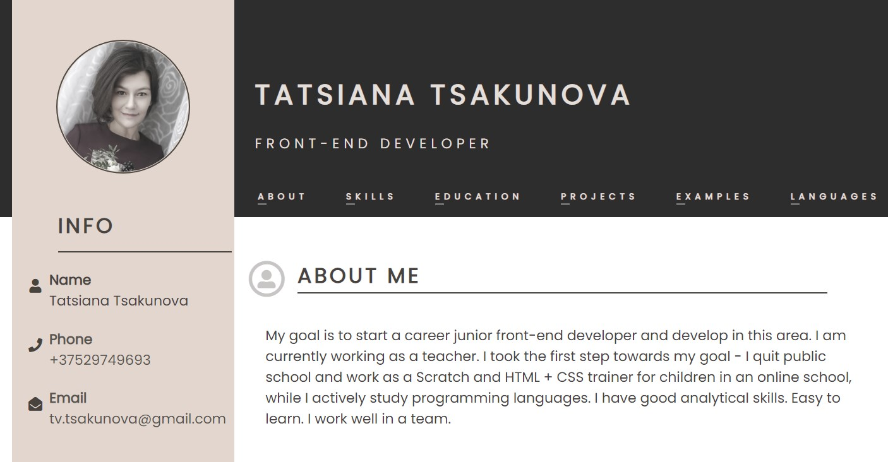

# CV

| Start task | Deadline task        | 
|------------|----------------------|
| 21.12.2021 | 03.01.2022 23:59 UTC |

## Описание проекта
CV (сurriculum vitae) - документ, в котором соискатель описывает своё образование и опыт работы. В отличие от резюме, которое редактируется под требования каждой конкретной вакансии, в CV отображаются все профессиональные достижения и навыки.  

## Задание
Вам необходимо создадить своё CV с использованием markdown разметки, а затем сверстать его используя html и css.

## Ключевые навыки:
- работа с Git и GitHub
- использование markdown разметки
- базовые навыки вёрстки
- использование [rs app](https://app.rs.school/) для сабмита и проверки тасков

## Этапы работы над проектом:
Задание состоит из трёх частей:
- CV#1. Markdown & Git - [Требования и критерии оценки](git-markdown.md)
- CV#2. HTML, CSS & Git Basics - [Требования и критерии оценки](html-css-git.md)
- CV#3. CV. Cross-Check - [Требования и критерии оценки](cv-stage0.md)

Продолжительность выполнения задания 2 недели  
Первая и вторая части задания проверяются автотестами.  
Третья часть задания проверяется в ходе кросс-чека.  

<kbd></kbd>

**Демо1**: [html & css вёрстка](https://kusakinvova.github.io/rsschool-cv/) / [markdown-разметка](https://kusakinvova.github.io/rsschool-cv/cv)  
**Демо2**: [html & css вёрстка](https://tsakunova.github.io/rsschool-cv/) / [markdown-разметка](https://tsakunova.github.io/rsschool-cv/cv)  

## Содержание CV:
Рекомендации EPAM HR department 
1. Имя и фамилия
2. Контакты для связи
3. Краткая информация о себе (ваша цель и приоритеты, подчеркните свои сильные стороны, расскажите о своём опыте работы, если опыта работы нет, расскажите о своём стремлении учиться и узнавать новое)
4. Навыки (языки программирования, фреймворки, методологии, системы контроля версий и инструменты разработки, которыми вы владеете)
5. Примеры кода
6. Опыт работы. Junior Dev может перечислить учебные проекты с указанием использованных навыков и ссылками на исходный код. 
7. Образование (включая пройденные курсы и тренинги)
8. Английский язык (уровень английского языка, если была языковая практика, расскажите о ней)

## Рекомендации к составлению CV:
- CV составляется на английском языке.
- при составлении CV рекомендуется указывать реальные данные
- в CV добавьте своё фото или аватарку. Фото предпочтительнее
- в CV укажите актуальные контакты для связи, в т.ч никнейм на дискорд-сервере rs school
- в качестве примера кода приведите решение задачи с сайта [Codewars](https://www.codewars.com/).  
Если решённых задач пока нет, подойдёт [задача](https://www.codewars.com/kata/50654ddff44f800200000004/train/javascript), которую нужно решить при регистрации на Codewars
- для выполненных проектов добавьте название проекта, ссылку на код проекта на гитхабе, перечень используемых технологий (html, css, js), ссылку на страницу проекта.  
Если выполненных проектов пока нет, в качестве первого проекта укажите само CV
- можно добавить к CV видеорезюме на английском языке. Продолжительность видео 3-5 минут (±15 секунд). В описание видео на YouTube добавьте ссылку на Google-документ с текстом видео на английском языке.  
Снять данное видео полезно, так как оно развивает ваши навыки самопрезентации и английского языка.  
В CV в формате markdown добавляется ссылка на видео, в html-документ видео встраивается.  
Этот пункт не оценивается.  

## Требования к репозиторию
- Задание выполняется в вашем личном публичном репозитории
- Название репозитория `rsschool-cv`

## Требования к коммитам
- История коммитов должна отображать процесс разработки приложения.
- [Названия коммитов дайте согласно гайдлайну](https://docs.rs.school/#/git-convention)

## Требования к Pull Request
- Название Pull Request дайте по названию задания
- [Описание Pull Request дайте по схеме](https://docs.rs.school/#/pull-request-review-process?id=Требования-к-pull-request-pr)  
- Мержить Pull Request из ветки разработки в ветку `main` не нужно

## Чтобы получить баллы за задание необходимо: 
- Выполнить задание
- Засабмитить задание т.е. отправить его на проверку \*  
- Если задание проверяется в ходе кросс-чека, проверить все присланные на проверку работы и засабмитить результаты проверки до дедлайна кросс-чека \**  
\* *Засабмитить задание можно только до дедлайна таска, после дедлайна сабмит недоступен*  
\** *Сабмит результатов кросс-чек проверки доступен и после дедлайна кросс-чека, но на оценки проверяющего  и проверяемых не влияет*

## Как сабмитить автопроверяемые задания
- Задания `Markdown & Git` и `HTML, CSS & Git Basics` проверяются автотестами  
- После окончания работы над заданием зайдите в rs app https://app.rs.school/, выберите **Auto-Test**, в выпадающем списке выберите название задания, нажмите кнопку **Submit**. Справа отобразится результат проверки.  
- До наступления дедлайна сабмитить задание можно сколько угодно раз, каждый следующий сабмит перезаписывает предыдущий.

## Как сабмитить задание CV. Cross-Check
- Задание `CV. Cross-Check` проверяется в ходе кросс-чека.  
- После выдачи задания, но до наступления дедлайна зайдите в rs app https://app.rs.school/, выберите **Cross-Check: Submit**, в выпадающем списке выберите название задания, в поле **Solution URL** добавьте ссылку на задеплоенную версию своего CV, нажмите кнопку **Submit**.  
- Засабмитить задание рекомендуется как можно раньше, как только в rs app появится такая возможность
- После сабмита задание можно продолжать выполнять до самого дедлайна.

## Проверка задания CV. Cross-Check
- инструкция по проведению cross-check: https://docs.rs.school/#/cross-check-flow