## Tips for Completing the CV Task - Simple Version

These tips are not part of the task. Follow them only if they help you.

If the [previous tips](./cv-hints.md) seemed a bit challenging for beginners, you can complete the first and second parts of the CV task using a simpler approach with the GitHub interface.

The advantage of this method is that you don't need to install any software. It also works all the time and can help you when you encounter issues with Git.

## Markdown & Git Task

Please review the requirements of the [Markdown & Git task](git-markdown.md) again and follow them step by step.

#### 1. Creating a Repository

1. Go to your GitHub account.
2. Click on the arrow next to your profile picture and select "New repository"

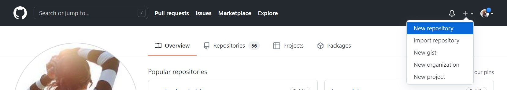

#### 2. Repository Settings

- Set the repository name to "rsschool-cv."
- Set the visibility option as "Public" (this is the default).
- Check the box that says "Add a README file"
- Click the "Create repository"

#### 3. Creating a Branch `gh-pages`

- Click on the arrow next to the branch name "main"
- Specify the name of the branch you want to create as "gh-pages"
- Click on the "Create branch: gh-pages from main" text.

We have created the "gh-pages" branch and switched to it. The README.md file from the "main" branch has also moved to this branch.

#### 4. Adding the `cv.md` File

You need to add the "cv.md" file to the "gh-pages" branch. You can do this in one of two ways:

1. Create the file directly in the GitHub repository.
2. Create the file on your computer and upload it to GitHub.

I prefer the second option because it allows you to upload not only files but also entire folders to GitHub.

Let's see how both options work.

In the repository, click the arrow next to the "Add file" button and choose one of the options: "Create new file" or "Upload files."

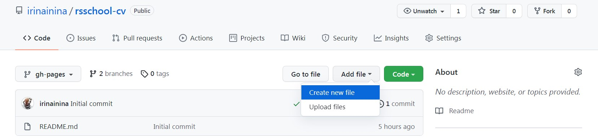

If you choose "Create new file," you will need to specify the name and the extension of the file you want to create, which is "cv.md," and add its content. Clicking on the "Preview" tab will allow you to see how the created file looks.

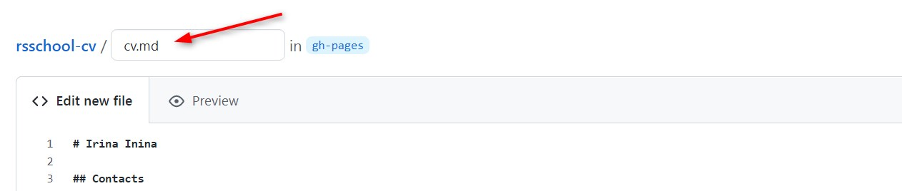

Before clicking the green "Commit new file" button, you should provide a commit name, for example, "feat: add cv.md file."

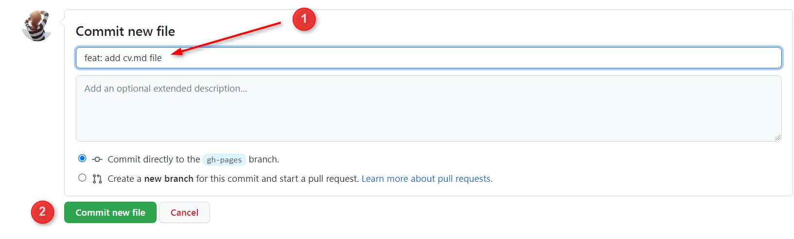

If you decide to click "Upload files," you will again have two options:

- Select a file from your computer.
- Drag and drop a file or folder with files from your computer into the file upload window.

Be attentive. Before clicking the green "Commit changes" button, you should provide a commit name, for example, "feat: add cv.md file."

#### 5. Commit Names

According to the task requirements, the "gh-pages" branch should have at least three commits, whose names start with one of the prefixes: "init:", "feat:", "fix:", "refactor:", "docs:". [Examples of commit names](https://docs.rs.school/#/en/git-convention?id=%d0%9f%d1%80%d0%b8%d0%bc%d0%b5%d1%80%d1%8b-%d0%b8%d0%bc%d0%b5%d0%bd-%d0%ba%d0%be%d0%bc%d0%bc%d0%b8%d1%82%d0%be%d0%b2).

After completing the previous step, you have made one commit. You need to make two more commits. To do this, you can click on the pencil icon next to the "cv.md" file and make some changes to it.

You can name this commit "feat: update cv.md file."

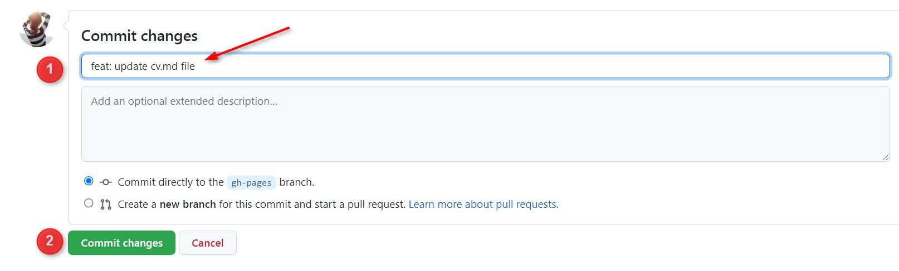

Create another commit in a similar manner.

The auto-test cannot read commit names, and it doesn't check the logic of their names. It only checks for the presence of a prefix. Adding commits with incorrect names is the most common mistake when completing this task. If you make this mistake, you will need to redo the task from the beginning. That means deleting the "rsschool-cv" repository, creating a new one with the same name, and completing the task again.

The reason for this is that GitHub doesn't have a convenient mechanism for renaming commits, and the existing one is much more complex than redoing the task from scratch.

#### 6. Link to CV in README.md

The project description in the README.md file is part of development culture, as mentioned earlier. This description should be sufficient to understand what the project is, what it is intended for, and how to run it. In this task, the minimum requirement is to add a link to your CV deployed on GitHub Pages to the README.md file in the "gh-pages" branch.

Deployment is the process of hosting a website or application on the internet. GitHub offers a simple and convenient deployment mechanism—simply place project files in the "gh-pages" branch. If there is an ".html" or ".md" file in the project's root, the project will be hosted on the internet.

The link to your CV in Markdown format should look like this: `https://GITHUB-USERNAME.github.io/rsschool-cv/cv`, where you need to replace "GITHUB-USERNAME" with your GitHub username. In my case, the link would be `https://irinainina.github.io/rsschool-cv/cv`.

Click on the "rsschool-cv" name at the top of the page to go to the main repository page.  
Select the "gh-pages" branch and click on its name to switch to the "gh-pages" branch of the repository.

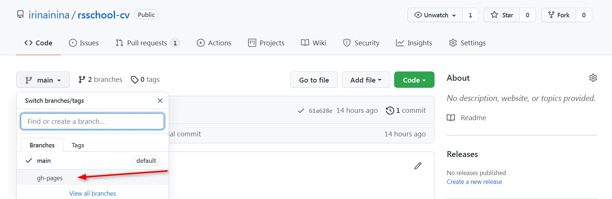

Make sure you are in the "gh-pages" branch, click on the pencil icon in the upper right corner of the README.md file, and add the link to your CV.

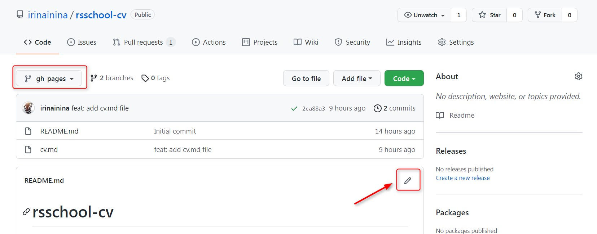

Be careful. Before clicking the "Commit change" button, provide a commit name, for example, "docs: add link to project."

#### 7. Create a Pull Request

You need to create a Pull Request with the title "Markdown & Git" from the "gh-pages" branch to the "main" branch.

To do this, click on the "Pull Request" tab at the top.

Then click on the green "New pull request" button on the right.

Specify that you are creating a Pull Request from the "gh-pages" branch to the "main" branch. Once done, the "Create pull request" button will become available. Click on it.

Give the Pull Request the title "Markdown & Git," add a description, and click the "Create pull request" button at the bottom.

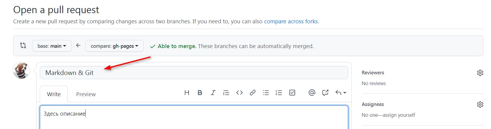

You don't need to click the "Merge pull request" button at this stage.

#### 8. Description of the Pull Request

During stage#0 to stage#1, Pull Request descriptions are not checked. The requirements for describing a Pull Request and maintaining a commit history are there to help you get accustomed to development culture from the very beginning.

In the requirements for the Pull Request description, it is mentioned that you should add a screenshot of your work. You can simply drag and drop the screenshot into the description box to add it.

Evaluate your work according to the requirements, marking all completed and uncompleted items.

#### 9. Submitting Your Work for Evaluation

Go to the following link: https://app.rs.school/
Select the "Auto-Test" tab.
Choose the assignment "CV#1. Markdown & Git"
Click the blue "Submit" button at the bottom.
The term "Submit" in this context means sending your assignment for evaluation.
To see the evaluation result, you may need to refresh the page.

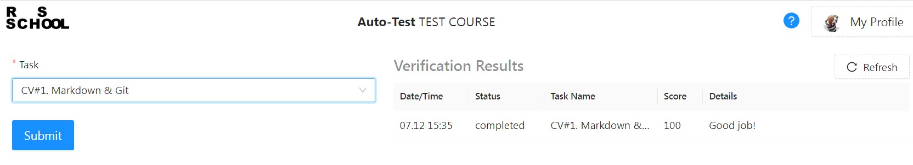

Congratulations! You have completed the first part of the assignment.

## HTML, CSS & Git Basics Task

Task description: [HTML, CSS & Git Basics](html-css-git.md)

#### 1. Create the Branch `rsschool-cv-html`

- Make sure you are in the "gh-pages" branch.
- Click on the arrow next to it.
- Specify the name of the branch you want to create as "rsschool-cv-html"
- Click on the "Create branch: rsschool-cv-html from gh-pages" text.

You have created the "rsschool-cv-html" branch and switched to it. All files from the "gh-pages" branch have been moved to this branch.

#### 2. Add the Files `index.html` and `style.css` to the `rsschool-cv-html` Branch

We have already covered two ways of adding files to the project. There is a small difference between them. GitHub allows you to create an empty file, but it won't let you upload an empty file. This is why it is recommended to add some content to the "index.html" and "style.css" files so that you can upload them to GitHub.

Be attentive when adding files and don't forget to provide commit names using the appropriate prefixes.

#### 3. Link to CV in README.md

Add the link `https://GITHUB-USERNAME.github.io/rsschool-cv/` to the README.md file in the "rsschool-cv-html" branch, where you should replace "GITHUB-USERNAME" with your GitHub username.

You don't necessarily have to manually compose this link; you can also find it in the settings or on the repository's page.

#### 4. Creating a Pull Request

We already have the "Compare & pull request" button that suggests creating a Pull Request. Click on it.

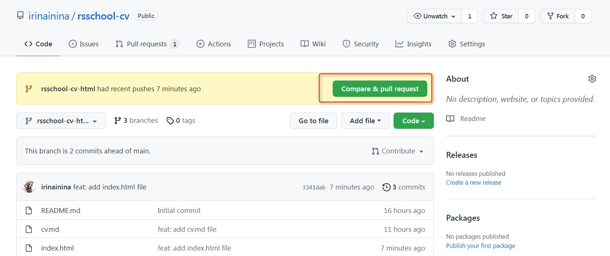

By default, GitHub suggests creating a Pull Request to the main branch of the repository. Specify that you want to create a Pull Request from the "rsschool-cv-html" branch to the "gh-pages" branch.

Give the Pull Request the title "HTML, CSS & Git Basics," add a description, and click the "Create pull request" button.

#### 5. Merging the Pull Request

To merge the Pull Request, click on the "Merge pull request" button, and then click "Confirm merge"

This will copy all files from the "rsschool-cv-html" branch to the "gh-pages" branch.

The Pull Request itself is closed but not deleted. You can see it in the "Closed" tab.

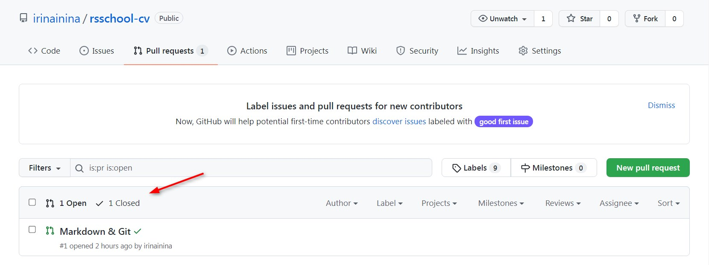

#### 6. Submitting Your Work for Evaluation

Go to the following link: https://app.rs.school/
Select the "Auto-Test" tab.
Choose the assignment "CV#2. HTML, CSS & Git Basics."
Click the blue "Submit" button at the bottom.

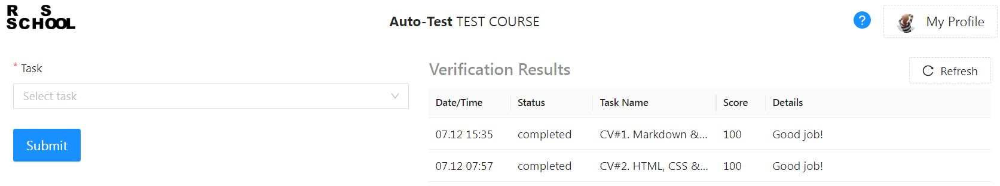
