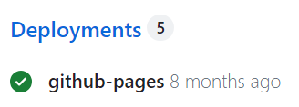
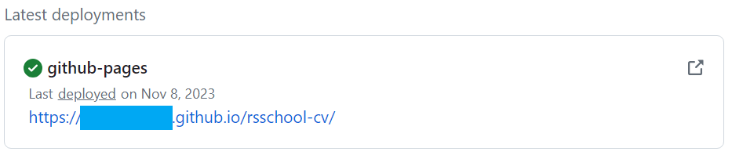

# CV#1. Markdown & Git

Your task is to create a repository according to the requirements, add your CV in markdown format to it, and deploy the CV in markdown format to GitHub Pages.

- [Task description and requirements](https://github.com/rolling-scopes-school/tasks/blob/master/tasks/cv/en/cv.md#%D1%81%D0%BE%D0%B4%D0%B5%D1%80%D0%B6%D0%B0%D0%BD%D0%B8%D0%B5-cv)
- [Tips for completing the task using VS Code](cv-hints.md)
- [Tips for completing the task using GitHub](cv-github-hints.md)

## Workflow

1. In your GitHub account, create a public repository with the name `rsschool-cv`. In the main branch of this repository (`main`), there should be only one file, `README.md`.
2. Create a branch `gh-pages` from the `main` branch.
3. During the work on the project, you need to make at least 3 commits in the `gh-pages` branch. According to the [commit guideline](https://docs.rs.school/#/en/git-convention), the name of each commit should start with one of the listed prefixes: `init:`, `feat:`, `fix:`, `refactor:`, `docs:`.
4. In the `gh-pages` branch, place the `cv.md` file.
5. Using the markdown language in the `cv.md` file, create your CV. The requirements for the CV content and recommendations for its preparation are listed in the [task description](cv.md#cv-contents).
6. In the `README.md` file of the `gh-pages` branch, add a link like `https://GITHUB-USERNAME.github.io/rsschool-cv/cv`, replacing `GITHUB-USERNAME` with your GitHub username. This link should open the CV page deployed on GitHub Pages.
7. Create a Pull Request from the `gh-pages` branch to the `main` branch. The title of the Pull Request should be `Markdown & Git`. Follow the [Pull Request description template](https://docs.rs.school/#/en/pull-request-review-process?id=Требования-к-pull-request-pr). Do not merge the Pull Request from the `gh-pages` branch to the `main` branch.

## Publishing the CV on `github-pages` (Deploy)

To find the link to your previously published CV (and add it to the third point of the Pull Request description):

- In your repository, on the right side, find the `Deployments` section (usually located in the lower right corner).
  
- Click on `github-pages` (next to green mark icon ✅), and in the opened window, click on the link in the `Latest deployments` section. This should open the website with your CV that you've created.
  
- The `gh-pages` service allows you to publish your content on the internet (making it public for anyone to see). It uses files with the `.md` extension as content. However, if there is a file with the `index.html` extension in the root of the repository, it will be used as the main page since it has higher priority than `.md` files.
- The first task (CV#1) is checked automatically. Our bot visits the repository's page and checks the correctness of commit prefixes, the number of commits (should be more than three), the title of the PR, and that its points are filled. Afterward, in the cross-check stage, the HTML/CSS task (CV#3) will be checked, which involves creating the CV using HTML/CSS.

## How to Submit the Assignment

- After completing the task, go to the [RS App](https://app.rs.school/), select **Auto-Test**, choose the task's name, click **Open task**, click **Submit task**.
  The results (score, accuracy, details) may not appear immediately and could take some time to process. If you see zeros and blanks after submitting, you can refresh the results page to update them.
- You can submit the assignment as many times as you like before the deadline, and each subsequent submission will overwrite the previous one.
- Note: If you encounter the error "Error: Temporary Github Error. Cannot get commits. Please try in 10 mins." when submitting, it means the system is overloaded and cannot retrieve information about your commits from GitHub (request limit reached). You don't need to fix anything; just try submitting the assignment again later, repeating your attempts until successful or until the deadline, whichever comes first.

## Grading Criteria

**Maximum score for the assignment +100**

- Requirements for the repository are met +50.
- Requirements for commits and Pull Request are met +50.

## Materials:

- [Working with Git](git.md).
- [Markdown Syntax Cheat Sheet [RU]](https://ydmitry.ru/blog/rukovodstvo-po-markdown-dlya-uproshcheniya-veb-razrabotki/).

## Examples of CVs in markdown format

- https://annavoloshina.github.io/rsschool-cv/cv
- https://kryvetski-andrei.github.io/rsschool-cv/cv
- https://nikita-resh.github.io/rsschool-cv/cv
- https://themrcrowley.github.io/rsschool-cv/cv
- https://elvinyeka.github.io/rsschool-cv/cv
