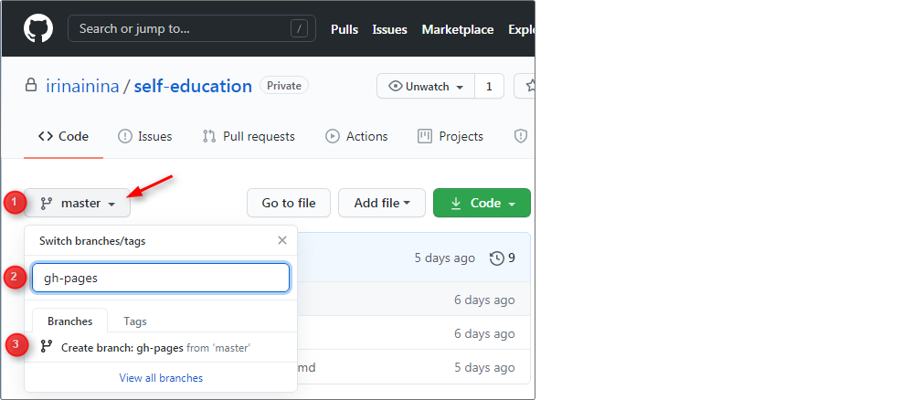
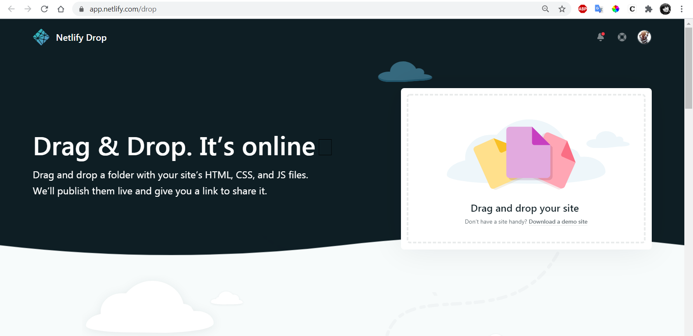

## Working with Git

At stage #0, you need to learn the basics of working with Git and GitHub. There is a list of actions with Git and GitHub below that you should be able to perform. If these are not challenging for you, you can proceed directly to the tasks. If you are just getting started with these topics, it is recommended not only to read the sequence of actions but also to do them yourself.

1. [Registering on GitHub](#1-registering-on-github)
2. [Creating a Repository](#2-creating-a-repository)
3. [Cloning a Repository to Your Computer](#3-cloning-a-repository-to-your-computer)
4. [Uploading Files to a Repository](#4-uploading-files-to-a-repository)
5. [Creating Branches](#5-creating-branches)
6. [Creating Pull Request](#6-creating-pull-request)
7. [Deploying to gh-pages](#7-deploying-to-gh-pages)
8. [Deploying to Netlify](#8-deploying-to-netlify)
9. [School Private Repository](#9-schools-private-repository)

## 1. Registering on GitHub

[GitHub](https://github.com/)  
Video: [Registering on GitHub](https://youtu.be/5DKVktUtH3A)

## 2. Creating a Repository

To create a repository, click on the "New repository" button at the top right.  
On the repository creation page [here](https://github.com/new), specify:

- Repository name
- Visibility settings (private or public)
- Check the box to create a README file  
  Video: [Creating a Repository on GitHub](https://youtu.be/CgFHLQBwj7A)

## 3. Cloning a Repository to Your Computer

The repository in the form of a folder on your computer is called a local repository.  
The repository uploaded to GitHub is called a remote repository.  
When you clone a repository from GitHub to your computer, you create a **local copy of the remote repository**.

Command to clone a repository:  
`git clone repository link`

For example, to clone the course tasks repository to your computer:  
`git clone https://github.com/rolling-scopes-school/tasks`

If you need to clone a specific branch of the repository to your computer, execute the command:  
`git clone repository link -b branch name`

## 4. Uploading Files to a Repository

You can upload files to a repository via GitHub's web interface or using Git. Let's look at both methods.

#### Uploading Files to a Repository via GitHub Interface

- Click the "Add file" button at the top right.
- Choose "Upload files."
- Drag and drop files and folders from your project into the window.

#### Uploading Files to a Repository via Git

- Clone the repository to your computer using the `git clone repository link`.
- Drag and drop files and folders into the repository folder.
- Stage the changes by executing `git add .` (with a period at the end).
- Commit the changes with `git commit -m "write what you changed"`.
- Push the files to the repository with `git push origin main`, where `main` is the branch name you're pushing to.

## 5. Creating Branches

The main branch of a repository is usually named `main` (formerly `master`).  
You can create other branches from it, and create branches from those branches, and so on.  
At the early stages of learning, all branches are created exclusively from the main branch.  
Before creating a new branch, make sure you are in the main branch of the repository.

### Creating Branches via GitHub Interface

1. Ensure you are in the main repository branch, `main` (or `master`).
2. Click on the triangle next to the branch name. Enter the branch name, e.g., `gh-pages`.
3. Click on the "Create branch: gh-pages from main" (or from `master`) line. You've created the `gh-pages` branch.

## Creating Branches via Git

- Clone the repository to your computer with the `git clone repository link`.
- While in the repository folder, open Git Bash and execute `git checkout -b gh-pages`. You've created the `gh-pages` branch.
- Note that when you create a branch, it copies all the files from the branch you created it from.

## 6. Creating Pull Request

During the RS School projects, you'll often create Pull Requests from a development branch to the main branch of your repository (`main` or `master`), or from a development branch to the `gh-pages` branch.

Pull Requests are created through the GitHub interface. Here's how:

- Select the development branch.
- Click on the "Pull Request" tab at the top left.
- Click the "Compare & pull request" button at the top right. This button appears if there are changes in the development branch compared to another branch, even an extra dot in the README file.
- Specify from which repository branch to which branch you are creating the Pull Request.
- Click the green "Create pull request" button. You've opened a Pull Request. Leave it as it is; it makes it convenient for the mentor to review the code.
- You can and should add a description to the Pull Request. [The Pull Request description should contain the following information](https://docs.rs.school/#/en/pull-request-review-process?id=Описание-pull-request-должно-содержать-следующую-информацию).
- You can add an image to the Pull Request description by simply dragging it from your computer.
- If you click the "Merge pull request" button, the Pull Request will be closed, and the files from the development branch will be moved to the branch you're merging into.

## 7. deploying to gh-pages

Deployment means hosting your project - a website or application - on the internet.

Let's assume our entire project - file index.html with content
`<h1>Hello world</h1>`

Upload it to the gh-pages branch of the remote repository (the repository should be public). You can upload the file to the repository either through GitHub or using Git (see section 4 [Uploading Files to the Repository](#4-uploading-files-to-a-repository)).

When uploading files via Git, execute the following commands sequentially:

> `git add .` > `git commit -m "feat: add file to gh-pages"` > `git push origin gh-pages`

When you create the gh-pages branch in a public repository, GitHub automatically hosts its content on the internet. In other words, if the repository is public, contains the gh-pages branch, and the index.html file is at the root of this branch, this file is already hosted on the internet. All that's left to do is to find the link to it.

Go to the repository settings (the gear icon with the inscription `Settings` in the upper right corner)

<kbd></kbd>

Scroll down to the GitHub Pages section. You will see a yellow bar with the inscription "Pages settings now has its own dedicated tab! Check it out here!". Click on the link and go to the GitHub Pages settings page.
If there is already a link to the created page highlighted in green, nothing else needs to be done, GitHub Pages is created. If not, wait a few minutes, GitHub Pages is not created instantly.

<kbd></kbd>

The link to GitHub Pages looks like this:
`https://github-name.github.io/repository-name`,
where you need to specify:
`github-name` - GitHub user nickname
`repository-name` - repository name

## 8. deploying to netlify

If you need to host a project created in a private repository on the internet, you can use the service [https://www.netlify.com/](https://www.netlify.com/). To do this, log in to Netlify, click the "New site from Git" button, and specify the repository on GitHub where your application is located.

Netlify also allows you to host an application whose code is located in a local folder on your computer. To do this, simply open the page [https://app.netlify.com/drop](https://app.netlify.com/drop) and drag the folder with the application code into the rectangle with the inscription "Drag and drop your site." Just like when deploying to GitHub Pages, deploying an application to Netlify is possible if the `index.html` file is at the top level of the project folder.

<kbd></kbd>

## 9. School's Private Repository

Most of the course assignments are done in the school's private repository.
To create such a repository, you need to go to [https://app.rs.school/](https://app.rs.school/), select `dashboard`, and click on the `Create repository` button.
An invitation to the school's repository will be sent to your email. Accept it, as the invitation will become invalid after a week. After that, a link to your repository will appear in the `dashboard` with the `Fix repository` button below it.

For new courses, a new private school repository is created.
When you move from the preschool course to the main set, you will need to create a new private school repository. Private school repositories are not deleted; you will have access to your work even after completing the course. You can move your work from the school repository to your personal one, but only after the task deadline.

Only you, mentors, and admins can see the private school repository. Other students cannot see it. Be careful when submitting links to your work for cross-checking. There is no point in sending a link to a private school repository or a PR in it; the reviewers will not see it. To check your work, you need to upload it to `gh-pages` and submit a link to the deployed version. Before submitting, check the deployment link, whether it opens in incognito mode of the browser, and whether the reviewers can see your work.

To complete each new task in the private school repository, create a new branch with the task name. In it, create a folder with the task name and place project files in it. It is important that the `index.html` file is at the root of the folder. After completing the work on the project, move this folder with project files to the `gh-pages` branch. Using the link
`https://rolling-scopes-school.github.io/repository-name/folder-name/`
you can open the deployed version of the application.

## Materials

- [How to Install Git and Work in the Console](https://youtu.be/dnrcpHcJyVo)
- [How to Create a Repository from Any Project](https://youtu.be/FTF1qTs6_LU)
- [What to Do If Things Go Wrong](https://youtu.be/sUKpPY9-tsA)
- [Why and How to Create Branches](https://youtu.be/9UwBPPw47Z4)
- [Git and GitHub Course for Beginners](https://youtu.be/zZBiln_2FhM)
