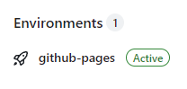

# CV#1. Markdown & Git

Ваша задача - оформить репозиторий согласно требованиям, добавить в него своё CV в формате markdown, задеплоить CV в формате markdown на GitHub Pages.

- [Описание и требования задания](https://github.com/rolling-scopes-school/tasks/blob/master/tasks/cv/cv.md#%D1%81%D0%BE%D0%B4%D0%B5%D1%80%D0%B6%D0%B0%D0%BD%D0%B8%D0%B5-cv)
- [Советы по выполнению задания с использованием VS Code](cv-hints.md)
- [Советы по выполнению задания с использованием GitHub](cv-github-hints.md)

## Порядок работы

1. В своём GitHub аккаунте создайте публичный репозиторий с названием `rsschool-cv`.
   В главной ветке данного репозитория (`main`) должен находиться только один файл `README.md`.
2. От ветки `main` создайте ветку `gh-pages`.
3. В процессе работы над проектом в ветку `gh-pages` необходимо сделать не меньше 3-х коммитов. Согласно [гайдлайну](https://docs.rs.school/#/git-convention) название каждого коммита должно начинаться с одного из перечисленных префиксов: `init:`, `feat: `, `fix: `, `refactor: `, `docs:`.
4. В ветке `gh-pages` разместите файл `cv.md`.
5. Используя markdown-разметку в файле `cv.md` создайте своё CV.  
   Требования к содержанию CV и рекомендации к его составлению перечислены в [описании задания](cv.md#содержание-cv).
6. В файл `README.md` ветки `gh-pages` добавьте ссылку вида `https://GITHUB-USERNAME.github.io/rsschool-cv/cv`, в которой вместо `GITHUB-USERNAME` укажите свой никнейм на сайте GitHub. По этой ссылке должна открываться страница CV, задеплоенная на GitHub Pages.
7. Создайте Pull Request из ветки `gh-pages` в ветку `main`.  
   Название Pull Request `Markdown & Git`  
   [Описание Pull Request дайте по схеме](https://docs.rs.school/#/pull-request-review-process?id=Требования-к-pull-request-pr).  
   Мержить Pull Request из ветки `gh-pages` в ветку `main` не нужно.

## Публикация резюме на `github-pages` (Deploy)

Для того чтобы найти ссылку на опубликованное ранее вами резюме (и добавить её в третий пункт описания пулл реквеста):

- находясь в своём репозитории, в правой части найдите блок `Deployments` (как правило, он располагается в нижнем углу);
  
- нажмите на `github-pages` (около галочки ✅) и в открывшемся окне нажмите на ссылку в блоке `Latest deployments`. При этом должен будет открыться сайт со сверстанным вами резюме;
  
- сервис `gh-pages` позволяет вам публиковать ваш контент в интернете (т.е он становится публичным, и кто угодно может его увидеть). В качестве контента в данном случае используются файлы с расширением `.md`, однако, если в корне репозитория есть файл с расширением `index.html` то он будет использоваться в качестве главной страницы поскольку имеет более высокий приоритет по сравнению с `.md` файлами;
- первое задание (CV#1) проверяется автоматически - для этого наш бот переходит на страницу репозитория и проверяет корректность префиксов коммитов, их количество (должно быть больше трёх), название PR и что его пункты заполнены. Далее через неделю, на этапе кросс-чека будет проверяться вёрстка задания (CV#3), выполненное с помощью html/css. _Примечание:_ в третьем пункте пулл реквеста можно указать ссылку на уже сверстанное резюме (с помощью HTML/CSS);
- [Deploy to GitHub Pages](https://www.youtube.com/watch?v=0lvKcqP3aP0)

## Как сабмитить задание

- После окончания работы над заданием зайдите в rs app https://app.rs.school/, выберите **Auto-Test**, в выпадающем списке выберите название задания, нажмите кнопку **Submit**. Справа отобразится результат проверки.
  Результат (score, accuracy, details) может отобразиться не сразу (время обработки). Если после сабмита стоят нули и пропуски - можно обновить страницу с результатами (кнопкой refresh).
- До наступления дедлайна сабмитить задание можно сколько угодно раз, каждый следующий сабмит перезаписывает предыдущий.
- NB! Если при сабмите появляется ошибка "Error: Temporary Github Error. Cannot get commits. Please try in 10 mins." Это значит, что система перегружена и не может получить информацию о ваших коммитах с GitHub (достигнут лимит запросов). Не нужно исправлять работу, нужно попробовать засабмитить задание чуть позже и повторять попытки до успешной загрузки или дедлайна, что наступит ранее.

## Критерии оценки

**Максимальный балл за задание +100**

- выполнены требования к репозиторию +50;
- выполнены требования к коммитам и Pull Request +50.

## Материалы:

- [Работа с Git](git.md).
- [Шпаргалка по синтаксису Markdown](https://ydmitry.ru/blog/rukovodstvo-po-markdown-dlya-uproshcheniya-veb-razrabotki/).

## Примеры CV в формате markdown

- https://annavoloshina.github.io/rsschool-cv/cv
- https://kryvetski-andrei.github.io/rsschool-cv/cv
- https://nikita-resh.github.io/rsschool-cv/cv
- https://themrcrowley.github.io/rsschool-cv/cv
- https://elvinyeka.github.io/rsschool-cv/cv
