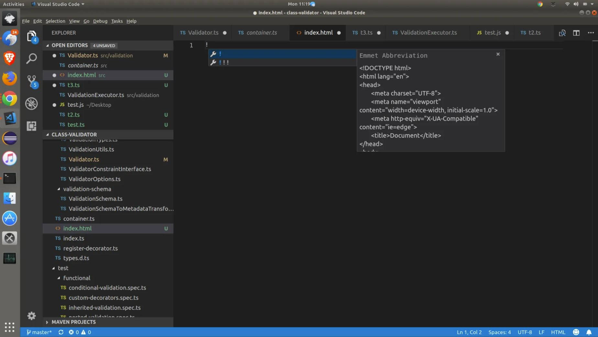
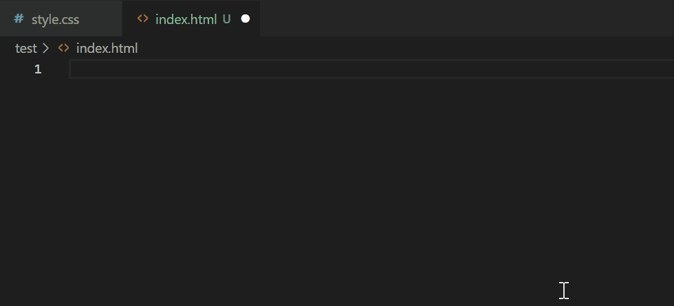

# CV#2. HTML, CSS & Git Basics

Ваша задача - в репозитории `rsschool-cv` от ветки `gh-pages` создать ветку `rsschool-cv-html`, добавить в неё файлы `index.html` и `style.css` которые содержат базовые пустые шаблоны или шаблоны с минимальным содержанием (вёрстка и стилизация CV будет выполняться в следующем задании), задеплоить их на GitHub Pages.

- [Описание и требования задания](cv.md)
- [Советы по выполнению задания с использованием VS Code](cv-hints.md)
- [Советы по выполнению задания с использованием GitHub](cv-github-hints.md)
  Советы не являются частью задания. Следуйте советам только в той мере, в которой они могут вам помочь.

Некоторые из правил валидации:

- не допускается наличие лишних пробелов в конце строк;
- не допускается наличие закрывающего тега или закрывающего слеша у непарного тега;
- если используются символы `<`, `>`, `&` и др., то они должны быть заменены на escape-последовательности.

Все ошибки которые нашел валидатор в ходе проверки вашей работы указаны в разделе `Details` таблицы с результатами.

## Порядок работы

1. Работу ведёте в репозитории `rsschool-cv`, созданном при выполнении предыдущего задания [Markdown & Git](git-markdown.md)
2. От ветки `gh-pages` создайте ветку `rsschool-cv-html`
3. В процессе работы над проектом ведите историю коммитов. Следуйте [гайдлайну](https://docs.rs.school/#/git-convention), согласно которому название каждого коммита должно начинаться с одного из перечисленных префиксов `init:`, `feat: `, `fix: `, `refactor: `, `docs:`.
4. В ветке `rsschool-cv-html` разместите файлы `index.html` и `style.css`, предварительно добавив в них базовые пустые шаблоны или шаблоны с минимальным содержанием.
   Вёрстка и стилизация CV будет выполняться в следующем задании.
5. В файл `README.md` ветки `rsschool-cv-html` добавьте ссылку `https://GITHUB-USERNAME.github.io/rsschool-cv/` в которой вместо `GITHUB-USERNAME` укажите свой никнейм на сайте GitHub.
   По этой ссылке будет открываться страницы CV в виде свёрстанной страницы.
   Саму вёрстку добавим в ходе выполнения следующего задания
6. Создайте Pull Request из ветки `rsschool-cv-html` в ветку `gh-pages`
   Название Pull Request `HTML, CSS & Git Basics`
   [Описание Pull Request дайте по схеме](https://docs.rs.school/#/pull-request-review-process?id=Требования-к-pull-request-pr).
   Замержите Pull Request из ветки `rsschool-cv-html` в ветку `gh-pages`

## Как сабмитить задание

- После окончания работы над заданием зайдите в rs app https://app.rs.school/, выберите **Auto-Test**, в выпадающем списке выберите название задания, нажмите кнопку **Submit**. Справа отобразится результат проверки.
- До наступления дедлайна сабмитить задание можно сколько угодно раз, каждый следующий сабмит перезаписывает предыдущий.
- NB! Если при сабмите появляется ошибка "Error: Temporary Github Error. Cannot get commits. Please try in 10 mins." это значит, что система перегружена и не может получить информацию о ваших коммитах с GitHub. Не нужно исправлять работу, нужно попробовать засабмитить задание чуть позже и повторять попытки до успешной загрузки или дедлайна, что наступит ранее.

## Критерии оценки

**Максимальный балл за задание +100**

- выполнены требования к репозиторию +50
- выполнены требования к коммитам и Pull Request +50

## Материалы:

- [Работа с Git](git.md)
- [Базовый шаблон HTML](https://www.w3schools.com/html/)

**NB** In the example above html tag missing lang attribute, which is necessary to pass the cv auto-test.

**hint** You can get basic html layout by typing ! sign at the very top of newly created empty html file and pressing Enter.

click to see the demo pic

Create an empty index.html document. Place the cursor inside the html editor content and type ! . You will get content selection dialog that looks like this:

click to see the demo gif

**Additionally** You can use any basic html template by your wish by googling it.

- [Escape-последовательности](https://www.lexium.ru/2009/05/343/)
