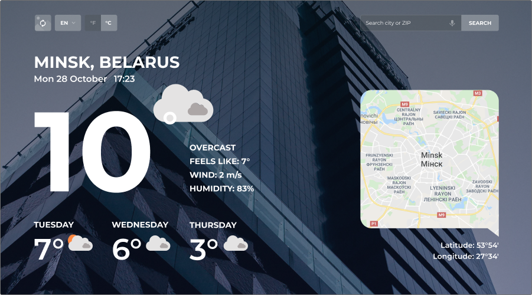

| Deadline         | Folder name   | Branch name   |
| ---------------- | ------------- | ------------- |
| 31.05.2020 23:59 | fancy-weather | fancy-weather |

# fancy-weather

## Задание

Вам необходимо создать приложение - прогноз погоды

### Структура приложения

Приложение состоит из четырёх функциональных блоков.

- Блок контроля
- Погода за сегодня
- Прогноз погоды на три дня
- Геолокационные данные

Макет приложения:

[Макет в Figma](https://www.figma.com/file/3aQwTNcZWg5CTuvlQ1t5MQ/fancy-weather?node-id=0%3A1)

_В предложенный макет можно вносить свои изменения с целью его улучшения, не удаляя и не упрощая представленные на макете элементы дизайна_

### Примеры работ

- https://deadline2020-fancy-weather.netlify.com/
- https://fancy-weather-lhk.surge.sh/
- https://my-fancy-weather.netlify.com/

### Описание функциональных блоков

**1. Блок контроля**

- кнопка для переключения фонового изображения
- кнопка для переключения языка (en/ru/be)
- кнопка для переключения единиц измерения температуры (°C/°F)
- строка поиска

**2. Погода за сегодня**

- название населённого пункта, название страны
- текущая дата: день недели в коротком формате, число, месяц. Например: Сб 26 октября
- время: часы, минуты, секунды. Например: 17:23:12. Обновляется раз в секунду
- температура в текущий промежуток времени
- описание погоды (summary), ощущаемая температура (apparent temperature), скорость ветра(м/с), влажность(%)
- иконка погоды

**3. Прогноз погоды на три дня**

- день недели в полном формате
- средняя температура
- иконка погоды

**4. Геолокационные данные**

- координаты населённого пункта: долгота и широта (в градусах и минутах)
- карта местности

## Работа приложения

- Когда пользователь открывает приложение, все данные на странице относятся к текущему местоположению пользователя
- В строке поиска осуществляется поиск по населённому пункту
- Фоновое изображение изменяется при обновлении содержания страницы или при клике по кнопке для переключения фонового изображения в блоке контроля
- Настройки при первом запуске приложения: язык – английский, единицы измерения температуры – градусы Цельсия:
  - переключатель языка изменяет язык отображения текста страницы (en/ru/be).
  - переключатель температуры изменяет единицы измерения температуры (°C/°F).
  - пользовательские настройки языка и температуры сохраняются в local storage.
- Голосовое управление:
  - рекомендуемые кодовые фразы:
    - озвучить прогноз погоды: "weather", "forecast"
    - увеличение громкости: "louder"
    - уменьшение громкости: "quieter"
  - допустимо реализовать по одной фразе для каждого элемента управления
  - в случае использования других фраз, используемые комбинации необходимо указать доступном проверяющему месте

## Технические требования

- приложение корректно работает в последней версии Chrome
- можно использовать css-препроцессоры, bootstrap, material design, lodash.js
- разрешается использовать jQuery или другие JS библиолеки только в качесте подключаемой зависимости для UI библиотек. Использование jQuery и JS библиотек в основном коде приложения не допускается
- использование Angular / React / Vue допускается только по личной договорённости с ментором

## Критерии оценки:

**Максимальный балл за задание: 250 баллов при кросс-чеке / 300 баллов при проверке ментором**

### Basic scope +80

- вёрстка, дизайн, UI **30 баллов**
  - минимальная ширина страницы, при которой она отображается корректно – 320 рх. Все указанные в задании элементы присутствуют как на десктопной, так и на мобильной версии +10
  - приложение корректно отображается для любого выбранного языка, единиц измерения температуры, указанного в поиске населённого пункта +10
  - внешний вид приложения внешне соответствует макету или является его улучшенной версией +10
- В блоке "Погода за сегодня" корректно отображаются данные, относящиеся к текущему местоположению пользователя – **20 баллов**
  - данные о погоде и местоположении пользователя - +10
  - дата в указанном в описании задания формате, часы, обновляющие время каждую секунду +10
- В блоке "Прогноз погоды на три дня" корректно отображаются данные, относящиеся к текущему местоположению пользователя – **10 баллов**
- В блоке "Геолокационные данные" корректно отображаются данные, относящиеся к текущему местоположению пользователя – **20 баллов**
  - карта с маской (форма карты отличная от прямоугольной) и маркером населённого пункта +10
  - координаты в градусах и минутах +10

### Advanced scope +80/+130

- Реализован поиск. Если в поиске вводится корректный запрос, по которому каждый из использованных API возвращает результат. Все данные на странице, в том числе дата и время, обновляются в соответствии с указанным в поиске населённым пунктом – **50 баллов**
  - поиск работает как при нажатии на клавишу Enter в поле поиска, так и при клике на кнопку Поиск +5
  - поиск корректно работает для разных населённых пунктов - больших и маленьких, столиц и посёлков +10
  - при вводе в поле поиска некорректных запросов, по которому API возвращает ошибку, приложение не ломается, выводится уведомление об ошибке. Возникающие ошибки в работе с API (прерывание соединения в ходе запроса, возвращаемые ошибки от API типа 4xx, 5xx) также обрабатываются клиентом и выводятся в область уведомления об ошибке +10
  - дата и время указываются для того часового пояса, в котором находится указанный в поле поиска населённый пункт +10
  - если у координаты есть знак минус, он тоже выводится, или возле координаты выводится буква, обозначающая широту (северная (N), южная (S)) и долготу (восточная (E), западная (W)) +5
  - одновременное обновление всех элементов страницы при вводе нового населенного пункта после получения успешного ответа по каждому из запросов (название по локации приходит быстро, а погода, иконки ее и т.п. - медленно). В случае возникновения ошибки по одному из запросов данные не обновляются +10
- При обновлении страницы или клике на кнопку для переключения фонового изображения меняется фоновое изображение – **20 баллов**
  - фоновое изображение генерируется с учётом поры года и времени суток указанного в поле поиска населённого пункта (по желанию можно добавлять и другие параметры поиска). Если возникла ошибка в ходе получения картинки, использовать любое стандартное фоновое изображение. Так как API для картинок не всегда возвращает правильный результат, данные о параметрах запроса фонового изображения для удобства в ходе проверки ментором или в процессе кросс чека выведите в консоль +10
  - плавная смена фонового изображения, изображение сначала загружается и только потом меняется, у изображения есть полупрозрачный оверлей или используется другой способ, обеспечивающий чёткость и контрастность надписей +10
- Переключение единиц измерения температуры – **10 баллов**
  - при смене шкалы отображения температур происходит пересчёт температур в соответствии с выбранной шкалой и меняется отображение активной кнопки, позволяющей определить, какая шкала сейчас активна. При перезагрузке страницы сохраняется выбранная пользователем шкала отображения температур +10
- Выполнены требования к коду – **30 баллов** (оценивает только ментор)
  - js код разбит на модули +10
  - используется webpack +10
  - используются editorconfig, eslint, eslint-config-airbnb-base, babel +10
- Реализованы юнит-тесты, использующие различные [методы jest](https://jestjs.io/docs/ru/expect) – 2 балла за каждую покрытую функию/метод, но не больше **20 баллов** (процент покрытия каждой функции/метода не учитывается) (оценивает только ментор)

### Hacker scope +90

- Реализовано голосовое управление/уведомление - **40 баллов**
  - есть возможность включения/ выключения микрофона по клику, есть индикация активного и неактивного состояния микрофона +5
  - Голосовой поиск по названию населённого пункта
    - после того, как название населённого пункта произнесено, поиск срабатывает автоматически, без необходимости кликать на кнопку +10
    - поиск ведётся на языке отображения страницы, если срабатывает поиск и на другом языке тоже, это не является ошибкой +5
  - Голосовое уведомление о погоде на сегодня
    - при клике по кнопке проигрывания звука есть возможность прослушать звуковое уведомление о прогнозе погоды +5
    - голосовое уведомление о прогнозе погоды можно запустить произнеся кодовую фразу. +5
    - голосом можно регулировать громкость уведомления +5
    - кодовые фразы управления громкостью не запускают поиск по названию населенного пункта +5
- Перевод текста страницы (en/ru/be) – **30 баллов**
  - переводится весь текст страницы. Не является ошибкой отсутствие перевода карты +10
  - название населённого пункта и страны всегда отображается на выбранном языке +10
  - перевод на текущий выбранный язык названий дней недели и месяцев +5
  - при перезагрузке страницы сохраняется выбранный пользователем язык +5
- Бонусные баллы за качество приложения – **20 баллов**
  - оригинальный интересный качественный дизайн приложения, иконки погоды и кнопки анимированы, для анимации используются ключевые кадры или svg-анимация +10
  - продуман и реализован не предусмотренный заданием дополнительный функционал +10

### Штрафные баллы

- используются ключи доступа к API указанные в задании, а не свои личные – **10 баллов** (оценивает только ментор)
- меньше 5 коммитов, ошибки в названиях коммитов, ошибки в pull request - **10 баллов** (оценивает только ментор)
- присутствуют ошибки в консоли, связанные с исполняемым кодом (ошибки типа favicon.ico: Failed to load resource: the server responded with a status of 404 или ошибки, связанные с запросами к API, не учитываются) или предупреждения eslint-config-airbnb-base: **-15 баллов** (оценивает только ментор)

### Cross-check

- инструкция по проведению cross-check: https://docs.rs.school/#/cross-check-flow
- форма для проверки задания https://cross-check-fancy-weather.netlify.com/

### Ключевые навыки

- работа с API
- получение данных при помощи асинхронных запросов
- дата и время

<details> 
  <summary>Примеры асинхронных запросов</summary>
  
  <p></p>
  
  JS-код для получения ссылки на изображение (ссылка выводится в консоль)
  
  - при помощи fetch
  
 ``` javascript 
  function getLinkToImage() {
  const url = 'https://api.unsplash.com/photos/random?query=morning&client_id=e2077ad31a806c894c460aec8f81bc2af4d09c4f8104ae3177bb809faf0eac17';
  fetch(url)
    .then(res => res.json())
    .then(data => {
      console.log(data.urls.regular)
    });
  }
``` 
  - при помощи async/await
  
 ``` javascript 
  async function getLinkToImage() {
    const url = 'https://api.unsplash.com/photos/random?query=morning&client_id=e2077ad31a806c894c460aec8f81bc2af4d09c4f8104ae3177bb809faf0eac17';
    const res = await fetch(url);
    const data = await res.json();
    console.log(data.urls.regular)
  }
```

</details>

<details> 
  <summary>Материалы</summary>
  
- **Асинхронные запросы, fetch/async/await**
  - [Асинхронные запросы. Использование Fetch](https://developer.mozilla.org/ru/docs/Web/API/Fetch_API/Using_Fetch)
  - [Асинхронные функции (async/await)](https://youtu.be/5kAPExqSZ1I)
  - [JavaScript Fetch API and using Async/Await](https://dev.to/shoupn/javascript-fetch-api-and-using-asyncawait-47mp)

- **Дата и время**

  - [Date](https://developer.mozilla.org/ru/docs/Web/JavaScript/Reference/Global_Objects/Date)
  - [Date.prototype.toLocaleString](https://developer.mozilla.org/ru/docs/Web/JavaScript/Reference/Global_Objects/Date/toLocaleString)

- **Распознавание голоса в браузере**

  - [SpeechRecognition](https://developer.mozilla.org/ru/docs/Web/API/SpeechRecognition)
  - [JavaScript Speech Recognition](https://www.youtube.com/watch?v=0mJC0A72Fnw)
  - [SpeechSynthesis](https://developer.mozilla.org/en-US/docs/Web/API/SpeechSynthesis)
  - [JavaScript Text-To-Speech](https://www.youtube.com/watch?v=saCpKH_xdgs)

- **API погоды**
  - [React-приложение Прогноз погоды на 5 дней](https://medium.com/@leizl.samano/how-to-make-a-weather-app-using-react-403c88252deb)
  - [React-приложение Прогноз погоды](https://tproger.ru/translations/react-basic-weather-app/)
- **Тестирование. Юнит-тесты. Jest**
  - [Testing](https://youtu.be/xrS60rkoG3w)
  - [Testing live coding](https://youtu.be/qFSrImO04X8)
  - [Jest. Unit Тестирование в JavaScript](https://youtu.be/IEDe8jl5efU)
- **Советы по качеству кода**

  - [Магические числа](https://ru.code-basics.com/languages/javascript/modules/variables/lessons/magic-numbers)
  - [Как писать чистый код: обзор лучших практик JavaScript](https://techrocks.ru/2019/08/27/writing-clean-code-in-javascript/)
  - [Рекомендации по написанию чистого кода на JavaScript](https://habr.com/ru/company/ruvds/blog/454520/)

- **Иконки погоды**
  - [Animated SVG Weather Icons](https://codepen.io/atiyahaider/pen/XwmPxq?editors=1100)
  - [Animated Weather Icons](https://codepen.io/irinainina/pen/ZEYORmy)
  - [Free animated SVG weather icons](https://www.amcharts.com/free-animated-svg-weather-icons/)
  - [Free to use animated weather icons](https://github.com/basmilius/weather-icons/tree/master/design/fill/animation-ready)
  - [Иконки макета в Figma](https://wxeka.mrmarkel.com/pws/css/icons/)
  - [owfont - symbol font for Open Weather Map API](https://websygen.github.io/owfont/)
  - [ClimaCell-API weather icons](https://github.com/ClimaCell-API/weather-code-icons)
  </details>

<details> 
  <summary>API с примерами подключения</summary>

<p></p>

**1. Geolocation API**

- [IP2Location.io](https://www.ip2location.io/)
  - получаем данные о местоположении пользователя  
    `https://api.ip2location.io/`
  - [API Docs](http://www.ip2location.io/ip2location-documentation)
- https://ipinfo.io/
  - регистрируемся на сайте
  - получаем токен
  - получаем данные о местоположении пользователя  
    `https://ipinfo.io/json?token=eb5b90bb77d46a`
  - [API Docs](https://ipinfo.io/developers)
- [Geolocation API](https://developer.mozilla.org/ru/docs/Web/API/Geolocation/getCurrentPosition)

**2. Weather API**  
OpenWeatherMap, Weatherbit, AccuWeather, Weather2020 и др.

- https://openweathermap.org/
  - регистрируемся на сайте
  - получаем API Key  
    `https://home.openweathermap.org/api_keys`
  - получаем данные о погоде на ближайшие пять дней  
    `https://api.openweathermap.org/data/2.5/forecast?q=Kiev&lang=ua&units=metric&APPID=a9a3a62789de80865407c0452e9d1c27`
  - [API Docs](https://openweathermap.org/api)
- https://www.weatherbit.io (500 запросов/сутки)
  - регистрируемся на сайте
    `https://www.weatherbit.io/account/create`
  - входим в личный кабинет
    `https://www.weatherbit.io/account/login`
  - выбираем план Free
  - копируем API key со вкладки API Keys / Admin
  - получаем данные о погоде на ближайшие три дня  
    `https://api.weatherbit.io/v2.0/forecast/daily?city=Moscow&country=RU&days=3&units=S&lang=be&key=619b6dd131094859b162bb2577321b2a`
  - [API Docs](https://www.weatherbit.io/api)
- https://www.weatherapi.com (20000 запросов/месяц)
  - регистрируемся на сайте
    `https://www.weatherapi.com/signup.aspx`
  - подтверждаем email (переходим по ссылке, которая пришла на почту)
  - входим в личный кабинет
    `https://www.weatherapi.com/login.aspx`
  - копируем API key
  - получаем данные о погоде на ближайшие три дня
    `https://api.weatherapi.com/v1/forecast.json?key=363474e96d194f10ab9212718201105&q=Moscow&days=3`
  - [API Docs](https://www.weatherapi.com/docs/)
- https://www.climacell.co/ (1000 запросов/сутки)
  - регистрируемся на сайте
    `https://developer.climacell.co/sign-up`
  - подтверждаем email (переходим по ссылке, которая пришла на почту)
  - входим в личный кабинет
    `https://developer.climacell.co/sign-in`
  - копируем API key
  - получаем данные о погоде на ближайшие дни
    `https://api.climacell.co/v3/weather/forecast/daily?lat=55.7522&lon=37.6156&unit_system=si&start_time=now&fields=feels_like%2Ctemp%2Chumidity%2Cwind_speed%2Cweather_code&apikey=rh8L0roTYDgi9hvbGsd6X3cu5rRWiV05`
  - [API Docs](https://developer.climacell.co/v3/docs)

**3. Images API**

- https://unsplash.com/developers
  - регистрируемся на сайте
  - подтверждаем email (переходим по ссылке, которая пришла на почту)
  - создаём приложение  
    `https://unsplash.com/oauth/applications`
  - получаем Access Key
  - получаем фото для фона, которое меняется при каждом обновлении страницы  
    `https://api.unsplash.com/photos/random?orientation=landscape&per_page=1&query=nature&client_id=e2077ad31a806c894c460aec8f81bc2af4d09c4f8104ae3177bb809faf0eac17`
  - у данного сервиса есть лимит - 50 изображений в час
  - [API Docs](https://unsplash.com/documentation)
- https://www.flickr.com/services/ - регистрируемся на сайте - подтверждаем email (переходим по ссылке, которая пришла на почту) - создаём приложение `https://www.flickr.com/services/apps/create/apply/` - получаем API Key - получаем список фото `https://www.flickr.com/services/rest/?method=flickr.photos.search&api_key=0f15ff623f1198a1f7f52550f8c36057&tags=nature,spring,morning&tag_mode=all&extras=url_h&format=json&nojsoncallback=1` - [API Docs](https://www.flickr.com/services/api/) - [The Flickr
  Developer Guide](https://www.flickr.com/services/developer/api/) - Still have questions? Check out [code.flickr.com](https://code.flickr.net/) or the [FAQs](https://help.flickr.com/)! - демонстрационный пример работы с API Flickr [demo](https://flickr-api-test.netlify.com/)
  _Внимание_ у Flickr огромный и не всегда очевидный в работе api, выбирая Flickr, будьте осторожны и терпеливы

**4. Maps API**  
Google Maps API, API Яндекс Карт, MapBox, OpenStreetMap и др.

- https://www.mapbox.com
  - регистрируемся на сайте  
    `https://account.mapbox.com/auth/signup/`
  - подтверждаем email (переходим по ссылке, которая пришла на почту)
  - получаем Access token  
    `https://account.mapbox.com/`
  - выбираем понравившийся дизайн  
    `https://docs.mapbox.com/mapbox-gl-js/examples/`
  - [API Docs](https://docs.mapbox.com/api/maps/)

**5. Geocoding API**  
Google Geocoding, Яндекс.Карты Геокодирование, Nominatim OpenStreetMap, Data Science Toolkit, Gisgraphy, OpenCage Geocoder и др.

- https://opencagedata.com/
  - регистрируемся на сайте
  - получаем API key
  - получаем координаты по названию населённого пункта  
    `https://api.opencagedata.com/geocode/v1/json?q=Minsk&key=c6b6da0f80f24b299e08ee1075f81aa5&pretty=1&no_annotations=1`
  - [API Docs](https://opencagedata.com/api)
    </details>

## Документ для вопросов

- документ для вопросов, связанных с выполнением задания: [ссылка](https://docs.google.com/spreadsheets/d/18BviVQSPjlrkByibrf7dg1ZXhNID66PBhrblXyNMFy8/edit#gid=0)
- ссылки на лучшие работы добавьте, пожалуйста, в эту форму: [ссылка](https://forms.gle/Fp3Bv4gdKXwV1FEG7)
