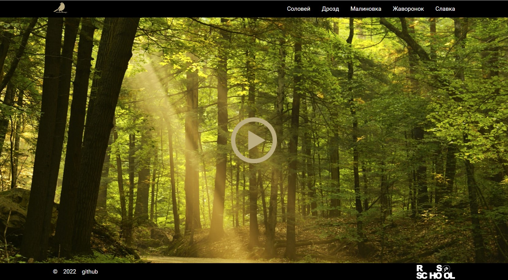

## js30#1.1-eco-sounds

| Start task | Deadline task        | Start cross-check | Deadline cross-check | Branch name | Folder name |
| ---------- | -------------------- | ----------------- | -------------------- | ----------- | ----------- |
| 01.02.2022 | 07.02.2022 23:59 UTC | 08.02.2022        | 10.02.2022 23:59 UTC | eco-sounds  | eco-sounds  |

## Описание проекта

Когда-то был в интернете сайт, на каждой странице которого отображались удивительной красоты пейзажи и проигрывалась своя уникальная мелодия, в которую вплеталось пение птиц. Сейчас этого сайта уже нет, осталась только его [копия в веб-архиве](https://web.archive.org/web/20150826214643/http://ornitoterapiya.ru/solo/solovey.html).  
Попробуем его восстановить.

## Задача

Вам необходимо создать приложение в котором при кликах по интерактивным элементам можно переключать изображение и звук.

[Описание и требования задания](js30.md)

<kbd></kbd>

[Демо](https://eco-sounds.netlify.app/)  
[Советы по выполнению задания](js30-media-hints.md)  
[Папка assets с медиафайлами](https://github.com/rolling-scopes-school/file-storage/tree/eco-sounds)

## Требования

1. Вёрстка +10
   - есть не меньше пяти интерактивных элементов, с которыми пользователи могут взаимодействовать. Изменение внешнего вида самого элемента и состояния курсора при наведении, плавные анимации +5
   - в футере приложения есть ссылка на гитхаб автора приложения, год создания приложения, [логотип курса](https://rs.school/images/rs_school_js.svg) со [ссылкой на курс](https://rs.school/js-stage0/) +5
2. При кликах по интерактивным элементам меняется изображение +10
3. При кликах по интерактивным элементам меняется звук +10
4. Активный в данный момент интерактивный элемент выделяется стилем +10
5. Кнопка Play/Pause +20
   - есть кнопка Play/Pause, при клике по которой можно запустить или остановить проигрывание звука +10
   - внешний вид и функционал кнопки Play/Pause изменяется в зависимости от того, проигрывается ли в данный момент звук +10
6. Очень высокое качество оформления приложения и/или дополнительный не предусмотренный в задании функционал, улучшающий качество приложения +10
   - высокое качество оформления приложения предполагает собственное оригинальное оформление равное или отличающееся в лучшую сторону по сравнению с демо

## Критерии оценки

**Максимальная оценка за задание 60 баллов**

Баллы за пункты требований указаны в разделе [Требования](#требования)

Для удобства проверки выведите в консоль браузера самооценку своего проекта по пунктам с указанием баллов за каждый выполненный вами пункт.

Разница между максимальной оценкой за задание (60 баллов) и максимально возможным количеством баллов за выполнение всех пунктов требований (70 баллов) позволит сгладить возможные ошибки проверяющих в ходе кросс-чека, неточности в описании задания, разное понимание требований задания проверяющим и проверяемым.

## Проверка задания

- инструкция по проведению cross-check: https://docs.rs.school/#/cross-check-flow
- форма для кросс-чека https://eco-sounds-cross-check.netlify.app/
- ссылки на самые лучшие работы с интересным дополнительным функционалом добавьте, пожалуйста, в эту форму https://forms.gle/retrgFivX1ybcVbp9
