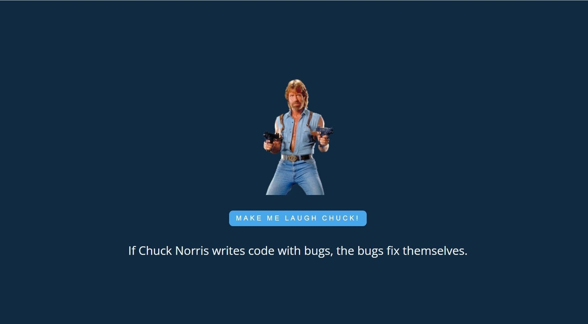

## js30#2.1-random-jokes

| Start task | Deadline task        | Start cross-check | Deadline cross-check | Branch name  | Folder name  |
| ---------- | -------------------- | ----------------- | -------------------- | ------------ | ------------ |
| 08.02.2022 | 14.02.2022 23:59 UTC | 15.02.2022        | 17.02.2022 23:59 UTC | random-jokes | random-jokes |

## Описание проекта

Random-jokes - один из проектов по JavaScript популярного бесплатного англоязычного курса freeCodeCamp. Проект предназначен для получения первого опыта работы с API - асинхронного получения данных и отображения их на странице

## Задача

Вам необходимо создать приложение в котором при клике по кнопке отображается случайная цитата, полученная от любого подходящего API. Также в качестве источника цитат можно использовать JSON-файл

[Описание и требования задания](js30.md)

<kbd></kbd>

[Демо](https://random-jokes-js30.netlify.app/)  
[Советы по выполнению задания](js30-api-hints.md)

## Требования

1. Вёрстка +10
   - на странице есть цитата и кнопка для смены цитаты +5
   - в футере приложения есть ссылка на гитхаб автора приложения, год создания приложения, [логотип курса](https://rs.school/images/rs_school_js.svg) со [ссылкой на курс](https://rs.school/js-stage0/) +5
2. При загрузке страницы приложения отображается рандомная цитата +10
3. При перезагрузке страницы цитата обновляется (заменяется на другую) +10
4. Есть кнопка, при клике по которой цитата обновляется (заменяется на другую) +10
5. Смена цитаты сопровождается любым другим эффектом, например, изменяется изображение или меняется фоновый цвет страницы, или проигрывается звук и т.д \* +10
6. Можно выбрать один из двух языков отображения цитат: en/ru или en/be \*\* +10
7. Очень высокое качество оформления приложения и/или дополнительный не предусмотренный в задании функционал, улучшающий качество приложения +10
   - высокое качество оформления приложения предполагает собственное оригинальное оформление равное или отличающееся в лучшую сторону по сравнению с демо

\* Чтобы не было лишних вопросов, эффект демо - анимация картинки - копировать не нужно. Придумайте свой.  
\*\* Для цитат на русском и белорусском языке рекомендуется использовать JSON-файл - предложенный в материалах к заданию или созданный самостоятельно, так как API с русскоязычными цитатами ненадёжные, а API с цитатами на белорусском языке найти не удалось.

## Критерии оценки

**Максимальная оценка за задание 60 баллов**

Баллы за пункты требований указаны в разделе [Требования](#требования)

Для удобства проверки выведите в консоль браузера самооценку своего проекта по пунктам с указанием баллов за каждый выполненный вами пункт.

Разница между максимальной оценкой за задание (60 баллов) и максимально возможным количеством баллов за выполнение всех пунктов требований (70 баллов) позволит сгладить возможные ошибки проверяющих в ходе кросс-чека, неточности в описании задания, разное понимание требований задания проверяющим и проверяемым.

Обратите внимание! При проверке приложений, работа которых связана с получением данных от API, необходимо различать ошибки в работе приложения и ошибки связанные с работой API.  
Если API не работает, в консоли выводится ошибка `403 - Too many request` или аналогичная. В этом случае проверьте приложение позже.

## Проверка задания

- инструкция по проведению cross-check: https://docs.rs.school/#/cross-check-flow
- форма для кросс-чека https://random-jokes-cross-check.netlify.app/
- ссылки на самые лучшие работы с интересным дополнительным функционалом добавьте, пожалуйста, в эту форму https://forms.gle/retrgFivX1ybcVbp9

## API с цитатами

- https://api.chucknorris.io/jokes
- https://type.fit/api/quotes
- https://favqs.com/api/qotd
- https://www.breakingbadapi.com/api/quotes
- [JSON-файл с цитатами на русском языке](https://github.com/rolling-scopes-school/file-storage/tree/random-jokes)
- [JSON-файл с цитатами на белорусском языке](https://github.com/rolling-scopes-school/file-storage/blob/random-jokes/belarusian_quotes.json)
