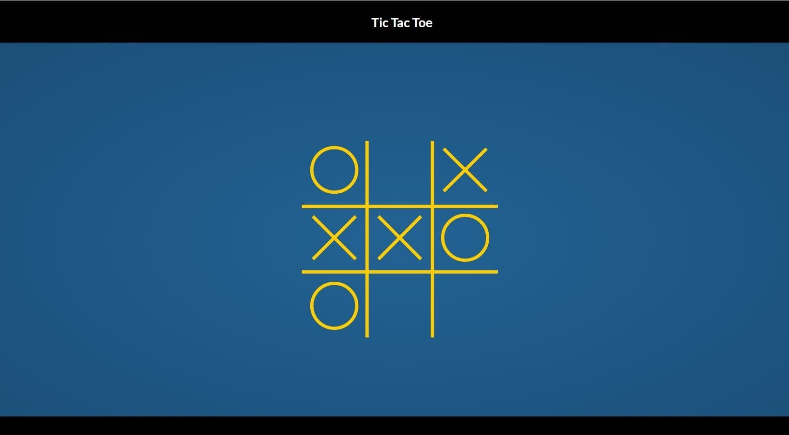

## memory-game

## Описание проекта
Memory-game набор из двенадцати (может быть другое количество) пар одинаковых карточек, которые отображаются "рубашкой" вверх. Кликом по карточке игрок переворачивает её и кликает по следующей карточке. Если на двух карточках изображены одинаковые рисунки, они остаются открытыми, если рисунки разные - карточки переворачиваются "рубашками" вверх. Цель игры - открыть все карточки за наименьшее число ходов. 

## Задача
Вам необходимо создать приложение memory-game.

В первую очередь ознакомьтесь с [описанием и требованиями задания](js.md)

<kbd></kbd>

[Демо]() - будет добавлено позже  
[Советы по выполнению задания]() - будут добавлены позже  

## Требования
1. Вёрстка, дизайн, UI +20
   - внешний вид приложения соответствует предложенному образцу или является его улучшенной версией +5
   - вёрстка адаптивная. Приложения корректно отображается и отсутствует полоса прокрутки при ширине страницы от 1920рх до 768рх +5
   - интерактивность элементов, с которыми пользователи могут взаимодействовать, изменение внешнего вида самого элемента и состояния курсора при наведении, использование разных стилей для активного и неактивного состояния элемента, плавные анимации +5
   - в футере приложения есть ссылка на гитхаб автора приложения, год создания приложения, [логотип курса](https://rs.school/images/rs_school_js.svg) со [ссылкой на курс](https://rs.school/js-stage0/) +5
2. Логика игры. Карточки, по которым кликнул игрок, переворачиваются согласно правилам игры +10
3. По окончанию игры выводится её результат - количество ходов, которые понадобились для завершения игры +10 
4. Результаты игр сохраняются в local storage. Есть таблица рекордов, в которой сохраняются результаты предыдущих 10 игр +10
5. По клику на карточку – она переворачивается плавно, если пара не совпадает – обе карточки так же плавно переварачиваются рубашкой вверх +10
6. Высокое качество реализации игры +5

## Критерии оценки

**Максимальная оценка за задание 60 баллов**  

Баллы за пункты требований указаны в разделе [Требования](#требования)

Для удобства проверки выведите в консоль браузера самооценку своего проекта по пунктам с указанием баллов за каждый выполненный вами пункт.

Разница между максимальной оценкой за задание (60 баллов) и максимально возможным количеством баллов за выполнение всех пунктов требований (65 баллов) позволит сгладить возможные ошибки проверяющих в ходе кросс-чека, неточности в описании задания, разное понимание требований задания проверяющим и проверяемым.