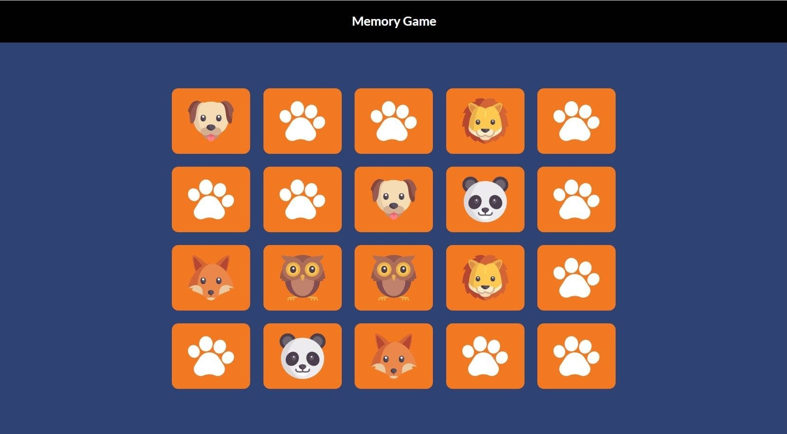

## js30#3.2-memory-game

| Start task | Deadline task        | Start cross-check | Deadline cross-check | Branch name | Folder name |
| ---------- | -------------------- | ----------------- | -------------------- | ----------- | ----------- |
| 15.02.2022 | 21.02.2022 23:59 UTC | 22.02.2022        | 24.02.2022 23:59 UTC | memory-game | memory-game |

## Описание проекта

Memory-game набор из двенадцати (может быть другое количество) пар одинаковых карточек, которые отображаются "рубашкой" вверх. Кликом по карточке игрок переворачивает её и кликает по следующей карточке. Если на двух карточках изображены одинаковые рисунки, они остаются открытыми, если рисунки разные - карточки переворачиваются "рубашками" вверх. Цель игры - открыть все карточки за наименьшее число ходов.

## Задача

Вам необходимо создать приложение memory-game.

[Описание и требования задания](js30.md)

<kbd></kbd>

[Демо](https://codepen.io/jeytii/full/QoagLr)  
[Другие реализации и дизайн](https://freefrontend.com/javascript-memory-games/)  
[Советы по выполнению задания](js30-game-hints.md)

## Требования

1. Вёрстка +10
   - реализован интерфейс игры +5
   - в футере приложения есть ссылка на гитхаб автора приложения, год создания приложения, [логотип курса](https://rs.school/images/rs_school_js.svg) со [ссылкой на курс](https://rs.school/js-stage0/) +5
2. Логика игры. Карточки, по которым кликнул игрок, переворачиваются согласно правилам игры +10
3. Игра завершается, когда открыты все карточки +10
4. По окончанию игры выводится её результат - количество ходов, которые понадобились для завершения игры +10
5. Результаты последних 10 игр сохраняются в local storage. Есть таблица рекордов, в которой сохраняются результаты предыдущих 10 игр +10
6. По клику на карточку – она переворачивается плавно, если пара не совпадает – обе карточки так же плавно переварачиваются рубашкой вверх +10
7. Очень высокое качество оформления приложения и/или дополнительный не предусмотренный в задании функционал, улучшающий качество приложения +10
   - высокое качество оформления приложения предполагает собственное оригинальное оформление равное или отличающееся в лучшую сторону по сравнению с демо

## Критерии оценки

**Максимальная оценка за задание 60 баллов**

Баллы за пункты требований указаны в разделе [Требования](#требования)

Для удобства проверки выведите в консоль браузера самооценку своего проекта по пунктам с указанием баллов за каждый выполненный вами пункт.

Разница между максимальной оценкой за задание (60 баллов) и максимально возможным количеством баллов за выполнение всех пунктов требований (70 баллов) позволит сгладить возможные ошибки проверяющих в ходе кросс-чека, неточности в описании задания, разное понимание требований задания проверяющим и проверяемым.

## Проверка задания

- инструкция по проведению cross-check: https://docs.rs.school/#/cross-check-flow
- форма для кросс-чека https://memory-game-cross-check.netlify.app/
- ссылки на самые лучшие работы с интересным дополнительным функционалом добавьте, пожалуйста, в эту форму https://forms.gle/retrgFivX1ybcVbp9
