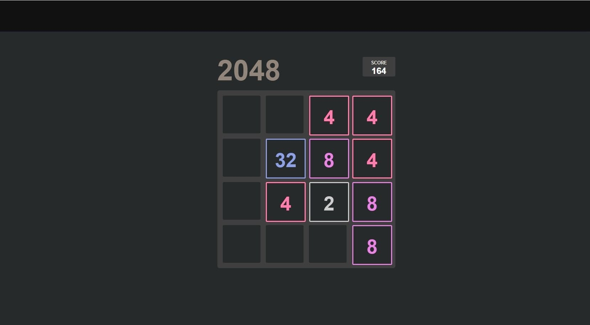

## js30#3.3-random-game

| Start task | Deadline task        | Start cross-check | Deadline cross-check |
|------------|----------------------|-------------------|----------------------|
| 15.02.2022 | 21.02.2022 23:59 UTC | 22.02.2022        | 24.02.2022 23:59 UTC |

## Описание проекта
Создание компьютерных игр - отдельная область программирования, требующая от разработчиков высокой квалификации. Компьютерные игры могут создаваться как большими компаниями, так и небольшими коллективами и даже отдельными разработчиками.

## Задача
Игру для реализации выбираете вы сами в зависимости от собственных интересов, уровня подготовки, наличия свободного времени. Важно, чтобы работая над ней вы смогли проявить свои сильные стороны, реализовать свои возможности, получить максимально качественный результат.  
Убедитесь, что для выбранной игры возможно реализовать указанные в задании [требования](#требования)

[Описание и требования задания](js30.md)

<kbd></kbd>

## Требования
1. Вёрстка, дизайн, UI +20
   - внешний вид приложения +5
   - вёрстка адаптивная. Приложения корректно отображается и отсутствует полоса прокрутки при ширине страницы от 1920рх до 768рх +5
   - интерактивность элементов, с которыми пользователи могут взаимодействовать, изменение внешнего вида самого элемента и состояния курсора при наведении, использование разных стилей для активного и неактивного состояния элемента, плавные анимации +5
   - в футере приложения есть ссылка на гитхаб автора приложения, год создания приложения, [логотип курса](https://rs.school/images/rs_school_js.svg) со [ссылкой на курс](https://rs.school/js-stage0/) +5
2. Логика игры. Ходы, перемещения фигур, другие действия игрока подчиняются определённым свойственным игре правилам +10
3. По окончанию игры выводится её результат, например, количество ходов, время игры, набранные баллы, выигрыш или поражение и т.д +10 
4. Результаты игр сохраняются в local storage. Есть таблица рекордов, в которой сохраняются результаты предыдущих 10 игр +10
5. Анимации или звуки, или настройки игры. Баллы начисляются за любой из перечисленных пунктов +10
6. Высокое качество реализации игры +5

## Критерии оценки

**Максимальная оценка за задание 60 баллов**  

Баллы за пункты требований указаны в разделе [Требования](#требования)

Для удобства проверки выведите в консоль браузера самооценку своего проекта по пунктам с указанием баллов за каждый выполненный вами пункт.

Разница между максимальной оценкой за задание (60 баллов) и максимально возможным количеством баллов за выполнение всех пунктов требований (65 баллов) позволит сгладить возможные ошибки проверяющих в ходе кросс-чека, неточности в описании задания, разное понимание требований задания проверяющим и проверяемым.