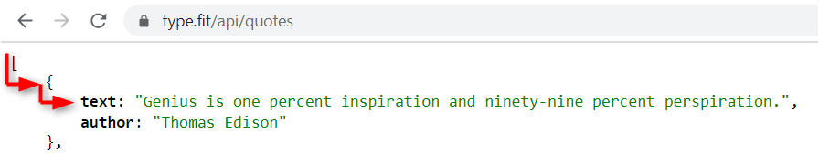
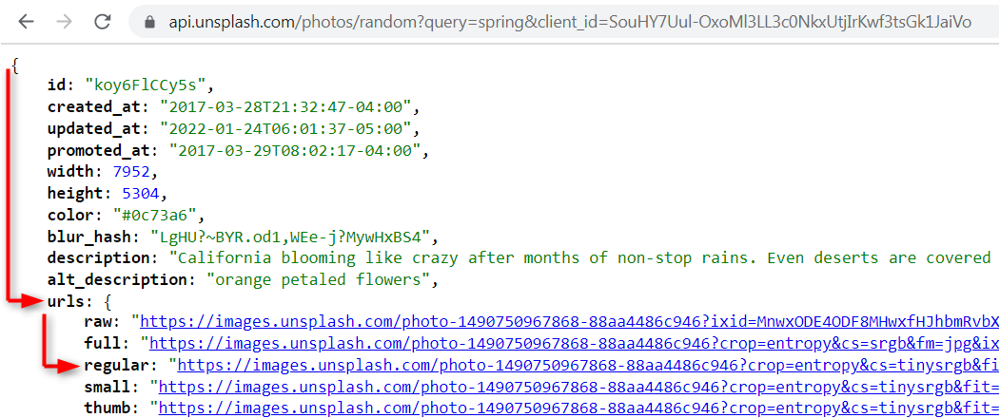
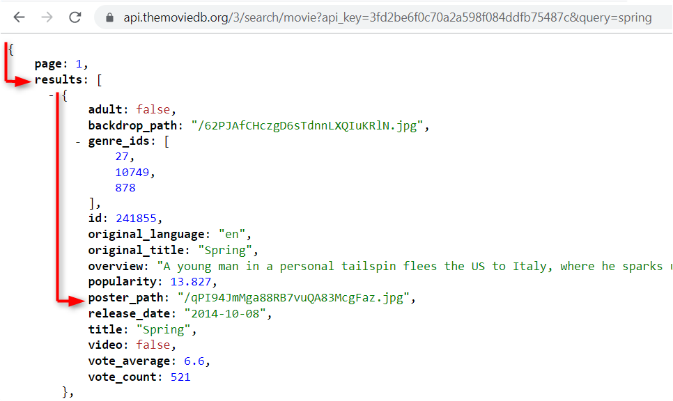

## js30-api-hints.md

Советы по выполнению 4-6 части задания js-30:

- [random-jokes](js30-4.md)
- [image-galery](js30-5.md)
- [movie-app](js30-6.md)

1. [Asynchronous JavaScript](#asynchrony-in-js)
2. [API. Запросы к серверу](#api-запросы-к-серверу)
   - [Методы API](#методы-api)
   - [Параметры запроса](#параметры-запроса)
3. [Получение данных от API](#получение-данных-от-api)
4. [Доступ к данным](#доступ-к-данным)
5. [Отображение данных на странице](#отображение-данных-на-странице)
6. [Генерация элементов средствами JavaScript](#генерация-элементов-средствами-javascript)
7. [JSON-файл с цитатами](#json-файл-с-цитатами)

### Asynchronous JavaScript

Частая задача в веб-разработке - получение данных от API и их отображение на веб-странице. Это могут быть курсы валют, данные о погоде, обзоры новостей, любая другая информация, которая должна динамически обновляться.

Особенность получения данных от API в том, что по сравнению с выполнением остального кода это очень длительный по времени процесс, и его результат заранее неизвестен: данные могут прийти, или не прийти, или прийти, но позже.

Для представлениях об особенностях получения данных от API используем жизненную ситуацию - ожидание самолёта в аэропорту.  
По расписанию самолёт должен быть, но пока его не подадут на взлётную площадку, мы не можем быть уверены, что вылет состоится причём в точно указанное время.

В JavaScript код выполняется так, как он написан, строчка за строчкой. Это - поток кода. Но получать данные от сервера в основном потоке нерационально: это будет тормозить код, пользователь будет вынужден ждать пока придут данные, а если данные не придут, выполнение кода остановится, и приложение прекратит свою работу.

Эти особенности получения данных от сервера обусловили появление Асинхронного JavaScript (Asynchronous JavaScript), в котором код для получения данных от сервера добавляется в очередь и выполняется только после выполнения основного потока кода.

Получение данных от сервера только после окончания работы основного потока кода позволяет не задерживать работу кода, не ставит работу приложения в зависимость от того, будут ли получены данные от сервера или нет.

Но эта же особенность приводит к тому, что получить доступ к пришедшим от сервера данным в основном потоке кода невозможно: пока основной поток кода выполняется этих данных ещё нет, они придут только после его выполнения.

#### Историческая справка

В истории веб-разработки сначала получение новых данных от сервера предполагало перезагрузку всей страницы. Затем пришло понимание, что было бы хорошо получать данные без перезагрузки. Появился AJAX (англ. Asynchronous JavaScript and XML). Асинхронный JavaScript получение данных от сервера откладывает в очередь и выполняет только после выполнения основного потока кода.

Технологией, которая использовалась для получения данных от сервера, долгое время был XMLHttpRequest (появился около 30 лет назад). В ES6 ему на смену пришёл Fetch. На сегодня новейшим и наиболее удобным способом получения данных от сервера является функция `async/await`.

#### Примеры получения данных от сервера при помощи разных технологий

Код предлагается не для запоминания, а для сравнения

Любая асинхронная функция начинается с запроса к серверу. Например:

```js
const url = 'https://type.fit/api/quotes';
```

Различия будут в обработке этого запроса.

**XMLHttpRequest**

```js
const xhr = new XMLHttpRequest();
xhr.open('GET', url);
xhr.send();
xhr.addEventListener('load', () => {
  if (xhr.status === 200) {
    let data = JSON.parse(xhr.response);
    console.log(data);
  }
});
```

**Fetch**

```js
function getData() {
  fetch(url)
    .then((res) => res.json())
    .then((data) => {
      console.log(data);
    });
}
getData();
```

**async/await**

```js
async function getData() {
  const res = await fetch(url);
  const data = await res.json();
  console.log(data);
}
getData();
```

Функция `async/await` это синтаксический сахар над Fetch. Она позволяет писать асинхронный код почти так же просто и удобно, как если бы мы писали обычный js-код.

### API. Запросы к серверу

API позволяет получить данные от сервера, соответствующие отправленному запросу.

Примеры запросов к API:

- API с цитатами
  - `https://api.icndb.com/jokes`
  - `https://type.fit/api/quotes`
- API с изображениями
  - `https://api.unsplash.com/search/photos?query=spring&per_page=30&orientation=landscape&client_id=SouHY7Uul-OxoMl3LL3c0NkxUtjIrKwf3tsGk1JaiVo`
  - `https://www.flickr.com/services/rest/?method=flickr.photos.search&per_page=30&api_key=0f15ff623f1198a1f7f52550f8c36057&tags=spring,nature&tag_mode=all&extras=url_m&format=json&nojsoncallback=1`
- API с информацией про фильмы
  - `https://api.themoviedb.org/3/search/movie?api_key=3fd2be6f0c70a2a598f084ddfb75487c&query=spring&page=1`
  - `https://www.omdbapi.com/?s=spring&apikey=841a117d&page=1`

#### Методы API

Запросы к API могут использовать разные методы, которые предоставляют API.

- API с цитатами
  - по запросу `https://api.icndb.com/jokes` приходит список цитат
  - по запросу `https://api.icndb.com/jokes/random` приходит одна случайная цитата.
- API с изображениями
  - по запросу `https://api.unsplash.com/search/photos?query=spring&client_id=SouHY7Uul-OxoMl3LL3c0NkxUtjIrKwf3tsGk1JaiVo` приходит список фото.
  - по запросу `https://api.unsplash.com/photos/random?query=spring&client_id=SouHY7Uul-OxoMl3LL3c0NkxUtjIrKwf3tsGk1JaiVo` получаем одно случайное фото.
- API с информацией про фильмы
  - по запросу `https://api.themoviedb.org/3/discover/movie?sort_by=popularity.desc&api_key=3fd2be6f0c70a2a598f084ddfb75487c` получаем список популярных фильмов
  - по запросу `https://api.themoviedb.org/3/search/movie?query=spring&api_key=3fd2be6f0c70a2a598f084ddfb75487c` получаем список фильмов, в названии которых есть слово 'spring`

#### Параметры запроса

Параметры запроса, которые в ссылке идут после знака ?, определяют некоторые характеристики данных, которые можно получить по этому запросу.

Например, запросы к API с изображениями и информацией о фильмах запрашивают информацию с ключевым словом "spring". Разумеется, ключевое слово можно изменить.  
Этот параметр позволит реализовать поиск по картинкам и по фильмам в созданных вами приложениях: всё, что от вас потребуется - изменять ключевое слово в запросе к API на то, которое пользователь ввёл строку поиска.

Также в запросы к API с изображениями и информацией о фильмах указывается API Key. Это обязательный параметр запроса - уникальный идентификатор пользователя,который необходимо получить, чтобы создавать свои собственные запросы к API. Если количество запросов с данным ключом превышает лимит, ключ временно деактивируется. Поэтому прежде чем переходить по предложенным выше ссылкам, необходимо зарегистрироваться на сайте API, получить свой собственный ключ и подставить его в свою ссылку.

Другие параметры запроса могут определять:

- количество данных на странице: `per_page=30`
- страницу, с которой получаем информацию : `page=1`
- необходимость учитывать все перечисленные ключевые слова: `tag_mode=all`
- размер изображения: `extras=url_m` - средний (medium)
- ориентация изображения: `orientation=landscape` - альбомная, то есть ширина больше высоты

Доступные в API методы и параметры запросов описываются в документации API.

### Получение данных от API

Создадим переменную `url`, в которой сохраним запрос к API, например:

```js
const url = 'https://type.fit/api/quotes';
```

Код асинхронной функции `async/await`, позволяющей получить данные от API:

```js
async function getData() {
  const res = await fetch(url);
  const data = await res.json();
  console.log(data);
}
getData();
```

Код совершенно минималистичный, одинаков для любого API, меняется только `url`, но сама `async/await` функция остаётся неизменной.

Обратите внимание, что `async/await` функции работают только на сервере. Live Server (расширение VS Code) подойдёт.

Ещё одна особенность асинхронных функций - все полученные данные доступны только внутри самой функции, получить их в основном коде приложения невозможно.

### Доступ к данным

API присылают данные в формате JSON.  
Формат JSON - JavaScript Object Notation – изначально разрабатывался для js. Сейчас он используется для представления данных во многих языках программирования.

Для удобного просмотра результатов, которые возвращает API, установите расширение [JSONView](https://chrome.google.com/webstore/detail/jsonview/chklaanhfefbnpoihckbnefhakgolnmc?hl=ru)

JSON использует синтаксис JavaScript и для работы с ним можно использовать уже имеющиеся знания про массивы и объекты.

Чтобы указать путь к данным, смотрим, где в JSON находятся нужные нам данные и в какие объекты или массивы они вложены

Например, результат, полученный от Type.fit API по запросу `https://type.fit/api/quotes`, представляет собой массив. Каждый элемент массива - объект с двумя ключами: `text` и `author`. Если полученные от API данные записать в переменную `data`, то первую цитату можно получить по индексу 0 и ключу "text":

```js
data[0].text;
```

<kbd></kbd>

В запросе к Unsplash API `https://api.unsplash.com/photos/random?query=spring&client_id=SouHY7Uul-OxoMl3LL3c0NkxUtjIrKwf3tsGk1JaiVo` для доступа к данным указываем ключи "urls" и "regular" :

```js
data.urls.regular;
```

<kbd></kbd>

Рассмотрим как получить ссылку на постер к фильму от The Movie Database API по запросу `https://api.themoviedb.org/3/search/movie?api_key=3fd2be6f0c70a2a598f084ddfb75487c&query=spring`

Указываем ключ "results", затем индекс элемента в массиве 0, затем ключ "poster_path" и затем полученный результат "/h3ufD3KszAl19r1gBv5wgvw4xpn.jpg" соединяем с началом ссылки "https://image.tmdb.org/t/p/w1280"

<kbd></kbd>

### Отображение данных на странице

Выводить полученные от API данные в консоль мы уже научились.  
Но пользователь в консоль не смотрит, его больше интересуют данные, которые отображаются на веб-странице.  

В зависимости от того, какие именно данные (текст или изображение) необходимо отобразить на странице, используются разные способы их отображения.

Для отображения текста необходимо создать текстовый элемент `p` или `span` и при помощи свойства `textContent` указать его содержание.  

Для отображения изображений есть два способа:
- создать изображение `img` и значением его атрибута `src` указать адрес изображения  
- создать элемент `div` и в его css-свойстве `background-image` указать всё тот же полученный от API адрес изображения

Если гора не идёт к Магомету, Магомет идёт к горе.  
Если полученные от API данные недоступны в основном коде приложения, нам понадобится отображение данных на странице поместить внутрь асинхронной функции `getData`, получающей данные от API.

Наиболее простой, но не самый оптимальный вариант - написать код для отображения данных внутри функции `getData`.

Это полностью рабочий вариант, а неоптимальность его в том, что смешивать получение и отображение данных нежелательно. 

Одно из базовых правил, которого рекомендуется придерживаться при написании кода, одна функция - одна задача.

Чтобы придерживаться этого правила, необходимо написать отдельную функцию `showData(data)` для отображения полученных от API данных на странице. Параметр функции - `data` - это и есть полученные от API данные. Представьте, что доступ к ним у вас есть, и напишите функцию так, как если бы эти данные у неё были.

А теперь внимание, магия.  
Чтобы у функции `showData` был доступ к полученным от API данным, вызов функции `showData(data)` необходимо поместить внутрь функции `getData`

Поздравляю. Вы выполнили самую сложную и важную часть этого задания.

### Генерация элементов средствами JavaScript

Если вы выполняете таск `random-jokes`, эту часть советов можно пропустить.  
В задании `random-jokes` всего один элемент, его создание средствами html вполне оправдано.

В заданиях `image-galery` и `movie-app` однотипных элементов несколько.  
Создать их средствами html, затем найти в js и указать каждому содержание тоже можно, именно так мы меняли изображения в задании Portfolio#3. Но проще и быстрее будет в самом js создать элементы и указать их содержание.  

Рассмотрим как это происходит на примере таска `image-galery`.  
Верстаем только строку поиска и контейнер для изображений.

Создадём элемент `img` добавляем ему класс, src, alt-атрибут и добавим в контейнер

```js
const img = document.createElement('img');
img.classList.add('gallery-img')
img.src = `полученный от API адрес изображения`;
img.alt = `image`;
galleryContainer.append(img);
```

Мы создали элемент `img` и добавили его на страницу.  
Такой же результат можно получить использовав шаблонную строку:

```js
const img = ``;
galleryContainer.insertAdjacentHTML('beforeend', img);
```

Чтобы добавить все полученные от API изображения, необходимо обойти полученный от API массив данных при помощи метода `map` и для каждого элемента массива выполнить функцию создания изображения и его добавления на страницу.

### JSON-файл с цитатами

При использовании API необходимо учитывать, что они могут перестать работать, в результате чего неработоспособным станут и созданные на их основе приложения.  

Для задания random-jokes возможным решением может быть создание собственного JSON-файла с цитатами и их авторами.

Пример файла `data.json`:

```json
[
  {
    "text": "Пишите код так, как будто сопровождать его будет склонный к насилию психопат, который знает, где вы живете",
    "author": "Стив Макконнелл"
  },
  {
    "text": "Сложность программы растет до тех пор, пока не превысит способности программиста",
    "author": "Артур Блох. Законы Мэрфи"
  },
    {
    "text": "Ходить по воде и разрабатывать программы, следуя ТЗ, очень просто… если они заморожены",
    "author": "И. Берард"
  }
]  
```

Данные от JSON-файла получаем асинхронно.  
Для этого используем `async/await` функцию:  

```js
async function getQuotes() {  
  const quotes = 'data.json';
  const res = await fetch(quotes);
  const data = await res.json(); 
  console.log(data);
}
getQuotes();
```

Вместо JSON-файла с цитатами можно было создать js-объект с цитатами и работать с ним синхронно, но так как задача предложенного задания научиться писать асинхронный код, JSON-файл предпочтительнее.

- [Ссылка на JSON-файл](https://github.com/rolling-scopes-school/file-storage/blob/random-jokes/quotes.json) с цитатами на русском языке, созданный студентами предыдущего набора
- [Ссылка на JSON-файл](https://github.com/rolling-scopes-school/file-storage/blob/random-jokes/belarusian_quotes.json) с цитатами на белорусском языке, созданный студентами набора 2022q1
