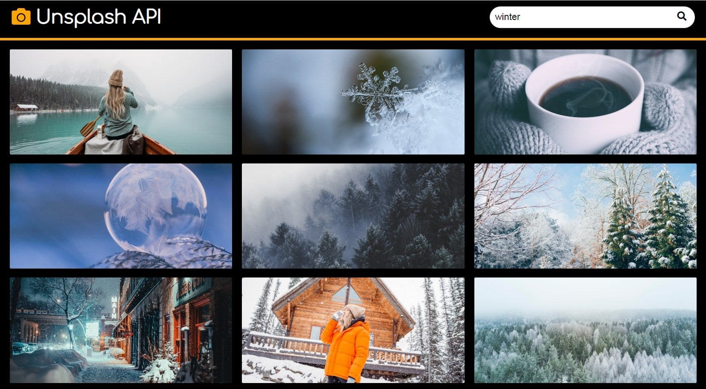

# js30

js30 - три небольших js-проекта, которые вы выполните на этапе stage#0.  
Выполнение самостоятельных проектов - наиболее эффективный и одновременно невероятно увлекательный способ использовать возможности языка, на практике изучить его особенности.

Задание js30 состоит из трёх частей, в каждой части задания предложены три проекта на выбор.  
Проекты расположены в порядке увеличения их сложности. Баллы за выполнение каждого из трёх проектов одинаковые, вне зависимости от их уровня сложности.  
В ходе выполнения каждой части задания вам необходимо выполнить только один js-проект из трёх проектов на выбор.

Если хотите, вы можете в каждой части задания выполнить не один, а два или все три проекта на выбор, но дополнительных баллов за это не предусмотрено.  
После окончания проверки задания все три колонки с проектами в score схлопнутся в одну, и в ней останется только одна лучшая оценка.

Продолжительность выполнения каждой части задания указана в расписании.
Проверяется задание в ходе кросс-чека.
Кросс-чек стартует в понедельник утром и заканчивается в пятницу поздно ночью в 23:59 UTC.

## Проекты на выбор

**В каждой части задания необходимо выбрать и выполнить только один проект**

 

## Часть 1. Работа с медиа

Выполняя предложенные проекты вы научитесь использовать JavaScript для работы с аудио- и видео-файлами.  
[Советы по выполнению](js30-media-hints.md)

| <h4>[Звуки природы](js30-1.md)</h4> | <h4>[Аудиоплеер](js30-2.md)</h4> | <h4>[Кастомный видеоплеер](js30-3.md)</h4> |
| ----------------------------------- | -------------------------------- | ------------------------------------------ |
|               |            |                      |

 

## Часть 2. Работа с API

Выполняя проекты этой части задания вы научитесь получать данные от API и отображать их на веб-странице.  
[Советы по выполнению](js30-api-hints.md)

| <h4>[Генератор цитат](js30-4.md)</h4> | <h4>[Галерея изображений](js30-5.md)</h4> | <h4>[Поисковик по видео](js30-6.md)</h4> |
| ------------------------------------- | ----------------------------------------- | ---------------------------------------- |
|                 |                     |                    |

 

## Часть 3. Игра

У программистов есть возможность не только играть в чужие игры, но и создавать свои собственные!  
[Советы по выполнению](js30-game-hints.md)

| <h4>[Tic Tac Toe](js30-7.md)</h4> | <h4>[Memory Game](js30-8.md)</h4> | <h4>[Игра на выбор](js30-9.md)</h4> |
| --------------------------------- | --------------------------------- | ----------------------------------- |
|             |             |               |

 

## Работа над проектом

- выполнение таска начните с изучения техзадания. Не приступайте к работе над проектом без точного понимания что именно от вас требуется сделать. Полчаса изучения ТЗ могут сэкономить несколько часов кодинга, избавят от необходимости переписывать уже написанный код
- общие для всех проектов требования описаны в этом документе, требования каждого конкретного проекта описываются в документе с проектом, который открывается при клике по ссылке с названием проекта в таблицах выше
- для каждого проекта предложено демо, которое поможет понять задание, визуализировать его требования. Вы можете в своём проекте повторить дизайн демо, использовать медиафайлы демо: картинки, иконки, звуки и видео. Копировать код демо запрещено. Весь код приложения - html, css, js вам необходимо написать самостоятельно
- для каждого проекта подготовленты советы по его выполнению. С советами необходимо ознакомиться: это ускорит работу над проектом, поможет в понимании его требований. Следовать предложенным советам не обязательно
- вы можете обсуждать задание в дискорде, искать решение похожих заданий в интернете, делиться найденными материалами с другими студентами. Единственное, что строго запрещено - копирование (Ctrl + C => Ctrl + V) чужого кода. Весь html, css, js код приложения вам необходимо написать самостоятельно
- вы можете вносить в проекты свои собственные изменения и улучшения, если они не мешают работе указанного в задании функционала

## Рекомендации по написанию кода

- основное и самое важное требование к коду - его работоспособность: работающий код лучше идеального, но не работающего
- тем не менее, есть те рекомендации, которым необходимо следовать даже начинающему разработчику:
  - правильное наименование переменных и функций
  - используйте prettier для форматирования кода, отформатированный код проще читается
  - избегайте дублирования кода, повторяющиеся фрагменты кода вынесите в функции
  - стремитесь к оптимальному размеру функций, следуйте правилу: одна функция – одна задача
  - избегайте глубокой вложенности циклов, магических чисел
  - используйте фичи ES6 и выше, например, let, const для объявления переменных, стрелочные функции и т.д

## Рекомендации к вёрстке

- внешний вид приложения соответствует предложенному образцу или является его улучшенной версией
- вёрстка адаптивная. Приложение хорошо выглядит при ширине страницы от 1920рх до 768рх
- интерактивность элементов, с которыми пользователи могут взаимодействовать, изменение внешнего вида самого элемента и состояния курсора при наведении, использование разных стилей для активного и неактивного состояния элемента, плавные анимации
- в футере приложения есть ссылка на гитхаб автора приложения, год создания приложения, [логотип курса](../../react/assets/rss-logo.svg) со [ссылкой на курс](https://rs.school/courses/javascript-preschool-ru)

## Технические требования

- работа приложения проверяется в браузере Google Chrome последней версии
- можно использовать [bootstrap](https://getbootstrap.com/), [material design](https://material.io/), css-фреймворки, html и css препроцессоры
- не разрешается использовать jQuery, другие js-библиотеки и фреймворки. Нарушение этого требования - 0 баллов за таск
- js-код приложения должен быть читаемым, без минимизации или обфускации

## Требования к репозиторию

- задание выполняется в приватном репозитории школы. [Как работать с приватным репозиторием школы](https://docs.rs.school/#/private-repository)
- если у вас не создаётся приватный репозиторий школы, задание можно выполнять в личном приватном репозитории
- от ветки `main` создайте ветку с названием проекта в ней создайте папку с названием проекта, в ней разместите файлы проекта
- для деплоя используйте `gh-pages` [Как сделать деплой задания из приватного репозитория школы](https://docs.rs.school/#/private-repository?id=Как-сделать-деплой-задания-из-приватного-репозитория-школы)
- если не можете для деплоя использовать `gh-pages`, используйте https://app.netlify.com/drop. Название страницы дайте по схеме: имя гитхаб аккаунта - название таска

## Требования к коммитам

- История коммитов должна отображать процесс разработки приложения.
- [Названия коммитов дайте согласно гайдлайну](https://docs.rs.school/#/git-convention)

## Требования к Pull Request

- Название Pull Request дайте по названию задания
- [Описание Pull Request дайте по схеме](https://docs.rs.school/#/pull-request-review-process?id=Требования-к-pull-request-pr)  
  **Мержить Pull Request из ветки разработки в ветку `main` не нужно**.

## Чтобы получить баллы за задание необходимо:

- Выполнить задание \*
- Засабмитить задание т.е. отправить его на проверку \*\*
- Если задание проверяется в ходе кросс-чека, проверить все присланные на проверку работы и засабмитить результаты проверки до дедлайна кросс-чека \*\*\*

\* \*Весь код проекта вам необходимо написать самостоятельно, только так можно чему-то научиться.  
Копирование чужого кода (`Ctrl + C`, `Ctrl + V`) на курсе запрещено.  
\*\* _Засабмитить задание можно только до дедлайна таска, после дедлайна сабмит недоступен_  
\*\*\* _Сабмит результатов кросс-чек проверки доступен и после дедлайна кросс-чека, но на оценки проверяющего и проверяемых не влияет_

## Как сабмитить задание

После выдачи таска, но до наступления дедлайна зайдите в rs app https://app.rs.school/, выберите **Cross-Check: Submit**, в выпадающем списке выберите свой проект, в поле **Solution URL** добавьте ссылку на задеплоенную версию своего приложения, нажмите кнопку **Submit**.

**Будьте очень внимательны при сабмите!**. Убедитесь, что из трёх проектов на выбор, при сабмите вы выбрали свой.

## Рекомендации по сабмиту

- Засабмитить задание рекомендуется как можно раньше, как только в rs app появится такая возможность. После сабмита задание можно продолжать выполнять до самого дедлайна
- Сабмитится ссылка на деплой
- Так как проект выполняется в приватном репозитории, сабмитить ссылку на репозиторий или pull request нет смысла - проверяющий его не увидит. Приватный репозиторий школы видите только вы сами, админы курса, и увидят ваши менторы, когда они появятся
- Убедитесь, что задеплоенная вами ссылка открывается в режиме инкогнито браузера
- Сделайте скриншот засабмиченной ссылки и сохраняйте его у себя до старта кросс-чека. Если вам не придут работы на проверку, скриншот послужит доказательством, что вы вовремя засабмитили ссылку на работу. В таком случае вашу работу проверят в ходе апелляции

## Проверка задания

- форма проверки каждой части задания - кросс-чек
- инструкция по проведению cross-check: https://docs.rs.school/#/cross-check-flow
