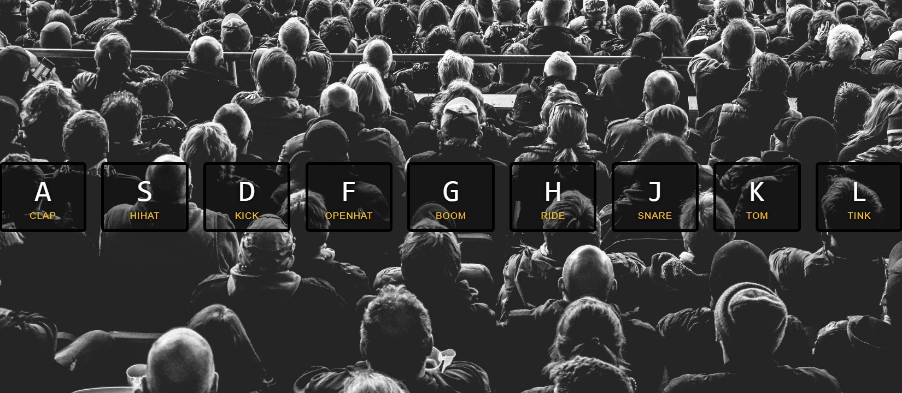
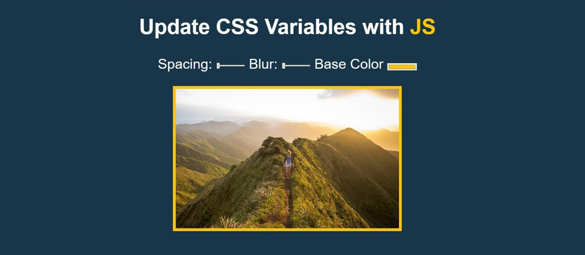
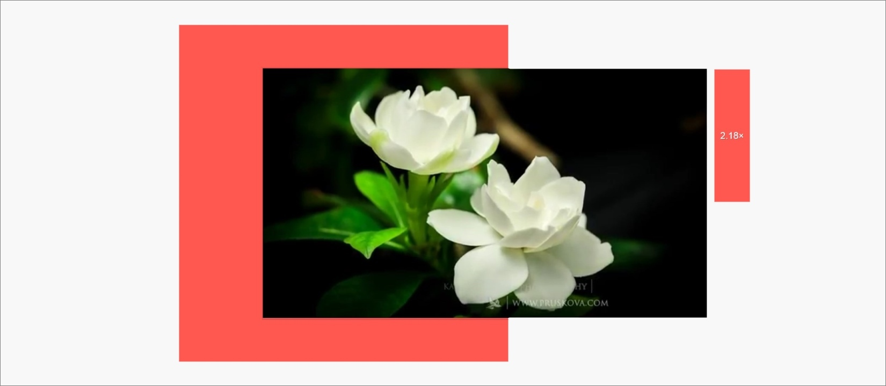
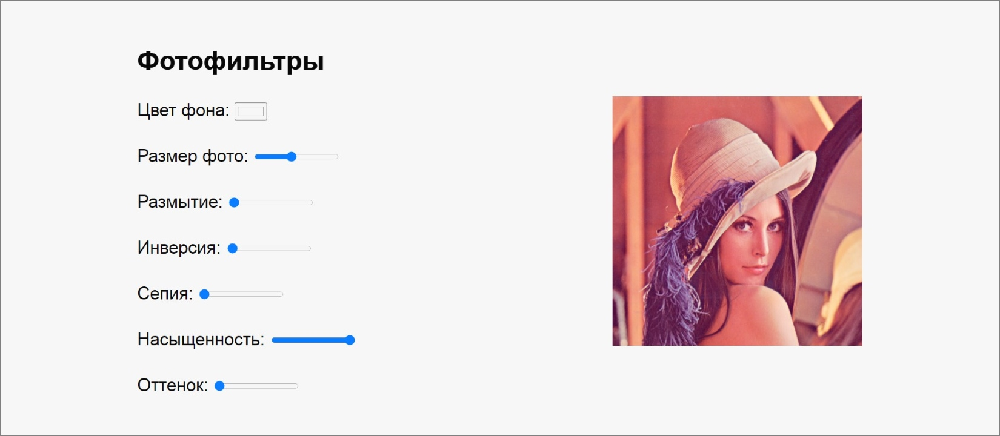
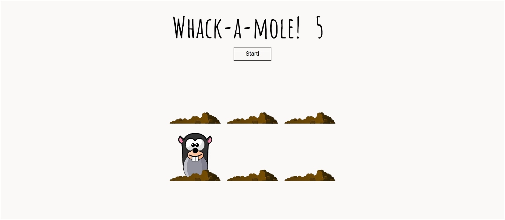

# js30

Задание js30 состоит из двух частей. Продолжительность каждой части - одна неделя. В ходе выполнения каждой части задания вам необходимо выполнить один js-проект из трёх проектов на выбор. Проверяется задание в ходе кросс-чека.

_Вы можете выполнить не один, а два или все три проекта каждой части, но дополнительных баллов за это не предусмотрено. По окончанию кросс-чека все три колонки с проектами в score схлопнутся в одну, и в ней останется только одна лучшая оценка_

## Part1

| <h4>[Drum Kit](js30-1.md)</h4>                                                                           | <h4>[JS Clock](js30-2.md)</h4>                                                                          | <h4>[Vertical Slider](js30-3.md)</h4>                                 |
| -------------------------------------------------------------------------------------------------------- | ------------------------------------------------------------------------------------------------------- | --------------------------------------------------------------------- |
|                                                                                    |                                                                                   |                                                 |
| [Демо](https://irinainina.github.io/JavaScript30-1/01%20-%20JavaScript%20Drum%20Kit/index-FINISHED.html) | [Демо](https://irinainina.github.io/JavaScript30-1/02%20-%20JS%20and%20CSS%20Clock/index-FINISHED.html) | [Демо](https://50projects50days.com/projects/double-vertical-slider/) |
| [Video](https://youtu.be/VuN8qwZoego) (19:38)                                                            | [Video](https://youtu.be/xu87YWbr4X0) (10:44)                                                           | [Video](https://youtu.be/laNpbZISwjY) (26:53)                         |

 

## Part2

| <h4>[Custom Video Player](js30-4.md)</h4>                                             | <h4>[Photofilter](js30-5.md)</h4>                                                                | <h4>[Whack-A-Mole](js30-6.md)</h4>                                                                |
| ------------------------------------------------------------------------------------- | ------------------------------------------------------------------------------------------------ | ------------------------------------------------------------------------------------------------- |
|                                                                 |                                                                            |                                                                             |
| [Демо](https://irinainina.github.io/JavaScript30-1/11%20-%20Custom%20Video%20Player/) | [Демо](https://irinainina.github.io/JavaScript30-1/03%20-%20CSS%20Variables/index-FINISHED.html) | [Демо](https://irinainina.github.io/JavaScript30-1/30%20-%20Whack%20A%20Mole/index-FINISHED.html) |
| [Video](https://youtu.be/yx-HYerClEA) (24:33)                                         | [Video](https://youtu.be/AHLNzv13c2I) (13:13)                                                    | [Video](https://youtu.be/toNFfAaWghU) (14:35)                                                     |

  

## Работа над проектом

#### Первый этап. Повторить исходный проект

Задача этого этапа - разобраться в коде предложенного вам для изучения чужого проекта и самостоятельно его воспроизвести.

html, css, js код приложения вам необходимо написать самостоятельно.  
Для этого у вас есть видео автора задания, в котором он рассказывает как пишет код, демо проекта, который вам необходимо выполнить.

Вам необходимо посмотреть видео, разобрать пример его, и воспроизвести html, css, js код приложения полностью самостоятельно.

Копирование html, css, js кода (Ctrl + C => Ctrl + V) исходного проекта запрещено.

Если в коде, функционале, внешнем виде исходного проекта вы видите какие-то недостатки и неточности, вы можете попытаться их исправить и улучшить. Если исправить не получится, оставьте как есть. За недостатки, которые присутствуют в исходном проекте, баллы не снимаются.

Количество баллов за этот этап - 10.

#### Второй этап. Обязательный дополнительный фукционал

Для каждого проекта указан обязательный дополнительный функционал, который необходимо реализовать. В каждом задании обязательный дополнительный функционал свой, он указан в описании задания.

Обязательный дополнительный фукционал вам необходимо реализовать самостоятельно. При этом вы можете пользоваться предложенными материалами, искать дополнительную информацию в интернете, задавать вопросы в чате. Единственное, что запрещено - копирование чужого кода, будь то код из интернета, из приведённых в задании примеров, или код других студентов. Реализовать обязательный дополнительный функционал вам необходимо полностью самостоятельно.

Количество баллов за этот этап - 10.

#### Третий этап. Дополнительный фукционал на выбор

Дополнительный фукционал на выбор это одно или несколько улучшений, которые вы можете добавить в свой проект.

Для каждого проекта предлагаются несколько возможных вариантов его улучшения. Вы можете реализовать одно или несколько из них, или добавить в проект свои собственные улучшения.

Каждое качественно выполненное улучшение из предложенных в задании или своё собственное, аналогичное им по сложности, оценивается в 10 баллов. Количество улучшений не ограничено. При этом максимальный балл за таск - 30.

Разница между количеством баллов за таск, которые можно заработать благодаря реализации дополнительного функционала на выбор, и максимальным количеством баллов, которые можно выставить в скоре, позволит сгладить возможные ошибки и неточности кросс-чека, и даст возможность каждому из вас полностью раскрыть свой потенциал, реализовать свои возможности.

Даже если от исходного проекта ничего не осталось и обязательный дополнительный функционал не выполнен, автор работы может получить максимальный балл за таск только за счёт дополнительного функционала на выбор, если по качеству выполнения и/или сложности он не уступает исходному проекту и обязательному дополнительному фукционалу. Единственное ограничение - приложение должно соответствовать тематике исходного проекта: музыкальное приложение проигрывать звуки, часы показывать время, слайдер листать слайды и т.д.

## Требования к репозиторию

- задание выполняется в **приватном репозитории школы** [Как работать с приватным репозиторием](https://docs.rs.school/#/private-repository?id=Как-работать-с-приватным-репозиторием)
- если у вас не создаётся приватный репозиторий школы, задание можно выполнять в личном приватном репозитории.
- в клонированном приватном репозитории школы от ветки `main` создайте ветку с названием задания, в ней создайте папку с названием задания, в папке разместите файлы проекта. В названии ветки и папки используйте только строчные буквы, между словами ставится дефис.
- для деплоя используйте gh-pages [Как сделать деплой задания из приватного репозитория школы](https://docs.rs.school/#/private-repository?id=Как-сделать-деплой-задания-из-приватного-репозитория-школы)
- если не можете для деплоя использовать gh-pages, используйте https://app.netlify.com/drop. Название страницы дайте по схеме: имя гитхаб аккаунта - название таска
- история коммитов должна отображать процесс разработки приложения. [Требования к коммитам](https://docs.rs.school/#/git-convention?id=Требования-к-именам-коммитов)
- после окончания разработки необходимо сделать Pull Request из ветки приложения в ветку `main` [Требования к Pull Request](https://docs.rs.school/#/pull-request-review-process?id=Требования-к-pull-request-pr). **Мержить Pull Request из ветки разработки в ветку `main` не нужно**

## Технические требования

- работа приложения проверяется в браузере Google Chrome последней версии
- можно использовать [bootstrap](https://getbootstrap.com/), [material design](https://material.io/), css-фреймворки, html и css препроцессоры
- не разрешается использовать jQuery, другие js-библиотеки и фреймворки
- js-код приложения должен быть читаемым, без минимизации или обфускации

## Как сабмитить задание

Засабмитить задание необходимо как можно раньше, как только в rs app появится такая возможность. Для этого зайдите в rs app https://app.rs.school/, выберите пункт Cross-Check: Submit, в выпадающем списке выберите название таска, в поле Solution URL добавьте ссылку на задеплоенную версию вашего приложения, нажмите кнопку Submit.  
После сабмита задания его можно продолжать выполнять до самого дедлайна.  
**Будьте очень внимательны при сабмите!**. Убедитесь, что из трёх возможных вариантов сабмита, выбрали название именно своего таска.

## Критерии оценки

**Максимальный балл за каждую часть задания - 30 баллов**

- [ ] Разобраться в коде чужого проекта, понять его, воспроизвести исходное приложение. Правки и изменения допускаются и приветствуются, если они не ухудшают внешний вид и функционал исходного проекта - 10 баллов
- [ ] Дополнить исходный проект обязательным дополнительным функционалом, указанным в описании задания - 10 баллов
- [ ] Дополнить исходный проект дополнительным функционалом на выбор из тех, которые перечислены в описании задания, или придуманным вами самостоятельно - 10 баллов за каждое качественно выполненное улучшение из предложенных в задании или своё собственное, аналогичное им по сложности
  - для получения максимального балла за данный пункт требований достаточно дополнить проект одним дополнительным улучшением на ваш выбор
  - количество улучшений не ограничено
  - 10 баллов засчитывается за каждое дополнительное улучшение на выбор
  - если функционал исходного приложения и/или обязательный дополнительный функционал не реализованы, максимальный балл за таск можно получить за счёт дополнительного функционала, если добавлено несколько улучшений по качеству выполнения и/или сложности не уступающих исходному проекту и/или обязательному дополнительному фукционалу
  - для удобства проверки выведите в консоль браузера самооценку своего проекта по пунктам с указанием баллов за каждый выполненный вами пункт

## Cross-check

- инструкция по проведению cross-check: https://docs.rs.school/#/cross-check-flow
- форма для проверки задания https://js30-cross-check.netlify.app/
- ссылки на лучшие работы добавьте, пожалуйста, в эту форму [https://forms.gle/CwZuCqgo8zCUapm88](https://docs.google.com/forms/d/e/1FAIpQLSckAxj6SocDFFtMHNOexXg0_L-nacCRbhp7GvZSoYKRi7nqbg/viewform?usp=sf_link)

## Материалы

- [Плейлист проекта JavaScript 30 (англ)](https://www.youtube.com/playlist?list=PLu8EoSxDXHP6CGK4YVJhL_VWetA865GOH)
- [Проект 50 Projects in 50 Days](https://github.com/bradtraversy/50projects50days)
- Документ для вопросов https://docs.google.com/spreadsheets/d/16Dl8l93BJNhBu2zJSaM1LIOXzBuP7pwT6gH7196qISM/edit#gid=0
