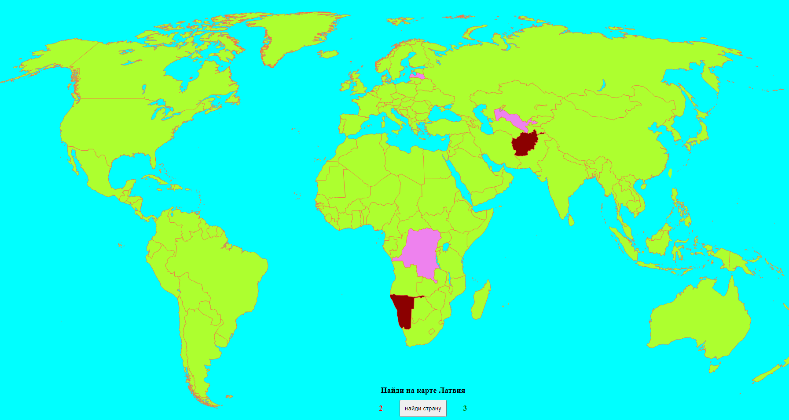

# map-game

| Deadline         | Folder name | Branch name |
| ---------------- | ----------- | ----------- |
| 25.03.2020 23:59 | map-game    | map-game   |

## Task  Map-game

Map-game - Небольшая игра на знание географии. При нажатии на кнопку звучит (а так же выводится на экран) название страны. Пользователь должен мышкой кликнуть на карте на страну. В случае правильного ответа - территория страны закрашивается одним цветом, в случае не правильного - другим. Реализован ховер-эффект при наведении мышкой на страну, так же ведется подсчет количества правильных и не правильных ответов. Игра может быть реализована на русском, английском, белорусском или украинском. Дизайн на ваше усмотрение. Демо версия не содержит полный функционал или идеальный дизайн, она указана просто для ориентира, в качестве.

- Видео: тут будет ссылка
- Demo: [пример аналогичной игры](https://map-game-rs.netlify.app/)

## Критерии оценки

**Максимальный балл за задание +40**

Базовый функционал:

Basic scope:
  - воспроизводится функциональность исходного проекта: выводится на экран просьба показать страну, по стране на карте можно кликнуть и, в случае правильного ответа, вся территория страны закрашивается одним цветом, в случае не правильного - другим цветом.
- в момент начала игры на экране есть кнопка "PLAY", после нажатия на которую начинается игра, а надпись на кнопке меняется на "FIND" (Допустимо использовать другие понятные по смыслу слова или иконки)
- на экран выводится количество правильных и не правильных ответов.
- в игре участвуют 100 самых больших по площади стран. Списки стран можно найти в интернете, как и их площади. 
- первый вариант, как можно задать вопрос (второй вариант в Advanced scope) - по клику на кнопку "FIND" на экран выводится соответсвующая надпись на экране.
- есть ссылка на рсскул и на гитхаб автора работы, можно абсолютом поверх основной карты.
- дизайн на усмотрение автора. Адаптивность - работа проверяется при ширине экрана свыше 1024 пикселей. Карта должна быть на весь экран. 

Advanced scope:
- после начала игры каждый клик по карте является правильным или неправильным ответом. Эти ответы отображаются в виде звёздочек (или других символов) разного цвета в шкале с рейтингом, которая появляется в режиме игры.
- в одной сессии игры нужно показать 15 случайных стран. При следующем запуске, или перезагрузке приложения, список стран обновляется.
- после клика по стране - карта блокируется и нажимать на страны нельзя до тех пор пока не будет задан следующий вопрос.
- второй вариант, как можно задать вопрос - через задержку 1-2 секунды звучит аудио с названием искомой страны (или при нажатии на кнопку "FIND") и соответсвующая надпись на экране. 
- если пользователь не смог найти страну И не выбрал ее на карте кликом, он может нажать "FIND" - будет предложена следующая страна для поиска, а пропущенная будет засчитана как неправильный ответ.

  
Hacker scope:
  - есть озвучка игры - произносится какая страна должна быть найдена, есть звуки ошибки и правильного ответа. 
  - после окончания игры всплывает попап с оценкой: угадано 0-7 стран - ваша оценка 2, угадано 8-10 стран - ваша оценка 3, угадано 11-13 стран - ваша оценка 4, угадано 14-15 стран - молодец! Пять! (надписи могут быть другие, оформление на ваш вкус - но смысл должен сохраниться)
  - есть звуки на итоговый результат - минимум 3 разные - для пятерки, для двойки, и для трех-четырех.
  - после закрытия попапа (крестик, нажатие кнопки "esc" и/или клик вне попапа) - игра начинается с начала, с новым случайным набором стран, т е чистая карта, чистый скор и кнопка "PLAY"
  
  
## Материалы
- [Лекция JS DOM](https://youtu.be/lHsQ6EEp3ms)
- [Теория - работа с DOM деревом](https://learn.javascript.ru/document)
- [Работа с SVG](https://ru.hexlet.io/blog/posts/kak-rabotat-s-formatom-svg-rukovodstvo-dlya-nachinayuschih-veb-razrabotchikov)
- [SVG в вебе](https://svgontheweb.com/ru/)
- [работа с аудио через тег audio](https://xsltdev.ru/html/audio/)
- [синтез речи](https://developer.mozilla.org/ru/docs/Web/API/SpeechSynthesisUtterance)

Документ для вопросов:

## Cross-check

- инструкция по проведению cross-check: https://docs.rs.school/#/cross-check-flow
- форма для проверки задания: 
- ссылки на лучшие работы добавьте, пожалуйста, в эту форму 
