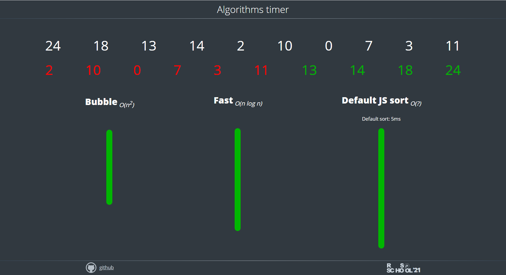

# Algorithms/Data Structures

- [Basic Sorting and Searching Algorithms](#Basic-Sorting-and-Searching-Algorithms)
- [Basic Data Structures](#Basic-Data-Structures)

## Basic Sorting and Searching Algorithms

### Big-О Notation

In programming, Big-O notation indicates the number of steps (processor clock cycles) an algorithm takes to execute. It characterizes the efficiency of a function or a specific algorithm.

Donald Knuth introduced the use of Big-O to assess algorithm complexity.  
Read as: O(1) – O of one, O(n) – O of n.

The faster the execution time of a function increases with the number of elements, the less efficient the algorithm is. Some commonly encountered complexities include:

- О(1)
- O(log n)
- O(n)
- O(n log n)
- O(n²)
- O(n!)

Their efficiencies:


The following demo visually compares the execution speed of some sorting algorithms that differ in their Big-O values (the image is clickable):

[](https://algorithms-timer-demo.netlify.app/)

### Bubble Sort

Iterates through a dataset from left to right, comparing values within each pair and moving the smallest to the left. The process repeats until no value can be moved.

The algorithm is simple to implement but inefficient.

#### Efficiency (Big-O)

- Best case: O(n)
- Average and worst cases: O(n²)

#### Implementation

```js
function bubbleSort(arr) {
  const n = arr.length;
  for (let i = 0; i < n - 1; i++) {
    for (let j = 0; j < n - 1 - i; j++) {
      if (arr[j + 1] < arr[j]) {
        let t = arr[j + 1];
        arr[j + 1] = arr[j];
        arr[j] = t;
      }
    }
  }
  return arr;
}
bubbleSort(arr);
```

### Merge sort

Divides the entire dataset into a minimum of two groups. Pairs of values are compared, and the smallest is moved to the left. After sorting within all pairs, the left values of two left pairs are compared, creating a group of four values: two smallest on the left, two largest on the right.  
This process repeats until only one set remains.

One of the fundamental sorting algorithms.

#### Efficiency (Big-O)

- Best case: O(n)
- Average and worst cases: O(n log n)

### Quick Sort

Divides the entire dataset in half by selecting the middle element and moving all elements smaller than it to the left. The same procedure is iteratively performed on the left part until only two elements remain. The same process is then applied to the right part.  
Data will continuously split until fully sorted.

###### Note

Although the Big-O values here are the same as many other sorting algorithms (and in some cases worse), this algorithm often performs faster in practice, for example, compared to merge sort.

#### Efficiency (Big-O)

- Best case: O(n)
- Average case: O(n log n)
- Worst case: O(n²)

#### Implementation

```js
function quickSort(arr) {
  if (arr.length == 0) return [];
  let a = [],
    b = [],
    p = arr[0];

  for (let i = 1; i < arr.length; i++) {
    if (arr[i] < p) a.push(arr[i]);
    else b.push(arr[i]);
  }
  return quickSort(a).concat(p, quickSort(b));
}
quickSort(arr);
```

#### Comparison of Merge Sort and Quick Sort

- Quick sort is often more efficient in practice
- Merge sort immediately divides the dataset into the smallest possible groups and then incrementally sorts and merges the groups
- Quick sort sequentially divides the dataset by the average value until it is recursively sorted

### Binary Search

#### Implementation

1. Iteration Method

```js
const arr = [-1, 0, 1, 2, 3, 4, 6, 100, 10000];

function binarySearchIterationMethod(arr, i) {
  let left = 0;
  let right = arr.length - 1;
  let mid;

  while (left <= right) {
    mid = Math.floor((right + left) / 2);

    if (arr[mid] === i) {
      return mid;
    } else if (arr[mid] > i) {
      right = mid - 1;
    } else {
      left = mid + 1;
    }
  }

  return -1;
}

binarySearchIterationMethod(arr, 100); // 7
```

2. Recursive Method

```js
function binarySearchRecursiveMethod(arr, i, left = 0, right = arr.length - 1) {
  if (left > right) return -1;
  else {
    let mid = Math.floor((right + left) / 2);
    if (arr[mid] === i) {
      return mid;
    } else if (arr[mid] > i) {
      return binarySearchRecursiveMethod(arr, i, left, mid - 1);
    } else {
      return binarySearchRecursiveMethod(arr, i, mid + 1, right);
    }
  }
}

binarySearchRecursiveMethod(arr, 5); // -1
```

---

## Basic Data Structures

- Array
- Linked List
- Stack
- Queue
- Hash Table
- Binary Tree

### Array

- An ordered set of elements, each accessible by its index (ordinal number in the array)
- Optimal for indexing (retrieving an array element by its number).
- Poor for search, insertion, and deletion unless performed at the very end of the array

#### Efficiency (Big-O)

- Indexing: O(1)
- Search: O(n)
- Binary search: O(log n)
- Insertion: Inadmissible _(unless performed at the very end of the array)_

### Linked List

- Data is stored in nodes, pointing to other nodes. The list looks like nested objects
- Each node has a value (the value of that element/node) and nextNode (reference to the next element in the linked list).
- Optimal for insertion and deletion (as it only requires shifting the pointer from one element to the next).
- Poor for indexing and searching (difficult to get an element by its number or find an element due to nested structure).

#### Efficiency (Big-O)

- Indexing: O(n)
- Search: O(n)
- Binary search: O(n)
- Insertion: O(1)

###### Note

There is a Doubly Linked List: it has, in addition to nextNode and value, a previousNode (value of the node, reference to the next node, and reference to the previous node, respectively).

### Stack

- Usually implemented using a linked list but can be created from an array
- Stacks are Last-In-First-Out (LIFO) data structures
- An analogy to a stack is a stack of plates: the last plate added to the stack will be the first one taken
- The head is the only place for inserting and removing elements

#### Efficiency (Big-O)

- Indexing: O(n)
- Search: O(n)
- Binary search: O(n)
- Insertion: O(1)

### Queues

- Like stacks, queues can be implemented using a linked list or an array
- Queues are First-In-First-Out (FIFO) data structures
- An analogy to a queue is a line at a store: the first customer in will be served first
- Elements are removed from the head, and added to the tail

#### Efficiency (Big-O)

- Indexing: O(n)
- Search: O(n)
- Binary search: O(n)
- Insertion: O(1)

### Hash Table (Object)

- Data is stored in the form of key-value pairs.
- Optimal for search, insertion, and deletion.

#### Efficiency (Big-O)

- Indexing: O(1)
- Search: O(1)
- Insertion: O(1)

### Binary Tree

- A binary tree is a data structure in which each node has a maximum of two child elements: left and right
- The key of the left child node is smaller than that of the parent
- The key of the right child node is larger than that of the parent
- Optimal for sorting and searching

#### Efficiency (Big-O)

- Indexing: O(log n)
- Search: O(log n)
- Insertion: O(log n)

#### What to do before the start of the course

- Perform tasks on the [Codewars website](https://www.codewars.com/) and determine the Big O notation of the algorithms you use.

#### RS School webinars

// TODO: revise materials

- [Data Structures with JS](https://youtu.be/j6w_ZJSYNRU)

#### Additional Materials

// TODO: revise materials

- [Шпаргалка для технического собеседования](https://habr.com/ru/company/mailru/blog/350326/)
- [Алгоритмы сортировки в танцах](https://www.youtube.com/user/AlgoRythmics/videos)
- [Оценка сложности алгоритма. Сложность алгоритмов. Big O](https://youtu.be/ZRdOb4yR0kk)
- [CS50 (Computer Science 50)](https://ru.wikipedia.org/wiki/CS50)
