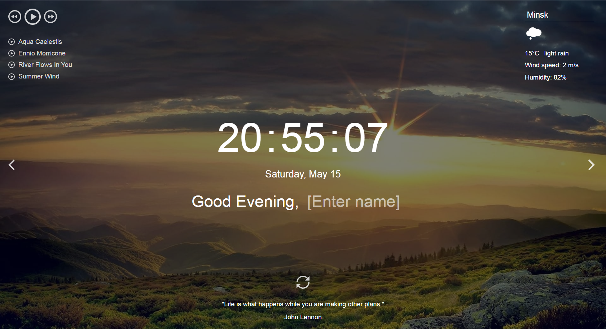

# momentum

**Momentum** - аналог [одноимённого приложения](https://chrome.google.com/webstore/detail/momentum/laookkfknpbbblfpciffpaejjkokdgca?hl=ru) интернет-магазина Chrome. Приложение показывает время и имя пользователя. Фоновое изображение и приветствие меняются в зависимости от времени суток.  
В приложении есть часы, слайдер изображений, виджеты погоды, аудиоплеер, блок цитата дня, настройки. Для хранения имени пользователя и населённого пункта используется локальное хранилище - local storage.

#### Ключевые навыки:

- методы поиска элементов;
- вывод данных на страницу;
- работа с датой и временем;
- работа с аудио;
- сохранение данных в local storage;
- использование рекурсивного setTimeout;
- деление js-кода на модули;
- работа с асинхронными запросами.

- [Demo](https://momentum-2021q3.netlify.app/)
- [Файлы с вёрсткой](https://github.com/rolling-scopes-school/stage1-tasks/tree/momentum)

#### Советы по выполнению задания

- [0. Организация работы](momentum-hints.md)
- [1. Часы и календарь](momentum-time.md)
- [2. Приветствие](momentum-greeting.md)
- [3. Слайдер изображений](momentum-slider.md)
- [4. Виджет погоды](momentum-weather.md)
- [5. Виджет "цитата дня"](momentum-quote.md)
- [6. Аудиоплеер](momentum-audio.md)
- [7. Продвинутый аудиоплеер](momentum-audio-advanced.md)
- [8. Перевод приложения](momentum-translation.md)
- [9. Получение фонового изображения от API](momentum-api-image.md)
- [10. Настройки приложения](momentum-settings.md)

## Функционал приложения

1. Часы и календарь +15
   - время выводится в 24-часовом формате, например: `21:01:00` +5
   - время обновляется каждую секунду - часы идут. Когда меняется одна из цифр, остальные при этом не меняют своё положение на странице (время не дёргается) +5
   - выводится день недели, число, месяц, например: "Воскресенье, 16 мая" / "Sunday, May 16" / "Нядзеля, 16 траўня" +5  
     Язык и формат вывода даты определяется языком приложения.
   - при изменении дня недели, даты, месяца эти данные меняются в приложении (в ходе кросс-чека этот пункт не проверяется)
2. Приветствие +10
   - текст приветствия меняется в зависимости от времени суток (утро, день, вечер, ночь) +5
     - с 6:00 до 11:59 - Good morning / Доброе утро / Добрай раніцы
     - с 12:00 до 17:59 - Good afternoon / Добрый день / Добры дзень
     - с 18:00 до 23:59 - Good evening / Добрый вечер / Добры вечар
     - с 00:00 до 5:59 - Good night / Доброй/Спокойной ночи / Дабранач
   - при изменении времени суток, если в это время приложение открыто, меняется текст приветствия (в ходе кросс-чека этот пункт не проверяется)
   - пользователь может ввести своё имя. При перезагрузке страницы приложения имя пользователя сохраняется, данные о нём хранятся в local storage +5
3. Смена фонового изображения +20  
   При загрузке или перезагрузке приложения фоновое изображение выбирается из расположенной на GitHub [коллекции изображений](https://github.com/rolling-scopes-school/stage1-tasks/tree/assets/images).  
   Репозиторий с изображениями необходимо форкнуть, и использовать изображения форкнутого репозитория, а не школьного.  
   Сами изображения желательно оптимизировать, например, конвертировать в формат WebP с целью уменьшения веса и увеличения скорости загрузки.  
   Также можно использовать свою собственную коллекцию изображений.  
   Скачать картинки на компьютер и использовать локальные файлы нельзя.
   - ссылка на фоновое изображение формируется с учётом времени суток и случайного номера изображения (от `01` до `20`) +5  
     Пример ссылки на фоновое изображение: `https://raw.githubusercontent.com/rolling-scopes-school/stage1-tasks/assets/images/evening/18.jpg`, здесь
     - `evening` - время суток, другие значения `afternoon`, `morning`, `night`
     - `18` - рандомный (случайный) номер изображения, от `01` до `20`.
   - изображения можно перелистывать кликами по стрелкам, расположенным по бокам экрана.
   - изображения перелистываются последовательно - после 18 изображения идёт 19 (клик по правой стрелке), перед 18 изображением идёт 17 (клик по левой стрелке) +5
   - изображения перелистываются по кругу: после двадцатого изображения идёт первое (клик по правой стрелке), перед 1 изображением идёт 20 (клик по левой стрелке) +5
   - при смене слайдов важно обеспечить плавную смену фоновых изображений. Не должно быть состояний, когда пользователь видит частично загрузившееся изображение или страницу без фонового изображения. Плавную смену фоновых изображений не проверяем: 1) при загрузке и перезагрузке страницы 2) при открытой консоли браузера 3) при слишком частых кликах по стрелкам для смены изображения +5
4. Виджет погоды +15
   - город по умолчанию - Минск, пока пользователь не ввёл другой город
   - при перезагрузке страницы приложения указанный пользователем город сохраняется, данные о нём хранятся в local storage +5
   - для указанного пользователем населённого пункта выводятся данные о погоде, если их возвращает API
   - данные о погоде включают в себя: иконку погоды, описание погоды, температуру в `°C`, скорость ветра в `м/с`, относительную влажность воздуха в `%`. Числовые параметры погоды округляются до целых чисел +5
   - выводится уведомление об ошибке при вводе некорректных значений, для которых API не возвращает погоду (пустая строка или бессмысленный набор символов) +5
5. Виджет цитата дня +10
   - при загрузке страницы приложения отображается рандомная цитата и её автор +5  
     В качестве источника цитаты можно использовать как API, так и созданный вами или найденный в интернете JSON-файл с цитатами и их авторами. API с цитатами не отличаются надёжностью и долговечностью, используемый в качестве источника цитат собственный JSON-файл гарантирует работоспособность вашего приложения. Запросы к JSON также осуществляются асинхронно, таким образом необходимые знания о работе с асинхронными запросами вы получите
   - при перезагрузке страницы цитата обновляется (заменяется на другую). Есть кнопка, при клике по которой цитата обновляется (заменяется на другую) +5
6. Аудиоплеер +15
   - при клике по кнопке `Play/Pause` проигрывается первый трек из блока `play-list`, иконка кнопки меняется на `Pause` +3
   - при клике по кнопке `Play/Pause` во время проигрывания трека, останавливается проигрывание трека, иконка кнопки меняется на `Play` +3
   - треки можно пролистывать кнопками `Play-next` и `Play-prev`
   - треки пролистываются по кругу - после последнего идёт первый (клик по кнопке `Play-next`), перед первым - последний (клик по кнопке `Play-prev`) +3
   - трек, который в данный момент проигрывается, в блоке `Play-list` выделяется стилем +3
   - после окончания проигрывания первого трека, автоматически запускается проигрывание следующего. Треки проигрываются по кругу: после последнего снова проигрывается первый. +3  
     Для удобства проверки треки возьмите небольшой продолжительности. Обрезать треки можно здесь: `https://mp3cut.net/ru/`
   - плейлист генерируется средствами JavaScript (в ходе кросс-чека этот пункт не проверяется)
7. Продвинутый аудиоплеер (реализуется без использования библиотек) +20
   - примерные внешний вид и функциональность плеера https://howlerplayer.github.io/
   - добавлен прогресс-бар в котором отображается прогресс проигрывания +3
   - при перемещении ползунка прогресс-бара меняется текущее время воспроизведения трека +3
   - над прогресс-баром отображается название трека +3
   - отображается текущее и общее время воспроизведения трека +3
   - есть кнопка звука при клике по которой можно включить/отключить звук +2
   - добавлен регулятор громкости, при перемещении ползунка регулятора громкости меняется громкость проигрывания звука +3
   - можно запустить и остановить проигрывания трека кликом по кнопке `Play/Pause` рядом с ним в плейлисте +3
8. Перевод приложения на два языка (en/ru или en/be) +15  
   Для перевода приложения может использоваться библиотека, например, [i18n](https://www.i18next.com/) или аналогичная.
   - переводится язык и меняется формат отображения даты +3
   - переводится приветствие и placeholder +3
   - переводится прогноз погоды в т.ч описание погоды (OpenWeatherMap API предоставляет такую возможность) и город по умолчанию +3
   - переводится цитата дня (используйте подходящий для этой цели API, возвращающий цитаты на нужном языке или создайте с этой целью JSON-файл с цитатами на двух языках) +3
   - переводятся настройки приложения. При переключении языка приложения в настройках, язык настроек тоже меняется +3
   - не переводятся данные, которые вводит пользователь: имя, город, тег для получения фонового изображения от API
9. Получение фонового изображения от API +10
   Пункт считается выполненным, если фоновые изображения, полученные от API, отвечают требованиям к фоновым изображениям, указанным в пункте 3: их можно перелистывать кликами по стрелкам, обеспечивается плавная смена фоновых изображений, ссылка на фоновое изображение формируется с учётом времени суток, если пользователь не указал другие теги для их получения. Не проверяем и не реализуем последовательное перелистывание изображений и перелистывание изображений по кругу.
   - в качестве источника изображений может использоваться Unsplash API +5
   - в качестве источника изображений может использоваться Flickr API +5
10. Настройки приложения +20
    - в настройках приложения можно указать язык приложения (en/ru или en/be) +3
    - в настройках приложения можно указать источник получения фото для фонового изображения: коллекция изображений GitHub, Unsplash API, Flickr API +3
    - если источником получения фото указан API, в настройках приложения можно указать тег/теги, для которых API будет присылает фото +3  
      Например, `nature` - фото про природу
    - в настройках приложения можно скрыть/отобразить любой из блоков, которые находятся на странице: время, дата, приветствие, цитата дня, прогноз погоды, аудиоплеер, список дел/список ссылок/ваш собственный дополнительный функционал +3
    - скрытие и отображение блоков происходит плавно, не влияя на другие элементы, которые находятся на странице, или плавно смещая их +3
    - настройки приложения сохраняются при перезагрузке страницы +5
11. Дополнительный функционал на выбор +10  
    Достаточно выполнить только один из предложенных пунктов на ваш выбор.
    - ToDo List - список дел (как в оригинальном приложении) +10
    - список ссылок (как в оригинальном приложении) +10
    - свой собственный дополнительный функционал, по сложности аналогичный предложенным +10
12. На основе созданного проекта вы можете создать расширение для Google Chrome без публикации его в интернет-магазине (в ходе кросс-чека этот пункт не проверяется и не оценивается)

#### Требования к репозиторию

- задание выполняется в **приватном репозитории школы** [Как работать с приватным репозиторием](https://docs.rs.school/#/private-repository?id=Как-работать-с-приватным-репозиторием)
- если у вас не работает приватный репозиторий школы, задание можно выполнять в личном приватном репозитории.
- в приватном репозитории школы от ветки `main` создайте ветку с названием задания, в ней создайте папку с названием задания, в папке разместите файлы проекта
- для деплоя используйте gh-pages [Как сделать деплой задания из приватного репозитория школы](https://docs.rs.school/#/private-repository?id=Как-сделать-деплой-задания-из-приватного-репозитория-школы)
- если при деплое на gh-pages не будет проигрываться звук в плеере, для деплоя используйте https://app.netlify.com/drop. Название страницы дайте по схеме: имя гитхаб аккаунта - название таска
- история коммитов должна отображать процесс разработки приложения. [Требования к коммитам](https://docs.rs.school/#/git-convention?id=Требования-к-именам-коммитов)
- после окончания разработки необходимо сделать Pull Request из ветки приложения в ветку `main` [Требования к Pull Request](https://docs.rs.school/#/pull-request-review-process?id=Требования-к-pull-request-pr). **Мержить Pull Request из ветки разработки в ветку `main` не нужно**

#### Технические требования

- работа приложения проверяется в браузере Google Chrome последней версии
- можно использовать [bootstrap](https://getbootstrap.com/), [material design](https://material.io/), css-фреймворки, html и css препроцессоры
- не разрешается использовать jQuery, другие js-библиотеки и фреймворки, за исключением библиотеки для перевода приложения [i18n](https://www.i18next.com/) или аналогичной
- рекомендуется js-код приложения разбить на модули
- рекомендуется для сборки приложения использовать [Webpack](https://www.npmjs.com/package/create-rss-app)

#### Требования к оформлению приложения

- внешний вид приложения соответствует предложенному образцу или является его улучшенной версией
- вёрстка адаптивная. Минимальная ширина страницы, при которой проверяется корректность отображения приложения - 320рх, максимальная ширина страницы, при которой проверяется корректность отображения приложения - 1920рх
- интерактивность элементов, с которыми пользователи могут взаимодействовать, изменение внешнего вида самого элемента и состояния курсора при наведении, использование разных стилей для активного и неактивного состояния элемента, плавные анимации
- в футере приложения есть ссылка на гитхаб автора, год создания приложения, [логотип курса](https://rs.school/images/rs_school_js.svg) со [ссылкой на курс](https://rs.school/js/)

#### Как сабмитить задание

Засабмитить задание необходимо как можно раньше, как только в rs app появится такая возможность. Для этого зайдите в rs app https://app.rs.school/, выберите пункт Cross-Check: Submit, в выпадающем списке выберите название таска, в поле Solution URL добавьте ссылку на задеплоенную версию вашего приложения, нажмите кнопку Submit.  
После сабмита задания его можно продолжать выполнять до самого дедлайна.

#### Критерии оценки

**Максимальный балл за задание +150**

Для удобства проверки выведите в консоль браузера самооценку своего проекта по пунктам с указанием баллов за каждый выполненный вами пункт.

Баллы за отдельные пункты требований указаны в разделе ["Функционал приложения"](#функционал-приложения)

Разница между максимальной оценкой за приложение (150 баллов) и максимально возможным количеством баллов за выполнение всех пунктов требований (160 баллов) позволит сгладить возможные ошибки проверяющих в ходе кросс-чека, неточности в описании задания, разное понимание требований задания проверяющим и проверяемым.

## Проверка задания

- задание будет проверяться посредством кросс-чека.
- инструкция по проведению cross-check: https://docs.rs.school/#/cross-check-flow
- форма для кросс-чек проверки [https://momentum-crosscheck.netlify.app/](https://rolling-scopes-school.github.io/checklist/) (В списке чеклистов 2 моментума, необходимо выбрать тот в котором 40 пунктов и максимум 150 баллов)
- ссылки на лучшие работы добавьте, пожалуйста, в эту форму https://forms.gle/Xc9RVjEWTTGF6ubK8

## API с цитатами

- https://favqs.com/api/qotd
- https://type.fit/api/quotes
- https://api.chucknorris.io/jokes/random
- https://www.breakingbadapi.com/api/quotes

## Images API

- [Unsplash API](https://unsplash.com)
- [Flickr API](https://www.flickr.com)

## Материалы

- [методы поиска элементов](https://learn.javascript.ru/searching-elements-dom)
- [textContent: просто текст](https://learn.javascript.ru/basic-dom-node-properties#textcontent-prosto-tekst)
- [дата и время](https://learn.javascript.ru/date)
- [Date.prototype.toLocaleTimeString()](https://developer.mozilla.org/ru/docs/Web/JavaScript/Reference/Global_Objects/Date/toLocaleTimeString)
- [Date.prototype.toLocaleDateString()](https://developer.mozilla.org/ru/docs/Web/JavaScript/Reference/Global_Objects/Date/toLocaleDateString)
- [рекурсивный setTimeout](https://learn.javascript.ru/settimeout-setinterval#rekursivnyy-settimeout)
- [шаблонные строки](https://developer.mozilla.org/ru/docs/Web/JavaScript/Reference/Template_literals)
- [тег &lt;input&gt;](https://developer.mozilla.org/ru/docs/Web/HTML/Element/Input)
- [Страница: DOMContentLoaded, load, beforeunload, unload](https://learn.javascript.ru/onload-ondomcontentloaded)
- [localStorage](https://developer.mozilla.org/ru/docs/Web/API/Window/localStorage)
- [введение в браузерные события](https://learn.javascript.ru/introduction-browser-events)
- [тег &lt;audio&gt;](https://developer.mozilla.org/ru/docs/Web/HTML/Element/audio)
- [стили и классы](https://learn.javascript.ru/styles-and-classes)
- [изменение документа](https://learn.javascript.ru/modifying-document)
- [Поймут даже дети: простое объяснение async/await и промисов в JavaScript](https://habr.com/ru/post/474726/)
- [JavaScript. Как работает Async, Await](https://youtu.be/SHiUyM_fFME)
- [Вебинар: Асинхронность в JavaScript](https://youtu.be/Ih6Q7ka2eSQ)

Документ для вопросов: https://docs.google.com/spreadsheets/d/1dMDLBC4-1XPaVMehZB6DqetToXZhq4x0PiZtj-jvLRc/edit#gid=1153986630
