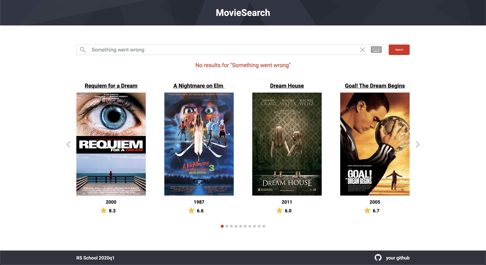

# MovieSearch

| Deadline         | Folder name  | Branch name  |
| ---------------- | ------------ | ------------ |
| 10.05.2020 23:59 | movie-search | movie-search |

**MovieSearch** - одностраничное приложение, отображающее информацию о фильмах по запросу пользователя.  
Для получения информации используется OMDb RESTful API.

## Структура приложения

- header
- поле поиска
- карточки с информацией о фильмах
- footer

## Макет приложения:


## Работа приложения

- когда пользователь открывает приложение, на странице отображается поле поиска и карточки с информацией о фильмах по произвольному, указанному разработчиком запросу
- поиск осуществляется по полному названию фильма или по части названия
- если пользователь вводит корректный поисковый запрос, по которому API возвращает результат, информация на карточках с фильмами обновляется
- при выполнении поискового запроса происходит загрузка первой страницы результата поиска из API
- во время выполнения запроса на поиск на странице присутствует индикация процесса загрузки.


- количество отображаемых карточек подстраивается под ширину страницы (карточек может быть от 1 до 4)
- на каждой карточке отображается следующая информация о фильме: название, постер, дата выхода, рейтинг IMDb.
- карточки можно перелистывать, для этого используется слайдер/свайпер (для его добавления может использоваться библиотека).
- при достижении конца слайдера/свайпера происходит загрузка следующей страницы результата поиска из API, если еще имеются данные для загрузки по данному поисковому запросу
  - пагинация работает по принципу бесконечного скроллинга, т.е. пролистывание слайдера/свайпера до тех пор, пока возможно загрузить дополнительные данные по текущему поисковому зарпросу без зацикливания слайдов
  - во избежание задержек в работе приложения, при наличии данных для загрузки, загрузку следующей страницы можно осуществлять, когда пользователю осталось пролистать определенное количество карточек
  - индикация текущего слайда в виде кружков или индикация текущей страницы не является обязательным
- если пользователь вводит некорректный поисковый запрос, по которому API возвращает ошибку, данные на карточках не меняются, приложение не ломается, выводится уведомление об ошибке



- возникающие ошибки в работе с API (прерывание соединения в ходе запроса, возвращаемые ошибки от API типа 4xx, 5xx) также обрабатываются клиентом и выводятся в область уведомления об ошибке

## Требования к репозиторию

- для разработки приложения используйте приватный репозиторий школы
- история коммитов должна отображать процесс разработки приложения. [Требования к коммитам](https://docs.rs.school/#/git-convention)
- демо-версия приложения размещается на `https://www.netlify.com/`, либо на другом подобном хостинге. Для демоверсий, размещённых на netlify.com, название сайта даётся по схеме: имя гитхаб аккаунта - название таска.
- после окончания разработки или при наступлении дедлайна, создайте pull request из ветки movie-search в ветку master. [Требования к pull request](https://docs.rs.school/#/pull-request-review-process?id=%d0%9e%d0%bf%d0%b8%d1%81%d0%b0%d0%bd%d0%b8%d0%b5-pull-request-%d0%b4%d0%be%d0%bb%d0%b6%d0%bd%d0%be-%d1%81%d0%be%d0%b4%d0%b5%d1%80%d0%b6%d0%b0%d1%82%d1%8c-%d1%81%d0%bb%d0%b5%d0%b4%d1%83%d1%8e%d1%89%d1%83%d1%8e-%d0%b8%d0%bd%d1%84%d0%be%d1%80%d0%bc%d0%b0%d1%86%d0%b8%d1%8e). Мержить pull request не нужно
- приложение проверятся ментором и другими студентами (кросс-чек)
- для проверки приложения в ходе кросс-чека ссылку на демо-версию необходимо будет добавить в rss-app

## Технические требования

- работа приложения проверяется в браузере Google Chrome последней версии
- можно использовать [bootstrap](https://getbootstrap.com/), [material design](https://material.io/), css фреймворки, html и css препроцессоры
- разрешается использовать jQuery только в качесте подключаемой зависимости для UI библиотек. Использование jQuery в основном коде приложения не допускается
- нельзя использовать Angular/React/Vue

## Требования к оформлению приложения

- минимальная ширина, при которой приложение отображается корректно – 320 рх. На разрешениях меньше десктопного виртуальная клавиатура может скрываться.
- должны присутствовать все элементы пользовательского интерфейса, представленные в демо, однако сам предложенный дизайн приложения не является обязательным и в него можно вносить свои изменения с целью улучшения
- дизайн конечного приложения должен выглядеть целостно: внешний вид соответствуют приложению, которым будут пользоваться потенциальные пользователи, постеры фильмов имеют правильные пропорции (отсутствуют какие-либо искажения), все элементы пользовательского интерфейса функционируют исправно, разметка не разваливается при изменении разрешения
- позаботьтесь об интерактивности кликабельных элементов - изменение внешнего вида самого элемента и состояния курсора при наведении, использование разных стилей для активного и неактивного состояния элемента

## Критерии оценки:

**Максимальный балл за задание: 180 баллов при кросс-чеке / 220 баллов при проверке ментором**

### Basic scope +60

- [ ] вёрстка. Минимальная ширина, при которой приложение отображается корректно – 320 рх. На разрешениях меньше десктопного виртуальная клавиатура может скрываться +10
- [ ] дизайн, UI. Выполняются требования к оформлению приложения +10
- [ ] поиск +20
  - [ ] при открытии приложения курсор находится в поле ввода
  - [ ] автозаполнение поля ввода отключено (нет выпадающего списка с предыдущими запросами)
  - [ ] есть placeholder
  - [ ] поисковый запрос можно ввести как нажатием клавиши Enter, так и кликом по кнопке Search или аналогичной
  - [ ] после ввода поискового запроса и отображения результатов поиска, набранный запрос отображается в поле ввода
  - [ ] в поле ввода есть кнопка "Очистить", которая визуально представлена в виде крестика. При клике по кнопке "Очистить" поле ввода очищается
- [ ] при отправке запроса и ожидания ответа от сервера присутствует индикация процесса загрузки +10
- [ ] при вводе в поле поиска корректного поискового запроса, по которому API возвращает результат, обновляются данные о фильмах +10

### Advanced scope +90/+130

- [ ] при вводе некорректного запроса, по которому API возвращает ошибку, приложение не ломается, выводится уведомление "No results for … " +10
- [ ] ошибки, возникающие во время выполнения запросов к API, обрабатываются и выводятся в область уведомления об ошибках +10
- [ ] при вводе запроса на русском языке поисковый запрос переводится на английский язык, выводится уведомление "Showing results for … " +10
- [ ] на карточке с фильмом указывается рейтинг IMDb +10
- [ ] название фильма является ссылкой на видеогаллерею данного фильма на сайте `https://www.imdb.com` +10
- [ ] реализован адаптивный слайдер/свайпер, карточки с фильмами можно перелистывать как кликами по стрелкам, так и пролистывать пальцем или мышкой +10
- [ ] при достижении конца слайдера/свайпера происходит загрузка следующей страницы поискового запроса +10
- [ ] слайды меняются плавно, без рывков и без проскакиваний нескольких слайдов; при смене поискового запроса данные сначала загружаются, потом отображаются, плавная смена фонового изображения +10
- [ ] карточки с фильмами отображаются на странице только после полной загрузки контента (нет постепенной подгрузки картинок) +10
- [ ] выполнены требования к коду (+40) (оценивает только ментор)
  - [ ] дублирование кода сведено к минимуму, не используются магические числа, строки, осмысленные имена переменных и функций, не слишком большие функции и т.д. (+10)
  - [ ] js-код разбит на модули: (+10)
  - [ ] подключены и используются webpack, eslint, eslint-config-airbnb-base, babel. Исправлены ошибки eslint (+10)
  - [ ] подключён jest, написаны 2-3 юнит-теста (+10)

### Hacker scope +30\*

- [ ] реализован дополнительный, не предусмотренный заданием функционал. Дополнительный функционал оценивается с точки зрения его уместности и соответствия задачам приложения, сложности реализации, полезности для пользователя +10
- [ ] поисковый запрос можно набирать на виртуальной клавиатуре. Есть возможность переключения языка клавиатуры кликом мышки +10
- [ ] поисковый запрос можно отправить, кликая мышкой по кнопке Enter на виртуальной клавиатуре. Поисковый запрос можно редактировать при помощи виртуальной клавиатуры перемещаясь стрелками вправо-влево и вводя текст на позицию курсора. +10\*

\* используйте выполненную вами виртуальную клавиатуру из таска virtual-keyboard. При необходимости в неё можно вносить изменения.

## Штрафные баллы

- [ ] не выполняются требования к pull request, репозиторию, коммитам: -10 баллов (оценивает только ментор)
- [ ] присутствуют ошибки в консоли, связанные с исполняемым кодом (ошибки типа favicon.ico: Failed to load resource: the server responded with a status of 404 или ошибки, связанные с запросами к API, не учитываются) или предупреждения eslint-config-airbnb-base: -15 баллов (оценивает только ментор)

## Cross-check

- инструкция по проведению cross-check: [docs.rs.school/#/cross-check-flow](https://docs.rs.school/#/cross-check-flow)
- форма для проверки задания: [cross-check-movie-search.netlify.com](https://cross-check-movie-search.netlify.com)
- если в ходе проверки задания не работают запросы к API, следует обратить внимание на код ошибки. Если возникла ошибка со статусом 401 Unauthorized с сообщением Request limit reached, то стоит связаться с автором работы, чтобы он смог сгенерировать новый ключ, или подождать определенное время, когда можно будет вновь выполнять запросы с указанным ключом
- возможна проблема со сторонним свайпером, когда при переходе в режим эмуляции мобильного устройства в Chrome Dev Tools не работают свайпы. В данном случае необходимо, не закрывая Dev Tools, обновить страницу и попробовать сделать свайпы по контейнеру с карточками

## Ключевые навыки

- использование RESTful API
- работа с асинхронными запросами
- реализация поиска

## Материалы

- **Асинхронные запросы, fetch/async/await**
  - [Асинхронные запросы. Использование Fetch](https://developer.mozilla.org/ru/docs/Web/API/Fetch_API/Using_Fetch)
  - [Fetch](https://learn.javascript.ru/fetch)
  - [Асинхронные функции (async/await)](https://youtu.be/5kAPExqSZ1I)
  - [JavaScript Fetch API and using Async/Await](https://dev.to/shoupn/javascript-fetch-api-and-using-asyncawait-47mp)
  - [Вебинар: Асинхронность в JavaScript. Таймеры, промисы, async/await](https://youtu.be/Ih6Q7ka2eSQ)
- **Тестирование. Юнит-тесты. Jest**
  - [Testing](https://youtu.be/xrS60rkoG3w)
  - [Testing live coding](https://youtu.be/qFSrImO04X8)
- **Советы по качеству кода**
  - [Магические числа](https://ru.code-basics.com/languages/javascript/modules/variables/lessons/magic-numbers)
  - [Как писать чистый код: обзор лучших практик JavaScript](https://techrocks.ru/2019/08/27/writing-clean-code-in-javascript/)
  - [Рекомендации по написанию чистого кода на JavaScript](https://habr.com/ru/company/ruvds/blog/454520/)
  - [Разбор похожего задания YouTube Client](https://www.youtube.com/watch?v=1Nk09Z4ca4A)
- **API**
  - [OMDb API](http://www.omdbapi.com/)
  - [Yandex.Translate API](https://tech.yandex.com/translate/)
  - [Swiper API](https://swiperjs.com/api/)
- **Туториалы**
- [How to build a movie search app](https://www.freecodecamp.org/news/how-to-build-a-movie-search-app-using-react-hooks-24eb72ddfaf7/)

## Примеры использования API

- Получаем OMDb API Key  
  `http://www.omdbapi.com/apikey.aspx`
- Поисковый запрос по ключевому слову "dream" (по умолчанию загружается первая страница)
  `https://www.omdbapi.com/?s=dream&apikey=9b67fc54`
- Получение второй страницы для поискового запроса по ключевому слову "dream"
  `https://www.omdbapi.com/?s=dream&page=2&apikey=9b67fc54`
- Получаем рейтинг IMDb по imdbID из предыдущего запроса  
  `https://www.omdbapi.com/?i=tt0180093&apikey=9b67fc54`
- Получаем Yandex.Translate API key  
  `https://translate.yandex.com/developers/keys`
- Перевод слова "мечта"  
  `https://translate.yandex.net/api/v1.5/tr.json/translate?key=trnsl.1.1.20200322T155651Z.de98a60e6a99185e.089aea4237b51c6db082c966f27a7895cd1e8b44&text=мечта&lang=ru-en`

<details> 
  <summary>Примеры асинхронных запросов</summary>

  <p></p>

JS-код для получения названия фильма (название выводится в консоль)

- при помощи fetch

```javascript
function getMovieTitle(page) {
  const url = `https://www.omdbapi.com/?s=dream&page=${page}&apikey=9b67fc54`;

  return fetch(url)
    .then((res) => res.json())
    .then((data) => {
      console.log(data.Search[0].Title);
    });
}
```

- при помощи async/await

```javascript
async function getMovieTitle(page) {
  const url = `https://www.omdbapi.com/?s=dream&page=${page}&apikey=9b67fc54`;

  const res = await fetch(url);
  const data = await res.json();

  console.log(data.Search[0].Title);

  return data;
}
```

</details>

### Документ для вопросов

- документ для вопросов, связанных с выполнением задания: [ссылка](https://docs.google.com/spreadsheets/d/1QQ4dz0sTOB-DePFiIXL8ZXoUWsZvWW3uvwnkqpUigk4/edit#gid=0)
- ссылки на лучшие работы с оригинальным дизайном, и/или реализованными дополнительным функционалом добавьте, пожалуйста, в эту форму: [ссылка](https://forms.gle/2eciWF1DaVALyZN16)
