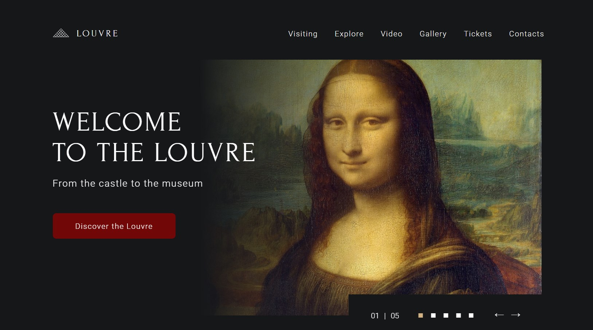

## museum

Задание Museum - продолжение одноимённого задания, которое вы выполняли на этапе stage#0 или в ходе самостоятельной подготовки к курсу. В ходе его выполнения вам необходимо дополнить свёрстанный ранее landing page Лувра, добавить ему адаптивность и реализуемый через JavaScript функционал.

## Этапы работы над проектом:

- фиксированная вёрстка - 1 неделя
- [адаптивная вёрстка](museum-adaptive.md) - 1 неделя
- [добавление JavaScript](museum-dom.md) - 1 неделя

Каждый этап проверяется в ходе кросс-чека.  
Кросс-чек стартует во вторник утром и закрывается в четверг поздно ночью в 23:59 UTC.

## Фиксированная вёрстка. Ключевые навыки:

- валидная семантическая вёрстка
- легкоподдерживаемый читаемый код
- экспорт стилей и графики из Figma
- работа с растровой и векторной графикой
- подключение шрифтов
- использование flexbox и grid для построения сеток
- вёрстка навигационных элементов интерфейса
- вёрстка карточных элементов интерфейса
- вёрстка и стилизация интерактивных элементов интерфейса (кнопки, ссылки, переключатели)
- вёрстка и стилизация форм

<kbd></kbd>

[Макет Museum](https://www.figma.com/file/xkP6mIaq7uG1Uru7CpasXq/Museum-04.09)  
[Советы по выполнению задания. Часть 1](museum-hints.md)  
[Советы по выполнению задания. Часть 2](museum-hints-stage1.md)  
[Папка assets с изображениями и видео](https://github.com/rolling-scopes-school/stage1-tasks/tree/museum)  
[Используемые в макете ссылки](https://github.com/rolling-scopes-school/stage1-tasks/blob/museum/README.md)

## Создание собственной копии макета:

- авторизуемся в Фигме
- открываем макет
- нажимаем на стрелку рядом с названием макета на панели вверху, выбираем пункт "Duplicate to your drafts"
- слева вверху открываем настройки, выбираем "Back to files"
- открываем копию макета рядом с которой есть надпись "In Drafts"

## Изменения в макете по сравнению со stage#0

- в секции `Welcome` добавлен бесконечный слайдер/свайпер
- карточки-ссылки секции `Visiting` и кнопка `Discover the Louvre` секции `Welcome` перенаправляют на страницы вашего сайта, в которые встроены полноэкранные панорамы Google Street View
- в секции `Video` заголовок с описанием переместились вверх, а внизу добавился плейлист с видео
- добавилась секция `Gallery`, в меню появились ссылки на эту секцию
- в секции `Tickets` добавилась большая полноэкранная форма покупки билетов, которая открывается при клике по кнопке `Buy Now`
- добавлен параллакс
- в `footer` добавились выходные данные сайта - знак копирайта, год создания сайта, ссылка на RS School, ваш GitHub username со ссылкой на ваш гитхаб-аккаунт
- небольшие изменения в оформлении: в секции `Tickets` поменялся цвет фона и шрифта, в плеере исчезли кнопки перелистывания вперёд-назад, в секции `Explore` добавились элементы слайдера сравнения изображений и т.д.

## Изменения в технических требованиях по сравнению со stage#0

- для студентов, уже знакомых с вёрсткой, рекомендуется использование Sass и Webpack

## Структура макета:

- Макет выполнен для разрешения (ширины) страницы: 1920рх, 1024рх, 768рх, 420рх
- На этапе фиксированной вёрстки выполняем макет 1920рх
- Макет состоит из трёх блоков: `<header>`, `<main>`, `<footer>`
- Блок `<main>` состоит из семи секций `<section>`:
  - `Welcome`
  - `Visiting`
  - `Explore`
  - `Video`
  - `Gallery`
  - `Tickets`
  - `Contacts`

## Интерактивность, реализуемая через css

1. Плавная прокрутка по якорям
2. Изменение стиля интерактивных элементов при наведении и при клике
3. Параллакс

## Технические требования

1. легкоподдерживаемый читаемый качественный код:
   - при написании кода следуйте гайдлайну https://codeguide.academy/html-css.html
   - следуйте требованиям Руководства по качеству кода, если они не противоречат гайдлайну
     - [общие принципы](../../stage1/modules/clean-code/materials/generic-principles.md)
     - [HTML и CSS рекомендации - начальный уровень](../../stage1/modules/clean-code/materials/html-and-css.md)
     - [HTML и CSS рекомендации - продвинутый уровень](../../stage1/modules/clean-code/materials/html-and-css-extended.md)
2. вёрстка валидная, семантическая, соответствующая макету
3. приложение корректно отображается и работает в браузере Google Chrome последней версии
4. запрещается использование CSS-фреймворков (bootstrap)
5. допускается использование normalize.css
6. рекомендуется использование Sass, при условии, что у вас уже есть опыт вёрстки
7. рекомендуется использование Webpack, при условии, что у вас уже есть опыт вёрстки

## Требования к репозиторию

- задание выполняется в приватном репозитории школы. [Как работать с приватным репозиторием школы](https://docs.rs.school/#/private-repository)
- от ветки `main` создайте ветку `museum` в ней создайте папку `museum`, в ней разместите файлы проекта
- для деплоя используйте `gh-pages` [Как сделать деплой задания из приватного репозитория школы](https://docs.rs.school/#/private-repository?id=Как-сделать-деплой-задания-из-приватного-репозитория-школы)
- при невозможности использовать `gh-pages`, используйте для деплоя https://app.netlify.com/drop. Название страницы дайте по схеме: имя гитхаб аккаунта - название таска

## Требования к коммитам

- История коммитов должна отображать процесс разработки приложения.
- [Названия коммитов дайте согласно гайдлайну](https://docs.rs.school/#/git-convention)

## Требования к Pull Request

- Название Pull Request дайте по названию задания
- [Описание Pull Request дайте по схеме](https://docs.rs.school/#/pull-request-review-process?id=Требования-к-pull-request-pr)  
  **Мержить Pull Request из ветки разработки в ветку `main` не нужно**.

## Соответствие вёрстки макету

- допускается отклонение вёрстки от макета до 10px по горизонтали и вертикали, если соблюдается визуальное сходство вёрстки и макета. Разрешены и даже приветствуются правки размеров и расположения криво нарисованных блоков.
- в качестве инструмента для проверки соответствия вёрстки макету используйте расширение [PerfectPixel](https://chrome.google.com/webstore/detail/perfectpixel-by-welldonec/dkaagdgjmgdmbnecmcefdhjekcoceebi?hl=ru)
- при проверке вёрстки при помощи расширения PerfectPixel в первую очередь убедетесь, что в расширении выставлен масштаб 1, в браузере и операционной системе - масштаб 100%
- если ширина экрана 1920рх и больше, для проверки вёрстки на соответствие макету достаточно вручную выставить макет по верхнему левому углу направляющих
- если ширина экрана меньше 1920рх, для проверки используем device toolbar браузера Google Chrome в режиме responsive
- каждый блок и секция рассматриваются по раздельности, т.е. недочеты предыдущего блока не переносятся на следующий, а при переходе проверки на следующий блок, мы его выравниваем с наложенным изображением
- относительно текста проверяем его выравнивание по левому или правому краю, отступы до границы блока. Размеры текста проверяются только по высоте. Отличие в ширине слов и отступах между буквами при сопоставлении макета и вёрстки не считается ошибкой, если используется правильный шрифт с правильно указанными свойствами

## Критерии оценки

**Максимальный балл за задание – 150 баллов**

Для удобства проверки выведите в консоль браузера самооценку своего проекта по пунктам с указанием баллов за каждый выполненный вами пункт.

1. Вёрстка валидная +10
   - для проверки валидности вёрстки используйте сервис https://validator.w3.org/  
     Валидной вёрстке соответствует надпись "Document checking completed. No errors or warnings to show."
2. Вёрстка семантическая. В коде страницы присутствуют следующие элементы (указано минимальное количество, может быть больше) +24
   - `<header>`, `<main>`, `<footer>` +2
   - семь элементов `<section>` (по количеству секций) +2
   - только один заголовок `<h1>` +2
   - семь заголовков `<h2>` (по количеству секций) +2
   - шесть заголовков `<h3>` (по количеству карточек) +2
   - два элемента `<nav>` (основная и вспомогательная панель навигации) +2
   - три списка `ul > li > a` (основная и вспомогательная панель навигации, ссылки на соцсети) +2
   - тринадцать кнопок button (четыре из них в секции `Video`, пять в секции `Tickets`, по две - стрелки слайдера и плейлиста) +2
   - три тега `input type="radio"` (в секции `Tickets`) +2
   - два тега `input type="number"`(в секции `Tickets`) +2
   - два тега `input type="range"` (громкось и прогрес-бар видео) +2
   - для всех элементов `` указан обязательный атрибут `alt` +2
3. Вёрстка соответствует макету +45
   - блок `<header>` +5
   - секция `Welcome` +5
   - секция `Visiting` +5
   - секция `Explore` +5
   - секция `Video` +5
   - секция `Gallery` +5
   - секция `Tickets` +5
   - секция `Contacts` +5
   - блок `<footer>` +5
4. Форма покупки билетов +22
   - форма плавно выдвигается слева при открытии и плавно возвращается назад при закрытии. В открытом состоянии под формой есть полупрозрачный overlay, который занимает весь экран. Форма и overlay прокручиваются вместе со страницей +2
   - форма открывается при клике по кнопке `Buy Now` в секции `Tickets` и закрывается кликом по иконке с крестиком в верхнем правом углу или кликом по overlay +2
   - при вёрстке формы используются следующие элементы: `form`, `input type="date"`, `input type="time"`, `input type="text"`, `input type="email"`, `input type="tel"`, `input type="number"`, `select` +8
   - вёрстка формы соответствует макету + 10
5. Требования к css + 18
   - добавлен favicon +2
   - для построения сетки используются флексы или гриды +2
   - при уменьшении масштаба страницы браузера вёрстка размещается по центру, а не сдвигается в сторону +2
   - фоновый цвет каждого блока и секции тянется на всю ширину страницы +2
   - иконки добавлены в формате `.svg`. SVG может быть добавлен любым способом. Обращаем внимание на формат, а не на способ добавления +2
   - расстояние между буквами, там, где это требуется по макету, регулируется css-свойством `letter-spacing` +2
   - переключаются радиокнопки в блоке `Tickets`, одновременно может быть выбрана только одна кнопка +2
   - в блоке `Contacts` правильно указанны ссылки на почту `mailto` и на телефон `tel` +2
   - в футере добавлены ссылки на соцсети. Круглая граница вокруг иконок соцсетей выполнена при помощи css +2
6. Интерактивность, реализуемая через css +25
   - плавная прокрутка по якорям +5
   - параллакс +5
   - при кликам по кнопке `Discover the Louvre` и карточкам секции `Visiting` открываются полноэкранные панорамы Google Street View встроенные в страницы вашего сайта при помощи iframe +5
   - изменение стиля интерактивных элементов при наведении и клике +10
     - интерактивность включает в себя не только изменение внешнего вида курсора, например, при помощи свойства `cursor: pointer`, но и другие визуальные эффекты – изменение цвета фона или шрифта, появление подчёркивания и т.д. Если в макете указаны стили при наведении и клике, для элемента указываем эти стили. Если в макете стили не указаны, реализуете их по своему усмотрению, руководствуясь общим стилем макета +4
     - обязательное требование к интерактивности: плавное изменение внешнего вида элемента при наведении и клике не влияющее на соседние элементы +2
     - интерактивность при наведении карточек в секции `Visiting` предусматривает плавное растягивание подчёркивания заголовка карточки на всю ширину карточки [Демо](https://raw.githubusercontent.com/rolling-scopes-school/tasks/master/tasks/images/hover.gif) +2
     - интерактивность при наведении иконок социальных сетей в футере предусматривает изменение цвета иконки и круглой границы вокруг иконки на золотистый +2
7. Интерактивность, реализуемая через js +16
   - можно передвигать ползунки громкости и прогресс-бар видео, при этом цвет шкалы до и после ползунка отличается и соответствует макету +2
   - кликами по кнопкам `+` и `-` в секции `Tiskets` можно менять количество билетов Basic и Senior от 0 до 20 +2
   - кнопке "Book" в форме покупки билетов добавлен ripple-эффект [Демо](https://50projects50days.com/projects/button-ripple-effect/) +2
   - при перезагрузке (обновлении) страницы картины в блоке `Galery` отображаются в рандомном порядке + 10

Разница между максимальной оценкой за приложение (150 баллов) и максимально возможным количеством баллов за выполнение всех пунктов требований (160 баллов) позволит сгладить возможные ошибки проверяющих в ходе кросс-чека, неточности в описании задания, разное понимание требований задания проверяющим и проверяемым.

## Как сабмитить задание

До наступления дедлайна зайдите в rs app https://app.rs.school/, выберите **Cross-Check: Submit**, в выпадающем списке выберите `museum`, в поле **Solution URL** добавьте ссылку на задеплоенную версию созданного вами сайта, нажмите кнопку **Submit**.

Засабмитить задание необходимо как можно раньше, как только в rs app появится такая возможность. После сабмита задание можно продолжать выполнять до самого дедлайна.

## Проверка задания

- задание будет проверяться посредством кросс-чека.
- инструкция по проведению cross-check: https://docs.rs.school/#/cross-check-flow
- форма для кросс-чека https://museum-cross-check.netlify.app/

## Материалы

- [Старт в Figma для верстальщика](https://htmlacademy.ru/blog/useful/figma)
- [Инструкция по работе в Figma для верстальщика](https://breezzly.ru/guides/start-v-figma-dlya-verstalshhika)
- [Верстка сайта с нуля из Figma](https://www.youtube.com/playlist?list=PL5_s7xdj2Vsw-bCx5nOZJMFIiHwRgok--)

## Вебинары RS School

- вебинары Сергея Шаляпина
  - [Stream 11.02.2020](https://youtu.be/UQavTWiTpnA)
  - [Stream 03.03.2020](https://youtu.be/PhRVJC0kBGE)
  - [Stream 10.03.2020](https://youtu.be/_5f0kznOM_A)
  - [Stream 17.03.2020](https://youtu.be/0M9Rz-wXYas)
  - [Stream 26.03.2020](https://youtu.be/fFDw7AH2OXo)
- вебинары Виктории Ворожун
  - [Friday Live Coding. Part 1](https://youtu.be/ZAde-IJAHzo)
  - [Friday Live Coding. Part 2](https://youtu.be/BJENQIX2e2o)
  - [Friday Live Coding. Part 3](https://youtu.be/fooyYgIuZe8)
  - [Friday Live Coding. Part 4](https://youtu.be/Qk2UGlFNKPE)
  - [Friday Live Coding. Part 5](https://youtu.be/ouZnGUefneQ)
  - [Репозиторий с кодом](https://github.com/ViktoriyaVorozhun/friday-live-coding/tree/develop)
  - [Макет в figma](https://www.figma.com/file/fw0GA18nmpVjTBzjtiEK2L/Friday_Live_Coding?node-id=0%3A1)

[Документ для вопросов](https://docs.google.com/spreadsheets/d/1zB87Qb3mX9NGVyk2LH0VLY7LYqs1TVcrXfHKZFKXfYU/edit#gid=0)
