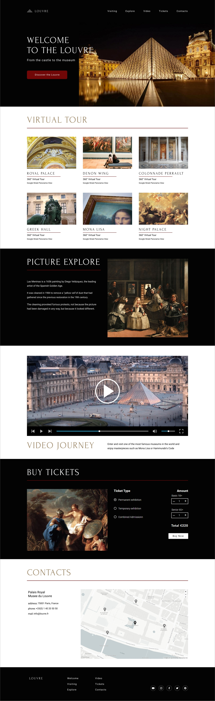

## museum

**Ваша задача** – сверстать landing page Лувра – одного из крупнейших и наиболее популярных художественных музеев мира.

#### Ключевые навыки:
- валидная семантическая вёрстка
- легкоподдерживаемый читаемый код
- экспорт стилей и графики из Figma
- работа с растровой и векторной графикой
- подключение шрифтов
- использование flexbox для построения сеток
- вёрстка навигационных элементов интерфейса
- вёрстка карточных элементов интерфейса
- вёрстка и стилизация интерактивных элементов интерфейса (кнопки, ссылки, переключатели)

#### Работа над проектом:
На подготовительном этапе - stage0 - создаётся и проверяется в ходе кросс-чека фиксированная неадаптивная вёрстка.  
В ходе основного этапа - stage1 - в вёрстку вносятся изменения и дополнения, добавляется адаптивность, реализуется создаваемая при помощи JavaScript интерактивность.

Благодаря этому, если вы приступили к выполнению задания на этапе stage0, ваша работа будет включать в себя весь цикл разработки: создание проекта, его поддержка и доработка.

На этапе stage1 планируются такие этапы работы над проектом:
- фиксированная вёрстка - 1 неделя
- адаптивная вёрстка - 1 неделя
- добавление интерактивности при помощи JavaScript - 2 недели

[Макет Museum – редактируется и дорабатывается](https://www.figma.com/file/fhycRKILxaj103q4ecs9w3/Museum-test?node-id=0%3A1)  

[Советы по выполнению задания](museum-hints.md)  
[Видео с обзором задания](https://youtu.be/OF9zQ0jRx4E)  

#### Создание собственной копии макета:
*Делайте копию только на момент выдачи таска. До этого момента в макет могут вноситься правки*
- авторизуемся в Фигме
- открываем макет
- нажимаем на стрелку рядом с названием макета на панели вверху, выбираем пункт "Duplicate to yout drafts"
- слева вверху открываем настройки, выбираем "Bask to files"
- открываем копию макета рядом с которой есть надпись "In Drafts"

#### Структура макета:
- Макет состоит из трёх блоков: `<header>`, `<main>`, `<footer>`
- Блок `<main>` состоит из шести секций `<section>`:
  1. `Welcome`
  2. `Visiting`
  3. `Explore`
  4. `Video`
  5. `Tickets`
  6. `Contacts`

#### Интерактивность, реализуемая через css
1. Плавная прокрутка по якорям
2. Изменение стиля интерактивных элементов при наведении и при клике

#### Технические требования
1. легкоподдерживаемый читаемый качественный код:
   - при написании кода следуйте гайдлайну https://codeguide.academy/html-css.html
   - выполняются требования Руководства по качеству кода, если они не противоречат гайдлайну
     - [общие принципы](..\clean-code-guide\generic-principles.md)
     - [HTML и CSS рекомендации - начальный уровень](..\clean-code-guide\html-and-css.md)
     - [HTML и CSS рекомендации - продвинутый уровень](..\clean-code-guide\html-and-css-extended.md)
2. вёрстка валидная, семантическая, соответствующая макету
3. приложение корректно отображается и работает в браузере Google Chrome последней версии
4. запрещается использование CSS-фреймворков (bootstrap)
5. допускается использование CSS-препроцессоров (Sass), normalize.css

**Максимальный балл за задание – 100 баллов**

#### Критерии оценки
1. Вёрстка валидная +10
   - для проверки валидности вёрстки используйте сервис https://validator.w3.org/  
     Валидной вёрстке соответствует надпись "Document checking completed. No errors or warnings to show."
2. Вёрстка семантическая +24
   - в коде странице присутствуют следующие элементы (указано минимальное количество, может быть больше):
     - `<header>`, `<main>`, `<footer>` +2
     - шесть элементов `<section>` (по количеству секций) +2
     - только один заголовок `<h1>` +2
     - шесть заголовков `<h2>` (по количеству секций) +2
     - шесть заголовков `<h3>` (по количеству карточек) +2
     - два элемента `<nav>` (основная и вспомогательная панель навигации) +2
     - три списка `ul > li > a` (основная и вспомогательная панель навигации, ссылки на соцсети) +2
     - шесть кнопок `<button>` (пять из них в секции `Tickets`) +2
     - три тега `input type="radio"` (в секции `Tickets`) +2
     - два тега `input type="number"`(в секции `Tickets`) +2
     - два тега `input type="range"` (громкось и прогрес-бар видео) +2
     - для всех элементов `` указан обязательный атрибут `alt` +2
3. Вёрстка соответствует макету +45
   - блок `<header>` +5
   - секция `Welcome` +5
   - секция `Visiting` +5
   - секция `Explore` +5
   - секция `Video` +5
   - секция `Tickets` +10
   - секция `Contacts` +5
   - блок `<footer>` +5 
   - допускается отклонение вёрстки от макета до 10px по горизонтали и вертикали, если соблюдается визуальное сходство вёрстки и макета. Разрешены и даже приветствуются правки размеров и расположения криво нарисованных блоков.
   - в качестве инструмента для проверки соответствия вёрстки макету используйте дополнение [PerfectPixel](https://chrome.google.com/webstore/detail/perfectpixel-by-welldonec/dkaagdgjmgdmbnecmcefdhjekcoceebi?hl=ru)
   - если разрешение экрана 1440рх и больше, проверку проводим в разрешении экрана 100%, достаточно выставить макет по верхнему левому углу направляющих
   - если разрешение экрана меньше 1440рх, для проверки можно а) уменьшить масштаб страницы б) использовать device toolbar браузера Google Chrome в режиме responsive
   - каждый блок и секция рассматриваются по раздельности, т.е. недочеты предыдущего блока не переносятся на следующий, а при переходе проверки на следующий блок, мы его выравниваем с наложенным изображением
   - относительно текста проверяем его выравнивание по левому или правому краю, отступы до границы блока. Размеры текста проверяются только по высоте. Отличие в ширине слов и отступах между буквами при сопоставлении макета и вёрстки не считается ошибкой, если используется правильный шрифт с правильно указанными свойствами
4. Требования к css + 16
   - для построения сетки используются флексы или гриды +2
   - при уменьшении масштаба страницы браузера вёрстка размещается по центру, а не сдвигается в сторону +2
   - фоновый цвет каждого блока и секции тянется на всю ширину страницы +2
   - иконки добавлены в формате `.svg`. SVG может быть добавлен любым способом. Обращаем внимание на формат, а не на способ добавления +2
   - изображения добавлены в формате `.jpg`, изображение карты добавлено в формате `.png` +2
   - расстояние между буквами, там, где это требуется по макету, регулируется css-свойством `letter-spacing` +2
   - фоновое изображение блока `Welcome` остаётся на своём месте даже если сильно уменьшить масштаб страницы +2
   - переключаются радиокнопки в блоке `Tickets`, одновременно может быть выбрана только одна кнопка +2
5. Интерактивность, реализуемая через css +15
   - плавная прокрутка по якорям +5
   - изменение стиля интерактивных элементов при наведении и клике +10
     - интерактивность включает в себя не только изменение внешнего вида курсора, например, при помощи свойства `cursor: pointer`, но и другие визуальные эффекты – изменение цвета фона или шрифта, появление подчёркивания и т.д.
     - если в макете указаны стили при наведении и клике, для элемента указываем эти стили
     - если в макете стили не указаны, реализуете их по своему усмотрению, руководствуясь общим стилем макета
     - обязательное требование к интерактивности: плавное изменение внешнего вида элемента при наведении и клике не влияющее на соседние элементы

Разница между максимальной оценкой за приложение (100 баллов) и максимально возможным количеством баллов за выполнение всех пунктов требований (110 баллов) позволит сгладить возможные ошибки проверяющих в ходе кросс-чека, неточности в описании задания, разное понимание требований задания проверяющим и проверяемым.

#### Требования к репозиторию
*Вопрос о том, выполнять задание в личном репозитории или репозитории школы, в процессе уточнения. Окончательное решение будет принято до выдачи задания*
- Задание выполняется в приватном репозитории школы. [Как работать с приватным репозиторием школы](https://docs.rs.school/#/private-repository)
  - если у вас не создаётся приватный репозиторий школы, задание можно выполнять в личном приватном репозитории.
- От ветки `main` создайте ветку `museum` в ней создайте папку `museum`, в ней разместите файлы проекта
- Для деплоя используйте `gh-pages` [Как сделать деплой задания из приватного репозитория школы](https://docs.rs.school/#/private-repository?id=Как-сделать-деплой-задания-из-приватного-репозитория-школы)
  - если не можете для деплоя использовать `gh-pages`, используйте https://app.netlify.com/drop. Название страницы дайте по схеме: имя гитхаб аккаунта - название таска

#### Требования к коммитам
- История коммитов должна отображать процесс разработки приложения.
- [Названия коммитов дайте согласно гайдлайну](https://docs.rs.school/#/git-convention)

#### Требования к Pull Request
- Название Pull Request дайте по названию задания
- [Описание Pull Request дайте по схеме](https://docs.rs.school/#/pull-request-review-process?id=Требования-к-pull-request-pr)
  **Мержить Pull Request не нужно**.

#### Как сабмитить задание
До наступления дедлайна зайдите в rs app https://app.rs.school/, выберите **Cross-Check: Submit**, в выпадающем списке выберите `museum`, в поле **Solution URL** добавьте ссылку на задеплоенную версию созданного вами сайта, нажмите кнопку **Submit**.

Засабмитить задание необходимо как можно раньше, как только в rs app появится такая возможность. После сабмита задание можно продолжать выполнять до самого дедлайна.

#### Проверка задания
- задание будет проверяться посредством кросс-чека.
- инструкция по проведению cross-check: https://docs.rs.school/#/cross-check-flow

#### Материалы
- [Старт в Figma для верстальщика](https://htmlacademy.ru/blog/useful/figma)
- [Инструкция по работе в Figma для верстальщика](https://breezzly.ru/guides/start-v-figma-dlya-verstalshhika)
- [Верстка сайта с нуля из Figma](https://www.youtube.com/playlist?list=PL5_s7xdj2Vsw-bCx5nOZJMFIiHwRgok--)
- [Официальный сайт Лувра](https://www.louvre.fr/) - источник картинок, ссылок, видео

