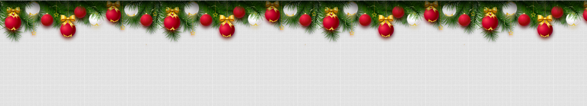

# Happy New Year

| Deadline         | Folder name   | Branch name   |
| ---------------- | ------------- | ------------- |
| 28.12.2020 23:59 | new-year-card | new-year-card |

В этом задании создадим новогоднюю открытку, которой можно поздравить родных, знакомых, студентов и менторов RS School. При её создании можно использовать те технологии, которые освоили за период учёбы в RS School, проявить свои таланты и способности. Задание творческое, единственный обязательный элемент в нём - новогодняя гирлянда.

[Демо](https://pcvector.net/demo.html?link=/uploads/demo/scripts/other/newyear_garland/index.html)

[Код на гитхабе (можно использовать в качестве источника звуков и изображений)](https://github.com/bybelov/new-year-garland)

## Работа приложения

1. При наведении курсора мышки на шарики гирлнды, они покачиваются, при этом воспроизводится мелодичные звуки.
2. Покачивание шариков и воспроизведение звука происходит также при кликах по клавишам клавиатуры
3. Мерцающие огоньки на гирлянде. Интенсивность свечения каждого огонька меняется в зависимости от таймера. Когда текущий огонёк становится ярче, предыдущий тускнеет, возвращаясь к исходной интенсивности. Такими огоньками могут быть шарики гирлянды, звёздочки или можно сделать на гирлянде точечные разноцветные огоньки - выбор за вами. [Демо](https://codepen.io/tobyj/full/QjvEex).

## Требования к репозиторию

- задание выполняется в приватном репозитории школы [Как работать с приватным репозиторием](https://docs.rs.school/#/private-repository?id=Как-работать-с-приватным-репозиторием). Если у вас нет приватного репозитория школы, задание можно выполнять в личном приватном репозитории.
- в приватном репозитории создайте ветку с названием задания, в ней создайте папку с названием задания, в ней разместите файлы проекта
- для деплоя используйте `gh-pages` [Как сделать деплой задания из приватного репозитория школы](https://docs.rs.school/#/private-repository?id=Как-сделать-деплой-задания-из-приватного-репозитория-школы). Также для деплоя можно использовать https://app.netlify.com/drop  
  Для демоверсий, размещённых на `netlify`, название страницы дайте по схеме: имя гитхаб аккаунта - название таска
- история коммитов должна отображать процесс разработки приложения. [Требования к коммитам](https://docs.rs.school/#/git-convention)
- после окончания разработки необходимо сделать Pull Request из ветки приложения в ветку `main` [Требования к Pull Request](https://docs.rs.school/#/pull-request-review-process?id=Описание-pull-request-должно-содержать-следующую-информацию). **Мержить Pull Request не нужно**

## Как сабмитить задание

Засабмитить задание необходимо как можно раньше, как только в rs app появится такая возможность. Для этого зайдите в rs app https://app.rs.school/, выберите пункт Cross-Check: Submit, в выпадающем списке выберите название таска, в поле Solution URL добавьте ссылку на задеплоенную версию вашего приложения, нажмите кнопку Submit.  
После сабмита задания его можно продолжать выполнять до самого дедлайна.

## Технические требования

- работа приложения проверяется в браузере Google Chrome последней версии
- можно использовать [bootstrap](https://getbootstrap.com/), [material design](https://material.io/), css-фреймворки, html и css препроцессоры
- разрешается использовать jQuery только в качесте подключаемой зависимости для UI библиотек. Использование jQuery в основном коде приложения не допускается
- можно использовать Angular/React/Vue, другие библиотеки и фреймворки.
- запрещено копировать код других студентов, демо, примеров, которые приводятся в задании. Этот запрет касается html, css, js кода. Можно использовать небольшие фрагменты кода со Stack Overflow, других самостоятельно найденных источников в интернете, за исключением github-репозиториев студентов курса. Возле использованного чужого фрагмента кода в комментарии указывается ссылка на источник.

## Требования к оформлению приложения

- внешний вид приложения - праздничная новогодняя открытка
- гирлянда выглядит так же как в предложенном образце или является его улучшенной версией. Если наличие новогодней гирлянды противоречит вашему замыслу, гирлянду можно скрыть, оставив кнопку для её отображения.
- вёрстка адаптивная. Минимальная ширина страницы, при которой проверяется корректность отображения приложения, 320рх

## Критерии оценки:

**Максимальный балл за задание: 30 баллов при кросс-чеке**

- шарики гирлянды при наведении курсора покачиваются +10
- при наведении курсора на шарики гирлянды воспроизводятся звуки +10
- на гирлянде есть мерцающие огоньки +10

## Материалы

- [Happy New Year 2021](https://codepen.io/marwan-ibrahim10/full/oNLrYqR)
- [Happy New Year fireworks](https://codepen.io/strangerintheq/full/Exaovjz)
- [Happy New Year 2020](https://codepen.io/uiswarup/full/JjojQby)
- [Happy New Year!](https://codepen.io/Mamboleoo/full/PZWPZx)
- [Happy New Year! -- CSS Only](https://codepen.io/Sector22/full/KwNpWr)
- [CreateJS: Happy Holidays](https://codepen.io/createjs/full/NXNwOZ)
- [Happy New Year!](https://codepen.io/sandstedt/full/ZBNjVx)

## Cross-check

- [инструкция по проведению cross-check](https://docs.rs.school/#/cross-check-flow)
- [cсылки на лучшие работы добавьте, пожалуйста, в эту форму](https://forms.gle/znHUPAS5bkmKqdxr7)
