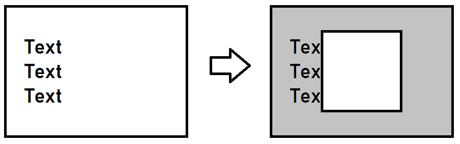

# Вариант #4

Выполнить задание согласно макету автора _Маргарита Григориева_: **[online zoo](https://www.figma.com/file/aBvQMVmI665DtzprpiniuH/online-zoo)**  
Текст ссылки: https://www.figma.com/file/aBvQMVmI665DtzprpiniuH/online-zoo

## Создание макета: неделя #1+2

Выполняется создание всех страниц для ширины экрана **1920px**.

### Технические требования

Максимальный балл: **80**

#### Общие

Все фоновые элементы макета должны растягиваться на всю доступную ширину экрана, если ширина больше 1920px. При этом направляющие должны сохраняться в исходном размере, 1160px. Особенностью этого проекта являются:

- нестандартные слайдеры,
- интересные адаптивные переходы.

Для создания вертикальных отступов лучше использовать вертикальные margin на блоках высшего порядка, насколько это возможно. При этом иметь ввиду, что вертикальные margin могут схлопнуться.

Для создания многоколоночных структур, или элементов имеющих относительное горизонтальное расположение, должно быть использовано одно из свойств:

- display: flex
- display: grid
- display: inline-block

#### Landing (25 баллов)

1. **Header** (`<header>` содержит только логотип и панель навигации)

- Логотип находится слева. Нажатие на логотип работает по принципу нажатия на `About`, перебрасывает нас на текущую страницу, на Landing.
- Интерактивная панель навигации.
- Нажатие на `Map` перебрасывает нас на Map.
- Нажатие на `Zoos` перебрасывает нас на Zoos_panda.
- Нажатие на `Contact Us` перебрасывает нас на Error 404.
- Нажатие на `Design` перебрасывает нас на оригинальную страницу [Figma](https://www.figma.com/file/aBvQMVmI665DtzprpiniuH/online-zoo?node-id=0%3A1).
- Должен быть подсвечен первый элемент `About`. И он не должен быть интерактивным.
- На странице обязательно должен присутствовать один элемент `<h1>`. В нем должен быть текст `Online Zoo`.
- Хедер "липким" делать не нужно. Т.е. при скролле он остается на своей позиции.

2. Блок **Watch your favorite animal online**

- Кнопка `play` должна быть интерактивной. Нажатие перебрасывает нас на Zoos_panda.
- Задний фон с картинкой может быть сделан одной, слитой в один слой, картинкой. А может быть набором разрозненных и спозицонированных изображений.

3. Блок **How it works**

- Картинки должны находиться внутри списка с элементами `ul > li`. Размеры картинок должны быть достигнуты с помощью CSS. за исходный размер будем считать картинку на заднем плане (картинки орла или слона).
- ❗ Исходники картинок, которые нужно использовать, представлены справа. На макете лишь указание, как картинки должны располагаться и до каких размеров изменяться стилистически.
- Картинки должны быть вписаны в ширину блока, таким образом сам блок должен быть немного больше, чем на макете, и располагаться по центру.
- Внутри текста есть ссылки - но они должны никуда вести, в будущем - будет открываться всплывающее окно.

4. Блок **Pets in zoo**

- Кнопки влево и вправо должны быть интерактивными.
- Карточки расположить сеткой 4х2.
- Карточки животных должны быть интерактивными. При наведении, карточка увеличивается по ширине на 20px, по высоте на 30px. Можно добавить всплывающие пояснительные надписи снизу.
- Нажатие на любую область карточки должно вести на страницу с животным. Если таких страниц не существует в дизайне, нужно запретить переход (при нажатии ничего происходить не должно).
- Кнопка `Choose your favorite` должна быть интерактивной. Нажатие ведет нас на страницу `Map`.

5. Блок **Pay and feed**

- Стрелки и иконки - это все отдельные картинки.
- ❗ Все пояснительные блоки должны быть одинаковых размеров. Текст не должен выходить за границы, а должен переноситься на следующую строку, даже если не будет совпадать с макетом. Однако, если сделано строго, как указано в дизайне, это не будет считаться ошибкой.

6. Блок **Testimonials**

- Кнопки влево и вправо должны быть интерактивными. При нажатии может ничего не происходить.
- Отзывы расположить сеткой 4х1.
- Кнопка `Leave Feedback` должна быть интерактивной. При нажатии может ничего не происходить.

7. **Footer** (`<footer>` содержит меню, логотипы, кнопки доната и соц. сетей):

- Интерактивная панель навигации. По умолчанию, элементы не имеют подсветки.
- Нажатие на `About` перебрасывает нас в верх страницы. Просто ссылка на эту же страницу.
- Нажатие на `Map` перебрасывает нас на Map.
- Нажатие на `Contact Us` перебрасывает нас на Error 404.
- Кнопка `Donate for volunteers` должна быть интерактивной. Нажатие никуда не ведет, в будущем - будет открываться всплывающее окно.
- Нажатие на основной логотип работает по принципу нажатия на `About`, перебрасывает нас на текущую страницу, на Landing.
- Остальные Логотипы не интерактивные. Они не должны реагировать на нажатие. Но должен появляться тултип (атрибут title) с соответствующей надписью (Yem Digital, Rolling Scopes School).
- Интерактивная панель соцсетей. Нажатия на соцсети могут вести просто на заглавные страницы соответствующих ресурсов.

#### Map (10 баллов)

1. **Header** (`<header>` содержит только логотип и панель навигации)

- Логотип находится слева. Нажатие на логотип работает по принципу нажатия на `About`, перебрасывает нас на Landing.
- Интерактивная панель навигации.
- Нажатие на `About` перебрасывает нас на Landing.
- Нажатие на `Zoos` перебрасывает нас на Zoos_panda.
- Нажатие на `Contact Us` перебрасывает нас на Error 404.
- Нажатие на `Design` перебрасывает нас на оригинальную страницу [Figma](https://www.figma.com/file/aBvQMVmI665DtzprpiniuH/online-zoo?node-id=0%3A1).
- Должен быть подсвечен элемент `Map`. И он не должен быть интерактивным.
- На странице обязательно должен присутствовать один элемент `<h1>`. В нем должен быть текст `Online Zoo`.
- Хедер "липким" делать не нужно. Т.е. при скролле он остается на своей позиции.

2. Блок **Map**

- Иконки животных должны занимать свою позицию относительно карты и быть интерактивными.
- При наведении на иконку животного должен появится тултип с названием животного, локация. Обязательно для 4х животных, упомянутых в дизайне. Для остальных нужно иконки сделать неинтерактивными. По желанию, можно добавить подходящее описание в тултип.
- ❗ Текст должен быть задан параметрами `font-size: 16px` и `line-heigth: 19px`. Однако, если сделано строго, как указано в дизайне, это не будет считаться ошибкой.

3. **Footer** (`<footer>` содержит меню, логотипы, кнопки доната и соц. сетей):

- Интерактивная панель навигации. По умолчанию, элементы не имеют подсветки.
- Нажатие на `About` перебрасывает нас на Landing.
- Нажатие на `Map` перебрасывает нас в верх страницы. Просто ссылка на эту же страницу.
- Нажатие на `Contact Us` перебрасывает нас на Error 404.
- Кнопка `Donate for volunteers` должна быть интерактивной. Нажатие никуда не ведет, в будущем - будет открываться всплывающее окно.
- Нажатие на основной логотип работает по принципу нажатия на `About`, перебрасывает нас на текущую страницу, на Landing.
- Остальные Логотипы не интерактивные. Они не должны реагировать на нажатие. Но должен появляться тултип (атрибут title) с соответствующей надписью (Yem Digital, Rolling Scopes School).
- Интерактивная панель соцсетей. Нажатия на соцсети могут вести просто на заглавные страницы соответствующих ресурсов.

#### Zoos page (10 x 4 = 40 баллов)

Требования для типовой страницы. Переход осуществляется по ссылкам типа `.../zoos/panda` или `.../zoos/alligator`

1. **Header** (`<header>` содержит только логотип и панель навигации)

- Логотип находится слева. Нажатие на логотип работает по принципу нажатия на `About`, перебрасывает нас на Landing.
- Интерактивная панель навигации.
- Нажатие на `About` перебрасывает нас на Landing.
- Нажатие на `Map` перебрасывает нас на Map.
- Нажатие на `Contact Us` перебрасывает нас на Error 404.
- Нажатие на `Design` перебрасывает нас на оригинальную страницу [Figma](https://www.figma.com/file/aBvQMVmI665DtzprpiniuH/online-zoo?node-id=0%3A1).
- Должен быть подсвечен элемент `Zoos`. И он не должен быть интерактивным.
- На странице обязательно должен присутствовать один элемент `<h1>`. В нем должен быть текст `Online Zoo`.
- Хедер "липким" делать не нужно. Т.е. при скролле он остается на своей позиции.

2. **Side bar** (`<aside>`)

- Панель слева: Должно быть подсвечено выбранное животное.
- Панель слева: При скролле меню с животными должно "прилипнуть" сбоку экрана. На этот счет ознакомьтесь с [position: fixed](https://developer.mozilla.org/ru/docs/Web/CSS/position#fixed_positioning).
- При наведении на иконку животного должен появится тултип с названием животного, локация.
- Выбранное животное становится не интерактивным.

3. Блок **Animal**

- Блок видео - это элемент `iframe` с видео трансляции, его можно добавить на страницу по [инструкции](https://support.google.com/youtube/answer/171780?hl=ru).
- Картинки в списке снизу - это должны быть либо превью с youtube, либо такие же `iframe` с видео. Можно все одинаковые.

4. Блок **Information**

- Выпадающие панели с информацией должны быть полностью раскрыты на момент верстки.

5. **Footer** (`<footer>` содержит меню, логотипы, кнопки доната и соц. сетей):

- Интерактивная панель навигации. По умолчанию, элементы не имеют подсветки.
- Нажатие на `About` перебрасывает нас на Landing.
- Нажатие на `Map` перебрасывает нас на Map.
- Нажатие на `Contact Us` перебрасывает нас на Error 404.
- Кнопка `Donate for volunteers` должна быть интерактивной. Нажатие никуда не ведет, в будущем - будет открываться всплывающее окно.
- Нажатие на основной логотип работает по принципу нажатия на `About`, перебрасывает нас на текущую страницу, на Landing.
- Остальные Логотипы не интерактивные. Они не должны реагировать на нажатие. Но должен появляться тултип (атрибут title) с соответствующей надписью (Yem Digital, Rolling Scopes School).
- Интерактивная панель соцсетей. Нажатия на соцсети могут вести просто на заглавные страницы соответствующих ресурсов.

#### Error 404 (5 баллов)

- Изображение ошибки, надпись Page not found и ссылка расположены как в макете.
- Нажатие на ссылку `Go back and try a different link` перебрасывает нас на Landing. Ссылка интерактивная.

### Рекомендации:

- Сделать поп-ап _Feedback_ согласно шаблону. Выводить на экран на данном этапе не обязательно.
- Сделать поп-ап _Donate_ согласно шаблону. Выводить на экран на данном этапе не обязательно.

## Порядок оценки cross-check: неделя 1&2

Открываем на ширине экрана 1920px. Если экран меньше, можно сделать масштабирование, а можно поставить на странице ширину 1920px и смотреть со включенной горизонтальной полосой прокрутки. Если экран шире, можно поставить область уже или сузить окно.

❗ Балл не может опуститься ниже **0** за страницу. Если не указано в требованиях отдельно, то для всех неповторяющихся блоков или элементов в состоянии покоя (без `hover`) справедливо:

- Отступы от границ элементов (или наборов элементов) до краев блока, по горизонтали или вертикали, отличаются более чем на 20px: **-1** за каждый блок.
- Отступы внутри набора или сетки между элементами, по горизонтали или вертикали, отличаются более чем на 10px: **-1** за каждый блок.
- Цвет фона блока или элемента сильно отличается от дизайна (например, отличие по каналу более чем на 34. #bbb и #ddd - не ошибка, больше - ошибка): **-1** за каждый блок.
- Отсутствует элемент или картинка, как фоновая, так и картинка элемента: **-1** за каждый блок.
- Шрифт или семейство шрифтов не подключено, или разница в размере шрифта более чем 4px: **-1** за каждый блок.

Создана страница _Landing_: **+25**.

1. Нет блока **Header**: **-8**.

- Нет логотипа: **-2**. Логотип есть, но он не работает как ссылка на *Desktop (Landing)*: **-1**.
- Нет панели навигации: **-5**. Панель навигации есть, но не интерактивная: **-1**. Рекомендуется использовать `<nav>`.
- Нет элемента `About`, или он не подсвечен: **-1**.
- Нет элемента `Map`, или он не работает как ссылка на _Map_: **-1**.
- Нет элемента `Zoos`, или он не работает как ссылка на _Zoos_panda_ или страницу с другим животным: **-1**.
- Нет элемента `Contact Us`, или он не работает как ссылка на _Error 404_: **-1**.
- Нет элемента `Design`, или он не работает как ссылка на оригинальную страницу _Figma_: **-1**.
- Нет элемента `<h1>`: **-2**. Элемент есть, но в количестве больше одного: **-1**.
- Рекомендуется хедер "липким" не делать.

2. Нет блока **Watch your favorite animal online**: **-5**.

- Нет кнопки `Play`: **-2**. Кнопка есть, но не интерактивная, или не работает как ссылка на *Zoos_panda*: **-1**.
- Нет фоновой картинки (или набора картинок), как на дизайне 1920px: **-2**.

3. Нет блока **How it works**: **-3**.

- Исходники картинок не одинаковых размеров: **-1**. (проверить можно с использованием расширения WebDeveloper в Google Chrome и отключением всех стилей. Или в инструментах разработчика во вкладке network (сеть) сделать фильтр по типу изображения)
- Нет ссылки "discount coupons": **-1**.

4. Нет блока **Pets in zoo**: **-20**.

- Нет кнопки вправо: **-1**. Нет кнопки влево: **-1**. Кнопки есть, но они не интерактивные: **-1**.
- Нет карточки животного: **-2** за каждую. Карточка есть, но она не интерактивная, или нет анимации при наведении: **-1** за каждую.
- Нет кнопки `Choose your favorite`: **-2**. Кнопка есть, но она не интерактивная, или не работает как ссылка на `Map`: **-1**
- Рекомендуется для каждой карточки животного добавить всплывающие пояснительные надписи снизу по наведению. За их отсутствие баллы не снимаем.
- Нажатие на карточку животного из перечня не ведет на _страницу соответствующего животного_: **-1** за весь блок.

5. Нет блока **Pay and feed**: **-1**.

- Рекомендуется использовать равноразмерные блоки для картинок и текста под ними, даже если текст уходит на следующую строку или обрезается. Если сделано строго в соответствии с макетом, баллы не снимаем.

6. Нет блока **Testimonials**: **-6**.

- Нет кнопки `Leave feedback`: **-2**. Кнопка есть, но она не интерактивная: **-1**.
- Нет кнопки вправо: **-1**. Нет кнопки влево: **-1**. Кнопки есть, но они не интерактивные: **-1**

7. Нет блока **Footer**: **-11**.

- Нет логотипа: **-2**. Логотип есть, но он не работает как ссылка на эту же страницу, не перебрасывает нас на верх страницы: **-1**.
- Нет кнопки `Donate for volunteers`: **-2**. Кнопка есть, но не интерактивная: **-1**.
- Рекомендуется использовать `<nav>` для панели навигации.
- Нет элемента `About`, или он не работает как ссылка на эту же страницу, не перебрасывает нас на верх страницы: **-1**.
- Нет элемента `Map`, или он не работает как ссылка на _Map_: **-1**.
- Нет элемента `Contact Us`, или он не работает как ссылка на _Error 404_: **-1**.
- Нет хотя бы одной иконки соцсетей: **-2** за весь набор элементов.
- Все иконки соцсетей есть, но хотя бы одна не интерактивная: **-1** за весь набор элементов.
- Нет хотя бы одного из логотипов курсов: **-2** за весь набор элементов.
- Все логотипы курсов есть, но хотя бы один из них не имеет тултипа (хотя бы аттрибута `title`): **-1** за весь набор элементов.

Создана страница: _Map_: **+10**.

1. Нет блока **Header**: **-8**.

- Нет логотипа: **-2**. Логотип есть, но он не работает как ссылка на *Desktop (Landing)*: **-1**.
- Нет панели навигации: **-5**. Панель навигации есть, но не интерактивная: **-1**. Рекомендуется использовать `<nav>`.
- Нет элемента `About`, или он не работает как ссылка на _Desktop (Landing)_: **-1**.
- Нет элемента `Map`, или он не подсвечен: **-1**
- Нет элемента `Zoos`, или он не работает как ссылка на _Zoos_panda_ или страницу с другим животным: **-1**.
- Нет элемента `Contact Us`, или он не работает как ссылка на _Error 404_: **-1**.
- Нет элемента `Design`, или он не работает как ссылка на оригинальную страницу _Figma_: **-1**.
- Нет элемента `<h1>`: **-2**. Элемент есть, но в количестве больше одного: **-1**.
- Рекомендуется хедер "липким" не делать.

2. Нет блока **Map**: **-10**.

- Нет фонового изображения карты земли: **-2**.
- На карте нет иконки или фишки животного: **-2** за каждую.
- При наведении на иконку животного не появляется тултип, как на дизайне: **-1** за каждую.
- Рекомендуется сделать иконки и фишки животных интерактивными. Если курсор при наведении на них не меняет своего состояния, баллы не снижаем.
- Рекомендуется использовать `font-size: 16px` и `line-heigth: 19px` для текста на элементах карты. Если сделано строго, как указано в дизайне, баллы не снимаем.

3. Нет блока **Footer**: **-10**.

- Нет логотипа: **-2**. Логотип есть, но он не работает как ссылка на _Desktop (Landing)_: **-1**.
- Нет кнопки `Donate for volunteers`: **-2**. Кнопка есть, но не интерактивная: **-1**.
- Рекомендуется использовать `<nav>` для панели навигации.
- Нет элемента `About`, или он не работает как ссылка на _Desktop (Landing)_: **-1**.
- Нет элемента `Map`, или он не работает как ссылка на эту же страницу, не перебрасывает нас на верх страницы: **-1**.
- Нет элемента `Contact Us`, или он не работает как ссылка на _Error 404_: **-1**.
- Нет хотя бы одной иконки соцсетей: **-2** за весь набор элементов.
- Все иконки соцсетей есть, но хотя бы одна не интерактивная: **-1** за весь набор элементов.
- Нет хотя бы одного из логотипов курсов: **-2** за весь набор элементов.
- Все логотипы курсов есть, но хотя бы один из них не имеет тултипа (хотя бы аттрибута `title`): **-1** за весь набор элементов.

Создана страница _Zoos_: **+10**. Считаем отдельно для каждой из 4х страниц (Аллигаторы, Панды, Орлы, Гориллы).

1. Нет блока **Header**: **-8**.

- Нет логотипа: **-2**. Логотип есть, но он не работает как ссылка на *Desktop (Landing)*: **-1**.
- Нет панели навигации: **-5**. Панель навигации есть, но не интерактивная: **-1**. Рекомендуется использовать `<nav>`.
- Нет элемента `About`, или он не работает как ссылка на _Desktop (Landing)_: **-1**.
- Нет элемента `Map`, или он не работает как ссылка на _Map_: **-1**.
- Нет элемента `Zoos`, или он не подсвечен: **-1**.
- Нет элемента `Contact Us`, или он не работает как ссылка на _Error 404_: **-1**.
- Нет элемента `Design`, или он не работает как ссылка на оригинальную страницу _Figma_: **-1**.
- Нет элемента `<h1>`: **-2**. Элемент есть, но в количестве больше одного: **-1**.
- Рекомендуется хедер "липким" не делать.

2. Нет блока **Side bar**: **-5**.

- Панель меняет свое положение во время скролла: **-2**.
- Не подсвечено выбранное животное: **-1**.
- При наведении хотя бы на одну из иконок животных из перечня, кроме активной, не появляется тултип с названием животного и локацией: **-1** за весь блок.
- Рекомендуется сделать выбранное животное не интерактивным, при этом тултип сохраняется. Если иконка выбранного животного продолжает быть интерактивной, баллы не снимаем.
- Рекомендуется использовать тот тултип, который представлен на дизайне. Если внешний вид тултипа отличается, баллы не снимаем.

3. Нет блока **Animal**: **-4**.

- Нет видео: **-2**. Видео есть, но он не `iframe`: **-1**.
- Рекомендуется использование элементов `Life` или иконки `Play`, показывающих видео или картинки в списке. При их отсутствии баллы не снимаем.

4. Нет блока **Information**: **-5**.

- Нет спойлера с информацией: **-1** за каждый.

5. Нет блока **Footer**: **-10**.

- Нет логотипа: **-2**. Логотип есть, но он не работает как ссылка на _Desktop (Landing)_: **-1**.
- Нет кнопки `Donate for volunteers`: **-2**. Кнопка есть, но не интерактивная: **-1**.
- Рекомендуется использовать `<nav>` для панели навигации.
- Нет элемента `About`, или он не работает как ссылка на _Desktop (Landing)_: **-1**.
- Нет элемента `Map`, или он не работает как ссылка на _Map_: **-1**.
- Нет элемента `Contact Us`, или он не работает как ссылка на _Error 404_: **-1**.
- Нет хотя бы одной иконки соцсетей: **-2** за весь набор элементов.
- Все иконки соцсетей есть, но хотя бы одна не интерактивная: **-1** за весь набор элементов.
- Нет хотя бы одного из логотипов курсов: **-2** за весь набор элементов.
- Все логотипы курсов есть, но хотя бы один из них не имеет тултипа (хотя бы аттрибута `title`): **-1** за весь набор элементов.

Создана страница: _Error 404_: **+5**.

1. Нет блока **404**: **-5**.

- Нет ссылки `Go back and try a different link`, или она не интерактивная, или не работает как ссылка на _Landing_: **-1**.

## Адаптивность: неделя #3&4

Сверстанные страницы адаптируются под следующую ширину экрана устройства:

- 1920px (уже будет готово)
- 1200px
- 640px
- 320px

### Технические требования

Максимальный балл: **40**

#### Общие

Точки перехода могут быть произвольными. Оценивать, насколько правильно и удобно они подобраны, мы не будем. Ниже будут приведены рекомендации для тех, кто еще не выполнял задание:

1. (max-width: 1920px) или (max-width: 1919px) - Переход между состояниями фиксированной колонки и отзывчивой.

-- Опционально (max-width: 1919px) или (max-width: 1440px)  
2. (max-width: 1200px) - Изменение размера элементов в блоке `How it works`. Скрытие сайдбара и появление стрелки открытия.

-- Опционально (max-width: 1199px) или (max-width: 980px) или (max-width: 768px)  
3. (max-width: 640px) - Изменение количества, размера карточек животных в блоке `Pets in zoo`. Изменение расположения и вида элементов в блоке `Pay and feed`. Количество и вид отзывов.

-- Опционально (max-width: 639px) или (max-width: 600px)  
4. (max-width: 320px) - Замена меню в хедере на бургер меню. Изменение количества, отступов между карточками животных, отзывов, элементов в блоке `How it works`.

Общие обозначения:

1. **Указанные** элементы - это элементы, которые прописаны в требованиях, и для которых указаны штрафные баллы за такой тип ошибки. Помимо этого, если ошибку для элементов, например, хедера или футера, мы уже указывали, а она идентично повторяется для других размеров или страниц, повторно баллы не снимаем.
2. _Отступы_ между элементами - это вертикальные и горизонтальные отступы между соседними элементами, как правило в одном списке или в одной сетке.
3. _Расположение_ элементов - это обозначение отступов от элемента до краев экрана или других элементов. Для текста учитываются отступы слева и сверху первой строки (точка начала текста), если текст выровнен по левому краю, или в заголовках. Что касается перехода из положения, когда все элементы выравнены по левому краю, в центральное положение, то тут можно смотреть отступы самого блока, и наличие свойств позиционирования контента по центру.
4. _Вид_ элементов - это обозначение внешнего вида элементов. Например, если происходит переход от маленькой круглой кнопки к большой квадратной, то акцентируется внимание на соотвествии внешнего вида тому, что приведен в дизайне.
5. _Количество_ элементов - это требование соотвествия количества элементов в дизайне. Например, при переходе на меньший размер экрана количество элементов уменьшается с 6 до 4х. Количество элементов больше или меньше 4х, в таком случае, будет считаться ошибкой.

❗ Обратите внимание на эти пункты:

1. Бургер-меню может быть не активным. Т.е. если при нажатии на него ничего не проиходит, то баллы снимать не будем.

## Порядок оценки cross-check: неделя 3&4

1. После выставления определенной ширины, при проверке размеров и отступов между элементами, внутри набора элментов или сетки, по горизонтали или вертикали, считаем отличие более чем на 10px. Можно использовать расширение PixelPerfect.
2. Проверяем страницы на отзывчивость, каждую, кроме повторяющихся Zoos.
3. На макете Zoos: Alligator 640px съехали размеры картинки видео в списке. Это ошибка дизайна, видео должно иметь отступы, как на страницах других животных.

### Страница Landing существует **+15**.

#### Выставляем Landing на 1200px. Смотрим отличия (> 10px) и снимаем баллы, если нарушены следующие пункты:

- Отступы между элементами меню в хедере: **-1**.
- Расположение кнопки `Play` в блоке `Watch your favorite animal online`: **-1**.
- Расположение элементов в блоке `How it works`: **-1**.
- Расположение элементов в блоке `Pets in zoo`: **-1**.
- Расположение кнопки `Choose your favorite` в блоке `Pets in zoo`: **-1**.
- Расположение элементов в блоке `Pay and feed`: **-1**.
- Расположение элементов в блоке `Testimonials`: **-1**.
- Расположение кнопки `leave feedback` в блоке `Testimonials`: **-1**.
- Отступы между неосновными логотипами в футере: **-1**.
- Расположение или отступы между элементами меню в футере: **-1**.
- Отступы между иконками соцсетей в футере: **-1**.
- Расположение кнопки `Donate for volunteers` в футере: **-1**.

#### Выставляем Landing на 640px. Смотрим отличия (> 10px) и снимаем баллы, если нарушены следующие пункты:

- Отступы между элементами меню в хедере: **-1**.
- Расположение кнопки `Play` в блоке `Watch your favorite animal online`: **-1**.
- Расположение или количество элементов в блоке `How it works`: **-1**.
- Количество или расположение карточкек животных в блоке `Pets in zoo`: **-1**.
- Расположение или отступы между кнопками вправо/влево в блоке `Pets in zoo`: **-1**.
- Расположение кнопки `Choose your favorite` в блоке `Pets in zoo`: **-1**.
- Расположение или вид элементов в блоке `Pay and feed`: **-1**.
- Расположение или количество отзывов в блоке `Testimonials`: **-1**.
- Расположение или отступы между кнопками вправо/влево в блоке `Testimonials`: **-1**.
- Расположение кнопки `leave feedback` в блоке `Testimonials`: **-1**.
- Отступы между неосновными логотипами в футере: **-1**.
- Расположение или отступы между элементами меню в футере: **-1**.
- Отступы между иконками соцсетей в футере: **-1**.
- Расположение кнопки `Donate for volunteers` в футере: **-1**.

#### Выставляем Landing на 320px. Смотрим отличия (> 10px) и снимаем баллы, если нарушены следующие пункты:

- Меню не преобразовано в бургер меню в хедере: **-1**.
- ❗ Можно хедер не фиксировать. Если решено сделать хедер фиксированным, выбираем голубой цвет бекграунда. Если при этом в начальном положении будет перекрываться картинка панды, баллы не снимаем.
- Расположение кнопки `Play` в блоке `Watch your favorite animal online`: **-1**.
- Расположение, вид или количество элементов в блоке `How it works`: **-1**.
- Количество или расположение карточкек животных в блоке `Pets in zoo`: **-1**.
- Расположение или отступы между кнопками вправо/влево в блоке `Pets in zoo`: **-1**.
- Расположение кнопки `Choose your favorite` в блоке `Pets in zoo`: **-1**.
- Расположение или вид элементов в блоке `Pay and feed`: **-1**.
- Расположение или количество отзывов в блоке `Testimonials`: **-1**.
- Расположение или отступы между кнопками вправо/влево в блоке `Testimonials`: **-1**.
- Расположение кнопки `leave feedback` в блоке `Testimonials`: **-1**.
- Расположение основного логотипа в футере: **-1**.
- Расположение или отступы между неосновными логотипами в футере: **-1**.
- Расположение или отступы между элементами меню в футере: **-1**.
- Расположение или отступы между иконками соцсетей в футере: **-1**.
- Расположение кнопки `Donate for volunteers` в футере: **-1**.

#### Проверяем на отзывчивость (Responsive).

Пошагово выполняем следующие действия:

1. Растягиваем страницу на ширину больше 1920px, либо уменьшаем масштаб.
2. Изменяем ширину страницы до размеров от 1919px до 1201px.
3. Изменяем ширину страницы до размеров от 1199px до 641px.
4. Изменяем ширину страницы до размеров от 639px до 321px.
5. Меньше 320px - не смотрим!  
   И оцениваем:

- В ходе изменения размера появляется горизонтальная полоса прокрутки: **-4**.
- Отсуствует хотя бы один элемент (кроме **указанных** или фоновых элементов), или есть лишний: **-2**.
- Есть элементы (кроме **указанных** или фоновых элементов), которые обрезаются или выходят за край экрана, хотя в дизайне они вписаны в границы: **-2**.
- В какой-либо момент, элементы (кроме **указанных** или фоновых элементов) наезжают на другие элементы, хотя во всех дизайнах между ними есть отступ: **-2**.

### Страница Map существует **+10**.

#### Выставляем Map на 1200px. Смотрим отличия (> 10px) и снимаем баллы, если нарушены следующие пункты:

- Отступы между элементами меню в хедере: **-1**.
- ❗ Хедер не тянется на всю ширину, или элементы хедера горизонтально не фиксированы, при наличии горизонтальной полосы прокрутки: **-1**.
- Полностью отсутствует изображение карты: **-1**.
- ❗ На карте исчезают иконки животных, или их позиция на карте сильно смещается, более чем на 30px: **-1**. При этом, если они выходят за край экрана вместе с картой, - это ошибкой не является, баллы не снимаем.
- Вид кнопок `+` и `-`: **-1**.
- ❗ При просмотре карты кнопки `+` и `-` должны находиться на своей позиции внизу окна, отступая от нижнего края на 20px, и двигаться вместе с вертикальным скроллом, пока до расстояние до футера не станет 100px. Если не реализван такой функционал: **-1**. Если расстояние по умолчанию получается меньше 100px, то визуально, кнопки могут не двигаться. Ознакомьтесь на этот счет с [position: sticky](https://medium.com/web-standards/sticky-bc7ff7088693).
- ❗ Футер не тянется на всю ширину, или элементы футера горизонтально не фиксированы, при наличии горизонтальной полосы прокрутки: **-1**.
- Отступы между неосновными логотипами в футере: **-1**.
- Расположение или отступы между элементами меню в футере: **-1**.
- Отступы между иконками соцсетей в футере: **-1**.
- Расположение кнопки `Donate for volunteers` в футере: **-1**.

#### Выставляем Map на 640px. Смотрим отличия (> 10px) и снимаем баллы, если нарушены следующие пункты:

- Отступы между элементами меню в хедере: **-1**.
- Хедер не тянется на всю ширину, или элементы хедера горизонтально не фиксированы, при наличии горизонтальной полосы прокрутки: **-1**.
- ❗ Рекомендуется использование сплошного голубого цвета для фона хедера. Если бекграунд сделан прозрачным, баллы не снимаем.
- Полностью отсутствует изображение карты: **-1**.
- На карте исчезают иконки животных, или их позиция на карте сильно смещается, более чем на 30px: **-1**. При этом, если они выходят за край экрана вместе с картой, - это ошибкой не является, баллы не снимаем.
- ❗ Вид тултипа: **-1**. Должен поменяться вид тултипа, внутри должна появиться кнопка. При этом, если при наведении тултип выходит за границы окна и обрезается, баллы не снимаем.
- Вид кнопок `+` и `-`: **-1**.
- При просмотре карты кнопки `+` и `-` должны находиться на своей позиции внизу окна, отступая от нижнего края на 20px, и двигаться вместе с вертикальным скроллом, пока до расстояние до футера не станет 100px. Если не реализван такой функционал: **-1**. Если расстояние по умолчанию получается меньше 100px, то визуально, кнопки могут не двигаться. Ознакомьтесь на этот счет с [position: sticky](https://medium.com/web-standards/sticky-bc7ff7088693).
- Футер не тянется на всю ширину, или элементы футера горизонтально не фиксированы, при наличии горизонтальной полосы прокрутки: **-1**.
- Отступы между неосновными логотипами в футере: **-1**.
- Расположение или отступы между элементами меню в футере: **-1**.
- Отступы между иконками соцсетей в футере: **-1**.
- Расположение кнопки `Donate for volunteers` в футере: **-1**.

#### Выставляем Map на 320px. Смотрим отличия (> 10px) и снимаем баллы, если нарушены следующие пункты:

- Меню не преобразовано в бургер меню в хедере: **-1**.
- Хедер не тянется на всю ширину, или элементы хедера горизонтально не фиксированы, при наличии горизонтальной полосы прокрутки: **-1**.
- Полностью отсутствует изображение карты: **-1**.
- На карте исчезают иконки животных, или их позиция на карте сильно смещается, более чем на 30px: **-1**. При этом, если они выходят за край экрана вместе с картой, - это ошибкой не является, баллы не снимаем.
- Вид тултипа: **-1**.
- Вид кнопок `+` и `-`: **-1**.
- При просмотре карты кнопки `+` и `-` должны находиться на своей позиции внизу окна, отступая от нижнего края на 20px, и двигаться вместе с вертикальным скроллом, пока до расстояние до футера не станет 100px. Если не реализван такой функционал: **-1**. Если расстояние по умолчанию получается меньше 100px, то визуально, кнопки могут не двигаться. Ознакомьтесь на этот счет с [position: sticky](https://medium.com/web-standards/sticky-bc7ff7088693).
- Футер не тянется на всю ширину, или элементы футера горизонтально не фиксированы, при наличии горизонтальной полосы прокрутки: **-1**.
- Расположение основного логотипа в футере: **-1**.
- Расположение или отступы между неосновными логотипами в футере: **-1**.
- Расположение или отступы между элементами меню в футере: **-1**.
- Расположение или отступы между иконками соцсетей в футере: **-1**.
- Расположение кнопки `Donate for volunteers` в футере: **-1**.

#### Проверяем на отзывчивость (Responsive).

Пошагово выполняем следующие действия:

1. Растягиваем страницу на ширину больше 1920px, либо уменьшаем масштаб.
2. Изменяем ширину страницы до размеров от 1919px до 1201px.
3. Изменяем ширину страницы до размеров от 1199px до 641px.
4. Изменяем ширину страницы до размеров от 639px до 321px.
5. Меньше 320px - не смотрим!  
   И оцениваем:

- В хедере или футере не хватает составных элементов (кроме **указанных**), или есть лишние: **-2**.
- Элменты хедера или футера (кроме **указанных**) обрезаются или выходят за край экрана, хотя в дизайне они вписаны в границы: **-2**.
- В какой-либо момент, элементы хедера или футера (кроме **указанных**) наезжают на другие элементы, хотя во всех дизайнах между ними есть отступ: **-2**.

### Хотя бы одна из страниц Zoos существует **+10**. Для проверки берем Zoos: Panda (или любую другую, если панды нет).

#### Выставляем Zoos на 1200px. Смотрим отличия (> 10px) и снимаем баллы, если нарушены следующие пункты:

- Отступы между элементами меню в хедере: **-1**.
- ❗ Не скрылся сайдбар: **-1**. Его не должно быть видно.
- ❗ Не появилась кнопка со стрелкой вместо сайдбара, или ее полжение не фиксировано: **-1**. При этом кнопка может не работать, при нажатии может ничего не происходить, баллы не снимаем.
- Расположение, вид или количество элементов в блоке `Animal`: **-1**.
- Отступы между спойлерами в блоке `Information`: **-1**. Сами спойлеры могут не работать, а быть полностью раскрытыми. Баллы за это не снимаем.
- Отступы между неосновными логотипами в футере: **-1**.
- Расположение или отступы между элементами меню в футере: **-1**.
- Отступы между иконками соцсетей в футере: **-1**.
- Расположение кнопки `Donate for volunteers` в футере: **-1**.

#### Выставляем Zoos на 640px. Смотрим отличия (> 10px) и снимаем баллы, если нарушены следующие пункты:

- Отступы между элементами меню в хедере: **-1**.
- Не скрылся сайдбар: **-1**.
- Нет кнопки со стрелкой, или ее полжение не фиксировано: **-1**.
- Расположение, вид или количество элементов в блоке `Animal`: **-1**.
- Расположение или отступы между спойлерами в блоке `Information`: **-1**.
- Отступы между неосновными логотипами в футере: **-1**.
- Расположение или отступы между элементами меню в футере: **-1**.
- Отступы между иконками соцсетей в футере: **-1**.
- Расположение кнопки `Donate for volunteers` в футере: **-1**.

#### Выставляем Zoos на 320px. Смотрим отличия (> 10px) и снимаем баллы, если нарушены следующие пункты:

- Меню не преобразовано в бургер меню в хедере: **-1**.
- ❗ Можно хедер не фиксировать. Если решено сделать хедер фиксированным, выбираем сплошной белый цвет бекграунда.
- Не скрылся сайдбар: **-1**.
- Нет кнопки со стрелкой, или ее полжение не фиксировано: **-1**.
- Расположение, вид или количество элементов в блоке `Animal`: **-1**.
- ❗ Не появилась кнопка `Feed` в блоке `Animal`: **-1**.
- Расположение или отступы между спойлерами в блоке `Information`: **-1**.
- Расположение основного логотипа в футере: **-1**.
- Расположение или отступы между неосновными логотипами в футере: **-1**.
- Расположение или отступы между элементами меню в футере: **-1**.
- Расположение или отступы между иконками соцсетей в футере: **-1**.
- Расположение кнопки `Donate for volunteers` в футере: **-1**.

#### Проверяем на отзывчивость (Responsive).

Пошагово выполняем следующие действия:

1. Растягиваем страницу на ширину больше 1920px, либо уменьшаем масштаб.
2. Изменяем ширину страницы до размеров от 1919px до 1201px.
3. Изменяем ширину страницы до размеров от 1199px до 641px.
4. Изменяем ширину страницы до размеров от 639px до 321px.
5. Меньше 320px - не смотрим!  
   И оцениваем:

- В ходе изменения размера появляется горизонтальная полоса прокрутки: **-4**.
- Отсуствует хотя бы один элемент (кроме **указанных** или фоновых элементов), или есть лишний: **-2**.
- Есть элементы (кроме **указанных** или фоновых элементов), которые обрезаются или выходят за край экрана, хотя в дизайне они вписаны в границы: **-2**.
- В какой-либо момент, элементы (кроме **указанных** или фоновых элементов) наезжают на другие элементы, хотя во всех дизайнах между ними есть отступ: **-2**.

### Страница Error 404 существует **+5**.

#### Выставляем Error 404 на 1200px. Смотрим отличия (> 10px) и снимаем баллы, если нарушены следующие пункты:

- Расположение и вид элементов в блоке `Oops`: **-1**.

#### Выставляем Error 404 на 640px. Смотрим отличия (> 10px) и снимаем баллы, если нарушены следующие пункты:

- Расположение и вид элементов в блоке `Oops`: **-1**.

#### Выставляем Error 404 на 320px. Смотрим отличия (> 10px) и снимаем баллы, если нарушены следующие пункты:

- Расположение и вид элементов в блоке `Oops`: **-1**.

#### Проверяем на отзывчивость (Responsive).

Пошагово выполняем следующие действия:

1. Растягиваем страницу на ширину больше 1920px, либо уменьшаем масштаб.
2. Изменяем ширину страницы до размеров от 1919px до 1201px.
3. Изменяем ширину страницы до размеров от 1199px до 641px.
4. Изменяем ширину страницы до размеров от 639px до 321px.
5. Меньше 320px - не смотрим!  
   И оцениваем:

- В ходе изменения размера появляется горизонтальная полоса прокрутки: **-4**.

## Функционалная часть и пользовательские события: неделя #5&6

Добавление JavaScript.

### Технические требования

Максимальный балл: **80**

#### Общие

1. Проверять функционал на оценку будем только для единственной ширины в промежутке от 1200px до 1920pх. Значит, это будет та часть, которая задана до перехода media query на дизайн 640px и меньше. Масштабировать браузер не нужно, в случае, если окно браузера удовлетворяет условию ширины.

2. Проверять и оценивать качество дизайна не будем.

#### Landing

1. **Выбор картинки или карусель** в блоке How it works.

- При нажатии на картинку, элемент выезжает вперед и становится в центр, на место предыдущего активного элемента. Получится карусель с анимацией.  
  [Пример с прокруткой #1](https://codepen.io/frise/pen/mZvKpe)  
  [Пример с прокруткой #2, в который нужно добавить событие нажатия мыши](https://codepen.io/WillyW/pen/wZebow)

2. **Модальное окно (попап)** по нажатию на кнопку Donate for volunteers.

- По нажатию кнопку, по центру текущего расположения окна браузера, появляется новое модальное окно, а остальной задний фон становится с полупрозрачным затемнением (или эффектом блюр). Примеры окон приведены в дизайне.  
  
- Закрытие попапа будет происходить по нажатию на крестик в правом верхнем углу, или по затемненной области вне попапа.
- Обязательные поля - это поля, которые должны быть не пустыми, чтобы можно было нажать на кнопку и продолжить.
- Поле, которое изначально выбрано как Alligator, нужно сделать с помощью select-option, добавив 4 животных. Важно, что при открытии попапа со страницы животного, оно должно быть предзадано. В ином случае по умолчанию оно может быть пустым. По умолчанию может быть плейсхолдер (серый текст) "Choose animal".
- Обязательное поле Donat (название ошибочно, должно быть Amount) должно быть типа number, с ограничением в 4 символа. Также должен быть плейсхолдер с текстом Amount, прижатый к левому краю. В случае если поле пустое, кнопка Next работать не будет.
- Поле USD - это select-option с возможностью выбора валюты, например из двух: USD, EUR.
- Поле Your text here может быть пустым, однако при заполнении текстом должно быть ограничено 280 символами.
  [Генератор текста](https://www.blindtextgenerator.com/lorem-ipsum)
- Кнопка Donat (название ошибочно, должно быть Next) при нажатии переводит на следующую страницу с полями и разметкой под карту банка.
- Если при переключении на следующую форму блок "прыгает" по высоте, это не будет считаться ошибкой.
- Обязательное поле Card Number ограничено 16 символами.
- Обязательное поле MM ограничено 2 символами.
- Обязательное поле YY ограничено 2 символами.
- Обязательное поле CVС ограничено 3 символами.
- Поле Сardholder Name имеет тип text.
- Кнопка Pay (название ошибочно, должно быть Donate) при нажатии закрывает попап. Можно добавить alert, или всплывающую подсказку с благодарностью "Thank you for your donation".

3. **Карусель** в блоке Pets in zoo.

- Должно происходить перелистывание блоков вправо/влево по нажатию на соответствующую кнопку бесконечно. Т.е. последовательная генерация и удаление блоков, либо замена на уже существующие и перестановка их вперед и назад.  
  [Видео: карусель со стрелочками на чистом js](https://www.youtube.com/watch?v=rkz6LURkbBw)  
  [Статья: карусель со стрелочками на чистом js](https://habr.com/ru/post/327246/)  
  [Пример: карусель со стрелочками на чистом js](https://codepen.io/tuesta/pen/QoMqBY)  
  [Базовое слайдшоу, в том числе автоматическое](https://www.w3schools.com/howto/howto_js_slideshow.asp)
- Порядок картинок роли не играет, могут быть в одинаковом расположении, но в одном слайде все картинки должны быть уникальными.
- В блоке, где отображается 8 карточек животных, перелистывание должно происходить сразу по 8 элементов. При меньшем количестве, перелистываться будет меньшее количество элементов внутри. Перелистывание по 1 колонке (2 элемента) за раз, ошибкой считаться не будет.

#### Map

1. **Карта**.

- Масштабирование с использованием кнопок + и -. Увеличение может происходить от размеров когда, карта полностью вписывается в ширину экрана, до размера карты, пропорциональной ширине в 2, 4 или 8 раз больше. Хотя бы в 4 шага (можно больше) в одну и другую сторону. Поведение карты на размере окна больше 1920px не смотрим. Крайним состоянием масштабирования в сторону уменьшения, чтобы она полностью вписывалась в окно. Увеличение может быть ограничено произвольно, но рекомендуется сделать так, чтобы размеры иконок не превышали по итогу масштабирования (256x256)px.  
  [Пример простейшего масштабирования Zoom In / Zoom Out](https://stackoverflow.com/questions/47635341/zooming-in-out-an-image-by-clicking-zoom-buttons-javascript)  
  [Пример хорошей реализации поведения масштабирования и перемещения](https://worka.github.io/vanilla-js-wheel-zoom/demo-image.html)
- Перемещение посредством drag'n'drop.  
  [События, позволяющие реализовать drag'n'drop](https://learn.javascript.ru/drag-and-drop)
- кнопки +/- должны быть поверх всех элементов карты.
- Нажатие на иконку животного перебрасывает нас на страницу с животным.

#### Zoos

1. **Автоматическая Карусель** в блоке Animal.

- Работоспособность карусели проверяться не будет, и баллы соответственно сниматься не будут, если карусель не активна.
- При нажатии на видео (сам элемент, картинку), основное видео должно замениться на новое. А видео из основного блока появиться в списке в карусели, таким образом не разрушая общее количество элементов.
- Всего 7 элементов видео в карусели, 8-й элемент в основном блоке. Они могут быть одинаковыми, могут быть разными. При неактивной карусели будет видно лишь 4 из них.

2. **Выпадающая панель (спойлер)** в блоке Information.

- Если панель скрыта, то по нажатию на строку, панель должна развернуться. И наоборот, по нажатию на строку с раскрытой информацией, она должна скрыться.  
  [пример панели в разделе Animation without jQuery](https://mxii.eu.org/2017/09/07/javascript-spoiler-with-a-twist-collapsing-up-or-down/)
- Также на строках меняются иконки стрелок вниз и вверх.

🚧🚧🚧🚧

## Порядок оценки cross-check: неделя #5&6

1. Открываем окно брузера на всю ширину экрана. Если оно больше 1920px, то уменьшаем до 1920px, или меньше, но не менее 1200px. Если окно меньше 1200px, то увеличиваем до 1200px, или больше, но не более 1920px.
2. При проверке, отклоения элементов или блоков от дизайна не учитываем, кроме элементов, которые указанны в ТЗ, и баллы за ошибки дизайна не снимаем.
3. В разделе Zoos достаточно сделать проверку только одной страницы. Например, страницы панды.
4. Баллы в рамках одной задачи не могут опуститься ниже 0. Например, в задаче указано **+10**, а в ходе проеверки вы насчитали _-18_. Тогда, выходное количество баллов, которое поставим за задачу, будет **0**.

#### Landing

1. Нажатие на картинки в блоке How it works реагирует как **Карусель или переключение картинки** **+15**. Баллы снимаем, если:

- Нажатие на картинку не переводит ее в центральную позицию. **-5**.
- Картинки при этом меняют последовательность. **-5**. Если картинок будет больше 5, баллы не снимаем.
- Размеры центральной или боковых картинок нарушаются. **-5**.

2. **Модальное окно (попап)** сделано и реагирует на нажатие кнопки Donate for volunteers **+15**. Баллы снимаем, если:

- Закрытие попапа не происходит по нажатию на затемненную область вне попапа, или по нажатию на крестик в правом верхнем углу. **-5**.
- Также, баллы снимаем если есть стилевые ошибки, только указанные ниже:
- Область за границами модального окна не затемнена или не размыта. **-2**.
- Попап не центрирован в окне браузера. **-2**.

3. **Карусель** в блоке Pets in zoo сделана и реагирует на нажатие кнопок вправо/влево **+15**. Баллы снимаем, если:

- С момента загрузки, нажимаем несколько раз кнопку "влево", хотя бы 5 раз, смотрим чтобы карточки (все, или одна колонка) перелистывались постоянно. Если появляется граничное условие, и кнопка исчезает или перестает работать (карточки по нажатию преестают перелистываться). **-5**.
- С момента загрузки, нажимаем несколько раз кнопку "вправо", хотя бы 5 раз, смотрим чтобы карточки (все, или одна колонка) перелистывались постоянно. Если появляется граничное условие, и кнопка исчезает или перестает работать (карточки по нажатию преестают перелистываться). **-5**.
- Во время статичного отображения слайда (не во время анимации), карточки повторяются. **-5**.

#### Map

1. **Карта** сделана, реагирует на нажатия (+) и (-) **+25**. Баллы снимаем, если:

- С момента загрузки, нажимаем несколько раз кнопку "+", хотя бы 4 раза, смотрим чтобы карта масштабировалась. Кнопка не реагирует на нажатие, или карта не масштабиурется **-5**.
- Визуально, икноки сильно смещаются при масштабировании, больше чем на 50px, от начальной точки на карте **-5**.
- С момента увеличения, нажимаем кнопку "-" столько раз, пока карта не впишется в окно браузера или в направлющие (и то и то допустимо), и смотрим, чтобы происходило уменьшение. Кнопка не реагирует на нажатие, или карта не масштабиурется **-5**.
- Карта (или иконки животных) наезжает поверх элементов, которые не должны попадать под нее (хедер, футер, кнопки + и -) **-5**.
- При масштабировании, когда карта увеличена и не помещается в окно браузера, не работает drag'n'drop **-10**.

#### Zoos

1. **Автоматическая карусель** в блоке Animal существует и реагирует на нажатие **+5**. Баллы снимаем, если:

- С момента загрузки, при нажитии на картинку видео в блоке Animal, этот элемент не становится на место основного видео, или основное видео не становится второстепенным элементом в блоке Animal **-5**.

2. **Выпадающая панель (спойлер)** в блоке Interesting facts сделана и реагирует на нажатие на строку или кнопки вниз и вверх **+5**. Баллы снимаем, если:

- Нажатие на закрытую строку или кнопку вниз не разворачивает скрытый текст. **-5**. При этом за отсутствие анимации баллы не снимаем.
- Нажатие на открытый спойлер или кнопку вверх, текст не скрывается. **-5**. При этом за отсутствие анимации баллы не снимаем.
- Также, баллы снимаем если есть стилевые ошибки, только указанные ниже:
- Кнопка вниз не меняется при раскрытии на вверх, или наоборот, вверх не меняется на вниз. **-2**.

🚧🚧🚧🚧
