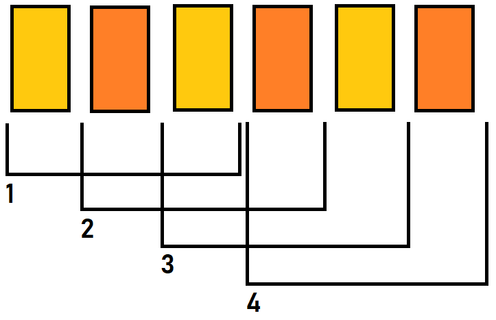

# Вариант #6

Выполнить задание согласно макету автора _Alisa Samborskaya_: **[PetStory-online](https://www.figma.com/file/jfEFwkXVj1WRq7sUHDr8os/PetStory-online)**  
Текст ссылки: https://www.figma.com/file/jfEFwkXVj1WRq7sUHDr8os/PetStory-online

## Создание макета: неделя #1+2

Выполняется создание всех страниц для ширины экрана **1600px**.

### Технические требования

Максимальный балл: **80**

#### Общие

Все фоновые элементы макета должны растягиваться на всю доступную ширину экрана, если ширина больше 1600px. При этом направляющие должны сохраняться в исходном размере, 1160px. Особенностью этого проекта являются:

- нестандартные размеры,
- дополнительные визуальные элементы.

Для создания вертикальных отступов лучше использовать вертикальные margin на блоках высшего порядка, насколько это возможно. При этом иметь ввиду, что вертикальные margin могут схлопнуться.

Для создания многоколоночных структур, или элементов имеющих относительное горизонтальное расположение, должно быть использовано одно из свойств:

- display: flex
- display: grid
- display: inline-block

❗ Соблюдение отступов между элементами важнее, чем размеры этих элементов. Часто можно увидеть некрасивые значения (вроде 369px х 548px), но это лишь значит, что размеры рассчитывались с учетом расстояния между направляющими и отступов между элементами.

#### Landing (20 баллов)

1. **Header** (`<header>` содержит только логотип, панель навигации)

- Логотип находится слева. Нажатие на логотип работает по принципу нажатия на `About`, перебрасывает нас на текущую страницу, на _petstory (Landing)_.
- Интерактивная панель навигации.
- ❗ Должен быть подсвечен элемент `About`. И он должен перестать быть интерактивным.
- Нажатие на `Map` перебрасывает нас на _map_.
- Нажатие на `Zoos` перебрасывает нас на _cam_panda_online_.
- ❗ Нажатие на `Contact Us` может ничего не делать. Либо может переводить на импровизированную страницу с ошибкой 404.
- Нажатие на `Designed by ©` перебрасывает нас на оригинальную страницу [Figma](https://www.figma.com/file/jfEFwkXVj1WRq7sUHDr8os/PetStory-online).
- На странице обязательно должен присутствовать один элемент `<h1>`. В нем должен быть текст `PetStory Online`.
- Хедер "липким" делать не нужно. Т.е. при скролле он остается на своей позиции.

2. Блок **Watch your favorite animal online**

- Задний фон является картинкой.
- ❗ Кнопка `Watch online` должна быть интерактивной. Нажатие перебрасывает нас на cam_panda_online.

3. Блок **The Backstage**

- Картинка и текст - двухколоночный макет.

4. Блок **Pets**

- Кнопки влево и вправо должны быть интерактивными. При нажатии может ничего не происходить.
- Карточки животных должны быть интерактивными.
- ❗ При наведении курсора должна быть анимация выезда текста снизу картинки, где будет информация о названии животного и локации с затемненным задним фоном. Сама картинка, но не карточка, должна [увеличиваться на 10px в каждом направлении относительно центра](https://thoughtbot.com/blog/transitions-and-transforms).
- Кнопка `Choose your favorite` должна быть интерактивной. При нажатии ведет нас на страницу `Map`.

5. Блок **Pick and feed a friend**

- Текст `Emergency support Fund` должна быть ссылкой. Нажатие перебрасывает нас на _donate_.
- Кнопка `Feed a friend now` должна быть интерактивной. При нажатии может ничего не происходить.
- ❗ Стрелки должны быть одинаковых размеров. Однако, если стрелки сделаны строго, как на дизайне, это не ошибка.
- ❗ Правильный вариант написания `PetStory`. Однако, ошибки в орфографии не учитываются в оценке.

6. Блок **Testimonials**

- Полоска прогресса должна быть интерактивной. Начинаем в крайней левой позиции. При нажатии может ничего не происходить.
- Кнопка `Leave feedback` должна быть интерактивной. При нажатии может ничего не происходить.

7. **Footer** (`<footer>` содержит меню, логотипы, кнопки доната и соц. сетей):

- Нажатие на логотип работает по принципу нажатия на About, перебрасывает нас на верх текущей страницы, на _petstory (Landing)_.
- Кнопка `Donate for volunteers` должна быть интерактивной. Нажатие перебрасывает нас на _donate_.
- Интерактивная панель соцсетей. Нажатия на соцсети (иконка + текст) могут вести просто на заглавные страницы соответствующих ресурсов.
- Email - поле `input` с типом `email`.
- Кнопка `submit` должна быть в положении _mistake_. Если поле `email` проходит валидацию, то переходит в состояние _default_.
- ❗ Должен быть подсвечен элемент `About`. И он должен перестать быть интерактивным.
- Нажатие на `Map` перебрасывает нас на _map_.
- Нажатие на `Zoos` перебрасывает нас на _cam_panda_online_.
- ❗ Нажатие на `Contact Us` может ничего не делать. Либо может переводить на импровизированную страницу с ошибкой 404.
- ❗ Если нет возможности подобрать необходимую толщину текста, используйте близкие значения [насыщенности](https://developer.mozilla.org/ru/docs/Web/CSS/font-weight), +-100.

#### Map (10 баллов)

1. **Header** (`<header>` содержит только логотип, панель навигации)

- Логотип находится слева. Нажатие на логотип работает по принципу нажатия на `About`, перебрасывает нас на текущую страницу, на _petstory (Landing)_.
- Интерактивная панель навигации.
- Нажатие на `About` перебрасывает нас на _petstory (Landing)_.
- Должен быть подсвечен элемент `Map`. И он должен перестать быть интерактивным.
- Нажатие на `Zoos` перебрасывает нас на _cam_panda_online_.
- ❗ Нажатие на `Contact Us` может ничего не делать. Либо может переводить на импровизированную страницу с ошибкой 404.
- Нажатие на `Designed by ©` перебрасывает нас на оригинальную страницу [Figma](https://www.figma.com/file/jfEFwkXVj1WRq7sUHDr8os/PetStory-online).
- На странице обязательно должен присутствовать один элемент `<h1>`. В нем должен быть текст `PetStory Online`.
- Хедер "липким" делать не нужно. Т.е. при скролле он остается на своей позиции.

2. Блок **Map**

- Кнопки `+` и `-` должны быть интерактивными. При нажатии может ничего не происходить.
- На карте должно быть 4 интерактивных иконки. При нажатии может ничего не происходить. При наведении должен появляется тултип, как на дизайне. Кнопка `watch online` внутри может быть неактивной.
- ❗ Активное состояние фишки животного - оранжевый цвет. Если рабочий механизм кнопки не сделан, то такая подсветка будет недоступна.

3. **Footer** (`<footer>` содержит меню, логотипы, кнопки доната и соц. сетей):

- Нажатие на логотип работает по принципу нажатия на About, перебрасывает нас на _petstory (Landing)_.
- Кнопка `Donate for volunteers` должна быть интерактивной. Нажатие перебрасывает нас на _donate_.
- Интерактивная панель соцсетей. Нажатия на соцсети (иконка + текст) могут вести просто на заглавные страницы соответствующих ресурсов.
- Email - поле `input` с типом `email`.
- Кнопка `submit` должна быть в положении _mistake_. Если поле `email` проходит валидацию, то переходит в состояние _default_.
- Нажатие на `About` перебрасывает нас на _petstory (Landing)_.
- Должен быть подсвечен элемент `Map`. И он должен перестать быть интерактивным.
- Нажатие на `Zoos` перебрасывает нас на _cam_panda_online_.
- ❗ Нажатие на `Contact Us` может ничего не делать. Либо может переводить на импровизированную страницу с ошибкой 404.

#### Zoos page (10 x 4 = 40 баллов)

Требования для типовой страницы. Переход осуществляется по ссылкам типа `.../zoos/panda` или `.../zoos/alligator`

1. **Header** (`<header>` содержит только логотип, панель навигации)

- Логотип находится слева. Нажатие на логотип работает по принципу нажатия на `About`, перебрасывает нас на текущую страницу, на _petstory (Landing)_.
- Интерактивная панель навигации.
- Нажатие на `About` перебрасывает нас на _petstory (Landing)_.
- Нажатие на `Map` перебрасывает нас на _map_.
- Должен быть подсвечен элемент `Zoos`. И он должен перестать быть интерактивным.
- ❗ Нажатие на `Contact Us` может ничего не делать. Либо может переводить на импровизированную страницу с ошибкой 404.
- Нажатие на `Designed by ©` перебрасывает нас на оригинальную страницу [Figma](https://www.figma.com/file/jfEFwkXVj1WRq7sUHDr8os/PetStory-online).
- На странице обязательно должен присутствовать один элемент `<h1>`. В нем должен быть текст `PetStory Online`.
- Хедер "липким" делать не нужно. Т.е. при скролле он остается на своей позиции.

2. **Side bar** (`<aside>`)

- Панель слева: Должно быть подсвечено выбранное животное.
- Панель слева: При скролле, как только экран опускается ниже хедера, меню с животными должно "прилипнуть" к боковой части экрана. До верхнй границы окна браузера должно оставаться 30px. На этот счет ознакомьтесь с [position: sticky](https://medium.com/web-standards/sticky-bc7ff7088693).
- Иконки животных должны быть интерактивными. При наведении на иконку животного должен появится тултип с названием животного, можно оформить в виде атрибута `title`.
- Выбранное животное становится не интерактивным, но тултип (атрибут title) должен остаться.

3. Блок **Animal Camera**

- Блок видео - это элемент `iframe` с видео трансляции, его можно добавить на страницу по [инструкции](https://support.google.com/youtube/answer/171780?hl=ru).
- Кнопки влево и вправо должны быть интерактивными. При нажатии может ничего не происходить.
- Картинки в карусели - это должны быть либо превью с youtube, либо такие же `iframe` с видео. Поверх видео, есть элемент, с надписью `LIVE`, какая это камера. Что касается самих видео - надо наложить полностью поверх прозрачный элемент, который не даст нажать видео, и ничего не произойдет. Эта заглушка нужна будет при работе с js.

4. Блок **Information**

- Кнопка `Feed a friend now` должна быть интерактивной.
- В тексте встречаются ссылки, которые могут вести на статью про животное в википедии.
- Ссылка `VIEW MAP` перебрасывает нас на _map_.
- На данном этапе, информация должна быть в полностью раскрытом виде.
- Кнопка `Read less` должна быть интерактивной. При нажатии может ничего не происходить.

5. **Footer** (`<footer>` содержит меню, логотипы, кнопки доната и соц. сетей):

- Нажатие на логотип работает по принципу нажатия на About, перебрасывает нас на _petstory (Landing)_.
- Кнопка `Donate for volunteers` должна быть интерактивной. Нажатие перебрасывает нас на _donate_.
- Интерактивная панель соцсетей. Нажатия на соцсети (иконка + текст) могут вести просто на заглавные страницы соответствующих ресурсов.
- Email - поле `input` с типом `email`.
- Кнопка `submit` должна быть в положении _mistake_. Если поле `email` проходит валидацию, то переходит в состояние _default_.
- Нажатие на `About` перебрасывает нас на _petstory (Landing)_.
- Нажатие на `Map` перебрасывает нас на _map_.
- Должен быть подсвечен элемент `Zoos`. И он должен перестать быть интерактивным.
- ❗ Нажатие на `Contact Us` может ничего не делать. Либо может переводить на импровизированную страницу с ошибкой 404.

#### Donate (10 баллов)

1. **Header** (`<header>` содержит только логотип, панель навигации)

- Логотип находится слева. Нажатие на логотип работает по принципу нажатия на `About`, перебрасывает нас на текущую страницу, на _petstory (Landing)_.
- Интерактивная панель навигации.
- Нажатие на `About` перебрасывает нас на _petstory (Landing)_.
- Нажатие на `Map` перебрасывает нас на _map_.
- Нажатие на `Zoos` перебрасывает нас на _cam_panda_online_.
- ❗ Нажатие на `Contact Us` может ничего не делать. Либо может переводить на импровизированную страницу с ошибкой 404.
- Нажатие на `Designed by ©` перебрасывает нас на оригинальную страницу [Figma](https://www.figma.com/file/jfEFwkXVj1WRq7sUHDr8os/PetStory-online).
- На странице обязательно должен присутствовать один элемент `<h1>`. В нем должен быть текст `PetStory Online`.
- Хедер "липким" делать не нужно. Т.е. при скролле он остается на своей позиции.

2. Блок **Pick and feed a friend**

- Зона в радиусе 20px от желтой точки должна быть интерактивной. При нажатии может ничего не происходить.
- Another amount - поле `input` типа `number` со [cкрытыми стрелками](https://www.w3schools.com/howto/howto_css_hide_arrow_number.asp). Знак $ должен всегда присутствовать внутри поля. Должно стоять ограничение в 4 символа.
- `Monthly` и `Once` - взаимоисключающие поля `input` типа `radio`.
- Кнопка `Feed a friend now` должна быть интерактивной. При нажатии может ничего не происходить.

3. **Footer** (`<footer>` содержит меню, логотипы, кнопки доната и соц. сетей):

- Нажатие на логотип работает по принципу нажатия на About, перебрасывает нас на верх текущей страницы, на _petstory (Landing)_.
- Кнопка `Donate for volunteers` должна быть интерактивной. Нажатие перебрасывает нас на _donate_.
- Интерактивная панель соцсетей. Нажатия на соцсети (иконка + текст) могут вести просто на заглавные страницы соответствующих ресурсов.
- Email - поле `input` с типом `email`.
- Кнопка `submit` должна быть в положении _mistake_. Если поле `email` проходит валидацию, то переходит в состояние _default_.
- Нажатие на `About` перебрасывает нас на _petstory (Landing)_.
- Нажатие на `Map` перебрасывает нас на _map_.
- Нажатие на `Zoos` перебрасывает нас на _cam_panda_online_.
- ❗ Нажатие на `Contact Us` может ничего не делать. Либо может переводить на импровизированную страницу с ошибкой 404.

### Рекомендации:

- Сделать страницу _donate_form_ согласно шаблону. Выводить на экран на данном этапе не обязательно
- Сделать страницу _popupwindow_feedback-form_ согласно шаблону. Выводить на экран на данном этапе не обязательно

## Порядок оценки cross-check: неделя 1&2

Открываем на ширине экрана 1920px. Если экран меньше, можно сделать масштабирование, а можно поставить на странице ширину 1920px и смотреть со включенной горизонтальной плосой прокрутки. Если экран шире, можно поставить область уже или сузить окно.

❗ Балл не может опуститься ниже **0** за страницу. Если не указано в требованиях отдельно, то для всех неповторяющихся блоков или элементов в состоянии покоя (без `hover`) справедливо:

- Отступы от границ элементов (или наборов элементов) до краев блока, по горизонтали или вертикали, отличаются более чем на 20px: **-1** за каждый блок.
- Отступы внутри набора или сетки между элементами, по горизонтали или вертикали, отличаются более чем на 10px: **-1** за каждый блок.
- Цвет фона блока или элемента сильно отличается от дизайна (например, отличие по каналу более чем на 34. #bbb и #ddd - не ошибка, больше - ошибка): **-1** за каждый блок.
- Отсутствует элемент или картинка, как фоновая, так и картинка элемента: **-1** за каждый блок.
- Шрифт или семейство шрифтов не подключено, или разница в размере шрифта более чем 4px: **-1** за каждый блок.

Создана страница _Landing_: **+20**.

1. Нет блока **Header**: **-10**.

- Нет логотипа: **-2**. Логотип есть, но он не работает как ссылка на _petstory (Landing)_: **-1**.
- Нет панели навигации: **-5**. Панель навигации есть, но не интерактивная: **-1**.
- Нет элемента `About`, или он не подсвечен: **-1**.
- Нет элемента `Map`, или он не работает как ссылка на _map_: **-1**.
- Нет элемента `Zoos`, или он не работает как ссылка на _cam_panda_online_: **-1**.
- Нет элемента `Contact Us`: **-1**.
- Рекомендуется при нажатии на `Contact Us` совершать переход на импровизированную страницу с ошибкой 404, или на страницу _donate_. Если при нажатии ничего не происходит, баллы не снимаем.
- Нет элемента `Designed by ©`, или он не работает как ссылка на оригинальную страницу _Figma_: **-1**.
- Нет элемента `<h1>`: **-2**. Элемент есть, но в количестве больше одного: **-1**.
- Рекомендуется хедер "липким" не делать.

2. Нет блока **Watch your favorite animal online**: **-5**.

- Нет кнопки `Watch online`: **-2**. Кнопка есть, но не интерактивная, или не работает как ссылка на _cam_panda_online_: **-1**.
- Нет фоновой картинки: **-2**.

3. Нет блока **The Backstage**: **-2**.

- Нет картинки растения справа: **-1**.

4. Нет блока **Pets**: **-19**.

- Нет кнопки вправо: **-1**. Нет кнопки влево: **-1**. Кнопки есть, но они не интерактивные: **-1**.
- Нет карточки животного: **-2** за каждую. Карточка есть, но не интерактивная, или нет анимации текста на затемненном фоне: **-1** за каждую.
- Рекомендуется использовать анимацию с увеличением на 10px в каждом направлении. Если величина увеличения другая, или увеличения нет, баллы не снижаем.
- Нет кнопки `Choose your favorite`: **-2**. Кнопка есть, но не интерактивная, или не работает как ссылка на `Map`: **-1**.
- Рекомендуется, что нажатие на карточку перебрасывает нас на _страницу с соотвествующим животным_. Если такого животного нет среди 4х представленных, то может ничего не происходить.
- Нет картинки растения слева: **-1**. Нет картинки растения справа: **-1**.

5. Нет блока **Pick and feed a friend**: **-4**.

- Нет кнопки `Feed a friend now`: **-2**. Кнопка есть, но не интерактивная: **-1**.
- Текст `Emergency support Fund` не является ссылкой, или не работает как ссылка на _donate_: **-1**.
- Рекомендуется делать стрелки одного размера. Если стрелки разных размеров, баллы не снижаем.

6. Нет блока **Testimonials**: **-5**.

- Нет кнопки `Leave feedback`: **-2**. Кнопка есть, но не интерактивная: **-1**.
- Нет полоски прогресса: **-2**. Полоска есть, но не интерактивная: **-1**.
- Нет картинки растения справа: **-1**.

7. Нет блока **Footer**: **-15**.

- Нет логотипа: **-2**. Логотип есть, но он не работает как ссылка на эту же страницу, не перебрасывает нас на верх страницы: **-1**.
- Нет кнопки `Donate for volunteers`: **-2**. Кнопка есть, но не интерактивная, или не работает как ссылка на _donate_: **-1**.
- Нет хотя бы одной иконки соцсетей: **-2** за весь набор элементов.
- Все иконки соцсетей есть, но хотя бы одна не интерактивная: **-1** за весь набор элементов.
- Нет поля `<input>` "Input your email" : **-2**. Поле есть, но не указан тип `email`: **-1**.
- Рекомендуется пометить `<input>` атрибутом required. За его отсуствие баллы не снимаем.
- Рекомендуется все поле обернуть в элемент `<form>`. За его отсуствие баллы не снимаем.
- Нет кнопки `Submit`: **-2**. Кнопка есть, но не интерактивная: **-1**.
- Рекомендуется для кнопки `Submit` использование стиля _default_, пока поле ввода не будет сфокусировано. Если кнопка по умолчанию стиля _active_ или _mistake_, баллы не снимаем.
- Нет элемента `About`, или он не работает как ссылка на эту же страницу, не перебрасывает нас на верх страницы: **-1**.
- Нет элемента `Map`, или он не работает как ссылка на _Map Page_: **-1**.
- Нет элемента `Zoos`, или он не работает как ссылка на _Zoos Page Panda_: **-1**.
- Нет элемента `Contact Us`: **-1**.
- Рекомендуется при нажатии на `Contact Us` совершать переход на импровизированную страницу с ошибкой 404, или на страницу _donate_. Если при нажатии ничего не происходит, баллы не снимаем.

Создана страница _Map_: **+10**.

1. Нет блока **Header**: **-10**.

- Нет логотипа: **-2**. Логотип есть, но не работает как ссылка на _petstory (Landing)_: **-1**.
- Нет панели навигации: **-5**. Панель навигации есть, но не интерактивная: **-1**.
- Нет элемента `About`, или он не работает как ссылка на _petstory (Landing)_: **-1**.
- Нет элемента `Map`, или он не подсвечен: **-1**.
- Нет элемента `Zoos`, или он не работает как ссылка на _cam_panda_online_: **-1**.
- Нет элемента `Contact Us`: **-1**.
- Рекомендуется при нажатии на `Contact Us` совершать переход на импровизированную страницу с ошибкой 404, или на страницу _donate_. Если при нажатии ничего не происходит, баллы не снимаем.
- Нет элемента `Designed by ©`, или он не работает как ссылка на оригинальную страницу _Figma_: **-1**.
- Нет элемента `<h1>`: **-2**. Элемент есть, но в количестве больше одного: **-1**.
- Рекомендуется хедер "липким" не делать.

2. Нет блока **Map**: **-10**.

- Нет фонового изображения карты земли: **-2**.
- Нет кнопки `+`: **-1**. Нет кнопки `-`: **-1**. Кнопки есть, но они не интерактивные: **-1**.
- На карте нет иконки животного: **-2** за каждую, кроме двух панд.
- Иконка животного не интерактивная, или при наведении не появляется тултип, как на дизайне: **-1** за каждую, кроме двух панд.

3. Нет блока **Footer**: **-10**.

- Нет логотипа: **-2**. Логотип есть, но он не работает как ссылка на _petstory (Landing)_: **-1**.
- Нет кнопки `Donate for volunteers`: **-2**. Кнопка есть, но не интерактивная, или не работает как ссылка на _donate_: **-1**.
- Нет хотя бы одной иконки соцсетей: **-2** за весь набор элементов.
- Все иконки соцсетей есть, но хотя бы одна не интерактивная: **-1** за весь набор элементов.
- Нет поля `<input>` "Input your email" : **-2**. Поле есть, но не указан тип `email`: **-1**.
- Рекомендуется пометить `<input>` атрибутом required. За его отсуствие баллы не снимаем.
- Рекомендуется все поле обернуть в элемент `<form>`. За его отсуствие баллы не снимаем.
- Нет кнопки `Submit`: **-2**. Кнопка есть, но не интерактивная: **-1**.
- Рекомендуется для кнопки `Submit` использование стиля _default_, пока поле ввода не будет сфокусировано. Если кнопка по умолчанию стиля _active_ или _mistake_, баллы не снимаем.
- Нет элемента `About`, или он не работает как ссылка на _petstory (Landing)_: **-1**.
- Нет элемента `Map`, или он не работает как ссылка на эту же страницу, не перебрасывает нас на верх страницы: **-1**.
- Нет элемента `Zoos`, или он не работает как ссылка на _Zoos Page Panda_: **-1**.
- Нет элемента `Contact Us`: **-1**.
- Рекомендуется при нажатии на `Contact Us` совершать переход на импровизированную страницу с ошибкой 404, или на страницу _donate_. Если при нажатии ничего не происходит, баллы не снимаем.

Создана страница _Zoos_: **+10**. Считаем отдельно для каждой из 4х страниц (Панды, Гориллы, Орлы, Аллигаторы).

1. Нет блока **Header**: **-10**.

- Нет логотипа: **-2**. Логотип есть, но не работает как ссылка на _petstory (Landing)_: **-1**.
- Нет панели навигации: **-5**. Панель навигации есть, но не интерактивная: **-1**.
- Нет элемента `About`, или он не работает как ссылка на _petstory (Landing)_: **-1**.
- Нет элемента `Map`, или он не работает как ссылка на _map_: **-1**.
- Нет элемента `Zoos`, или он не подсвечен: **-1**.
- Нет элемента `Contact Us`: **-1**.
- Рекомендуется при нажатии на `Contact Us` совершать переход на импровизированную страницу с ошибкой 404, или на страницу _donate_. Если при нажатии ничего не происходит, баллы не снимаем.
- Нет элемента `Designed by ©`, или он не работает как ссылка на оригинальную страницу _Figma_: **-1**.
- Нет элемента `<h1>`: **-2**. Элемент есть, но в количестве больше одного: **-1**.
- Рекомендуется хедер "липким" не делать.

2. Нет блока **Side bar**: **-6**.

- При скролле верхняя граница панели (1 элемент) должна находится ниже верхнего края окна браузера на 30px. Отличие величины отсутпа более чем на 5px: **-2**.
- Не подсвечено выбранное животное: **-1**.
- Нет хотя бы одной из иконок животных или стрелки: **-2** за весь блок.
- Хотя бы одна из неактивных иконок животных не интерактивная: **-1** за весь блок.
- Хотя бы одна из иконок животных не имеет тултипа (хотя бы атрибута title): **-1** за весь блок.

3. Нет блока **Animal Camera**: **-7**.

- Нет видео: **-2**. Видео есть, но он не iframe: **-1**.
- Нет кнопки вправо: **-1**. Нет кнопки влево: **-1**. Кнопки есть, но они не интерактивные: **-1**.
- Нет элементов `LIVE`, покарывающих видео или картинки в карусели: **-1** за весь набор элементов.

4. Нет блока **Information**: **-2**.

- Нет кнопки `Feed a friend now`: **-2**. Кнопка есть, но не интерактивная: **-1**.
- Рекомендуется при нажатии на кнопку `Feed a friend now`, чтобы нас перебрасывало на _donate_.
- В тексте нет хотя бы одной из указанных ссылок: **-1** за весь блок.
- Рекомендуется при нажатии на ссылку `VIEW MAP`, чтобы нас перебрасывало на _map_.
- Нет кнопки `Read less`: **-2**. Кнопка есть, но она не интерактивная: **-1**.
- Нет картинки растения слева: **-1**. Нет картинки растения справа: **-1**.

5. Нет блока **Footer**: **-10**.

- Нет логотипа: **-2**. Логотип есть, но он не работает как ссылка на _petstory (Landing)_: **-1**.
- Нет кнопки `Donate for volunteers`: **-2**. Кнопка есть, но не интерактивная, или не работает как ссылка на _donate_: **-1**.
- Нет хотя бы одной иконки соцсетей: **-2** за весь набор элементов.
- Все иконки соцсетей есть, но хотя бы одна не интерактивная: **-1** за весь набор элементов.
- Нет поля `<input>` "Input your email" : **-2**. Поле есть, но не указан тип `email`: **-1**.
- Рекомендуется пометить `<input>` атрибутом required. За его отсуствие баллы не снимаем.
- Рекомендуется все поле обернуть в элемент `<form>`. За его отсуствие баллы не снимаем.
- Нет кнопки `Submit`: **-2**. Кнопка есть, но не интерактивная: **-1**.
- Рекомендуется для кнопки `Submit` использование стиля _default_, пока поле ввода не будет сфокусировано. Если кнопка по умолчанию стиля _active_ или _mistake_, баллы не снимаем.
- Нет элемента `About`, или он не работает как ссылка на _petstory (Landing)_: **-1**.
- Нет элемента `Map`, или он не работает как ссылка на _map_: **-1**.
- Нет элемента `Zoos`, или он не работает как ссылка на эту же страницу, не перебрасывает нас на верх страницы: **-1**.
- Нет элемента `Contact Us`: **-1**.
- Рекомендуется при нажатии на `Contact Us` совершать переход на импровизированную страницу с ошибкой 404, или на страницу _donate_. Если при нажатии ничего не происходит, баллы не снимаем.

Создана страница _donate_: **+10**.

1. Нет блока **Header**: **-10**.

- Нет логотипа: **-2**. Логотип есть, но не работает как ссылка на _petstory (Landing)_: **-1**.
- Нет панели навигации: **-5**. Панель навигации есть, но не интерактивная: **-1**.
- Нет элемента `About`, или он не работает как ссылка на _petstory (Landing)_: **-1**.
- Нет элемента `Map`, или он не работает как ссылка на _map_: **-1**.
- Нет элемента `Zoos`, или он не работает как ссылка на _cam_panda_online_: **-1**.
- Нет элемента `Contact Us`: **-1**.
- Рекомендуется при нажатии на `Contact Us` совершать переход на импровизированную страницу с ошибкой 404, или на страницу _donate_. Если при нажатии ничего не происходит, баллы не снимаем.
- Нет элемента `Designed by ©`, или он не работает как ссылка на оригинальную страницу _Figma_: **-1**.
- Нет элемента `<h1>`: **-2**. Элемент есть, но в количестве больше одного: **-1**.
- Рекомендуется хедер "липким" не делать.

2. Нет блока **Pick and feed a friend**: **-10**.

- Зона в радиусе 20px хотя бы от одной желтой точки не интерактивная: **-1** за весь блок.
- Нет поля `<input>` "Another amount" : **-2**. Поле есть, но не указан тип `number`: **-1**.
- Нет поля `<input>` "Monthly" : **-2**. Поле есть, но не указан тип `radio`: **-1**.
- Нет поля `<input>` "Once" : **-2**. Поле есть, но не указан тип `radio`: **-1**.
- Есть поля "Monthly" и "Once", но они не взаимоисключающие: **-1**.
- Нет кнопки `Feed a friend now`: **-2**. Кнопка есть, но она не интерактивная: **-1**.

3. Нет блока **Footer**: **-10**.

- Нет логотипа: **-2**. Логотип есть, но он не работает как ссылка на эту же страницу, не перебрасывает нас на верх страницы: **-1**.
- Нет кнопки `Donate for volunteers`: **-2**. Кнопка есть, но не интерактивная, или не работает как ссылка на _donate_: **-1**.
- Нет хотя бы одной иконки соцсетей: **-2** за весь набор элементов.
- Все иконки соцсетей есть, но хотя бы одна не интерактивная: **-1** за весь набор элементов.
- Нет поля `<input>` "Input your email" : **-2**. Поле есть, но не указан тип `email`: **-1**.
- Рекомендуется пометить `<input>` атрибутом required. За его отсуствие баллы не снимаем.
- Рекомендуется все поле обернуть в элемент `<form>`. За его отсуствие баллы не снимаем.
- Нет кнопки `Submit`: **-2**. Кнопка есть, но не интерактивная: **-1**.
- Рекомендуется для кнопки `Submit` использование стиля _mistake_, пока заполеное поле не будет валидным. Если кнопка по умолчанию стиля _default_ или _active_, баллы не снижаем.
- Нет элемента `About`, или он не работает как ссылка на _petstory (Landing)_: **-1**.
- Нет элемента `Map`, или он не работает как ссылка на _map_: **-1**.
- Нет элемента `Zoos`, или он не работает как ссылка на _Zoos Page Panda_: **-1**.
- Нет элемента `Contact Us`: **-1**.
- Рекомендуется при нажатии на `Contact Us` совершать переход на импровизированную страницу с ошибкой 404, или на страницу _donate_. Если при нажатии ничего не происходит, баллы не снимаем.

## Адаптивность: неделя #3&4

Сверстанные страницы адаптируюятся под следующую ширину экрана устройства:

- 1600px (уже будет готово)
- 1000px
- 640px
- 320px

### Технические требования

Максимальный балл: **40**

#### Общие

Точки перехода могут быть произвольными. Оценивать, насколько правильно и удобно они подобраны, мы не будем. Ниже будут периведены рекомендации для тех, кто еще не выполнял задание:

1. (max-width: 1600px) или (max-width: 1599px) - Переход между состояниями фиксированной колонки и отзывчивой.

-- Опционально (max-width: 1599px) или (max-width: 1440px) или (max-width: 1280px) или (max-width: 1220px)  
2. (max-width: 1000px) - Изменение расположения кнопок врпаво/влево в блоке `Pets`. Изменение количества отзывов в блоке `Testimonials`. Изменение количества элементов в карусели в блоке `Animal Camera`. Сайдбар должен получить ограниччение движения, и перестать быть фиксированным при достижении блока `Information`.

-- Опционально (max-width: 999px) или (max-width: 980px) или (max-width: 768px)  
3. (max-width: 640px) - Замена меню в хедере на бургер меню. Хедер становится фиксированным. Потеря или преобразование некоторых элементов, и изменение расположения в блоках `The backstage`, `Pick and feed a friend`. Изменение количества, размера и отступов карточек животных в блоке `Pets`. Изменение расположения отзывов в блоке `Testimonials`. Сайдбар перестает двигаться. Потеря кнопок `+` и `-` на карте.

-- Опционально (max-width: 639px) или (max-width: 600px)  
4. (max-width: 320px) - Потеря или преобразование некоторых элементов, и изменение расположения в блоках `The backstage`, `Pick and feed a friend`. Изменение количества, размера и отступов карточек животных в блоке `Pets`. Изменение расположения отзывов в блоке `Testimonials`.

Общие обозначения:

1. **Указанные** элементы - это элементы, которые прописаны в требованиях, и для которых указаны штрафные баллы за такой тип ошибки. Помимо этого, если ошибку для элементов, например, хедера или футера, мы уже указывали, а она идентично повторяется для других размеров или страниц, повторно баллы не снимаем.
2. _Отступы_ между элементами - это вертикальные и горизонтальные отступы между соседними элементами, как правило в одном списке или в одной сетке.
3. _Расположение_ элементов - это обозначение отступов от элемента до краев экрана или других элементов. Для текста учитываются отступы слева и сверху первой строки (точка начала текста), если текст выровнен по левому краю, или в заголовках. Что касается перехода из положения, когда все элементы выравнены по левому краю, в центральное положение, то тут можно смотреть отступы самого блока, и наличие свойств позиционирования контента по центру.
4. _Вид_ элементов - это обозначение внешнего вида элементов. Например, если происходит переход от маленькой круглой кнопки к большой квадратной, то акцентируется внимание на соотвествии внешнего вида тому, что приведен в дизайне.
5. _Количество_ элементов - это требование соотвествия количества элементов в дизайне. Например, при переходе на меньший размер экрана количество элементов уменьшается с 6 до 4х. Количество элементов больше или меньше 4х, в таком случае, будет считаться ошибкой.

❗ Обратите внимание на эти пункты:

1. Изменение элементов со сменой концепции лучше сделать через скрытие/отображение элементов. Например, замена картинок стрелок на другие в блоке `Pick and feed a friend`. Также, в некоторых случаях, будет проще работать с ними в js.
2. Бургер-меню может быть не активным. Т.е. если при нажатии на него ничего не проиходит, то баллы снимать не будем.
3. На странице _Donate_, поле `Another amount` может находиться по ценру страницы, это не ошибка, баллы не снимаем.

## Порядок оценки cross-check: неделя 3&4

1. После выставления определенной ширины, при проверке размеров и отступов между элементами, внутри набора элментов или сетки, по горизонтали или вертикали, считаем отличие более чем на 10px. Можно использовать расширение PixelPerfect.
2. Проверяем страницы на отзывчивость, каждую, кроме повторяющихся Zoos.

### Страница Landing существует **+15**.

#### Выставляем Landing на 1000px. Смотрим отличия (> 10px) и снимаем баллы, если нарушены следующие пункты:

- Отступы между элментами меню в хедере: **-1**.
- Расположение элементов в блоке `Watch your favorite animal online`: **-1**.
- Расположение элементов в блоке `The Backstage`: **-1**.
- ❗ Не пропало растение в блоке `The Backstage`: **-1**. Растение может исчезнуть резко, может плавно уходить за край экрана.
- Расположение или отступы между карточками животных в блоке `Pets`: **-1**.
- Расположение или отступы между кнопками вправо/влево в блоке `Pets`: **-1**.
- Вид растений справа или слева в блоке `Pets`: **-1**.
- Количество, расположение или отступы между отзывами в блоке `Testimonials`: **-1**.
- Расположение кнопки `leave feedback` в блоке `Testimonials`: **-1**.
- Вид растения справа в блоке `Testimonials`: **-1**.
- Расположение элементов внутри формы `Subscribe to our news` в футере: **-1**.
- Расположение кнопки `donate for volunteers` в футере: **-1**.
- Отступы между иконками и именами соцсетей в футере: **-1**.
- Отступы между элментами меню в футере: **-1**.

#### Выставляем Landing на 640px. Смотрим отличия (> 10px) и снимаем баллы, если нарушены следующие пункты:

- Меню не преобразовано в бургер меню в хедере: **-1**.
- ❗ Хедер не стал фиксированным: **-1**.
- Расположение элементов в блоке `Watch your favorite animal online`: **-1**.
- Расположение элементов в блоке `The Backstage`: **-1**.
- ❗ Не появилось растение в блоке `The Backstage`: **-1**. Растение может появиться резко, может плавно выходить из-за края экрана.
- Количество, расположение или отступы между карточками животных в блоке `Pets`: **-1**.
- Расположение или отступы между кнопками вправо/влево в блоке `Pets`: **-1**.
- Вид растений справа или слева в блоке `Pets`: **-1**.
- Расположение элементов в блоке `Pick and feed a friend`: **-1**.
- Вид стрелок в блоке `Pick and feed a friend`: **-1**.
- Вид, расположение или отступы между отзывами в блоке `Testimonials`: **-1**.
- Расположение кнопки `leave feedback` в блоке `Testimonials`: **-1**.
- Вид растения справа в блоке `Testimonials`: **-1**.
- ❗ Не пропала форма `Subscribe to our news` в футере: **-1**. Она должна скрыться
- Расположение кнопки `donate for volunteers` в футере: **-1**.
- Расположение или отступы между иконками соцсетей в футере: **-1**.
- ❗ Если рядом с иконками соцсетей будут видны имена, это не ошибка, баллы не снимаем.
- Отступы между элментами меню в футере: **-1**.

#### Выставляем Landing на 320px. Смотрим отличия (> 10px) и снимаем баллы, если нарушены следующие пункты:

- Нет бургер меню в хедере: **-1**.
- Расположение элементов в блоке `Watch your favorite animal online`: **-1**.
- Расположение элементов в блоке `The Backstage`: **-1**.
- ❗ Точность расположения растения в блоке `The Backstage` не оцениваем, и баллы за то, что его нет, не снимаем. Однако, если растение наезжает на текст: **-1**.
- Количество, расположение или отступы между карточками животных в блоке `Pets`: **-1**.
- ❗ Не пропали кнопки вправо/влево в блоке `Pets`: **-1**.
- Вид растений справа или слева в блоке `Pets`: **-1**.
- Расположение элементов в блоке `Pick and feed a friend`: **-1**.
- Вид стрелок в блоке `Pick and feed a friend`: **-1**.
- Расположение или отступы между отзывами в блоке `Testimonials`: **-1**.
- Расположение кнопки `leave feedback` в блоке `Testimonials`: **-1**.
- Вид растения справа в блоке `Testimonials`: **-1**.
- Вид или расположение основного логотипа в футере: **-1**.
- Расположение или отступы между иконками соцсетей в футере: **-1**.
- ❗ Не появилась форма `Subscribe to our news`, или нарушено расположение элементов внутри этой формы, в футере: **-1**.
- Расположение кнопки `donate for volunteers` в футере: **-1**.
- Отступы между элментами меню в футере: **-1**.

#### Проверяем на отзывчивость (Responsive).

Пошагово выполняем следующие действия:

1. Растягиваем страницу на ширину больше 1600px, либо уменьшаем масштаб.
2. Изменяем ширину страницы до размеров от 1599px до 1001px.
3. Изменяем ширину страницы до размеров от 999px до 641px.
4. Изменяем ширину страницы до размеров от 639px до 321px.
5. Меньше 320px - не смотрим!  
   И оцениваем:

- В ходе изменения размера появляется горизонтальная полоса прокрутки: **-4**.
- Отсуствует хотя бы один элемент (кроме **указанных** или фоновых элементов), или есть лишний: **-2**.
- Есть элементы (кроме **указанных** или фоновых элементов), которые обрезаются или выходят за край экрана, хотя в дизайне они вписаны в границы: **-2**.
- В какой-либо момент, элементы (кроме **указанных** или фоновых элементов) наезжают на другие элементы, хотя во всех дизайнах между ними есть отступ: **-2**.

### Страница Map существует **+10**.

#### Выставляем Map на 1000px. Смотрим отличия (> 10px) и снимаем баллы, если нарушены следующие пункты:

- Отступы между элментами меню в хедере: **-1**.
- ❗ Хедер не тянется на всю ширину, или элементы хедера горизонтально не фиксированы, при наличии горизонтальной полосы прокрутки: **-1**.
- Полностью отсутствует изображение карты: **-1**.
- ❗ На карте исчезают иконки животных, или их позиция на карте сильно смещается, более чем на 30px: **-1**.
- Тултипы могут выходить за край экрана, за это баллы не снимаем.
- Отступы между кнопками `+` и `-`: **-1**.
- ❗ При просмотре карты кнопки `+` и `-` должны находиться на своей позиции внизу окна, отступая от нижнего края на 20px, и двигаться вместе с вертикальным скроллом, пока до расстояние до футера не станет 20px. Если не реализван такой функционал: **-1**. Если расстояние по умолчанию получается меньше 20px, то визуально, кнопки могут не двигаться. Ознакомьтесь на этот счет с [position: sticky](https://medium.com/web-standards/sticky-bc7ff7088693).
- ❗ Футер не тянется на всю ширину, или элементы футера горизонтально не фиксированы, при наличии горизонтальной полосы прокрутки: **-1**.
- Расположение элементов внутри формы `Subscribe to our news` в футере: **-1**.
- Расположение кнопки `donate for volunteers` в футере: **-1**.
- Отступы между иконками и именами соцсетей в футере: **-1**.
- Отступы между элментами меню в футере: **-1**.

#### Выставляем Map на 640px. Смотрим отличия (> 10px) и снимаем баллы, если нарушены следующие пункты:

- Меню не преобразовано в бургер меню в хедере: **-1**.
- Хедер не стал фиксированным: **-1**.
- Хедер не тянется на всю ширину, или элементы хедера горизонтально не фиксированы, при наличии горизонтальной полосы прокрутки: **-1**.
- Полностью отсутствует изображение карты: **-1**.
- На карте исчезают иконки животных, или их позиция на карте сильно смещается, более чем на 30px: **-1**.
- Тултипы могут выходить за край экрана, за это баллы не снимаем.
- ❗ Не пропали кнопки `+` и `-`: **-1**.
- Футер не тянется на всю ширину, или элементы футера горизонтально не фиксированы, при наличии горизонтальной полосы прокрутки: **-1**.
- ❗ Не пропала форма `Subscribe to our news` в футере: **-1**. Она должна скрыться
- Расположение кнопки `donate for volunteers` в футере: **-1**.
- Расположение или отступы между иконками соцсетей в футере: **-1**.
- ❗ Если рядом с иконками соцсетей будут видны имена, это не ошибка, баллы не снимаем.
- Отступы между элментами меню в футере: **-1**.

#### Выставляем Map на 320px. Смотрим отличия (> 10px) и снимаем баллы, если нарушены следующие пункты:

- Нет бургер меню в хедере: **-1**.
- Хедер не тянется на всю ширину, или элементы хедера горизонтально не фиксированы, при наличии горизонтальной полосы прокрутки: **-1**.
- Полностью отсутствует изображение карты: **-1**.
- На карте исчезают иконки животных, или их позиция на карте сильно смещается, более чем на 30px: **-1**.
- Тултипы могут выходить за край экрана, за это баллы не снимаем.
- Футер не тянется на всю ширину, или элементы футера горизонтально не фиксированы, при наличии горизонтальной полосы прокрутки: **-1**.
- Вид или расположение основного логотипа в футере: **-1**.
- Расположение или отступы между иконками соцсетей в футере: **-1**.
- ❗ Не появилась форма `Subscribe to our news`, или нарушено расположение элементов внутри этой формы, в футере: **-1**.
- Расположение кнопки `donate for volunteers` в футере: **-1**.
- Отступы между элментами меню в футере: **-1**.

#### Проверяем на отзывчивость (Responsive).

Пошагово выполняем следующие действия:

1. Растягиваем страницу на ширину больше 1600px, либо уменьшаем масштаб.
2. Изменяем ширину страницы до размеров от 1599px до 1001px.
3. Изменяем ширину страницы до размеров от 999px до 641px.
4. Изменяем ширину страницы до размеров от 639px до 321px.
5. Меньше 320px - не смотрим!  
   И оцениваем:

- В хедере или футере не хватает составных элементов (кроме **указанных**), или есть лишние: **-2**.
- Элменты хедера или футера (кроме **указанных**) обрезаются или выходят за край экрана, хотя в дизайне они вписаны в границы: **-2**.
- В какой-либо момент, элементы хедера или футера (кроме **указанных**) наезжают на другие элементы, хотя во всех дизайнах между ними есть отступ: **-2**.

### Хотя бы одна из страниц Zoos существует **+10**. Для проверки берем Zoos: Panda (или любую другую, если панды нет).

#### Выставляем Zoos на 1000px. Смотрим отличия (> 10px) и снимаем баллы, если нарушены следующие пункты:

- Отступы между элментами меню в хедере: **-1**.
- Вид сайдбара или иконок внутри: **-1**.
- ❗ Сайдбар должен перейти из состояния "fixed" в состояние "sticky", и терять фиксировнное состояние при достижении блока `Information (Giant Panda)`. Если сайдбар продолжает ездить на всю длину: **-1**.
- Количество или расположение элементов с видео превью в карусели в блоке `Animal Camera`: **-1**.
- Расположение или отступы между кнопками вправо/влево в блоке `Animal Camera`: **-1**.
- Расположение элементов в блоке `Information`: **-1**.
- ❗ Спойлер может быть полностью открыт, кнопка может находится в состоянии "Read less", и по нажатию может ничего не происходить. За это баллы не снимаем.
- Вид растений справа или слева в блоке `Information`: **-1**.
- Расположение кнопки `Donate`: **-1**.
- Расположение элементов внутри формы `Subscribe to our news` в футере: **-1**.
- Расположение кнопки `donate for volunteers` в футере: **-1**.
- Отступы между иконками и именами соцсетей в футере: **-1**.
- Отступы между элментами меню в футере: **-1**.

#### Выставляем Zoos на 640px. Смотрим отличия (> 10px) и снимаем баллы, если нарушены следующие пункты:

- Меню не преобразовано в бургер меню в хедере: **-1**.
- ❗ Хедер не стал фиксированным: **-1**.
- Вид сайдбара или иконок внутри: **-1**.
- ❗ Сайдбар должен перейти из состояния "sticky" в состояние "static", т.е. прекратить реагировать на скролл. Если сайдбар продолжает ездить: **-1**.
- Расположение или отступы между элементами с видео превью в карусели в блоке `Animal Camera`: **-1**.
- Расположение или отступы между кнопками вправо/влево в блоке `Animal Camera`: **-1**.
- Расположение элементов в блоке `Information`: **-1**.
- Вид растений справа или слева в блоке `Information`: **-1**.
- Расположение кнопки `Donate`: **-1**.
- ❗ Не пропала форма `Subscribe to our news` в футере: **-1**. Она должна скрыться
- Расположение кнопки `donate for volunteers` в футере: **-1**.
- Расположение или отступы между иконками соцсетей в футере: **-1**.
- ❗ Если рядом с иконками соцсетей будут видны имена, это не ошибка, баллы не снимаем.
- Отступы между элментами меню в футере: **-1**.

#### Выставляем Zoos на 320px. Смотрим отличия (> 10px) и снимаем баллы, если нарушены следующие пункты:

- Нет бургер меню в хедере: **-1**.
- Вид сайдбара: **-1**.
- Количество или отступы между иконками животных в сайдбаре: **-1**.
- Количесто, расположение или отступы между элементами с видео превью в карусели в блоке `Animal Camera`: **-1**.
- ❗ Не пропали кнопки вправо/влево в блоке `Animal Camera`: **-1**.
- Расположение элементов в блоке `Information`: **-1**.
- Вид растений справа или слева в блоке `Information`: **-1**.
- Расположение кнопки `Donate`: **-1**.
- Вид или расположение основного логотипа в футере: **-1**.
- Расположение или отступы между иконками соцсетей в футере: **-1**.
- ❗ Не появилась форма `Subscribe to our news`, или нарушено расположение элементов внутри этой формы, в футере: **-1**.
- Расположение кнопки `donate for volunteers` в футере: **-1**.
- Отступы между элментами меню в футере: **-1**.

#### Проверяем на отзывчивость (Responsive).

Пошагово выполняем следующие действия:

1. Растягиваем страницу на ширину больше 1600px, либо уменьшаем масштаб.
2. Изменяем ширину страницы до размеров от 1599px до 1001px.
3. Изменяем ширину страницы до размеров от 999px до 641px.
4. Изменяем ширину страницы до размеров от 639px до 321px.
5. Меньше 320px - не смотрим!  
   И оцениваем:

- В ходе изменения размера появляется горизонтальная полоса прокрутки: **-4**.
- Отсуствует хотя бы один элемент (кроме **указанных** или фоновых элементов), или есть лишний: **-2**.
- Есть элементы (кроме **указанных** или фоновых элементов), которые обрезаются или выходят за край экрана, хотя в дизайне они вписаны в границы: **-2**.
- В какой-либо момент, элементы (кроме **указанных** или фоновых элементов) наезжают на другие элементы, хотя во всех дизайнах между ними есть отступ: **-2**.

### Страница Donate существует **+5**.

#### Выставляем Donate на 1000px. Смотрим отличия (> 10px) и снимаем баллы, если нарушены следующие пункты:

- Отступы между элментами меню в хедере: **-1**.
- Расположение элементов в блоке `Pick and feed a friend`: **-1**.
- ❗ Поле `Another amount` может находиться по ценру страницы, это не ошибка, баллы не снимаем. Отступы вокруг `Another amount` также не учитываем.
- Расположение элементов внутри формы `Subscribe to our news` в футере: **-1**.
- Расположение кнопки `donate for volunteers` в футере: **-1**.
- Отступы между иконками и именами соцсетей в футере: **-1**.
- Отступы между элментами меню в футере: **-1**.

#### Выставляем Donate на 640px. Смотрим отличия (> 10px) и снимаем баллы, если нарушены следующие пункты:

- Меню не преобразовано в бургер меню в хедере: **-1**.
- ❗ Хедер не стал фиксированным: **-1**.
- Расположение элементов в блоке `Pick and feed a friend`: **-1**.
- Поле `Another amount` может находиться по ценру страницы, это не ошибка, баллы не снимаем. Отступы вокруг `Another amount` также не учитываем.
- ❗ Не пропала форма `Subscribe to our news` в футере: **-1**. Она должна скрыться
- Расположение кнопки `donate for volunteers` в футере: **-1**.
- Расположение или отступы между иконками соцсетей в футере: **-1**.
- ❗ Если рядом с иконками соцсетей будут видны имена, это не ошибка, баллы не снимаем.
- Отступы между элментами меню в футере: **-1**.

#### Выставляем Donate на 320px. Смотрим отличия (> 10px) и снимаем баллы, если нарушены следующие пункты:

- Нет бургер меню в хедере: **-1**.
- Расположение элементов в блоке `Pick and feed a friend`: **-1**.
- Поле `Another amount` может находиться по ценру страницы, это не ошибка, баллы не снимаем. Отступы вокруг `Another amount` также не учитываем.
- Вид или расположение основного логотипа в футере: **-1**.
- Расположение или отступы между иконками соцсетей в футере: **-1**.
- ❗ Не появилась форма `Subscribe to our news`, или нарушено расположение элементов внутри этой формы, в футере: **-1**.
- Расположение кнопки `donate for volunteers` в футере: **-1**.
- Отступы между элментами меню в футере: **-1**.

#### Проверяем на отзывчивость (Responsive).

Пошагово выполняем следующие действия:

1. Растягиваем страницу на ширину больше 1600px, либо уменьшаем масштаб.
2. Изменяем ширину страницы до размеров от 1599px до 1001px.
3. Изменяем ширину страницы до размеров от 999px до 641px.
4. Изменяем ширину страницы до размеров от 639px до 321px.
5. Меньше 320px - не смотрим!  
   И оцениваем:

- В ходе изменения размера появляется горизонтальная полоса прокрутки: **-4**.
- Отсуствует хотя бы один элемент (кроме **указанных** или фоновых элементов), или есть лишний: **-2**.
- Есть элементы (кроме **указанных** или фоновых элементов), которые обрезаются или выходят за край экрана, хотя в дизайне они вписаны в границы: **-2**.
- В какой-либо момент, элементы (кроме **указанных** или фоновых элементов) наезжают на другие элементы, хотя во всех дизайнах между ними есть отступ: **-2**.

## Функционалная часть и пользовательские события: неделя #5&6

Добавление JavaScript.

### Технические требования

Максимальный балл: **80**

#### Общие

1. Проверять функционал на оценку будем только для единственной ширины в промежутке от 1200px до 1920pх. Значит, это будет та часть, которая задана до перехода media query на дизайн 640px и меньше. Масштабировать браузер не нужно, в случае, если окно браузера удовлетворяет условию ширины.

2. Проверять и оценивать качество дизайна не будем.

Вариант 6

#### Landing

1. **Карусель** в блоке Pets.

- Должно происходить перелистывание блоков вправо/влево по нажатию на соответствующую кнопку бесконечно. Т.е. последовательная генерация и удаление блоков, либо замена на уже существующие и перестановка их вперед и назад.  
  [Видео: карусель со стрелочками на чистом js](https://www.youtube.com/watch?v=rkz6LURkbBw)  
  [Статья: карусель со стрелочками на чистом js](https://habr.com/ru/post/327246/)  
  [Пример: карусель со стрелочками на чистом js](https://codepen.io/tuesta/pen/QoMqBY)  
  [Базовое слайдшоу, в том числе автоматическое](https://www.w3schools.com/howto/howto_js_slideshow.asp)
- Порядок картинок роли не играет, могут быть в одинаковом расположении, но в одном слайде все картинки должны быть уникальными.
- В блоке, где отображается 6 карточек животных, перелистывание должно происходить сразу по 6 элементов. При меньшем количестве, перелистываться будет меньшее количество элементов внутри. Перелистывание по 1 колонке (2 элемента) за раз, ошибкой считаться не будет.

2. **Автоматическая карусель** в блоке Testimonials.

- Должно происходить перелистывание блоков с отзывами автоматически, каждые 10 секунд справа-налево на 1 элемент.  
  [Пример автоматической карусели на чистом js, с наличием стрелок и точек-переключателей](https://betterprogramming.pub/make-a-slideshow-with-automatic-and-manual-controls-using-html-css-and-javascript-b7e9305168f9)  
  [Автоматическая карусель с перелистыванием по 1 элементу, с наличием элементов управления](https://jsfiddle.net/pvbk0spb/et09fzkp/)
- Когда панель упрется вправо, и таймер сделает новый переход, он перелистает все отзывы в начало, и будет идти сначала.
- Должно быть сгенерировано столько элементов, чтобы получилось 8 промежуточных интервалов. Например, если на странице видно 4 отзыва, то всего в карусели будет 11 отзывов. Если видно 3, в карусели будет 10. Пример расчета количества промежуточных интервалов для 6 отзывов при 3 видимых на странице представлен ниже:
  
- При нажатии на любой отзыв, перелистывание должно остановиться на 40 секунд, затем продолжиться снова каждые 10 секунд.
- Полоса прогресса должна быть привязана к конкретному промежуточному интервалу.  
  [Пример полосы прогресса](https://codepen.io/juanbrujo/pen/uIqaw)
- Перелистывание отзывов также должно происходить путем движения ползунка на полосе прогресса. В самом крайнем левом положении ползунка будут видны первые отзывы. В крайнем правом положении ползунка будут видны последние отзывы. Рекомендуется уменьшить размер оранжевого ползунка до 1/8 (12,5%) от общей длины полосы.

#### Map

1. **Карта**.

- Поведение карты на размере окна больше 1920px не смотрим.
- Масштабирование с использованием кнопок + и -. Увеличение может происходить от размеров когда, карта полностью вписывается в ширину экрана, до размера карты, пропорциональной ширине в 2, 4 или 8 раз больше. Хотя бы в 4 шага (можно больше) в одну и другую сторону.
- Крайним состоянием масштабирования в сторону уменьшения, чтобы она полностью вписывалась в окно.
- Увеличение может быть ограничено произвольно, но рекомендуется сделать так, чтобы размеры иконок не превышали по итогу 4х кратного увеличения ширины и высоты для размеров дизайна карты 1920px. Например иконка аллигатора (75х20)px. Таким образом допустимый максимальный размер в рекомендации (300х80)px.  
  [Пример простейшего масштабирования Zoom In / Zoom Out](https://stackoverflow.com/questions/47635341/zooming-in-out-an-image-by-clicking-zoom-buttons-javascript)  
  [Пример хорошей реализации поведения масштабирования и перемещения](https://worka.github.io/vanilla-js-wheel-zoom/demo-image.html)
- Перемещение посредством drag'n'drop.  
  [События, позволяющие реализовать drag'n'drop](https://learn.javascript.ru/drag-and-drop)
- Наличие полос прокрутки, горизонтальной или вертикальной, не считается ошибкой.
- кнопки +/- должны быть поверх всех элементов карты.
- Нажатие на иконку животного показывает тултип с кнопкой watch online.
- Нажатие на кнопку watch online перебрасывает нас на страницу Zoos с соответствующим животным.
- Нажатие на любое свободное место на карте скрывает тултип.
- Нажатие на другую иконку скрывает предыдущий тултип, если такой открыт, и показывает новый.
- Если тултип будет выходить за край экрана, это не будет считаться ошибкой.

#### Zoos

1. **Карусель** в блоке Animal.

- Работоспособность карусели по нажатию на точки снизу проверяться не будет, и баллы соответственно сниматься не будут, если карусель не активна.
- При нажатии на видео (сам элемент, картинку), основное видео должно замениться на новое. А видео из основного блока появиться в списке камер к карусели, таким образом не разрушая общее количество элементов.
- Всего 7 элементов видео в карусели, 8-й элемент в блоке Main cameras. Они могут быть одинаковыми, могут быть разными. При неактивной карусели будет видно лишь часть из них (4 или 2).

2. **Кнопка спойлера Read More / Read Less** в блоке Information.

- Нажатие на кнопку показывает или скрывает часть информации.  
  [пример панели в разделе Animation without jQuery](https://mxii.eu.org/2017/09/07/javascript-spoiler-with-a-twist-collapsing-up-or-down/)
- Имя кнопки меняется с Read More на Read Less, и наоборот.

#### Donate

1. **Панель Amount** в блоке Pick and feed a friend.

- При нажатии на кружок поверх суммы, он должен стать подсвеченным, а предыдущий активный кружок стать неактивным.
- Указанная сумма при нажатии на кружочек должна быть записана в поле Another amount.
- Обязательное поле Another amount должно быть ограничено 4 символами типа number.
- На старте отображения страницы должно быть введено число 100, и быть подсвечен соответствующий элемент (3й справа).
- Если в поле Another amount ввести число, которое совпадает с одной из сумм в полоске Amount сверху, соответствующий кружок должен стать подсвеченным.

🚧🚧🚧🚧

## Порядок оценки cross-check: неделя #5&6

1. Открываем окно брузера на всю ширину экрана. Если оно больше 1600px, то уменьшаем до 1600px, или меньше, но не менее 1000px. Если окно меньше 1000px, то увеличиваем до 1000px, или больше, но не более 1600px.
2. При проверке, отклоения элементов или блоков от дизайна не учитываем, кроме элементов, которые указанны в ТЗ, и баллы за ошибки дизайна не снимаем.
3. В разделе Zoos достаточно сделать проверку только одной страницы. Например, страницы панды.
4. Баллы в рамках одной задачи не могут опуститься ниже 0. Например, в задаче указано **+10**, а в ходе проеверки вы насчитали _-18_. Тогда, выходное количество баллов, которое поставим за задачу, будет **0**.

#### Landing

1. **Карусель** в блоке Pets сделана и реагирует на нажатие кнопок вправо/влево **+15**. Баллы снимаем, если нарушены следующие пункты:

- С момента загрузки, нажимаем несколько раз кнопку "влево", хотя бы 5 раз, смотрим чтобы карточки (все, или одна колонка) перелистывались постоянно. Если появляется граничное условие, и кнопка исчезает или перестает работать (карточки по нажатию преестают перелистываться). **-5**.
- С момента загрузки, нажимаем несколько раз кнопку "вправо", хотя бы 5 раз, смотрим чтобы карточки (все, или одна колонка) перелистывались постоянно. Если появляется граничное условие, и кнопка исчезает или перестает работать (карточки по нажатию преестают перелистываться). **-5**.
- Во время статичного отображения слайда (не во время анимации), карточки повторяются. **-5**.

2. **Автоматическая карусель** перелистывает блоки с отзывами автоматически в блоке Testimonials **+15**. Баллы снимаем, если:

- Интервал отличается от 10 секунд более чем на 5 секунд. **-5**.
- Перелистывание должно происходить справа-налево. Однако, если отзывы будут перелистываться слева-направо, баллы не снимаем.
- При нажатии на отзыв, таймер не остановился, или не возобновился через 40(+-5) секунд. **-5**.

#### Map

1. **Карта** сделана, реагирует на нажатия (+) и (-) **+25**. Баллы снимаем, если:

- С момента загрузки, нажимаем несколько раз кнопку "+", хотя бы 4 раза, смотрим чтобы карта масштабировалась. Кнопка не реагирует на нажатие, или карта не масштабиурется **-5**.
- Визуально, икноки сильно смещаются при масштабировании, больше чем на 50px, от начальной точки на карте **-5**.
- С момента увеличения, нажимаем кнопку "-" столько раз, пока карта не впишется в окно браузера, и смотрим, чтобы происходило уменьшение. Кнопка не реагирует на нажатие, или карта не масштабиурется **-5**.
- Карта (или иконки животных) наезжает поверх элементов, которые не должны попадать под нее (хедер, футер, кнопки + и -) **-5**.
- При масштабировании, когда карта увеличена и не помещается в окно браузера, не работает drag'n'drop **-10**.

#### Zoos

1. **Карусель** в блоке Animal существует и реагирует на нажатие **+5**. Баллы снимаем, если:

- С момента загрузки, при нажитии на картинку видео в блоке Animal, этот элемент не становится на место основного видео, или основное видео не становится второстепенным элементом в блоке Animal **-5**.

2. **Выпадающая панель (спойлер)** в блоке Information сделана и реагирует на нажатие на строку или Кнопку спойлера Read More / Read Less **+5**. Баллы снимаем, если:

- Нажатие на кнопку Read More не разворачивает скрытый текст. **-5**. При этом за отсутствие анимации баллы не снимаем.
- Нажатие на кнопку Read Less, текст не скрывается. **-5**. При этом за отсутствие анимации баллы не снимаем.
- Также, баллы снимаем если есть стилевые ошибки, только указанные ниже:
- Кнопка Read More не меняется при раскрытии на Read Less, или наоборот, Read Less не меняется на Read More. **-2**.

#### Donate

1. **Панель Amount** в блоке Pick and feed a friend сделана и реагирует на нажатия кружков в панели сумм **+15**. Баллы снимаем, если:

🚧🚧🚧🚧
