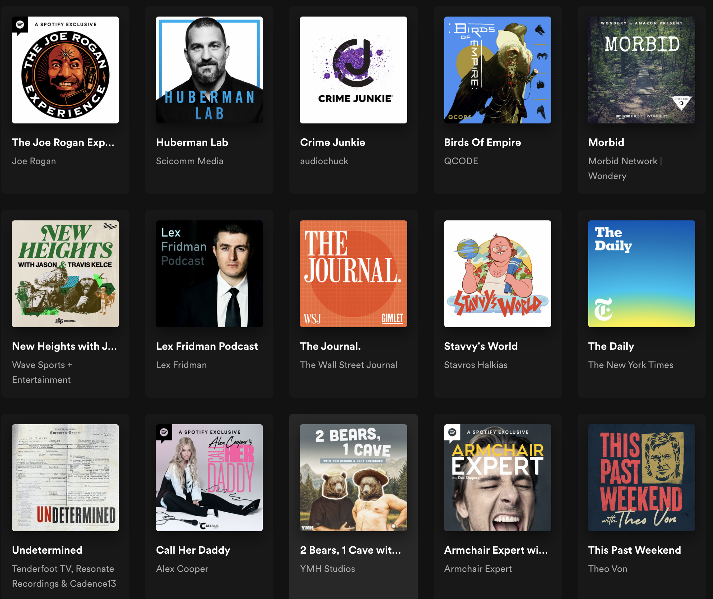
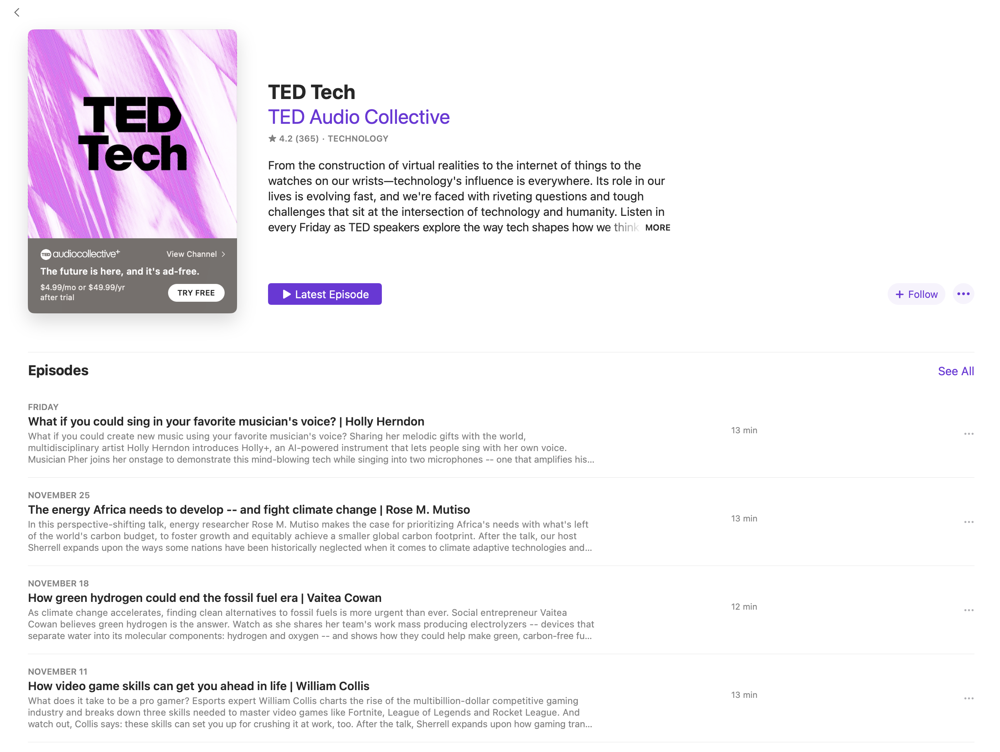
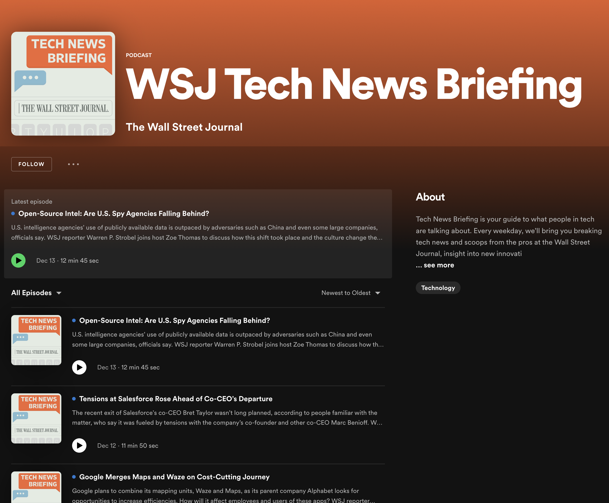

# Project: Podcast Player Application

## Intro

A podcast player is an app that is used to play podcasts. Podcasts are audio recordings that are typically part of a series and are often focused on a specific topic or theme. Podcast players allow users to search for, subscribe to podcasts, and download and listen to individual episodes. Some podcast players also offer features such as the ability to speed up or slow down playback and bookmark specific points in an episode for later reference. Some popular podcast players include:
- [Apple Podcasts](https://www.apple.com/apple-podcasts/)
- [Spotify](https://open.spotify.com/genre/podcasts-web)
- [Google Podcasts](https://podcasts.google.com/)
- [Pocket Casts](https://pocketcasts.com)

## Goal
Create a simplified web version of the podcast player. Base user stories:
1. The user should be able to see a list of recently updated podcasts.
2. Users should be able to search podcasts via text search.
3. Users should be able to select podcasts from the list and navigate to the details page. This page should display a list of recent episodes for a given podcast.
4. The user should be able to select an episode and start listening to it.
5. The user should be able to skip some time and return. Therefore navigation through the episode timeline should be supported.
6. Users should be able to keep navigating through the app, search podcasts, and check a list of episodes when the current episode is playing in the player.
7. The user should be able to add and remove episodes to/from the playlist.
8. The application should remember the play position and playlist content after the page reloads.

## Section 1. Landing page and search functionality.
### User stories [1,2].
### Steps
1. Register at [Podcast Index API](https://api.podcastindex.org/) and obtain **API Key** and **API Secret**. Check [code examples](https://podcastindex-org.github.io/docs-api/#overview--libraries) to work with API. Besides API Key and API Secret you will need **API HeaderTime** and calculate **Authorization**.
This is an example of API calls from a browser.
```ts
  class App {
    fetchRecent(apiKey: string, apiSecret: string): void {
        const url = 'https://api.podcastindex.org/api/1.0/recent/feeds?max=10';
        const apiHeaderTime: string = "" + Math.round(Date.now() / 1_000);

        this.getAuthorizationHeaderValue(apiKey, apiSecret, apiHeaderTime)
            .then((authorization: string) => this.getHeaders(apiHeaderTime, apiKey, authorization))
            .then((headers: HeadersInit) => ({ method: 'GET', headers }))
            .then(requestInit => fetch(url, requestInit))
            .then(res => res.json())
            .then(json => console.log(json));
    }

    private async getAuthorizationHeaderValue(apiKey: string, apiSecret: string, apiHeaderTime: string): Promise<string> {
        const arrayBuffer: ArrayBuffer = new TextEncoder().encode(apiKey + apiSecret + apiHeaderTime);
        const arrayBuffer_1 = await crypto.subtle
            .digest("SHA-1", arrayBuffer);
        return [...new Uint8Array(arrayBuffer_1)]
            .map(x => x.toString(16).padStart(2, '0'))
            .join('');
    }

    private getHeaders(apiHeaderTime: string, apiKey: string, authorization: string): HeadersInit {
        const requestHeaders: HeadersInit = new Headers();

        requestHeaders.set("Accept", "application/json");
        requestHeaders.set("Content-Type", "application/json; utf-8");
        requestHeaders.set("X-Auth-Date", apiHeaderTime);
        requestHeaders.set("X-Auth-Key", apiKey);
        requestHeaders.set("Authorization", authorization);
        requestHeaders.set("User-Agent", "https://github.com/alexey-ulashchick/podcast-backend");

        return requestHeaders;
    }
}
```
2. Create a landing page. Use either your own layout or follow some examples:
Apple Landing

Spotify Landing

3. Fetch information and pass it to the page based on [Recent Feeds API](https://podcastindex-org.github.io/docs-api/#get-/recent/feeds). Apply pagination or infinite scrolling technique, if required.
4. Add search input.
- When the search input is empty, recent feeds shown
- When search input is filled with some value, use search API: [Search Podcasts API](https://podcastindex-org.github.io/docs-api/#get-/search/byterm)
- Search calls should **NOT** be issued on every user stroke. Use [throttling and debouncing](https://www.telerik.com/blogs/debouncing-and-throttling-in-javascript) to reduce the number of API calls.


## Section 2. Podcast details page.
### User stories [3].
### Steps
1. Create the ability to check available episodes. From the landing/search page, a user should be able to click on the tile and navigate to the page where all episodes are listed. Use either your own layout or follow some examples:
Apple Landing

Spotify Landing

2. To get data, use the `URL` field from [By Feed ID API](https://podcastindex-org.github.io/docs-api/#get-/podcasts/byfeedid) response. Fetch URL and download the full XML feed. Parse it and get information about episodes. Display information accordingly.
3. Create the ability to return to the landing page without explicitly clicking the browser's "back" button.

## Section 3. Podcast player.
### User stories [4,5,6].
### Steps
1. Create an audio player component to play the selected episode.
- The player should have alternating "play/pause" buttons.
- The player should show the progress bar of playback, current time, and total time (or remaining time).
- The user should be able to navigate the audio stream by clicking on the progress bar.
- The player component should always be visible on the screen.
- The player should not block the user's navigation between pages.
- User should be able to search podcasts (section#1) and check list of episodes(section#2) while listening.
- When the user selects another episode, the currently playing stream should be replaced with a new one.

## Section 4. Memory & playlist.
### User stories [7,8].
### Steps
1. Create a page that has a playlist of episodes. No particular layout is provided. Please match your current style.
2. Use `LocalStorage API` to store the state of the list.
3. Create the ability to add and remove episodes to/from the list.
4. It's up to you how the playlist should behave when the user starts playing a new episode.
5. Store information about episode's playback progress in `LocalStorage API`. When the user returns to the episode they had previously listened to, the player should pick up from the last listened 10 seconds window.