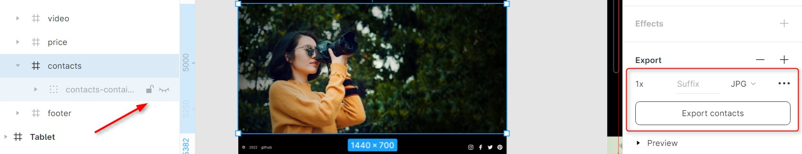
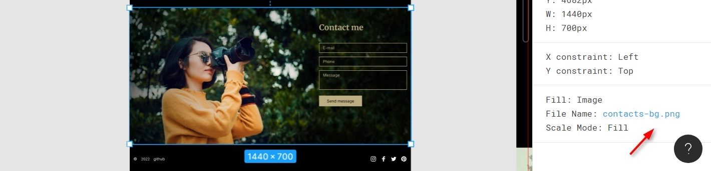

## Советы по выполнению задания Portfolio#1-Фиксированная вёрстка
- [Описание и требования задания Portfolio#1-Фиксированная вёрстка](portfolio-part1.md)
- Советы не являются частью задания. Следуйте советам только в той мере, в которой они могут вам помочь.

Базовые советы по вёрстке рассматривались в задании [CV](../cv/cv-stage0-hints.md).  
Здесь рассмотрим особенности выполнения задания [Portfolio#1-Фиксированная вёрстка](portfolio-part1.md) с учётом того, что базовые советы по вёрстке вам уже известны, вы их знаете и применяете на практике.  

1. [Организация работы](#организация-работы)
2. [Работа с репозиторием](#работа-с-репозиторием)
3. [Экспорт размеров и стилей из figma](#экспорт-размеров-и-стилей-из-figma)
4. [Экспорт изображений из figma](#экспорт-изображений-из-figma-растровая-и-векторная-графика)
5. [Структура проекта](#структура-проекта)
6. [Подключение шрифтов](#подключение-шрифтов)
7. [Вёрстка основных блоков и секций](#вёрстка-основных-блоков-и-секций)
8. [Header](#header)
9. [Секция Hero](#hero)
10. [Изменение цвета svg при наведении](#изменение-цвета-svg-при-наведении)
11. [Использование svg спрайтов](#использование-svg-спрайтов)
10. [Секция Skills](#skills)
11. [Секция Portfolio](#portfolio)
12. [Секция Video](#video)
13. [Секция Price](#price)
14. [Секция Contacts](#contacts)
15. [CSS переменные](#css-переменные)

### Организация работы
- выполнение задания начните с изучения ТЗ. Не приступайте к работе над проектом без чёткого понимания, какой результат от вас ожидается
- разбейте задание на небольшие подзадачи. Выполняйте их последовательно
- ведите тайминг времени. Для учёта времени используйте [trello](https://netology.ru/blog/trello), с дополнением [Activity](https://texterra.ru/blog/prokachay-svoy-trello-rasshireniy-i-integratsiy-dlya-produktivnoy-raboty.html) (одно улучшение к доске с проектом можно подключить бесплатно). Так выглядит [доска trello](images/trello.png) с выполненным проектом
- для проверки соответствия своей работы требованиям задания используйте 
  - расширение [PerfectPixel](https://chrome.google.com/webstore/detail/perfectpixel-by-welldonec/dkaagdgjmgdmbnecmcefdhjekcoceebi?hl=ru) для проверки соответствия вёрстки макету
  - сервис https://validator.w3.org/ для проверки валидности вёрстки

### Работа с репозиторием
Задание выполняется в приватном репозитории школы.  
- регистрируемся в rs app https://app.rs.school/registry/student
- заходим в dashboard, кликаем на кнопку `Create repo`
- на привязанную к гитхабу почту приходит инвайт - приглашение в приватный репозиторий школы. Принять инвайт необходимо сразу, через несколько дней он становится недействительным
- клонируем приватный репозиторий школы на свой компьютер  
`git clone ссылка на репозиторий` - ссылку копируем из адресной строки
- заходим в папку локального репозиторий командой `cd repo-name` или просто кликнув по ней мышкой и открыв GitBash внутри папки
- от ветки `main` создаём ветку `portfolio` и переходим в неё  
`git checkout -b "portfolio"`
- в ветке `portfolio` локального репозитория создаём папку `portfolio`, в ней размещаем файлы проекта
- в ходе работы над проектом, каждый выполненный этап работы пушим в удалённый репозиторий.  
Пример:  
  ```
  git add .
  git commit -m "feat: add header"
  git push origin portfolio
  ```  

### Экспорт размеров и стилей из figma
О необходимости создания собственной копии макета сказано в [самом задании](portfolio.md#создание-собственной-копии-макета).  
Не игнорируйте эту рекомендацию: работать с собственной копией макета намного удобнее.  
Кроме того, у figma есть ограничение по количеству пользователей, которые одновременно могут работать с макетом.

Если кликнуть по элементу на макете figma, на вкладке `Inspect` справа можно увидеть применённые к этому элементу стили: его размер, положение на странице, свойства шрифта, некоторые эффекты оформления. Их все, кроме положения на странице, можно скопировать и использовать в вёрстке.  

Положение элемента на странице копировать не нужно. Дело в том, что фигма все элементы рассматривает как абсолютно позиционированные. Такой подход не применяется в профессиональной разработке. Элементы должны находиться в потоке документа, а их взаимное расположение определяется при помощи внутренних отступов (padding), внешних отступов (margin), а также свойств flex и/или grid.

Чтобы определить расстояние между двумя элементами в figma, кликните, чтобы выбрать один из них, зажмите клавишу клавиатуры `Alt` и наведите курсор на другой элемент, расстояние до которого необходимо определить.

### Экспорт изображений из figma. Растровая и векторная графика
Чтобы экспортировать изображение из figma:
- кликните по нему - изображение выделится синей рамкой
- убедитесь, что справа выбрана вкладка **Design**
- справа внизу кликните по знаку "+" возле **Export**
- выберите формат, в котором экспортируется графика
  - обычные изображения - `.jpg`
  - изображения с текстом или прозрачностью - `.png`
  - иконки - `.svg`
- Кликните по кнопке **Export** внизу  

Чтобы экспортировать несколько изображений одновременно, выделите все нужные изображения с зажатой клавишей `Shift`, затем укажите формат для экспорта изображений и нажмите кнопку **Export**.

### Структура проекта

Внутри папки `portfolio` локальной копии приватного репозитория курса разместите файлы 
- `index.html`
- `style.css`
- `index.js` (понадобится при выполнении второй и третьей части задания)
- папку `assets` с подпапками `img`, `svg`, `fonts`, `video`  
Папки `fonts` может и не быть, если шрифты будете подключать не локально, а при помощи Google Fonts  
Папки `video` может и не быть, если не планируете выбирать таск на создание кастомного видеоплеера при выполнении проектов [js30](../js30%23/js30-3.md) 

В папку `assets` сложите все экспортированные из figma изображения и иконки.

В файле `index.html` создайте основу html документа.  
В блоке `head` укажите `title` - `portfolio`, добавьте фавикон - любое изображение, [конвертированное](https://image.online-convert.com/ru/convert-to-ico) в формат `.ico`, подключите стили.  
В конце документа перед закрывающим `body` подключите файл `index.js`.

### Подключение шрифтов
В макете используется два шрифта: 
- для заголовков шрифт с засечками `Merriweather`, bold `font-weight: 700` 
- для основного текста страницы шрифт без засечек `Inter`, regular `font-weight: 400` и bold  `font-weight: 700`.  
Оба шрифта есть в Google Font.  
[Способы подключения шрифтов](../cv/cv-stage0-hints.md#подключение-шрифтов) через Google Font и из папки проекта вам уже известны, какой из них использовать выбираете вы сами. 

Несколько слов про шрифт `Inter`, представитель вариативных или вариабельных шрифтов (variable fonts).  

Это новые шрифты, которые появились только в конце 2016 года. Их особенность - один файл шрифтов для любого стиля. Для обычного шрифта, если в макете используется два стиля: regular и bold, нужно загрузить два файла шрифта. Для вариативного шрифта загружается только один файл, содержащий в себе любой вариант начертания.  

Вариативные шрифты можно использовать точно так же, как обычные, но на самом деле возможностей у них намного больше. Для обычных шрифтов свойство `font-weight` принимает значения от 100 до 900 с интервалом 100, для вариантивных шрифтов это может быть любое целое число в диапазоне от 1 до 999. Для обычных шрифтов свойство `font-style` принимает два значения `normal` и `italic`, для вариативных можно указать угол наклона `oblique` от –90deg до 90deg. Свойство `font-stretch` вариативных шрифтов меняется от 50% (узкое начертание) до 200% (широкое начертание), нормальной пропорции соответствует 100%. И есть ещё свойство `font-optical-sizing`, которое изменяет внешний вид шрифта в зависимости от его размера.

### Вёрстка основных блоков и секций
Внутри элемента `body` создайте элементы `header`, `main` и `footer`, добавьте им классы.  
В элементы `header`, `main` и `footer` вложите контейнер - `div` с классом `container`, укажите ему css-свойства  
```css
.container {
  max-width: 1440px;
  margin: 0 auto;
  padding: 0 20px;
}
```  
Свойство `max-width` ограничивает ширину контента на больших экранах, свойство `margin: 0 auto` центрирует контейнер по горизонтали, свойство `padding: 0 20px` добавляет внутренние отступы по бокам, необходимые для того, чтобы контент не прилипал к краям при уменьшении ширины экрана.  

Для секций, в которых фоновое изображение тянется на всю ширину макета 1440рх, понадобятся отдельные контейнеры.

Для фиксированной вёрстки (первая часть задания) временно замените свойство `max-width: 1440px` на `width: 1440px` - это упростит проверку соответствия вёрстки макету при кросс-чеке.  

Внутри контейнера элемента `main` создайте шесть секций с классом `.section`
  - `hero`
  - `skills`
  - `portfolio`
  - `video`
  - `price`
  - `contacts`

Внутри каждой секции, кроме первой, создайте заголовок `h2` с классом `section-title`.  
Внутри первой секции создайте заголовок `h1` с именем фотографа.

### Header
Вёрстка header рассматривалась в предыдущем таске, в пунктах: [header](../cv/cv-stage0-hints.md#header), [якорные ссылки](../cv/cv-stage0-hints.md#якорные-ссылки), [стилизация списка](../cv/cv-stage0-hints.md#стилизация-списка),  [интерактивность при наведении](../cv/cv-stage0-hints.md#интерактивность-при-наведении).  

В данном задании актуальны все перечисленные приёмы, остановимся на моментах, которые могут вызвать сложности.

#### Расположение элементов по горизонтали  
По горизонтали в `header` размещаются три блока: логотип, навигация и переключатель языка en/ru.  
Два из этих трёх блоков смещены вправо, один - влево. Свойства, которое располагало бы три элемента таким образом, у flex-элементов нет. Кажется, что без дополнительной обёртки не обойтись. На самом деле вопрос решается свойством `margin-left: auto` у навигации. Свойство `auto` для горизонтальных отступов означает занять все доступное пространство. Мы его уже использовали для центрирования контейнера по горизонтали. Если свойство `auto` указать c двух сторон, оно поровну распределяет все свободное пространство между правым и левым отступами. Задав `auto` только для одной стороны блока, тем самым сдвинем весь этот блок в противоположную сторону.

#### Фоновое изображение  
Сложность может вызвать добавление одного фонового изображения двум элементам `header` и `hero`.  
Для `header` свойства фона указываем следующим образом:  
```css
.header-container {
  background: url('./assets/img/header-bg.jpg');
  background-repeat: no-repeat;
  background-position: center 0;
}
```  

### Изменение цвета svg при наведении  
По макету логотип является интерактивным и при наведении изменяет цвет на золотистый.  
Если иконка логотипа добавлена как фоновое изображение, изменить её цвет при наведении можно используя фильтры или маски.  
```css
.logo {
  background-image: url('./assets/svg/logo.svg');
  background-size: contain;
  background-repeat: no-repeat;  
  transition: 0.3s;
}
.logo:hover {
  filter: invert(26%) sepia(15%) saturate(638%) hue-rotate(7deg) brightness(92%)
    contrast(87%);
}
```  
Генератор фильтра для получения заданного цвета: https://pranjaldubey.com/css-filter-generator/  
Так как генератор работает для черного цвета, а у нас белый, значение `invert` нужно изменить на противоположное, например, если для черного цвета генератор определил значение `invert` как 74%, для белого цвета указываем значение 100% - 74% = 26%.  

Ещё один способ изменить цвет svg при наведении - использование css-маски [Демо](https://codepen.io/irinainina/pen/abvGBwP) 

### Использование svg спрайтов

Использование svg sprite позволяет очень гибко управлять svg, в том числе менять их цвет при наведении.

Для того, чтобы иметь возможность менять цвет иконки или добавлять ей какую-либо
другую интерактивность, следует использовать ее инлайново. Это даст возможность
задать ей классы и обратиться к её внутренней структуре. Для этого удобно
использовать один общий файл для всех интерактивных иконок проекта - svg спрайт.

1. Скачайте из макета иконки в расширении svg.
2. Соберите все нужные вам иконки в один файл sprite.svg. Это можно сделать, например, при помощи сервиса [SvgSprit.es](https://svgsprit.es/).
   - перетащите иконки в генератор
   - внизу окошка появится ваш спрайт. Скопируйте его себе в проект в папку `svg`.
3. Иконку используйте инлайн, добавив ее в нужное место в html, к примеру

```html
<a href="https://github.com">
  <svg class="icon">
    <use xlink:href="./assets/svg/sprite.svg#github-logo"></use>
  </svg>
</a>
```  
В атрибуте `href` укажите путь к иконке. Путь задаётся как к обычному файлу, но в конце добавляется якорь с идентификатором символа в спрайте. В данном примере, в спрайте вы найдете символ с `id="github-logo"`.

4. Для того, чтобы иметь возможность задать нужный нам цвет прописываем стили для иконки.  
Цвет будем задавать через свойство fill  
```css
.icon {
  width: 30px;
  height: 30px;
  fill: #cdc6db;
}

.icon:hover {
  fill: #fac420;
}
```  
5. ВАЖНО! Для того, чтобы эти стили применились, необходимо в файле спрайта удалить значения `fill`. В противном случае `fill` из нашего css не сработает.

Более подробную видео-инструцию и объяснение можно найти в данном [видео](https://www.youtube.com/watch?v=dPoRsolsCjA).

### Hero

#### Фоновое изображение  
Секция `hero` - полноэкранное изображение, которое занимает всю страницу. Такая секция используется для привлечения внимания пользователя, создания образа компании или бренда.  
В задании указано, что в этом макете секция `hero` верстается не полноэкранная, а по размерам, указанным в макете.  

Если посмотрим советы туториала [How TO - Hero Image](https://www.w3schools.com/howto/howto_css_hero_image.asp) (на сайте много полезного материала, рекомендую добавить его в закладки), увидим, что для вёрстки секции `hero` используется фоновое изображение. В нашем случае часть этого изображения уже используется в `header`, высота которого 90рх. Поэтому позиционирование фонового изображения секции `hero` указываем со сдвигом на 90рх вверх:  
```css
.hero-container {
  background-image: url('./assets/img/header-bg.jpg');
  background-position: center -90px;
  background-repeat: no-repeat;
}
```  

#### Выпадение внешних отступов
Также обратите внимание на способ указать отступ блока с заголовком и текстом от верхнего края родительского элемента.  
Сайт верстается сверху вниз, поэтому, как правило, верхние элементы отталкивают нижние, а не наоборот. Кроме того, чаще отдаётся предпочтение использованию внутренних отступов `padding` по сравнению с использованием внешних отступов `margin`.  

Таким образом, для позиционирования блока с заголовком и текстом лучше использовать свойство `padding-top` родительского элемента, чем `margin-top` вложенного в него блока с заголовком и текстом.  

Но если вы всё же попробуете использовать свойство `margin-top` для вложенного элемента, столкнётесь с явлением выпадения внешних отступов. Оно состоит в том, что если внутри родительского блока расположить блок и задать ему отступ сверху, то внутренний блок прижмется к верхнему краю родительского, а у родительского элемента появится отступ сверху. Т.е. верхний отступ внутреннего элемента "выпадает" из родительского элемента. Решением может быть добавление родительскому элементу границы (`border`) сверху, или свойства `overflow: hidden`, или, как было предложено выше, использование свойства `padding-top` для родительского элемента.  

#### Вёрстка кнопки
В макете используются всего два вида кнопок, сверстав одну из них, тем самым сверстали все остальные кнопки такого же вида, достаточно указать им такой же класс.  

У кнопки есть полезная особенность - текст внутри кнопки автоматически центрируется по горизонтали и вертикали.  

Но у кнопки есть и другие стили по умолчанию, например, граница или полупрозрачный серый фон, от которых нужно избавиться для того, чтобы вёрстка соответствовала макету.  

Для стилизации кнопок понадобится:
- удалить границу `border` свойством `border: 0`, или указать свойства границы такие же, как в макете 
- указать цвет фона: для золотистых кнопок - `background-color: #bdae82`, для прозрачных кнопок - `background-color: transparent`
- указать свойство `cursor: pointer`, которого по умолчанию у кнопок нет
- указать свойство `font-family: inherit`. На последнем остановимся подробнее.  

Обычно, свойства шрифта указаем в `body`, и они наследуются всеми дочерними элементами. Но некоторые элементы, такие как `button`, `input`, `textarea` не наследуют свойства шрифта. Для них нужно или указать свойства шрифта отдельно, или указать, что наследуется шрифт родителя. Свойство `font-family: inherit` указывает, что дочерний элемент наследуется семейство шрифтов родителя.

### Skills

#### Заголовки секций
В секции `Skills` есть заголовок. Точно такой же заголовок есть у всех остальных секций (у заголовка секции `Contacts` есть небольшие отличия), то есть стилизовав заголовок один раз, мы тем самым стилизуем все остальные заголовки, для этого достаточно им указать один и тот же класс.

Свойства шрифта заголовков секций копируем в figma. Сложность может составить добавление декоративных линий по бокам заголовка.

Для того, чтобы добавить заголовку линии по бокам, для вёрстки используем два вложенных элемента - сам заголовок с текстом и обёртку. Ширина обёртки - 50% ширины страницы. Заголовок с текстом находится внутри неё. Дальше может быть два варианта добавления линий по бокам.  
1) линии создаём при помощи [псевдоэлементов](../cv/cv-stage0-hints.md#псевдоэлементы) `::after` и `::before` у заголовка с текстом, указываем им ширину большую, чем необходимо. Обёртке добавляем свойство `overflow-x: hidden` благодаря которому обрезаются выступающие края линий.
2) линию указать фоном обёртки заголовка, самому заголовку с текстом добавить черный фон  
```css
.section-title {
  background-image: linear-gradient(to top, #000 39px, #bdae82 39px, #bdae82 41px, #000 41px);
}
```

#### Карточки с описанием навыков
Карточки с описанием навыков вкладываем в контейнер, указываем ему свойства:  
```css
.skills-items {
  display: flex;
  justify-content: space-between;
  flex-wrap: wrap;
}
```  
Первые два свойства уже использовали раньше, последнее свойство `flex-wrap: wrap` нужно для того, чтобы при уменьшении ширины страницы карточки не сжимались, а переносились на новую строку.

Картинку внутри карточки добавляем как фоновое изображение:  
```css
.skill-item {
  background-position: center top;
}

.skill-item:nth-child(1) {
  background-image: url('./assets/svg/camera.svg');
  background-size: 62px 50px;
}
```

### Portfolio
Секция `Portfolio` состоит из заголовка, блока с кнопками и блока с картинками. Расположить элементы внутри этих блоков удобно при помощи использования `flex`. Расстояние между flex-элементами удобно указывать свойством `gap`, например `gap: 5px`.

### Video
Как сказано в задании, секция `Video` верстается картинкой с расположенной по её центру кнопкой.  

Кнопке указываем абсолютное позиционирование и размещаем её внутри блока `video-player`.  
Разместить кнопку по центру позволят свойства родительского элемента:  
```css
.video-player {
  position: relative;
  display: flex;
  justify-content: center;
  align-items: center;
}
```  
Обратите внимание, что родительскому элементу, внутри которого находится абсолютно позиционированный элемент, указываем относительное позиционирование `position: relative`.

### Price
Секция состоит из заголовка и flex-контейнера, внутри которого размещаются три карточки.  
У каждой карточки есть заголовок, блок с ценой, и описание. Каждую строку описания верстаем при помощи элемента `span` со свойством `display: block`.

### Contacts

#### Стилизация input и textarea
Секция `Contacts` содержит элементы `input` с `type="email"` и `type="tel"` и элемент `textarea`.  
Надписи внутри этих элементов добавляем при помощи атрибута `placeholder`.  
Пример стилизации `placeholder`:
```css
::placeholder {
  font-family: inherit;
  color: #bdae82;
  font-size: 20px;
}
```  
Также обратите внимание на свойство `textarea` `resize: none`, которое указывает, что пользователь не может изменять размер элемента.  
О том, что `input` и `textarea` не наследуют свойства шрифта родителя уже упоминалось выше.  
В остальном элементы `input` и `textarea` стилизуются точно так же, как другие элементы.

Также в данной секции обратите внимание на размер и позиционирование фонового изображения:
```css
.contacts .container {
  background: url('./assets/img/contacts-bg.jpg');
  background-size: auto 700px;
  background-position: center center;
}
```

#### Экспорт фонового изображения из figma
В секции с контактами могут быть сложности с экспортом фонового изображения из figma.  
Два способа, как экспортировать фон секции:  
- Способ 1
   - выделить секцию `Contacts`, кликнув по ней
   - нажать на иконку глаза на панели слева возле элемента `contacts-container`, чтобы скрыть его
   - на вкладке `Design` на панели справа в секции `Export` указать формат изображения и нажать на кнопку `Export contacts`

   <kbd></kbd>
- Способ 2
   - выделить секцию `Contacts`, кликнув по ней
   - на панели справа открыть вкладку `Inspect` прокрутить вниз и кликнуть по ссылке `contacts-bg.png` - откроется изображение, которое можно сохранить на компьютер

<kbd></kbd>

### CSS переменные
Часто встречающиеся в макете цвета, отступы, размеры можно передать в переменные и использовать эти переменные при стилизации.  
В начале файла со стилями объявляем переменные
```css
:root {
  --color-gold: #bdae82;
  --color-black: #000;
  --font1: 60px;
  --font2: 40px;
}
```
Их использование:
```css
.section-title {
  font-size: var(--font2);
  color: var(--color-gold);
}
```
Преимущества:
- говорящие имена переменных запомнить легче, чем коды цветов или размеры шрифтов
- ключевые переменные сосредотачиваются в одном месте, в коде появляется "единый источник истины"
- очень легко и быстро вносить правки, предложение заказчика "поиграть со шрифтами" перестаёт быть проблемой
- удобно изменить свойства в медиа-запросе, например
```css
@media (max-width: 768px) {
  :root {
    --font1: 40px;
    --font2: 32px;
  }
```