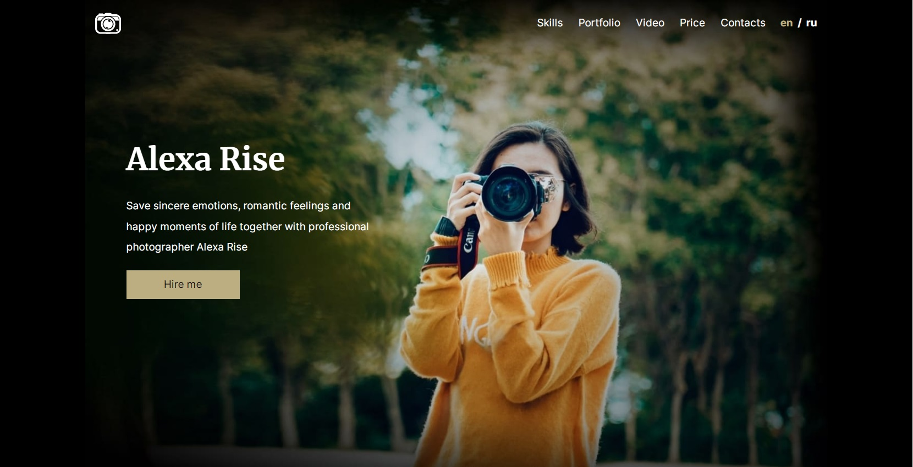

# portfolio

## Описание проекта
Portfolio – задание stage#0 в ходе выполнения которого вы сверстаете landing page портфолио фотографа, сделаете его адаптивным и интерактивным.

## Ключевые навыки:
- валидная семантическая адаптивная вёрстка
- легкоподдерживаемый читаемый код
- экспорт стилей и графики из Figma
- использование JavaScript для реализации указанного в задании функционала

## Этапы работы над проектом:
Задание состоит из трёх частей:
- Часть 1. Фиксированная вёрстка - [Требования и критерии оценки](portfolio-part1.md)
- Часть 2. Адаптивная вёрстка - [Требования и критерии оценки](portfolio-part2.md)
- Часть 3. Добавление функционала - [Требования и критерии оценки](portfolio-part3.md)

Продолжительность выполнения каждой части задания 1 неделя  

<kbd></kbd>

[Макет в figma - фиксированная вёрстка](https://www.figma.com/file/6yRTVMur4ijM1w5Fj1gDPl/Portfolio)  
[Макет в figma - адаптивная вёрстка](https://www.figma.com/file/YcEST7ugdfJ7d28jSNN2Oh/Portfolio-adaptive)

## Создание собственной копии макета
Выполнение задания начните с создания собственной копии макета. Для этого
- авторизуемся в [figma](https://www.figma.com/)
- открываем макет
- на панели вверху нажимаем на стрелку рядом с названием макета, выбираем пункт "Duplicate to your drafts"
- слева вверху открываем настройки, выбираем "Back to files"
- открываем копию макета рядом с которой есть надпись "In Drafts"

## Структура макета:
- Макет состоит из трёх блоков: `<header>`, `<main>`, `<footer>`
- Блок `<main>` состоит из шести секций `<section>`:
  - `hero`
  - `skills`
  - `portfolio`
  - `video`
  - `price`
  - `contacts`

## Рекомендации по качеству кода
- гайдлайн https://codeguide.academy/html-css.html#html
- руководство по качеству кода
  - [общие принципы](../../stage1/modules/clean-code/materials/generic-principles.md)
  - [HTML и CSS рекомендации - начальный уровень](../../stage1/modules/clean-code/materials/html-and-css.md)
  - [HTML и CSS рекомендации - продвинутый уровень](../../stage1/modules/clean-code/materials/html-and-css-extended.md)

## Технические требования
1. вёрстка валидная, семантическая, соответствующая макету
2. приложение корректно отображается и работает в браузере Google Chrome последней версии
3. запрещается использование CSS-фреймворков (`bootstrap`)
4. допускается использование CSS-препроцессоров (`Sass`), `normalize.css`
5. не рекомендуется использовать сброс стилей при помощи `reset.css`

## Требования к репозиторию
- задание выполняется в приватном репозитории школы. [Как работать с приватным репозиторием школы](https://docs.rs.school/#/private-repository)
- если у вас не создаётся приватный репозиторий школы, задание можно выполнять в личном приватном репозитории
- от ветки `main` создайте ветку `portfolio` в ней создайте папку `portfolio`, в ней разместите файлы проекта
- для деплоя используйте `gh-pages` [Как сделать деплой задания из приватного репозитория школы](https://docs.rs.school/#/private-repository?id=Как-сделать-деплой-задания-из-приватного-репозитория-школы)
- если не можете для деплоя использовать `gh-pages`, используйте https://app.netlify.com/drop. Название страницы дайте по схеме: имя гитхаб аккаунта - название таска

## Требования к коммитам
- История коммитов должна отображать процесс разработки приложения.
- [Названия коммитов дайте согласно гайдлайну](https://docs.rs.school/#/git-convention)

## Требования к Pull Request
- Название Pull Request дайте по названию задания
- [Описание Pull Request дайте по схеме](https://docs.rs.school/#/pull-request-review-process?id=Требования-к-pull-request-pr)  
**Мержить Pull Request из ветки разработки в ветку `main` не нужно**.

## Чтобы получить баллы за задание необходимо: 
- Выполнить задание
- Засабмитить задание т.е. отправить его на проверку \*  
- Проверить все присланные на проверку работы и засабмитить результаты проверки до дедлайна кросс-чека \**  
\* *Засабмитить задание можно только до дедлайна таска, после дедлайна сабмит недоступен*  
\** *Сабмит результатов кросс-чек проверки доступен и после дедлайна кросс-чека, но на оценки проверяющего  и проверяемых не влияет*

## Как сабмитить задание
После выдачи таска, но до наступления дедлайна зайдите в rs app https://app.rs.school/, выберите **Cross-Check: Submit**, в выпадающем списке выберите таск, в названии которого есть слово `portfolio`, в поле **Solution URL** добавьте ссылку на задеплоенную версию созданного вами сайта, нажмите кнопку **Submit**.

## Рекомендации по сабмиту
- Засабмитить задание рекомендуется как можно раньше, как только в rs app появится такая возможность. После сабмита задание можно продолжать выполнять до самого дедлайна
- Так как проект выполняется в приватном репозитории, сабмитить ссылку на репозиторий или pull request нет смысла - проверяющий его не увидит. Приватный репозиторий школы видите только вы сами, админы курса, и увидят ваши менторы, когда они появятся 
- Убедитесь, что задеплоенная вами ссылка открывается в режиме инкогнито браузера
- Сделайте скриншот засабмиченной ссылки и сохраняйте его у себя до старта кросс-чека. Если вам не придут работы на проверку, скриншот послужит доказательством, что вы вовремя засабмитили ссылку на работу. В таком случае вашу работу проверят в ходе апелляции

## Проверка задания
- форма проверки каждой части задания - кросс-чек
- инструкция по проведению cross-check: https://docs.rs.school/#/cross-check-flow

## Материалы
- [Старт в Figma для верстальщика](https://htmlacademy.ru/blog/useful/figma)
- [Инструкция по работе в Figma для верстальщика](https://breezzly.ru/guides/start-v-figma-dlya-verstalshhika)
- [Верстка сайта с нуля из Figma](https://www.youtube.com/playlist?list=PL5_s7xdj2Vsw-bCx5nOZJMFIiHwRgok--)

## Вебинары RS School
- вебинары Сергея Шаляпина
  - [Stream 11.02.2020](https://youtu.be/UQavTWiTpnA)
  - [Stream 03.03.2020](https://youtu.be/PhRVJC0kBGE)
  - [Stream 10.03.2020](https://youtu.be/_5f0kznOM_A)
  - [Stream 17.03.2020](https://youtu.be/0M9Rz-wXYas)
  - [Stream 26.03.2020](https://youtu.be/fFDw7AH2OXo)
- вебинары Виктории Ворожун
  - [Friday Live Coding. Part 1](https://youtu.be/ZAde-IJAHzo)
  - [Friday Live Coding. Part 2](https://youtu.be/BJENQIX2e2o)
  - [Friday Live Coding. Part 3](https://youtu.be/fooyYgIuZe8)
  - [Friday Live Coding. Part 4](https://youtu.be/Qk2UGlFNKPE)
  - [Friday Live Coding. Part 5](https://youtu.be/ouZnGUefneQ)
  - [Репозиторий с кодом](https://github.com/ViktoriyaVorozhun/friday-live-coding/tree/develop)
  - [Макет в figma](https://www.figma.com/file/fw0GA18nmpVjTBzjtiEK2L/Friday_Live_Coding?node-id=0%3A1) 